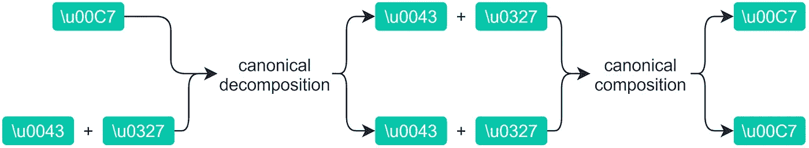
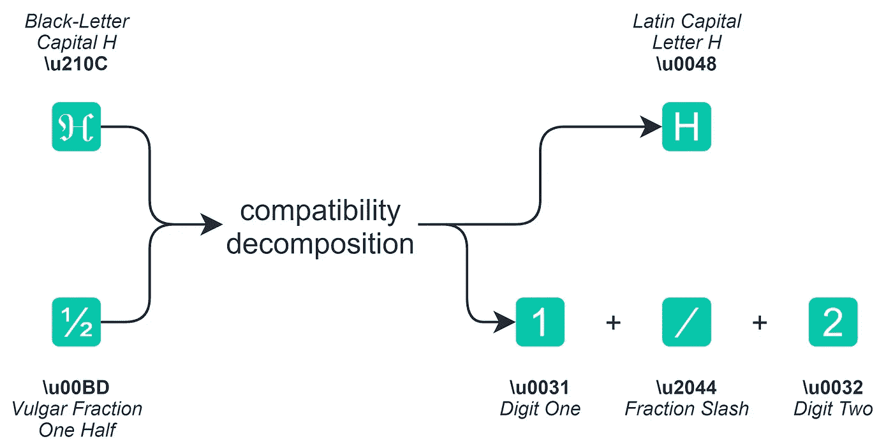
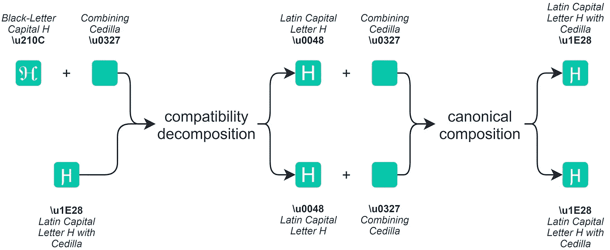

# Unicode 规范化到底是什么？

> 原文：<https://towardsdatascience.com/what-on-earth-is-unicode-normalization-56c005c55ad0?source=collection_archive---------16----------------------->

## 你的高质量自然语言处理的基本方法指南

照片由[埃琳娜·莫日维洛](https://unsplash.com/@miracleday?utm_source=medium&utm_medium=referral)在 [Unsplash](https://unsplash.com?utm_source=medium&utm_medium=referral) 上拍摄

ℕ𝕠-𝕠𝕟𝕖 𝕚𝕟 𝕥𝕙𝕖𝕚𝕣 𝕣𝕚𝕘𝕙𝕥 𝕞𝕚𝕟𝕕 𝕨𝕠𝕦𝕝𝕕 𝕖𝕧𝕖𝕣 𝕦𝕤𝕖 𝕥𝕙𝕖𝕤𝕖 𝕒𝕟𝕟𝕠𝕪𝕚𝕟𝕘 𝕗𝕠𝕟𝕥 𝕧𝕒𝕣𝕚𝕒𝕟𝕥𝕤. 𝕋𝕙𝕖 𝕨𝕠𝕣𝕤𝕥 𝕥𝕙𝕚𝕟𝕘, 𝕚𝕤 𝕚𝕗 𝕪𝕠𝕦 𝕕𝕠 𝕒𝕟𝕪 𝕗𝕠𝕣𝕞 𝕠𝕗 ℕ𝕃ℙ 𝕒𝕟𝕕 𝕪𝕠𝕦 𝕙𝕒𝕧𝕖 𝕔𝕙𝕒𝕣𝕒𝕔𝕥𝕖𝕣𝕤 𝕝𝕚𝕜𝕖 𝕥𝕙𝕚𝕤 𝕚𝕟 𝕪𝕠𝕦𝕣 𝕚𝕟𝕡𝕦𝕥, 𝕪𝕠𝕦𝕣 𝕥𝕖𝕩𝕥 𝕓𝕖𝕔𝕠𝕞𝕖𝕤 𝕔𝕠𝕞𝕡𝕝𝕖𝕥𝕖𝕝𝕪 𝕦𝕟𝕣𝕖𝕒𝕕𝕒𝕓𝕝𝕖.

我们还发现，像这样的文字非常普遍——尤其是在社交媒体上。

另一个痛点来自音调符号(在,,é，中的小符号),你会在几乎所有的欧洲语言中找到它。

这些字符有一个隐藏的属性，可以使任何 NLP 模型出错——看看两个版本的 Unicode:

`\u00C7`和`\u0043\u0327`似乎都在生产同一个角色。实际上，它们是完全不同的——你建立的任何 NLP 模型都会认为它们也是完全不同的。

所以现在我们有两个问题。

*   人们用奇怪的字符来表达🅘🅝🅓🅘🅥🅘🅓🅤🅐🅛🅘🅣🅨(或者吸引注意力——或者两者兼而有之)。
*   两个看似匹配却不匹配的角色。

这两个问题的答案是 **Unicode 规范化**，我们将在本文中探讨这个问题。

点击这里查看本文的视频版本:

# 对等的问题

我们刚才看到的是两种不同形式的**等价**、*相容*等价和*规范*等价。

## 兼容性等价

我们在大量不同的角色中发现了兼容性等价，有些很抽象，有些我们一直都可以看到。

首先，我们有自己的字体变体——我不完全确定这是谁的主意，但我很高兴它对“百万富翁”大师们的影响使得他们的许多帖子无法阅读。

> 7 𝕸𝖎𝖑𝖑𝖎𝖔𝖓𝖆𝖎𝖗𝖊 𝕳𝖆𝖈𝖐𝖘 — 𝕭𝖚𝖞 𝖒𝖞 𝖈𝖔𝖚𝖗𝖘𝖊 𝖙𝖔 𝖌𝖊𝖙 𝖗𝖎𝖈𝖍!

然后我们有一些在网上很常见的例子，`[NBSP]`和`[SPACE]`都是非常有效的换行符序列。上标和下标无处不在，分数也是。

我们希望让我们的模型将ⓗⓔⓛⓛⓞ ⓦⓞⓡⓛⓓ和“hello world”视为一体。简化文字，使 xⱼ变成 xj，变成 1/2。

## 典范等价

规范等价更难发现，因为它处理的是呈现时完全相同的字符，但实际上是完全不同的字符。

如果我们以本文介绍中的例子为例，字符\

我们可以使用 Unicode 字符*‘带塞迪拉的拉丁文大写字母 c’*创建这个字符，即 *\u00C7* 。或者，我们可以同时使用这两个字符来创建这个字符，分别是*‘拉丁文大写字母 c’*和*‘将 cedilla’*字符组合在一起】、 *\u0043* 和 *\u0327* 。

虽然它们看起来一样，但是我们可以看到它们没有被识别为匹配字符。

这种字符组合呈现为单个字符，因为有些 Unicode 字符(如组合 cedilla)是专门为与其他字符组合而制作的。

我们可以通过用空格将两个字符分开来分别看到它们:

# Unicode 规范化

Unicode 规范化是我们对规范和兼容性等价问题的解决方案。

在规范化中，我们可以进行两个方向和两种类型的转换。我们已经讨论过的两种类型，规范的和兼容的。

这两个方向分别是**分解**和**构图**:

*   **分解**分解字符，所以在我们的 C 和 cedilla 的例子中，我们将字符的两个版本分解成两个单独的字符(*拉丁文大写 c +结合 cedilla* )。
*   **组合**将单独的字符合并成一个 Unicode 字符，在我们的 C 带 cedilla 的情况下，这两个字符(*拉丁文大写 c* `\u0043` + *组合 cedilla* `\u0327`)将成为单个字符*拉丁文大写 C 带 cedilla* `\u00C7`)。

当我们将这两个方向与我们的两种转换类型合并时，我们得到四种不同的归一化形式:

## 范式 D

让我们测试其中的一些。首先，我们有 **NFD** 规范化，它执行规范分解——将 Unicode 字符分解成独立的部分。

我们需要导入`unicodedata`，这将允许我们使用每一种规范化形式。然后，让我们比较一个规范化的*拉丁文大写 c 和带加符*的*拉丁文大写 c* 和*组合加符*字符:

好极了。希望这是有意义的，我们已经将带有 cedilla 字符的单个 *C 分解成两个字符，一个 *C* 和一个*cedilla*——所以现在它们匹配了。*

## 范式 C

NFC 的工作方式有所不同，它首先像 **NFD** 一样分解角色，然后将它们组合成一个单一的角色。如果我们看一下这对我们两种不同的形式有什么影响:

应用规范分解后再应用规范合成(NFC)的结果。

我们可以看到，当规范化两者时，我们应该得到相同的字符，并且该字符与我们的单个字符 *C with cedilla* 相同——所以让我们进行意义检查:

## 范式 KD

现在我们可以看一下我们对于兼容性等价的规范化，用 **K** ( *C* = *规范*， *K* = *兼容性*)来表示。

**NFKD** 或*‘兼容性分解’*将新奇/另类字符分解成更小的部分(如果可以分解的话)，并分解成更多的‘普通’字符。让我们举两个例子，ℌ.

对不同字符应用兼容性分解(NFKD)的结果。

我们的花式ℌ分解成一个正常的 h，我们的花式分数分解成分数中使用的两个数字，以及一个分数斜杠字符。

我们可以用 Python 这样做:

## 范式 KC

**NFKC** 由两步组成，兼容性分解就像 NFKD 一样，接下来是**规范**合成。

这一次我们同时使用了兼容性和规范转换。这允许我们将给定字符的所有变体规范化为一个单一的共享版本。

例如，我们可以添加一个*组合符号*到我们喜欢的ℌ.中这给了我们一个 Unicode 字符的怪物，只有最优秀的快速致富大师才有权力使用——ℋ̧.

这种水平的酷真的提升了那些没有人会后悔购买的高价课程的转化率。

我们需要将这个字符转换成正常人可能使用的东西，并且我们的 NLP 模型可以理解。

我们和 NFKC 一起做这件事:

应用兼容性分解后进行规范合成的结果(NFKC)。

我们可以检查我们的原始ḩ是否与 Python 中的花式ℋ̧相匹配:

值得注意的是，我们不能执行兼容性组合，因为兼容性等价只以一种方式工作——有数百个字体变体 *H* 分解成 *H* ，因此从 *H* 组合回根本无法工作(我们将把 *H* 组合回哪个 *H* 字体变体？).

好了，我们已经介绍了开始在 Python 中对文本应用 Unicode 规范化所需要知道的一切！

作为最后的结束语，值得一提的是，对于大多数应用程序来说，NFKC 形式比其他任何形式都更能规范文本中的变化。但是哪种需求将取决于你到底需要做什么。

如果你想在一个笔记本上查看所有这些，你可以在这里找到。

所以，我希望你喜欢这篇文章。如果您有任何问题或建议，请通过 [Twitter](https://twitter.com/jamescalam) 或在下面的评论中告诉我！如果你对更多类似的内容感兴趣，我也会在 [YouTube](https://www.youtube.com/c/jamesbriggs) 上发布。

Ⓣⓗⓐⓝⓚⓢ ⓕⓞⓡ ⓡⓔⓐⓓⓘⓝⓖ!

# 参考

[自己做讨厌的文字](http://qaz.wtf/u/convert.cgi?text=)

[🤖带变压器的 NLP 课程](https://bit.ly/nlp-transformers)