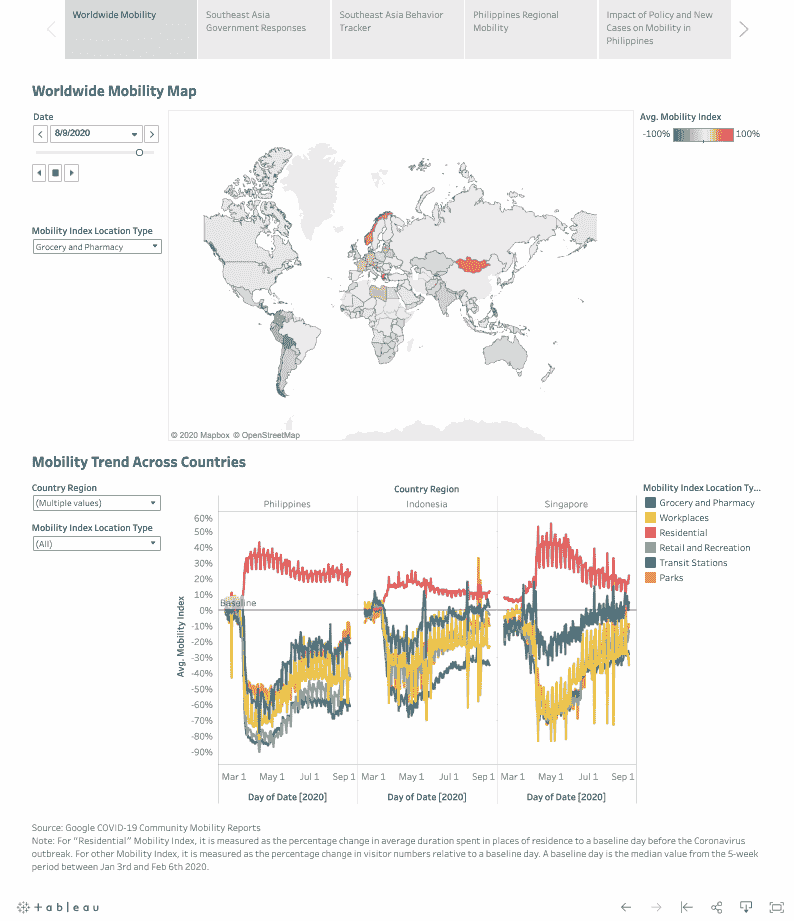
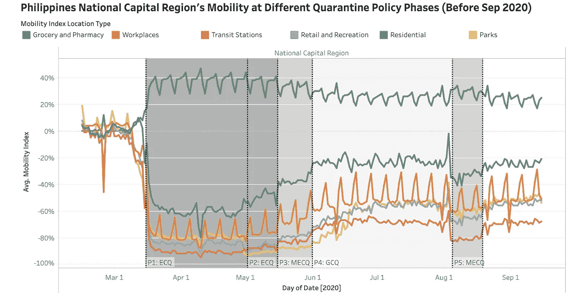
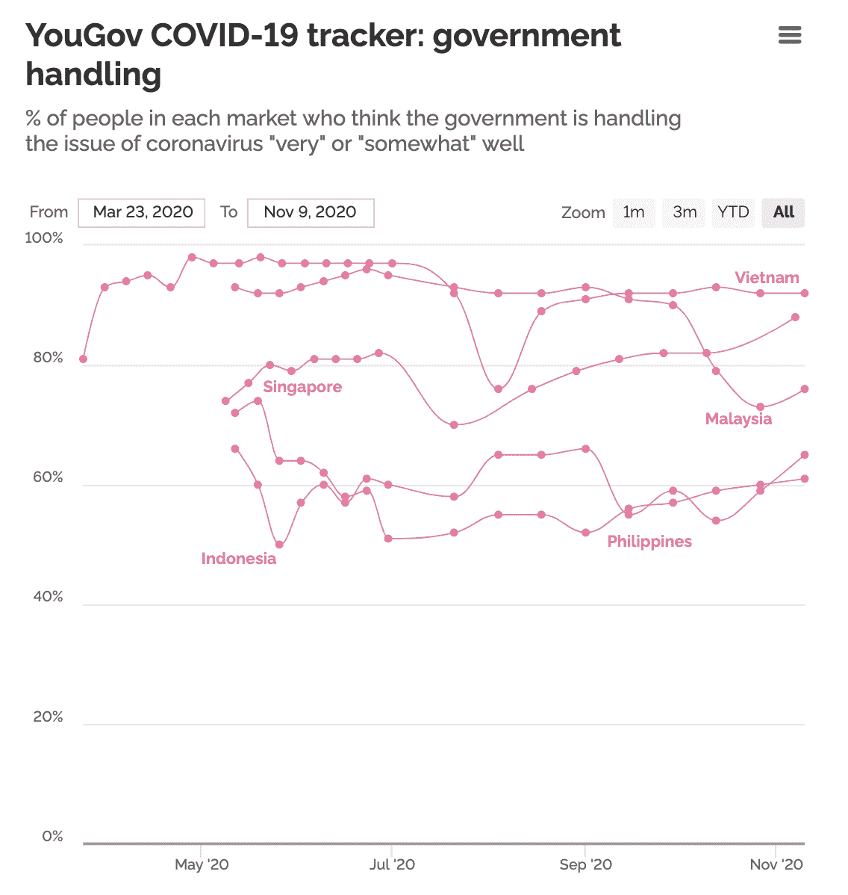
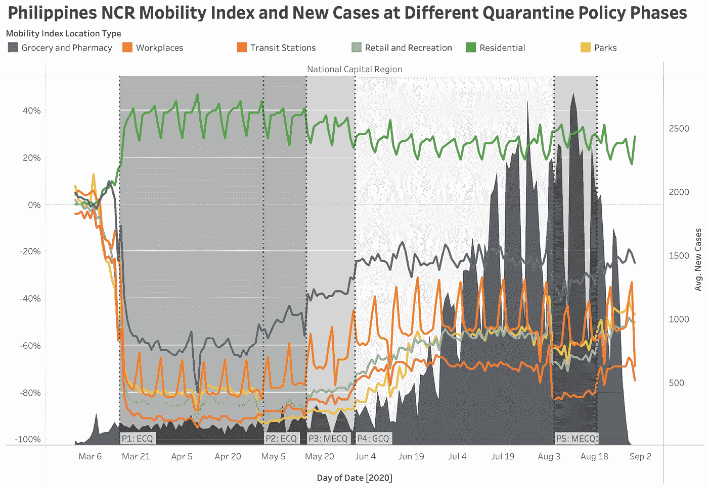
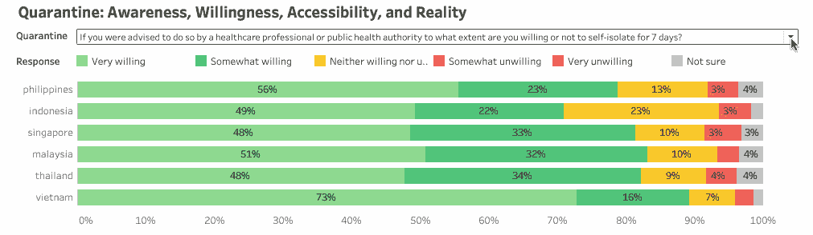
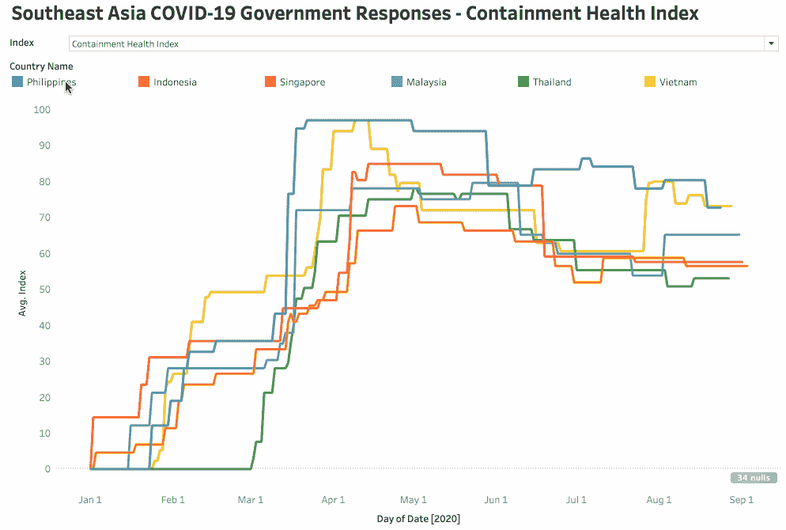

# 关于东南亚的新冠肺炎，有哪些公开数据可以告诉你(除了病例数之外)

> 原文：<https://towardsdatascience.com/what-open-data-can-tell-you-about-covid-19-in-southeast-asia-besides-number-of-cases-6bea0d3d51d?source=collection_archive---------39----------------------->

## [变更数据](https://towardsdatascience.com/tagged/data-for-change)

## *#社会影响数据:*东南亚新冠肺炎应对数据仪表板及分析

*联合国开发计划署亚太地区区域创新中心 UNV 在线志愿服务在线志愿者邓华。*

# **概述**

自新冠肺炎开始以来，有大量仪表板帮助了解疫情的进展情况，其中大部分侧重于公共卫生数据。然而，疫情不仅仅是一场健康危机。它还对人们的福祉构成了从流动性到就业的社会经济风险。事实上，我们看到越来越多、种类越来越多的开放数据源也有很大的潜力来揭示这些方面，这可以加深我们对新冠肺炎影响的理解。将不同的开放数据源结合在一起，我们能够提供丰富的内容并提取有用的见解。

我们对新冠肺炎如何影响人们流动性的问题很感兴趣；尤其是在封锁政策下。这引导我们回顾谷歌移动数据，这是关于人们在不同类型的地点移动的活跃程度，包括工作场所、中转站、杂货店和其他地方。我们将流动模式与遏制政策和疫情进步联系起来。此外，由于政策的有效实施也受到人们遵守和改变行为的意愿的影响，我们还研究了由于新冠肺炎引起的人口行为和态度转变的调查数据。为了将这一分析置于背景中，我们对菲律宾、越南和泰国进行了案例研究，在这些国家，不同的政府应对措施导致了不同的后果。

该分析利用多个开放数据源在 Tableau 中提供一个交互式可视化仪表板。仪表板可以帮助领域专家访问开放的数据，并通过提供切片数据和钻取到不同地理粒度级别的灵活性来轻松获得洞察力。[这是仪表盘](https://public.tableau.com/profile/hua.deng#!/vizhome/COVID-19ResponsesinSoutheastAsia/COVID-19ResponsesinSoutheastAsia)的链接，我们希望你能喜欢玩它。

作者图片

  

*注:以下分析主要基于 2020 年 9 月前的情况。*

# **见解:隔离政策——时间、地点和方式**

为了减少新冠肺炎病毒的传播，隔离是一项普遍实施的政策。但是，在何时、何地以及如何实施检疫政策方面，没有“一刀切”的做法。隔离策略需要与环境相关联，并且足够敏捷以响应快速变化的环境。在此，我们将深入探讨三个东南亚国家--菲律宾、越南和泰国的检疫政策，作为案例研究，讨论他们的良好做法和教训。

菲律宾:长时间的隔离政策在保持低水平的流动性方面变得不那么有效。

菲律宾的检疫政策在不同的阶段和地点以不同的严格程度实施。这里我们重点关注首都地区(NCR)，因为这是菲律宾受灾最严重的地区。

菲律宾有四种检疫政策，严格程度从高到低依次为:强化社区检疫(ECQ)>改良强化社区检疫(MECQ)>普通社区检疫(GCQ)>改良普通社区检疫(MGCQ)。到目前为止，NCR 的检疫政策可以概括为五个阶段，你可以在下面的图表中找到详细的时间表。

作者图片

从上图中，当我们比较第 2 阶段与第 1 阶段(ECQ)以及第 5 阶段与第 3 阶段(MECQ)时，我们应该注意到，即使在相同的隔离政策下，与前一阶段相比，后一阶段的移动性水平通常无法保持较低。

虽然我们不能做出因果推断，因为可能有其他因素影响迁移率，但我们怀疑隔离的影响随着隔离时间的延长而减弱。首先，隔离时间越长，经济成本越高，人们没有足够的积蓄负担在家里呆太久。[根据世界银行](https://data.worldbank.org/indicator/NY.GDS.TOTL.ZS?most_recent_value_desc=false&year_high_desc=true)的数据，与包括印度尼西亚、新加坡、马来西亚、泰国和越南在内的其他东南亚国家相比，菲律宾的国内储蓄总额最低。这也是为什么 NCR 在 8 月份被划归 MECQ，尽管医护人员呼吁 ECQ。只有少数人有存款以备不时之需？嗯，我们的积蓄只是毛毛雨，”[杜特尔特总统说](https://www.onenews.ph/why-mecq-phl-can-no-longer-afford-a-lockdown-cases-may-reach-more-than-200-000-under-gcq)。[马尼拉被封锁的贫民窟的状况也令人担忧，那里的人们担心他们是否会死于饥饿而不是病毒。](https://www.nytimes.com/2020/04/15/world/asia/manila-coronavirus-lockdown-slum.html)

第二，民众对政府的处理方式逐渐失去了信心，这一点得到了 YouGov 新冠肺炎追踪数据的支持(见下表，每个调查时间段每个国家的样本量约为 1000 人)。调查结果显示，与其他东南亚国家相比，越来越少的人认为政府对冠状病毒的处理非常好或比较好。人们可能越来越不愿意遵守严格的检疫政策，因为他们只看到这样做的不确定的好处。

图片来自 [YouGov](https://today.yougov.com/topics/international/articles-reports/2020/03/17/perception-government-handling-covid-19)

[根据最近的研究](https://www.nature.com/articles/s41562-020-01009-0) [1]，“适当的非药物干预措施组合对于遏制病毒传播是必要的”，并且“破坏性较小且成本较高的非药物干预措施可以与更具侵入性、更激烈的干预措施(例如全国封锁)一样有效。”事实上，由于最初几个月实行了非常严格的封锁，菲律宾在后期调整政策以应对新情况的空间似乎更小了。从 6 月 1 日到 8 月 3 日，NCR 被 GCQ 统治了两个多月。随着 7 月中旬创纪录的 2000 多个新病例，隔离政策方面没有任何变化，直到 8 月 4 日，医疗保健部门警告医院几乎达到饱和，并呼吁进行更严格的隔离。这一次，虽然建议将 NCR 置于 ECQ 之下，但政府只能以 MECQ 告终。事实上，对一些人来说，“即使只是两周，对我们来说也很难”，而且“我们可能会挨饿”，根据路透社的报道[。](https://www.reuters.com/article/us-health-coronavirus-philippines/philippines-fears-for-economy-income-as-tough-lockdown-returns-idUSKBN24Z0D7)

作者图片

V 

根据 YouGov 的调查，越南人对隔离表现出非常独特的行为和态度。如果公共卫生当局建议进行自我隔离，越南人非常愿意，并且觉得这样做很容易。然而，关于他们每天与多少人有密切的身体接触以及离开家多少次，越南人表现出不太谨慎的态度。菲律宾的情况正好相反，他们不太愿意也觉得很难自我孤立，同时非常谨慎，很少与人见面，也不经常外出。这是非常反直觉的，不是吗？

为了解释这种反差，我们应该把它放在它们不同的检疫政策和整体政府反应的背景下。越南政府采取了针对性的封锁和其他措施来有效控制疫情，他们很快就恢复了正常。尽管 8 月份出现了一点反弹，但在短短一个月内就得到很好的控制。因此，在越南的人们没有遭受太多的隔离，并对政府的处理建立了信任。在与人交往和外出方面已经没有必要过于紧张，但他们愿意并觉得如果必要的话很容易自我隔离。与此同时，菲律宾人的情况正好相反。

作者图片

在与新冠肺炎的战斗中，越南的确是一个典范，我们的数据世界已经全面总结了越南的故事。值得注意的是，越南的目标隔离是基于流行病学风险，而不是症状或区域水平的病例数据。因此，他们可以将封锁限制在街道、村庄、社区和地区级别，影响尽可能少的人，但有效地管理风险。越南只有一个全国范围的封锁，最初设定为 15 天，然后在 63 个省中的 28 个省延长至 21 天。

T

也有很多关于是什么让泰国成为应对疫情的典范的讨论。在这里，我们想举一个具体的例子，说明泰国是如何设计宵禁政策的，以展示其灵活的决策。

简单介绍一下泰国实施宵禁的时间表:

*   [4 月 3 日:晚上 10 点—凌晨 4 点](https://www.bangkokpost.com/thailand/general/1891910/curfew-starts-today)
*   [5 月 17 日晚 11 点—凌晨 4 点](https://www.nationthailand.com/news/30387908)
*   [6 月 1 日:晚上 11 点—凌晨 3 点](https://www.worldaware.com/covid-19-alert-thailand-continues-easing-controls-maintaining-some-measures-june-1)
*   [6 月 15 日:试行解除宵禁 15 天。](https://www.tatnews.org/2020/06/thailand-to-lift-curfew-on-15-june/)

这就像通过逐步评估公众反应和疫情局势来试水，这降低了风险，允许进行调整，并帮助人们平稳过渡。

作者图片

我们可以使用牛津大学的新冠肺炎政府反应跟踪系统的数据，从宏观的角度来讨论政策制定的速度。在这一数据来源中，各国政府的应对措施被分为不同的类别，并按所采取措施的数量和严格程度进行量化。在这里，我们来看看“遏制与健康指数”，它包括遏制与关闭政策和卫生系统政策。在图表上，菲律宾的污染控制和健康指数在短短几天内就飙升至近 100。与此同时，泰国总是迅速做出小的调整，以寻求当时最佳的一揽子政策。看看越南的曲线也很有意思，它与我们在上一节讨论的内容一致——政府很早就开始应对，并试图控制受影响人口的规模；全国范围的封锁在 4 月份被强制执行，以消除风险，但再次被限制在一个可承受和可管理的时期，比菲律宾的封锁短得多。

# **总结**

通过对菲律宾、越南和泰国的案例研究，我们学到了一些关于何时、何地以及如何实施检疫政策的经验。

*   何时——期限不能太长，超过人口的承受能力，否则政策的效果会随着时间的推移而减弱。
*   哪里—没有其他配套措施的全国范围的封锁不会达到预期的好处，而是会造成广泛的危害，而有针对性的封锁会更有效，造成的负面影响更小。
*   如何——灵活制定政策，进行适应性规划和持续改进。最好不要突然实施过于严厉的政策，因为公民可能还没有准备好，可能会做出混乱的反应，这可能会导致更糟糕的情况。

*感谢您的阅读！我们希望我们的分析能够激发更多的问题和分析，我们强烈建议您亲自探索* [*仪表盘*](https://today.yougov.com/topics/international/articles-reports/2020/03/17/perception-government-handling-covid-19) *以获得更多见解！*

*特别感谢联合国开发计划署区域创新中心数据与影响管理顾问刘淑敏对项目的监督和给予我的大力支持！*

# **附录:数据**

*私营部门*

*   谷歌，[新冠肺炎社区移动性报告:每日国家级和次区域级移动性指数，不同位置类型，包括杂货店和药房、住宅、公园、零售和娱乐、工作场所和中转站。](https://www.google.com/covid19/mobility/)

*NGO*

*   [世卫组织，新冠肺炎仪表板:每日国家级公共卫生数据，包括新增病例、新增死亡、累计病例和累计死亡。](https://covid19.who.int/)

*学术机构*

*   牛津，[新冠肺炎政府响应跟踪:每日关于遏制和关闭政策、经济政策和卫生系统政策的国家级指标，汇总为总体政府响应指数、遏制和健康指数、经济支持指数和严格指数。](https://www.bsg.ox.ac.uk/research/research-projects/coronavirus-government-response-tracker)
*   伦敦帝国理工学院和 YouGov，[新冠肺炎行为追踪者:关于人们对新冠肺炎的态度和行为转变的调查结果，覆盖了全球 29 个国家。](https://www.imperial.ac.uk/global-health-innovation/our-research/covid-19-response/covid-19-behaviour-tracker/)

*政府*

*   菲律宾卫生部，《新冠肺炎跟踪报告:菲律宾分区域详细数据》。

# **附录:参考文献**

[1] Haug，n .，Geyrhofer，l .，Londei，A. *等*对世界范围内新冠肺炎政府干预的有效性进行排名。Nat Hum Behav (2020)。[https://doi.org/10.1038/s41562-020-01009-0](https://doi.org/10.1038/s41562-020-01009-0)

***编者按:*** *《走向数据科学》是一份以研究数据科学和机器学习为主的中型刊物。我们不是健康专家或流行病学家，本文的观点不应被解释为专业建议。详见我们的* [*读者术语*](/readers-terms-b5d780a700a4) *。想了解更多关于疫情冠状病毒的信息，可以点击* [*这里*](https://www.who.int/emergencies/diseases/novel-coronavirus-2019/situation-reports) *。*