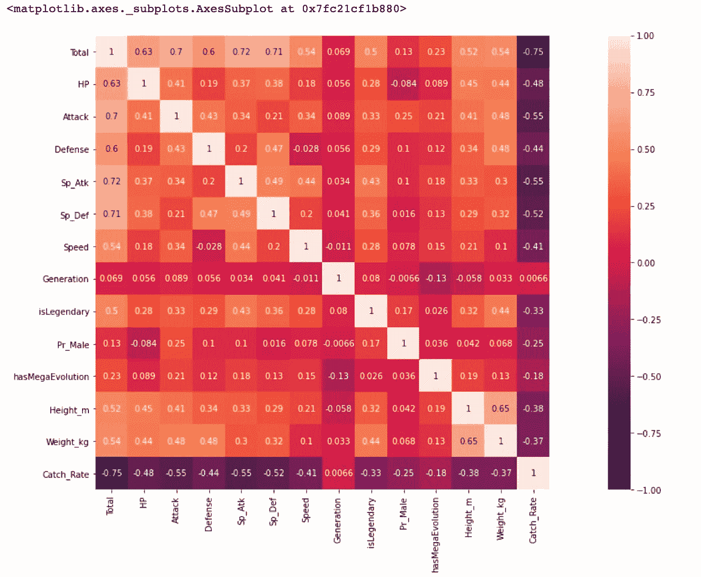
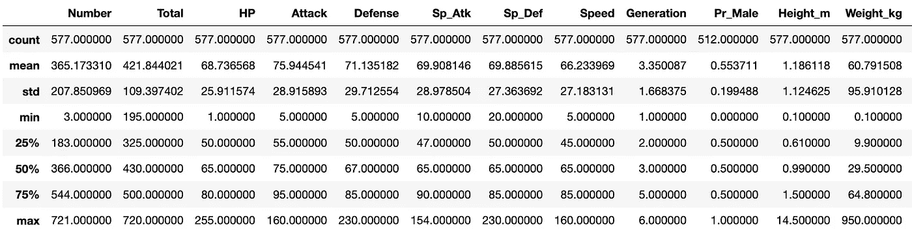

# 关于机器学习，神奇宝贝能教会你什么

> 原文：<https://towardsdatascience.com/what-pok%C3%A9mons-can-teach-you-about-machine-learning-d72586c4b202?source=collection_archive---------40----------------------->

## 简单的数据集消除了学习数据科学等复杂主题时不必要的困难

[杰](https://unsplash.com/@imjma?utm_source=unsplash&utm_medium=referral&utm_content=creditCopyText)在 [Unsplash](https://unsplash.com/s/photos/pokemon?utm_source=unsplash&utm_medium=referral&utm_content=creditCopyText) 上拍照

机器学习是数据科学的一个分支，专门让计算机在没有明确编程的情况下行动**【1】**。最近，机器学习给了我们无人驾驶汽车、精确的网络搜索、实用的语音识别以及对遗传学的大量了解。机器学习是如此相关，以至于你可能一天用很多次都没有注意到。因此，机器学习专业知识在多个行业的兴起并不令人惊讶。

然而，机器学习并不是一个容易学习的话题。它需要相当高的数学和统计学水平，更不用说编程技能了。尽管如此，为了达到你熟悉和舒适地使用机器学习的程度，你必须开始尽可能多地让自己接触这个话题。但是，对于初学者来说，很难找到一个简单的例子。

大多数时候，学生必须处理机器学习的理论方面和问题的特定部分(*例如*预测股票价格时金融市场中使用的术语)。因此，学生可能会被破译行业的特殊性所淹没，以理解手头的机器学习问题。为此，我使用一个学生友好的机器学习示例创建了一个 [Kaggle 数据集](https://www.kaggle.com/renatoboemer/pokemon-datasets-for-ml)。

# **为什么是神奇宝贝？**

因为它比任何其他现实生活中的例子都简单，也不复杂，所以您在学习数据科学和机器学习时会遇到。神奇宝贝是虚构的生物，每个都有独特的特征、能力和技能**【3】**。神奇宝贝被训练成互相战斗(就像拳击或空手道一样)。由于其特点的组合，其中一些更有可能赢得战斗。然而，少数种类的神奇宝贝非常强大，可以击败大多数对手。这些稀有而强大的生物被称为传说中的神奇宝贝。

考虑到这一点，我们将把机器学习算法应用于每个物种的特征、能力和技能，以预测 Pókemon 是否具有传奇色彩。所以，现在，检查下面的步骤。

在 [Unsplash](https://unsplash.com/s/photos/pokemon?utm_source=unsplash&utm_medium=referral&utm_content=creditCopyText) 上由 [Lia Panidara](https://unsplash.com/@panidara?utm_source=unsplash&utm_medium=referral&utm_content=creditCopyText) 拍摄的照片

# **机器学习循序渐进**

理想情况下，您需要两个数据集。第一个称为训练数据集，是神奇宝贝及其特征的列表。还会对每个物种的神奇宝贝是否传奇进行分类。在机器学习的术语中，传说中的神奇宝贝将是**‘1’**，而非传说中的神奇宝贝将是**‘0’**(零)。我们的机器学习将查看这个列表，并交叉检查传奇和非传奇神奇宝贝的数据点之间是否有相似之处。您将训练您的计算机识别传说中的神奇宝贝，因此数据集的名称。

第二个数据集称为测试数据集，应该是一个单独的文件，包含类似的神奇宝贝列表。然而，测试数据集并没有显示神奇宝贝是否是传奇。一旦我们在训练数据集上排序了我们的算法，我们将在测试数据集上测试它，看看我们的模型预测传奇神奇宝贝的效果如何。

结果将是一个百分比；例如，81.3%的确定性一个神奇宝贝物种是传奇。**剧透预警:**几乎可以肯定的是，在现实生活的案例上你永远达不到 100%的把握，所以不要气馁勇往直前。尽你最大的努力。

# **准备数据**

为了让你的学习过程更加高效，我已经清理了数据，这样你就不用浪费时间整理列和空值了。我是这样做的:

# **数据分析**

在本节中，我们将分析与'**is generic '**相关的不同特征之间的关系。各种组件之间的关联热图可能会有所帮助:

*   **正数** =正相关，*即*增加一个特征会增加另一个特征&反之亦然。
*   **负数** =负相关，*即*一个特征的增加会减少另一个特征&反之亦然。

在我们的例子中，我们关注的是哪些特性与传说中的特性有很强的正相关或负相关。

由[作者](https://boemer.medium.com/)创建的热图

看来，‘**攻击**、‘**防御**、‘**捕捉率**等特性与传奇性的关联度很高。这些特性可能对我们以后的模型有用，所以，让我们记住它们。

现在，让我们仔细看看与 **isLegendary** 密切相关的另外两个特征。

似乎大多数传说中的神奇宝贝也是飞行型的，其次是龙型的。没有传说中的毒药，战斗或昆虫类型。尽管如此， **Type_1** 特征对于预测传说中的神奇宝贝还是很有用的。和 **Type_1** 一样， **Type_2** 可以帮助预测传说中的神奇宝贝。

# **特征提取**

在过程的这一步，我们希望只提取对我们的机器学习模型有用的特征(如上所述)。此外，我们必须使我们的模型更容易读取数据点并进行必要的计算。因此，我们必须转换每个数据集…

由[作者](https://boemer.medium.com/)创建的表格

对此…

由[作者](https://boemer.medium.com/)创建的表格

虽然采取这一步骤没有秘密可言，但是没有理由在介质上进行数据准备过程。所以，我已经在我的 [Kaggle](https://www.kaggle.com/renatoboemer/pokemon-ml) 页面上为你勾勒出了它的轮廓。现在，我们可以转到有趣的部分，机器学习。

# **机器学习**

最后，我们已经到了机器学习这一步。有许多算法，但我们将只应用一些最常用的分类算法来预测传奇的神奇宝贝:

*   逻辑回归
*   *k*-最近邻(KNN)
*   决策图表
*   随机森林
*   朴素贝叶斯

以下是培训和测试程序:

**首先**，我们将定义数据集，并用我们的训练数据训练这些分类器。此外，导入必要的模块。

**其次**，利用训练好的分类器，我们将从测试数据中预测传说中的结局。

## 逻辑回归

[逻辑回归](https://en.wikipedia.org/wiki/Logistic_regression)是因变量(DV)为分类变量的模型。它涵盖了二元因变量的情况—例如，它只能取两个值，“0”和“1”。这些案例代表了赢/输、死/活和**传奇/非传奇**等结果。

## k-最近邻

[*k*-最近邻](https://en.wikipedia.org/wiki/K-nearest_neighbors_algorithm)算法( *k* NN)是用于分类和回归的最简单的机器学习算法之一。在 *k* NN 分类中，我们得到的输出是一个类成员关系。该类意味着输入将获得与其大多数邻居相同的分类。数据点被分配到其最近邻居中最常见的类别。k 是邻居的个数，所以必须是正整数(通常是个小数字)。如果 k=1，则该对象被给予该单个最近邻的类。换句话说:

> 如果它有一条尾巴，四条腿，还会叫，那么它很可能是一只狗。

## 决策图表

[决策树](https://en.wikipedia.org/wiki/Decision_tree)是类似流程图的结构，其中每个内部节点代表对某个属性的“测试”。在我们的例子中，神奇宝贝是龙型的还是电动型的。每个分支代表测试的结果，每个叶节点代表考虑所有属性后的决定。因此，从根到叶的每条路径代表一个分类规则。

## 随机森林

[随机森林](https://en.wikipedia.org/wiki/Random_forest)是一种分类的分组学习方法，通过构建几个决策树来工作。随机森林输出的类是类(分类)的**模式**或个体树的**均值**预测(回归)。随机决策树纠正了决策树过度适应训练集的缺点。

## 高斯朴素贝叶斯

[朴素贝叶斯](https://en.wikipedia.org/wiki/Naive_Bayes_classifier)是一个简单的概率分类器，基于著名的贝叶斯定理，在特征之间具有强(朴素)独立性假设。

贝叶斯定理描述了一个事件的概率，基于可能与事件**【4】**相关的条件的先验知识。换句话说，*贝叶斯**定理*是在我们知道某些其他概率的情况下，寻找一个概率的一种方法。例如，假设新冠肺炎与年龄有关。在这种情况下，一个人的年龄可以用来评估一个人有新冠肺炎的可能性，这比在不知道这个人的年龄的情况下评估新冠肺炎的可能性更准确。

所有朴素贝叶斯分类器都假设，给定类变量，特定特征的值独立于任何其他属性的值。例如，如果一个水果是橙色的，圆形的，大约 7 厘米大，那么它可以被认为是橙子。朴素贝叶斯分类器认为每个特征独立地贡献了该水果是橙子的概率，而不考虑颜色、圆度和直径特征之间的任何可能的相关性。

**最后**，我们将计算每个训练好的分类器的准确率分数(百分比)。

由[作者](https://boemer.medium.com/)创建的表格

我们可以看到，决策树和随机森林分类器的准确率最高。然而，我们选择**随机森林分类器**，因为它可以限制[过拟合](https://www.kaggle.com/dansbecker/underfitting-and-overfitting)，而决策树分类器不能。因此，下一次有人创造一个新的神奇宝贝，我们可以应用我们的随机森林分类器以 86.2%的把握预测这个新生物是否是传奇。

## **结论**

如今，机器学习就在我们身边。它将继续为困难的分类和预测问题提供创新的解决方案。的确，这不是一个容易学的题目。尽管如此，在大多数情况下，由于现实生活中的例子，这可能会更加令人生畏，这需要对行业有一定程度的熟悉(*例如*股票市场)。对于想要了解分类在最基础层面上如何工作的数据科学家和机器学习学生来说，神奇宝贝派上了用场。专家可能会批评 86.2%的准确率不够。尽管如此，本文的主要目标是带您了解机器学习项目背后的基本原理。我希望你受到鼓励去参加[神奇宝贝挑战](https://www.kaggle.com/renatoboemer/pokemon-datasets-for-ml)。最终，这些挑战会让你更加适应机器学习。你准备好了吗？

**感谢阅读。这里有一些你可能会喜欢的文章:**

 [## 初学者的完美 Python 备忘单

### Cheetsheets 是有抱负和早期职业数据科学家的救命稻草。

towardsdatascience.com](/the-perfect-python-cheatsheet-for-beginners-c7c16799de5)  [## 提高生产力:使用 Python 和 Pandas 进行数据清理

### 数据清理可能很耗时，但了解不同类型的丢失值，以及如何处理…

towardsdatascience.com](/increase-productivity-data-cleaning-using-python-and-pandas-5e369f898012)  [## 作为数据科学家最适合工作的公司

### 寻找数据科学职位时，拓展你的视野

towardsdatascience.com](/best-companies-to-work-for-as-a-data-scientist-aa991ff29e2a) 

**参考文献:**

**【1】骏马**【https://www.coursera.org/learn/machine-learning】T2

**【2】KD 掘金**[https://www . KD Nuggets . com/2020/11/rise-machine-learning-engineer . html .](https://www.kdnuggets.com/2020/11/rise-machine-learning-engineer.html.)

**【3】神奇宝贝**[https://www.pokemon.com/uk/pokedex/](https://www.pokemon.com/uk/pokedex/)

**【4】贝叶斯定理**[https://en.wikipedia.org/wiki/Bayes%27_theorem](https://en.wikipedia.org/wiki/Bayes%27_theorem)