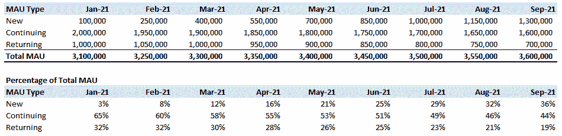
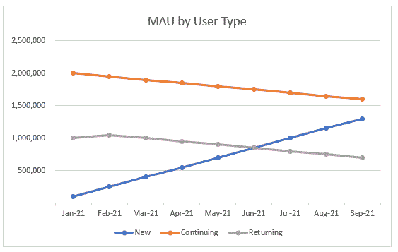
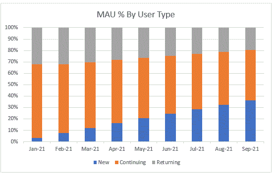

# 关于 MAU，产品分析师应该知道什么

> 原文：<https://towardsdatascience.com/what-product-analysts-should-know-about-mau-c07c13443dfe?source=collection_archive---------21----------------------->

## 如何衡量产品参与度

照片由 [Cookie 在](https://unsplash.com/@cookiethepom?utm_source=medium&utm_medium=referral) [Unsplash](https://unsplash.com?utm_source=medium&utm_medium=referral) 上的 Pom 拍摄

当我成为一名[产品数据分析师](/my-experience-as-a-product-data-analyst-3d01748bc6ea)时，我被介绍给了 MAU(月度活跃用户)，这是衡量产品参与度和增长的主要 KPI(关键绩效指标)。随着时间的推移，我意识到 MAU 作为一个单一的 KPI 不足以回答产品利益相关者的问题。今天，我将讨论 MAU 的问题，以及如何让它成为衡量产品参与度的更有意义的 KPI。

# 问题

## 不同的定义

MAU 被[定义为](https://www.investopedia.com/terms/m/monthly-active-user-mau.asp)过去一个月内访问网站的独立用户数量，其中一个月是 30 天。

第一个问题在于“用户”的定义。这些网站的匿名访问者是由 cookie ID 跟踪的吗？这些仅限于注册了帐户的用户，还是两者都有？

第二个问题是什么被认为是“活跃”用户？我们算不算一个在网站上看了一页就离开的访问者？如果用户只是因为得到了推送通知而登录了 app，然后关闭了它怎么办？一种选择是要求一个活跃的用户在你的产品的核心功能中执行至少一个活动，以此来计算“活跃”。如果你有一个游戏应用程序，这可能意味着用户玩了一个游戏。如果你有一个信息应用程序，用户必须发送或阅读信息。

鉴于“用户”和“活跃”的定义不同，不同产品的 MAU 可能不具有可比性，因此在分析 MAU 变化时，您应该注意澄清这些定义。

## 如果不看构成，总体 MAU 可能会产生误导

在下面的例子中，总 MAU 从一月份的 310 万增加到九月份的 360 万。如果产品经理只是关注 MAU 的增长，他们会认为一切都很好，因为参与度提高了。

然而，如果我们使用下面的定义将 MAU 分成三个部分，我们会看到不同的趋势。MAU 增长的大部分来自于**新**用户和**持续**和**回归**用户，实际上自一月份以来一直在下降。

*   新用户是本月注册的用户。
*   **持续**上个月和本月用户活跃。
*   **回头客**2 个多月前活跃，本月活跃。

作者图片

按细分市场绘制的 MAU 图更清晰地显示了趋势。蓝色的**新**用户线在增加，橙色的**继续**和灰色的**回归**用户在逐渐减少。

作者图片

堆积条形图帮助我们看到**新**用户占总 MAU 的百分比在增加，而**继续**和**返回**的百分比在减少。

作者图片

在上面的例子中，公司有一个用户保留问题。新用户在增加，但许多人不会回来。如果不细分 MAU，产品经理就不会意识到有一个需要解决的用户保留问题。

# 可供选择的事物

由于 MAU 无法讲述产品参与的全部情况，因此有几个备选方案。

## 使用群组分析 MAU

[群组](https://clevertap.com/blog/cohort-analysis/)按注册月份统计用户，分析一段时间内的留存率。对于我上面使用的例子，群组分析可以帮助确定保留率是否一直在下降，或者是由于 2021 年的产品变化影响了保留率。群组分析将有助于确定保留率何时开始下降。

## **粘性比**

产品粘性是“[客户再次使用你的产品或更频繁使用它的倾向](https://www.parlor.io/blog/customer-stickiness/)”。DAU(每日活跃用户)除以 MAU 可用于[衡量粘性](https://www.geckoboard.com/best-practice/kpi-examples/dau-mau-ratio/)，这是一个流行的参与度指标，因为它曾被脸书使用。

# 外卖食品

最后，MAU 有助于跟踪产品参与度，但可能无法反映全部情况。现在你已经理解了局限性并有了替代方案，我希望这能有所帮助，让你在下次遇到关于敬业度的问题时有一个新的视角。

## 你可能也会喜欢…

 [## 关于 A/B 测试，产品分析师应该知道什么

towardsdatascience.com](/what-product-analysts-should-know-about-a-b-testing-a7bdc8e9a61)  [## 我作为产品数据分析师的经历

### 支持产品如何让我成为更好的数据分析师

towardsdatascience.com](/my-experience-as-a-product-data-analyst-3d01748bc6ea)  [## 营销人员应该了解哪些订阅模式

### 数据分析师洞察提高转化率和降低流失率

bettermarketing.pub](https://bettermarketing.pub/what-marketers-should-know-about-subscription-models-7643bbede5eb)