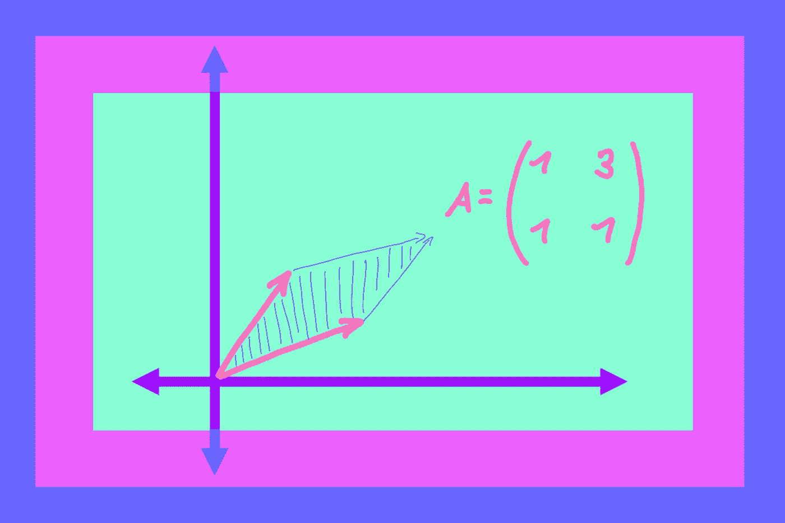
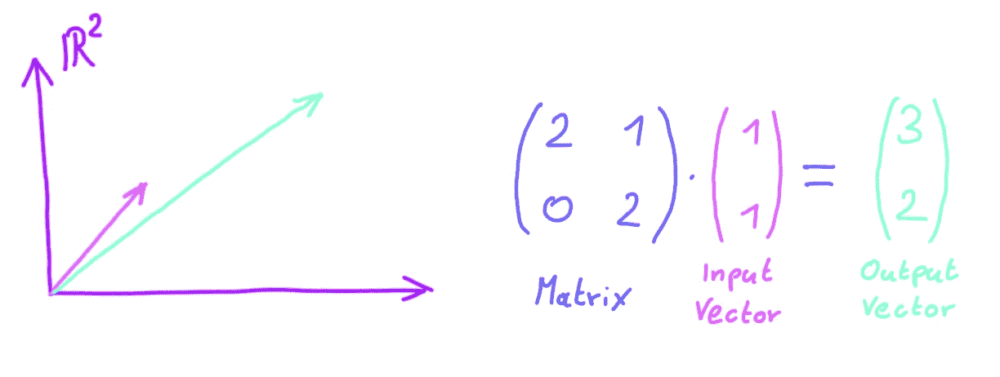
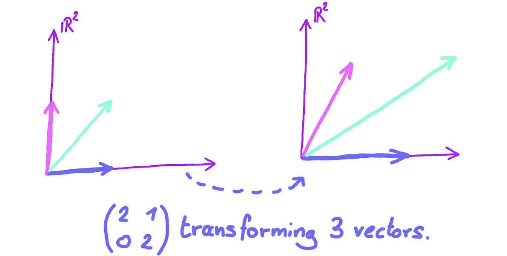
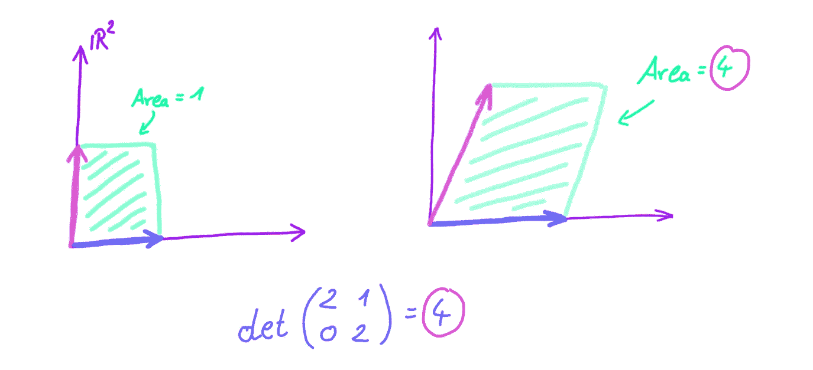
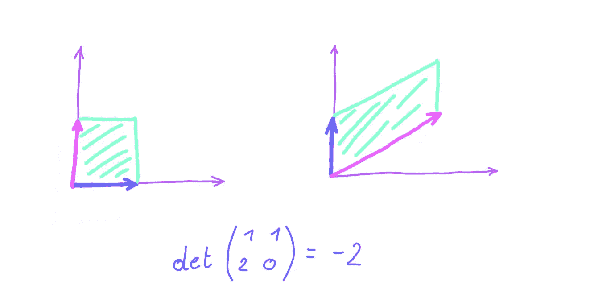

# 什么是矩阵行列式？

> 原文：<https://towardsdatascience.com/what-really-is-a-matrix-determinant-89c09884164c?source=collection_archive---------0----------------------->

## [入门](https://towardsdatascience.com/tagged/getting-started)

## 行列式背后的几何直觉会改变你对它们的看法。

图片作者(【marcelmoos.com】T2)

回想我的高中时代，线性代数是我特别着迷的一个话题。它给了我解决大型线性方程组的技巧，以及对问题的几何透视，使整个过程变得直观。

然而，关于矩阵行列式，我被教导的是它们是矩阵的数字，如何计算它们，而不是更多。直到上了大学，我才了解到行列式背后的美。

> 当我一知道行列式的几何意义，我就在想为什么高中没有教它，因为它非常容易理解和开放思维。

在数学中，如何计算一个东西永远不应该是第一个问题。第一个问题总是:“它到底是什么？”。只有到那时，我们才应该问:“好了，现在我们知道了它是什么，我们如何计算它”。以导数为例，我们大多数人都知道什么是导数:

> 给定一个函数，它的导数就是它的斜率或变化率。

就是这么简单的描述。然而，以这种方式定义衍生品是如此强大和自由。我们知道什么是导数，不管具体的函数，或者函数的维数，也不管如何计算它。不同函数的导数的实际计算有很大不同。然而，衍生品的基本含义是将一切联系在一起，将秩序带入混乱。

没有老师会像这样给学生介绍导数:"给定一个函数，导数就是另一个函数，这就是你计算它的方法……"尽管如此，对于矩阵行列式，这样的解释似乎流传很广。根据行列式的几何意义而不仅仅是一些数字来定义行列式，就像把导数看作斜率而不仅仅是函数一样强大。

# 行列式和几何

在深入研究行列式之前，让我们快速回顾一下它们的定义:矩阵。

**矩阵是一个数字表，代表一个线性函数**以一个向量作为输入，产生另一个向量作为输出:

除了矩阵转换单个向量，我们还可以考虑矩阵同时转换多个(甚至所有)向量:

你能看见它吗？看起来我们选择的矩阵**拉伸了空间**。无论我们选择输入空间中的哪一个区域，看起来在变换之后，区域变大了。这正是行列式的意义所在！

> 矩阵的行列式是该矩阵缩放面积的因子。

因为矩阵是**线性**变换，所以知道**一个**单一区域的缩放因子就足以知道所有区域的缩放因子。让我们回到我们的例子:

由粉色和蓝色单位向量内接的矩形，面积为 1。应用我们的矩阵变换后，这个矩形变成了一个平行四边形，底边为 *2* 高为 *2。所以它的面积是 4。*这意味着，我们的矩阵以 *4* 的系数缩放面积。所以我们矩阵的行列式是 *4* 。很整洁，不是吗？

这个故事有一个警告:决定因素可以是负的！如果我们从面积 1 开始，用一个负的因子来缩放，我们将得到一个负的面积。而负面区域就是扯淡。**那么，在负行列式存在的情况下，我们如何理解我们的几何定义呢？幸运的是，解决方法很简单:如果一个矩阵有一个负的行列式，比如说-2，面积按 2 缩放。减号只是意味着空间颠倒了它的方向。“这到底是什么意思？”你可能会理直气壮地问。让我们来看看:**

我们可以看到，给定的矩阵按系数 *2* 缩放面积。如果我们仔细观察，我们会进一步注意到蓝色向量在粉色向量的右边，但最后却在左边。这就是“空间颠倒了方向”的含义。这就是为什么矩阵的行列式不是 *2* 而是 *-2* 的原因。包括负面决定因素在内，我们得到了全貌:

> 矩阵的行列式是该矩阵缩放面积的符号因子。如果符号为负，矩阵反转方向。

我们所有的例子都是二维的。很难画出更高维的图。行列式的几何定义适用于高维空间，就像它适用于二维空间一样。在三维空间中，决定因素是体积的有符号比例因子，在更高维度中是超体积。

# 知识带来力量

有了行列式的这个新的几何定义，我们可以轻松地解决问题，如果没有它，事情会变得困难得多。例如，你可能听说过也可能没有听说过以下事实:

> 如果矩阵的行列式为 0，则它是不可逆的。

矩阵不可逆意味着矩阵所代表的变换不可撤销或回复。如果我们只知道行列式是如何计算的，而对它们的几何意义一无所知，证明这一事实是困难的。**相比之下，使用我们新建立的关于决定因素的直觉来解释为什么这是真的并不困难**

假设我们有一个行列式为 *0* 的矩阵。这意味着矩阵以系数 *0* 缩放所有区域，这又意味着所有区域在变换后变成 *0* 。只有当矩阵将整个空间压缩到一个更低的维度时，这种情况才会发生。例如，二维空间将被压缩成一条线或一个点，并且这种转换是不可撤销的。

到了这一步，我们可以为自己感到骄傲。我们引入了矩阵行列式作为面积比例因子，并证明了矩阵和行列式的一个著名性质。我们做这些甚至没有考虑行列式是如何计算的。但是这个问题应该是次要的。

觉得这个故事有趣？你可以在这里成为一个中等会员来支持我的写作:[medium.com/@mmsbrggr/membership](https://medium.com/@mmsbrggr/membership)。你将获得所有媒体的访问权，你的部分会员费将直接支持我的写作。

欢迎在 LinkedIn[上向我提出私人问题和评论。如果你喜欢这篇文章，让我告诉你我的时事通讯:](https://www.linkedin.com/in/marcel-moosbrugger/)[marcelmoos.com/newsletter](https://marcelmoos.com/newsletter)。