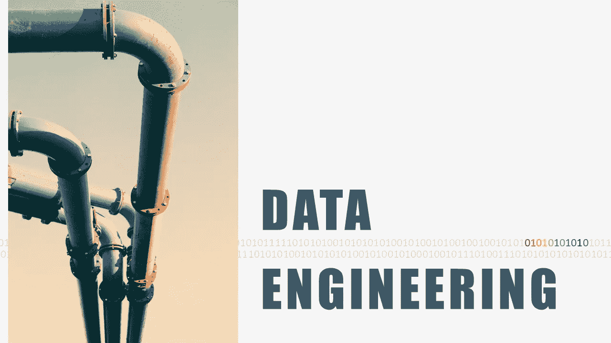

# 对于 FAANG 的数据工程职位来说，哪些技能是重要的？

> 原文：<https://towardsdatascience.com/what-skills-are-important-for-a-data-engineering-role-at-faang-ec5230cbc962?source=collection_archive---------23----------------------->

## 数据工程

## 在 FAANG 这样的大公司获得数据工程职位之前，你需要知道什么

！丹尼尔·索罗金在 [Unsplash](https://unsplash.com/s/photos/pipeline?utm_source=unsplash&utm_medium=referral&utm_content=creditCopyText) 上拍摄的照片。由作者修改。

作为一名在大型 FAANG 公司工作的数据工程师，我经常听到人们问，在知名科技公司获得数据工程工作，什么技能是重要的？许多人认为他们需要精通 Spark 或了解 Hadoop 系统的一切才能在这些公司找到工作。虽然对某些数据工程角色来说是这样，但它与大公司(包括 FAANG 公司)内部的许多其他数据工程角色无关。

在这篇文章中，我提到了在大型科技公司获得数据工程工作所需的最重要的技能。在继续之前，我想强调一下，这篇文章更多地是针对与分析团队一起工作的数据工程师，而不是与基础架构团队一起工作的数据工程师。

# 结构化查询语言

SQL 可能是你在任何公司获得数据工程职位所必须掌握的最重要的技能。如果有人跟你说 SQL 老了，已经没人管 SQL 了，请忽略它。即使在 FAANG 这样的大公司，SQL 仍然是很多数据工程师使用最广泛的语言。记住，做一个万能的数据工程师，要努力学习 standard/ANSI SQL。许多公司使用不同的数据库，他们使用像 Presto 这样的平台从一个点访问和查询它们。

对于那些想认真学习 SQL 的人，我的第一推荐是 Vertabelo Academy(披露:与作者无隶属关系)

 [## 随时随地学习 SQL。维尔塔贝罗学院的在线课程

### 在 Vertabelo 学院，我们相信边做边学是掌握新技能的最佳方式。这就是为什么我们的课程…

academy.vertabelo.com](https://academy.vertabelo.com/) 

提高 SQL 技能的另一条建议。始终考虑如何提高 SQL 查询的性能。许多人可以用一个复杂的非优化的 SQL 查询来完成一项任务，但是当涉及到大量数据时，编写优化的查询是至关重要的，它将您与 SQL 初学者区分开来。

# 计算机编程语言

也许，数据工程师最重要的任务是构建数据/ETL 管道。许多现代数据管道都是用 Python 语言编写的。Python 为构建复杂的 ETL 管道提供了一套灵活而广泛的工具。Python 是许多工作流管理平台的语言(见下一节)。大多数现代数据管道是 Python 和 SQL 查询的混合脚本。对于大多数数据工程任务，您应该能够使用 Python 的基本工具、对象和库来完成任务。

# 气流或工作流管理平台

大多数管道都需要定期运行。此外，在没有综合专用工具的情况下，很难监控和维护管道。因此，许多大公司开始使用像 Apache Airflow 这样的工作流管理平台。一些公司有自己的工作流管理平台，另一些公司使用像 Airflow 这样的开源选项。由于 Airflow 被许多科技公司广泛使用，并且与一些大公司的其他专有工具非常相似，因此鼓励投入时间学习 Apache Airflow。你有很多选择来学习(甚至获得认证)气流。以下是一些选项(披露:与作者无隶属关系)。

 [## Apache 气流的完整实践介绍

### 大家好，我叫马克·兰伯特，今年 27 岁，很高兴能引起你们的好奇心！我目前在工作…

www.udemy.com](https://www.udemy.com/course/the-complete-hands-on-course-to-master-apache-airflow/) 

(披露:与作者无关)

 [## 天文学家|阿帕奇气流的企业框架

### 在我们或您的云中轻松运行、管理和扩展 Apache 气流。

www .天文学家. io](https://www.astronomer.io/) 

# 仓储系统基础

数据仓库是公司中所有可用数据(理想情况下)的结构化组织。使用数据仓库，数据科学家和决策者可以回答重要的业务问题并分析业务绩效。建立和维护数据仓库的人是数据工程师。与数据仓库交互是数据工程师工作的重要部分。因此，对于数据工程师来说，理解数据仓库基础知识和了解该领域的最佳实践是至关重要的。

对于那些想学习数据仓库和最佳实践的人来说，克里斯多夫·阿达姆松的《星型模式完整参考》是最好的起点(声明:与作者无关)。

 [## 星型模式完整参考

### 我们很抱歉。此预览目前在此浏览器上不可用。与此同时，你可以阅读这些…

read.amazon.com](https://read.amazon.com/kp/embed?asin=B003Y8YWAE&preview=newtab&linkCode=kpe&ref_=cm_sw_r_kb_dp_TYBC3G1Z4548S1HF2JVV) 

如果你没有时间阅读这本优秀的书，或者如果你想获得阅读它的动力，请阅读我在《走向数据科学》上发表的书籍摘要。它在一篇短文中涵盖了所有重要的基础知识。

 [## 数据科学家的数据仓库基础

towardsdatascience.com](/fundamentals-of-data-warehouses-for-data-scientists-5314a94d5749) 

# Hadoop、Spark 和 Hive 的基础知识

由于数据的规模(通常一个简单的查询需要数 Pb 的数据)，大多数大型科技公司的数据仓库都是基于 Hadoop 系统的。尽管一些数据工程师熟悉 Hadoop 和 Spark，但许多这些公司利用 Hive(和 Presto)来支持所有数据工程师(他们最熟悉 SQL)。数据工程师应该熟悉 Hadoop、Spark 和 Hive 的基础知识。然而，许多数据工程师(尤其是分析方面的 DEs)只需要基本的知识就可以完成他们的日常工作。像 Presto 和 Hive 这样的系统使数据工程师能够通过 ANSI SQL 与许多类型的数据库(包括 Hadoop 系统)进行交互。同样，如果你在上游团队(涉及基础设施系统和维护数据仓库的团队)中担任 DE，你可能需要更好的 Hadoop 和 Spark 技能，但对于分析团队中的 DE 角色，基本知识应该足够了。这里有一本书可以帮助你熟悉 Hive 和 Hadoop(披露:与作者无隶属关系)。

 [## 编程配置单元:Hadoop 的数据仓库和查询语言

### 我们很抱歉。此预览目前在此浏览器上不可用。与此同时，你可以阅读这些…

read.amazon.com](https://read.amazon.com/kp/embed?asin=B009D76316&preview=newtab&linkCode=kpe&ref_=cm_sw_r_kb_dp_YYMH6J8N04P2VCPGEX19) 

# 摘要

你需要非常了解 SQL 和 Python 才能在知名科技公司(比如 FAANG 公司)找到数据工程的工作。使用 Apache Airflow 这样的工作流管理平台的经验可以帮助您构建 ETL 管道，并在您的工具箱中拥有这种技能。此外，您需要了解 Hadoop、Hive、Spark 和数据仓库的基础知识，以便通过面试并能够完成日常工作。对于许多公司和角色来说，了解关于 Hadoop、Hive 或 Spark 的太多细节是不必要的，因为许多 DE 角色通过 Presto 或 Hive 等基于 SQL 的工具与数据仓库进行交互。