# 2010 年代我错过了什么歌？

> 原文：<https://towardsdatascience.com/what-song-did-i-miss-in-the-2010s-306ff6a061c5?source=collection_archive---------24----------------------->

## **使用 Spotify Web API 和 k-means 聚类找出它们**

## 介绍

没有人能否认 Spotify 革新了整个音乐行业。但很多人不知道的是，Spotify 还免费提供了强大的 Web API。在 Spotify 中创建你的开发者账号后，你就可以打开这个闸门，摆弄与音乐相关的海量信息。今天我在这里演示如何用 Python 玩 Spotify Web API。

## 情况

我有自己的播放列表，只有 56 首歌曲。我确定我错过了很多好歌。但是我怎么才能确定我错过了什么呢？更重要的是，我如何利用我当前的播放列表找到我可能也喜欢的其他歌曲？所以需要一个基于我目前歌单的推荐系统。但是如何量化我的歌单里我爱听的歌？

我们开始吧！

## 第一步:访问 Spotify Web API

首先，你需要在你的 Spotify 账户中设置好一切。客户端 ID 和客户端密码是必需的。如果您还没有，请点击[链接](https://developer.spotify.com/documentation/web-api/quick-start/)下的“设置您的帐户”部分。

在仪表板页面上设置应用程序后，您将获得客户端 ID 和客户端密码。这两个是访问 Spotify API 所必需的。不要和别人分享！


Spotify Web API 基于 REST。所以我们需要的就是包装。在获得客户机 ID 和客户机秘密之后，我们需要的下一件事是访问令牌。你可以向 Spotify 提出请求，Spotify 会将访问令牌返还给你。

```
auth_response = requests.post("[https://accounts.spotify.com/api/token](https://accounts.spotify.com/api/token)", {
    "grant_type": "client_credentials",
    "client_id": CLIENT_ID,
    "client_secret": CLIENT_SECRET,
})auth_response_json = auth_response.json()access_token = auth_response_json["access_token"]
```

`auth_response_json`将采用 JSON 格式，如下所示

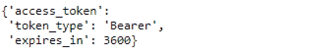

当我们向 Spotify 发送任何请求时，我们都会添加一个包含此 access_token 的额外标头。

```
headers = {"Authorization": f"Bearer {access_token}"}
```

访问 API 的基本 URL 是[https://api.spotify.com/v1/](https://api.spotify.com/v1/')。URL 后面的会话是选择 API 的类型。比如对于一个艺人，网址会是[https://api.spotify.com/v1/artists](https://api.spotify.com/v1/artists)；对于播放列表，它将是[https://api.spotify.com/v1/me/playlists](https://api.spotify.com/v1/me/playlists)。然后对于每种类型的 API，会有不同的 API 调用。欲了解更多信息，您可以访问[此链接](https://developer.spotify.com/documentation/web-api/reference/)。

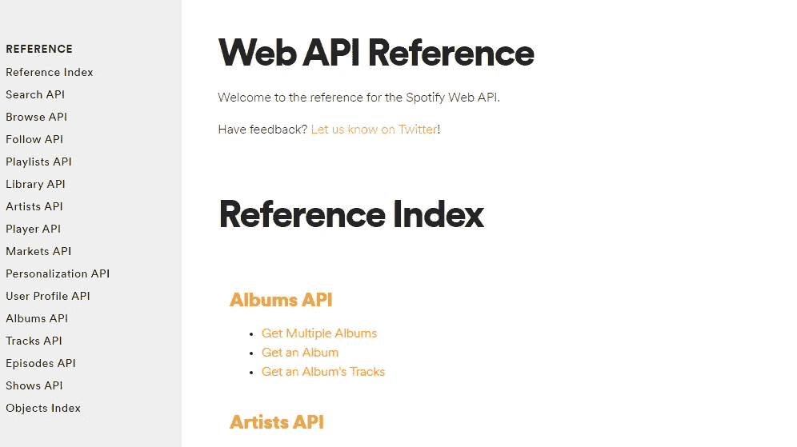

## 第二步:我的 Spotify 播放列表中的歌曲

现在我们都准备好享受 Spotify API 了。第一个问题，我的播放列表里有哪些歌曲？要识别哪个播放列表，您需要提供该播放列表的 ID。如果你点击三个点->共享->复制链接到播放列表，就可以获得 ID。

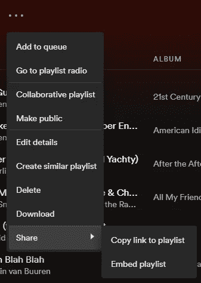

你会得到一个网址。playlist/后面的字符串是播放列表的 ID。

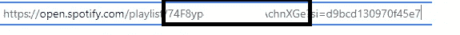

如果我们专门获取一个播放列表中的所有歌曲，您可以按如下方式进行:

```
requests.get("https://api.spotify.com/v1/playlists/YOUR_PLAYLIST_ID/tracks", headers=headers).json()
```

然而，有一个问题是，每次发送请求，你最多只能从 Spotify API 获得 100 首歌曲。

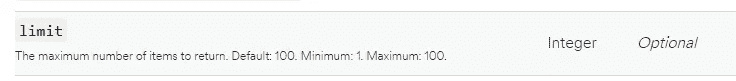

因此，如果您的播放列表中有超过 100 首歌曲，那么您需要包含`offset`参数并使用 for 循环来获取所有歌曲的详细信息。

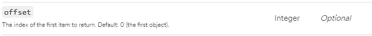

但由于我的播放列表只有 56 首歌曲，所以我没事。

你会收到一个长长的 JSON。`Item`中的每个元素代表一首歌。它列出了歌曲的详细信息，包括歌曲名称、艺术家和专辑名称。

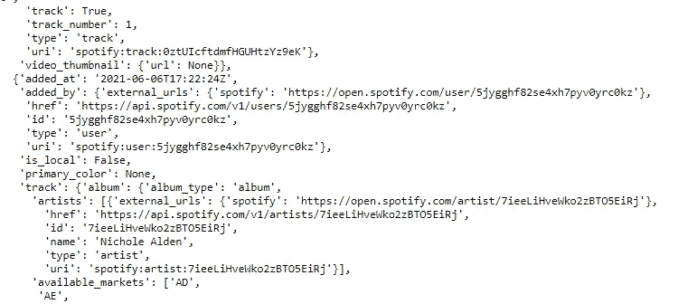

艺术家详细信息

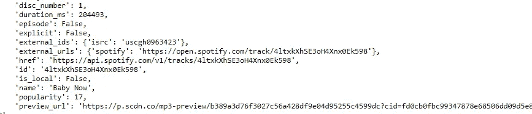

歌曲细节

我们下一步需要的是歌曲的 ID。但是这里我们也得到歌曲名称和艺术家，只是为了演示。

由于我们将发送请求超过三次，我简单地创建了如下函数( [Link](https://twitter.com/drob/status/928447584712253440) ):

```
def send_request(send_type_,id_,remaining_ = ""):
    return requests.get(BASE_URL + send_type_ +"/"+ id_ + "/"+remaining_, headers=headers).json()myPlaylist = send_request("playlists", YOUR_PLAYLIST_ID,"tracks")
```

## 第三步:歌曲的特点

是时候想办法描述一下我喜欢什么类型的歌了。从最后一步，我们可以获得每首歌曲的唯一 ID。在这个阶段，我们可以使用`audio_features`发送一个请求，并将 ID 作为参数。例如:

```
requests.get("[https://api.spotify.com/v1/audio-features/4ltxkXhSE3oH4Xnx0Ek598/](https://api.spotify.com/v1/audio-features/4ltxkXhSE3oH4Xnx0Ek598/)", headers=headers).json()
```

这就是你将得到的，一个列出了歌曲特征的 JSON。

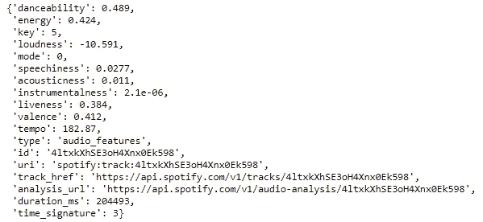

这里就不解释每个字符的意思了。有兴趣的话，去[这个链接](https://developer.spotify.com/documentation/web-api/reference/#object-audiofeaturesobject)了解更多。

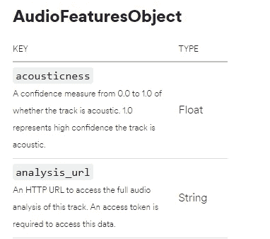

现在，我们几乎完成了收集我的播放列表中歌曲的所有必要信息。最后一步是将所有信息存储在数据帧中。

```
# This is to get the song ID of a song
def get_id(dict_):
    return dict_["track"]["id"]# This is to get all details of a song 
def getSongDetail(trackID_):
    # Get the audio feature of a song 
    audioFeatures = send_request("audio-features" , trackID_)
    # Get the information of a song 
    songDetails = send_request("tracks", trackID_)
    songName = songDetails["name"]
    artists = songDetails["artists"]
    artistsName = [x["name"] for x in artists]
    # Combine all into a dict
    return {**{"Song_Name": songName, "Artists": artistsName},**audioFeatures}mySongs = []
for song in myPlaylist["items"]:
    mySongs.append(getSongDetail(get_id(song)))
mySongsDF = pd.DataFrame(mySongs)
```

## 第四步:k-means 聚类

(这里我假设你已经知道什么是 k 均值聚类。如果没有，有大量的材料介绍。例如 [scikit-learn doc](https://scikit-learn.org/stable/modules/clustering.html#k-means) 。)

因此，我们将只需要数字变量进行 k 均值聚类。在执行聚类之前，还要执行标准化，以调整所有数值变量的标度。

```
numeric_Variable = ["danceability", "energy",  "loudness", "speechiness",
       "acousticness", "instrumentalness", "liveness", "valence", "tempo","duration_ms"]
mySongsNumericDF = mySongsDF[numeric_Variable]# This is to standardize all numeric variables 
mysongsScaler = StandardScaler().fit(mySongsNumericDF)
mysongsNormalizedDF = mysongsScaler.transform(mySongsNumericDF)
```

用肘法求最优 k。

```
# This is to return the sum of squared distances of samples to their closest cluster center.
def get_inertia(n_cluster_,df_):
    return  KMeans(n_clusters = n_cluster_, random_state= 42).fit(df_).inertia_mySongSqDistance = []
for i in range(1,10):
    mySongSqDistance.append(get_inertia(i,mysongsNormalizedDF))plt.plot(range(1,10), mySongSqDistance, "rx-")
plt.show()
```

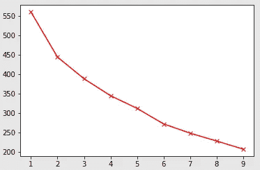

肘部不清楚，但至少从 1 到 2 的下降比从 2 开始大。所以下一步我取 k =2。

```
kMeansResult = KMeans(n_clusters = 2, random_state= 42).fit(mysongsNormalizedDF)
```

第一个问题:每个集群有多少首歌？

```
collections.Counter(kMeansResult.labels_)
# Counter({1: 18, 0: 38})
```

第二个问题:每个集群都分组了哪些歌曲？

```
mySongsDF["kCluster"] = kMeansResult.labels_.tolist()
list(mySongsDF[mySongsDF["kCluster"]==1]["Song_Name"])
```

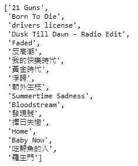

有意思的一点是，我所有的粤语歌都在这个集群里。

## 第五步:我错过了什么歌？

现在是时候找出我错过了哪首歌了。

我将使用现有的歌曲列表，并将所有歌曲放入经过训练的 k-means 聚类中。聚类之后，我将进一步计算每首歌曲与相应聚类的质心之间的距离。

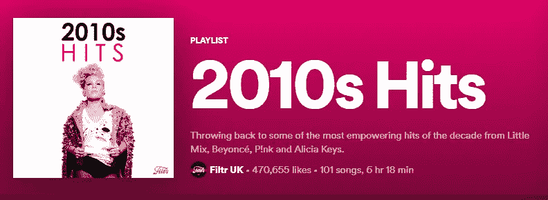

这将是歌单。

得到歌曲特征的过程和前面一样。所以下面更侧重于 k-means 聚类部分。首先是标准化，然后预测结果。

```
# playlist_songsNumericDF is a dataframe for storing all numeric characteristics of all songs in the playlist# Below processes are to standardize all numeric variables and then predict the result. playlist_songsNormalizedDF = mysongsScaler.transform(playlist_songsNumericDF)playlist_songsPredict = kMeansResult.predict(playlist_songsNormalizedDF)
```

下面是所有被预测在聚类 1 中的歌曲。

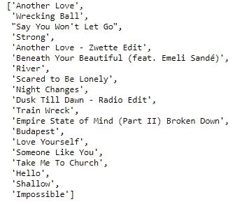

然后，我们计算每首歌曲与其各自的聚类质心之间的距离。这里我们使用距离 numpy 的欧几里德距离。

```
playlist_songsDF["Distance_to_Centroid"]=[np.linalg.norm(
    result[0]-kMeansResult.cluster_centers_[result[1]]) 
    for result in list(zip(playlist_songsNormalizedDF,
                           playlist_songsPredict))
]
```

与质心距离最短的前五首歌曲是:

```
list(playlist_songsDF[playlist_songsDF["kCluster"]==1].nsmallest(5,"Distance_to_Centroid")['Song_Name'])
```

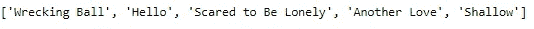

## 最后的

这里我只演示一个简单的例子来使用 Spotify Web API。如果你对此感兴趣，我建议你访问 https://developer.spotify.com/，发现 Spotify 免费提供的其他酷功能。

本文到此结束，整个 Jupyter 笔记本已经发布在我的 GitHub 上([链接](https://github.com/wyfok/Spotify_API_KMeans))。

下次见。