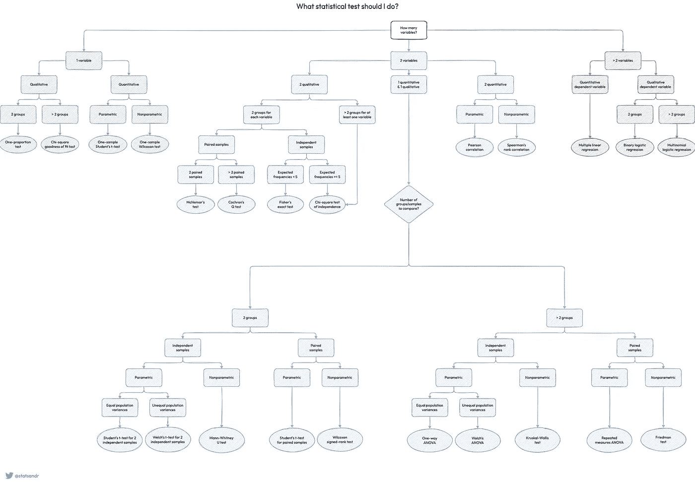

# 应该做什么统计检验？

> 原文：<https://towardsdatascience.com/what-statistical-test-should-i-do-612036412147?source=collection_archive---------26----------------------->

## 借助流程图，根据变量的数量及其类型选择最合适的统计测试

作为一名[统计学助教](https://antoinesoetewey.com/teaching/)为不同背景的学生提供帮助，我有机会看到全球学生没有很好理解的东西。

我已经意识到，当学生被告知使用哪一个时，他们做一个具体的统计测试通常不是问题(当然，只要他们有良好的资源，并且他们在课堂上一直很专心)。然而，当他们需要**选择做什么测试**时，这个任务对他们来说似乎要困难得多。

本文给出了一个流程图，帮助学生根据几个标准选择最合适的统计测试: [1](https://statsandr.com/blog/what-statistical-test-should-i-do/#fn1)

统计测试概述(图片由作者提供)

由于大量的测试，图像很宽，因此可能无法在所有屏幕上很好地呈现。在这种情况下，您可以通过点击以下链接全屏查看:

[**PDF 格式下载**](https://statsandr.com/blog/files/overview-statistical-tests-statsandr.pdf)

正如您在流程图中看到的，选择最合适的测试基于:

*   感兴趣的变量的数量:一个、两个或两个以上的变量
*   [变量类型](https://statsandr.com/blog/variable-types-and-examples/) : [定量](https://statsandr.com/blog/variable-types-and-examples/#quantitative)或[定性](https://statsandr.com/blog/variable-types-and-examples/#qualitative)
*   在定性变量的情况下，组的数量以及它们是独立的还是成对的(即从属的)
*   无论您想要参数或非参数版本 [2](https://statsandr.com/blog/what-statistical-test-should-i-do/#fn2)

在一幅图像中总结如此多的测试并不是一件容易的事情。此流程图的目标是为学生提供一种快速简便的方法，从最常见的统计测试中选择最合适的统计测试(或查看有哪些替代方法)。显然，这个流程图并不详尽。还有许多其他的测试，但是为了保持简单和可读性，大部分都被省略了。我决定保持简单，这样流程图就不会让人不知所措，希望它对大多数学生来说仍然是完整和精确的。

为了完整起见，这里有一些关于此流程图的附加说明:

*   两个以上变量的测试也适用于两个变量的情况。然而，为了简单起见，当可能有多个测试时，我倾向于建议最简单的测试。例如，对于两个定量变量，可以进行[相关性检验](https://statsandr.com/blog/correlation-coefficient-and-correlation-test-in-r/)和[简单线性回归](https://statsandr.com/blog/multiple-linear-regression-made-simple/)。在统计学入门课上，我很可能会教授相关性的概念，但不一定是线性回归的概念。出于这个原因，我最有可能推荐相关性测试而不是线性回归，除非学生的水平更高。
*   [Kolmogorov-Smirnov 检验](https://en.wikipedia.org/wiki/Kolmogorov%E2%80%93Smirnov_test)，用于将一个样本与参考概率分布进行比较或比较两个样本，已被省略，因为它通常不会在入门课程中讲授。然而，请记住，这个测试在单变量和双变量情况下都是有用的。
*   [正态性检验](https://statsandr.com/blog/do-my-data-follow-a-normal-distribution-a-note-on-the-most-widely-used-distribution-and-how-to-test-for-normality-in-r/#normality-test)(如 Shapiro-维尔克或 Kolmogorov-Smirnov 检验等)也省略了，因为它们是另一类检验的一部分(用于回答“我的数据集是否通过[正态分布](https://statsandr.com/blog/do-my-data-follow-a-normal-distribution-a-note-on-the-most-widely-used-distribution-and-how-to-test-for-normality-in-r/)很好地建模了？”).然而，请记住，它们对于验证许多[假设测试](https://statsandr.com/blog/hypothesis-test-by-hand/)中要求的正态性假设非常有用。例如[学生 t 检验](https://statsandr.com/blog/student-s-t-test-in-r-and-by-hand-how-to-compare-two-groups-under-different-scenarios/)要求在小样本情况下数据近似服从正态分布。如果不是这种情况，则应首选非参数版本(即 [Wilcoxon 检验](https://statsandr.com/blog/wilcoxon-test-in-r-how-to-compare-2-groups-under-the-non-normality-assumption/))。方差分析和许多其他统计测试也是如此。
*   流程图可以扩展到包括更高级的线性或非线性模型，但这超出了其范围和目标。请记住，我创建这个工具的目的是帮助非专家人士更清楚地看到并大致了解**最常见的统计测试**，而不是让他们更加困惑。
*   如果打开 [PDF](https://statsandr.com/blog/files/overview-statistical-tests-statsandr.pdf) 中的流程图，您将能够点击大部分测试。单击测试名称将重定向到相应的文章，该文章进一步详细解释了该测试。如果测试是不可点击的，这意味着我还没有写它。如果我发布一篇关于其中一个缺失测试的文章，我将更新流程图。

希望本指南能帮助您确定正确的统计测试。请随意与所有可能感兴趣的学生分享。

一如既往，如果你有问题或建议(例如，如果我错过了一个你认为应该包括在内的测试)，请添加它作为评论，以便其他读者可以从讨论中受益。

1.  对于那些有兴趣画这样的流程图的人，请注意我用的是 diagrams.net。在写这篇文章的时候，它是免费的，你可以和 Google Drive，GitHub 等同步。 [↩︎](https://statsandr.com/blog/what-statistical-test-should-i-do/#fnref1)
2.  参数测试意味着它是基于理论统计分布，这取决于一些定义的参数。相反，非参数检验不依赖于属于任何特定概率分布参数族的数据。非参数检验与参数检验具有相同的目的。然而，与参数检验相比，它们有两个优点:(1)它们不需要假设正态分布，以及(2)它们可以处理异常值。权衡是，当正态假设成立时，非参数检验通常不如相应的参数检验有效。因此，在其他条件相同的情况下，如果数据遵循正态分布，那么在非参数检验中，当[零假设](https://statsandr.com/blog/hypothesis-test-by-hand/#step-1-stating-the-null-and-alternative-hypothesis)为假时，您不太可能拒绝该假设。因此，当假设得到满足时，最好使用参数版本。 [↩︎](https://statsandr.com/blog/what-statistical-test-should-i-do/#fnref2)

# 相关文章

*   [手工假设检验](https://statsandr.com/blog/hypothesis-test-by-hand/)
*   [R 中的方差分析](https://statsandr.com/blog/anova-in-r/)
*   [一比例和卡方拟合优度检验](https://statsandr.com/blog/one-proportion-and-goodness-of-fit-test-in-r-and-by-hand/)
*   [如何手动执行单样本 t 检验，并对一个平均值进行 R:检验](https://statsandr.com/blog/how-to-perform-a-one-sample-t-test-by-hand-and-in-r-test-on-one-mean/)
*   [R 中的 Wilcoxon 检验:如何在非正态假设下比较两组](https://statsandr.com/blog/wilcoxon-test-in-r-how-to-compare-2-groups-under-the-non-normality-assumption/)

*最初发表于 2021 年 12 月 2 日*[*https://statsandr.com*](https://statsandr.com/blog/what-statistical-test-should-i-do/)T22。