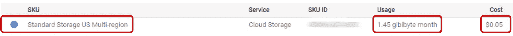
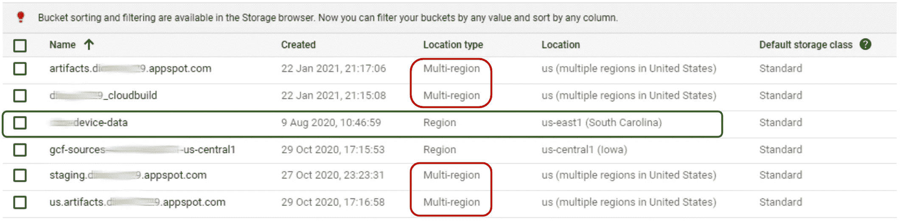
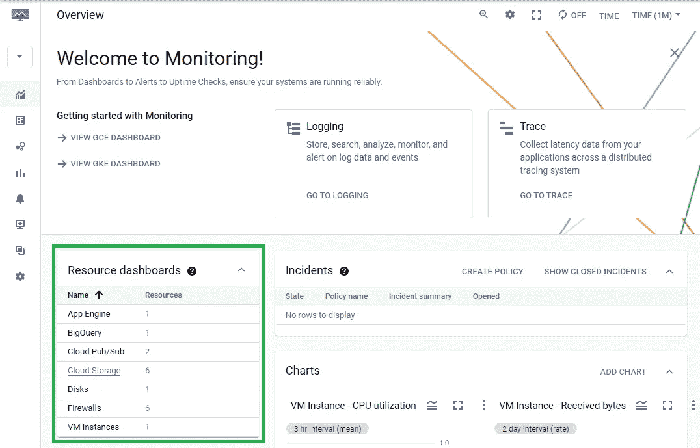
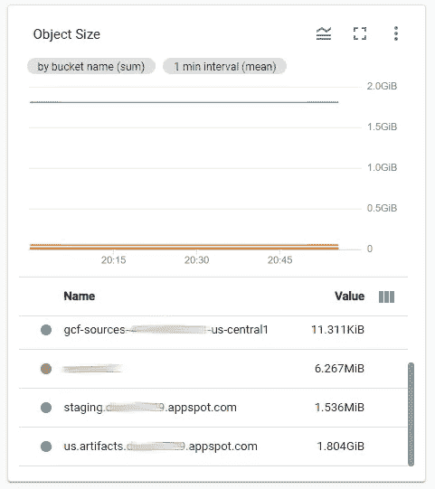
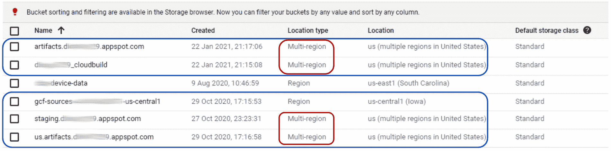

# 这些云存储桶到底是什么？！

> 原文：<https://towardsdatascience.com/what-the-heck-are-these-cloud-storage-buckets-2bf27d0a0872?source=collection_archive---------40----------------------->

## 了解自动生成的 GCS 时段、费用来源以及如何删除它们。


由 [Pedro da Silva](https://unsplash.com/@pedroplus?utm_source=unsplash&utm_medium=referral&utm_content=creditCopyText) 在 [Unsplash](https://unsplash.com/s/photos/bucket?utm_source=unsplash&utm_medium=referral&utm_content=creditCopyText) 上拍照

我喜欢在业余项目中使用谷歌云平台(GCP)(点击这里查看我为什么使用 GCP)和[谷歌的云存储](https://cloud.google.com/storage) (GCS)产品已经多次进入我的设计。然而，我很快意识到其他 GCP 服务利用 GCS，创建桶并用对象填充它们。

起初，我对 GCS 的使用很少，这些系统桶并没有困扰我，但后来我开始在我的账单上看到费用(尽管只有几分钱)，并决定是时候了解这些桶的用途以及如何消除或减少费用了。

理解这些费用可能是一个挑战，并且是什么创建了系统存储桶被松散地记录。我在这里记录了我的经历，希望它能帮助其他人避免类似的挫折。

下面包括我的调查过程，发现，以及我采取的步骤，以尽量减少我的 GCS 费用。如果您只是对解决方案感兴趣，您可以跳到**解决方案**部分。

**警告:不要在不了解其用途的情况下更改 GCP 自动生成的任何存储桶(或其内容)。有些绑定到活动进程，改变它们会导致不可逆转的对象损坏！**

# 调查

所有这一切都是从我开始承担 GCS 费用时开始的，如果你在这里调查你的费用，你会知道在计费仪表板上没有太多的细节。这是我对 2021 年 2 月的预测。



作者图表

在**美国多地区** SKU 下**每月**1.45 GB 存储空间需要支付 **5 美分**的费用。我认为这里有两个问题:

1.  前 5GB 存储应该是免费的(谢谢免费层！)
2.  我对云存储的使用不应接近 1.45 GB

谷歌云存储价格页面解决了我的第一个问题。免费层适用于某些地区。

> *云存储总自由配额适用于* `*US-WEST1*` *、* `*US-CENTRAL1*` *、* `*US-EAST1*` [*地区*](https://cloud.google.com/storage/docs/bucket-locations#location-r) *的使用情况。这三个地区的使用量是合计的。永远免费是可以改变的。资格要求和其他限制请参见我们的* [*常见问题解答*](https://cloud.google.com/free/docs/frequently-asked-questions) *。*

也许我为我的桶选择了错误的存储类型？

## 云存储浏览器

存储桶详情可在云存储[浏览器](https://console.cloud.google.com/storage/browser)页面找到:



作者图表

在这种情况下，我总共有 6 个桶。绿色突出显示的是一个活动存储桶，用于存储一些物联网设备数据。我没有直接创建其他的和一些有多区域的位置类型。

这部分解释了这些指控，但不清楚是什么过程创造了这些桶，GCP 用它们做什么。关于这一点…

**警告:在不了解其用途的情况下，不要更改 GCP 自动生成的任何存储桶(或其内容)。有些绑定到活动进程，改变它们会导致不可逆转的对象损坏！***

*由于其重要性，有意重复！

下一步是分析铲斗空间利用率，并了解成本的来源。

## 监控页面

尽管 GCS 浏览器不显示按存储桶划分的总空间利用率，但有几种不同的方法可以获得此信息。我更喜欢 GCP [监控](https://console.cloud.google.com/monitoring)页面。以下是首次使用监控页面时谷歌的设置说明:

> *如果您从未使用过云监控，那么在您第一次访问 Google 云控制台中的* ***监控*** *时，会自动创建一个工作区，并且您的项目会与该工作区相关联。否则，如果您的项目不与工作区相关联，那么将出现一个对话框，您可以创建一个工作区或将您的项目添加到现有的工作区。我们建议您创建一个工作区。做出选择后，点击* ***添加*** *。*

加载后，了解 GCS 使用情况的最简单方法是在 resource dashboard 下选择它。



作者图表

在资源仪表板上展开对象大小图形的图例，提供了所有存储桶及其当前空间利用率的列表。



作者图表

在这种情况下， **us.artifacts** bucket 负责我的总存储的 99.7%。主要成本驱动因素已经确定！

# 解决方案

在我的谷歌云存储中的 5 个自动生成的存储桶中，有 4 个是跨地区的，并且正在产生成本。我将概述 GCP 流程使用每个存储桶的目的，以及如何最小化或消除成本。



作者图表

## 云跑桶

`<project-id>_cloudbuild`和`artifacts.<project-id>.appspot.com`桶由 [Google Cloud Run](https://cloud.google.com/run) 引擎使用。当代码提交到云运行时，引擎使用 *cloudbuild* 存储桶来存放构建对象，使用*工件*存储桶作为[工件](https://cloud.google.com/build/docs/building/store-build-artifacts)注册表。确切地知道这些对象是什么并不重要，但是您应该知道它们在部署之后通常并不重要，并且没有理由将它们放在多区域存储桶中。

好消息是 GCP 允许用`gcloud builds submit` [命令](https://cloud.google.com/sdk/gcloud/reference/builds/submit#--gcs-source-staging-dir)重载缺省值。以下是确保您不会因 Clour Run 部署而产生更多 GCS 成本的步骤:

1.  用您想要的**区域存储**(例如 gcr_store)创建一个新的存储桶
2.  为这个存储桶中的构建对象创建一个默认文件夹(例如 source)
3.  为这个存储桶中的工件对象创建一个默认文件夹(例如工件)
4.  在您的部署目录中创建一个类似下面这样的`cloudbuild.yaml`文件(注意映射到新工件文件夹的位置和指示使用什么[构建器](https://cloud.google.com/build/docs/configuring-builds/create-basic-configuration)的`gcr.io/cloud-builders/docker`

5.使用`--gcs-source-staging-dir`标志来指定在构建新的云运行应用程序时应该保存构建对象的位置，并包含您的 config yaml 文件

```
gcloud builds submit --gcs-source-staging-dir=gs://gcr_store/source --config cloudbuild.yaml
```

6.删除您自动生成的`<project-id>_cloudbuild`和`artifacts.<project-id>.appspot.com`桶

5.(可选)在新存储桶上添加一个生命周期规则，以删除超过 X 天(如 7 天)的对象

完成后，您应该不再有与您的云运行部署流程相关联的多区域存储桶，如果您发现您的自定义存储桶的大小失控，您可以实施步骤 6。

## 云函数存储桶

`gcf-sources-<id>-<region>`桶用于存储 Google Cloud Function (GCF)对象和元数据。这个文件夹与您的函数部署在同一个区域，应该不会太大(我的文件夹是 11 kB，包含 5 个函数)。我不建议接触这个桶的内容，因为它可能会永久损坏你的 GCF 对象。

一些云函数也将使用 Cloud Build，它将工件转储到`us.artifacts.<project-id>.appspot.com`桶中。参见下面的**us . artifacts Bucket**部分，以及如何处理这些对象。

## 应用引擎桶

在部署期间，`staging.<project-id>.apopspot.com`桶被谷歌应用引擎用于[临时存储](https://cloud.google.com/appengine/docs/standard/php7/using-cloud-storage)。

> *App Engine 还会创建一个存储桶，用于在部署新版本的应用时进行临时存储。这个桶名为* `*staging.project-id.appspot.com*` *，仅供 App Engine 使用。应用程序无法与此桶进行交互。*

您不能去掉这个桶，但是您可以通过在构建时用`-bucket`标志指定一个不同的桶来减少存储对象的数量。以下是确保您从该铲斗中获得最低成本的步骤:

1.  使用您想要的**区域存储**(例如 gae_storage)创建一个新的存储桶——如果需要，您可以为每个应用程序使用不同的存储桶
2.  使用`-bucket`标志来指定部署应用程序时构建对象应该保存在哪里

```
gcloud app deploy --bucket=gs://gae_storage
```

3.删除`staging.<project-id>.apopspot.com`目录中除`ae/`文件夹以外的所有内容

完成后，多区域`staging.<project-id>.apopspot.com`存储桶将得到最低限度的利用，您的自定义存储桶将包含每个部署的应用程序的 99%的对象。

应用引擎部署也利用`us.artifacts.<project-id>.appspot.com`桶。参见下面的**美国工件桶**部分，以及如何处理这些对象。

## 美国文物桶

`us.artifacts.<project-id>.appspot.com`桶用于存储由云构建服务生成的容器映像。我观察到的在这个桶中生成对象的唯一过程是云函数和应用引擎构建。由这些过程生成的对象可以安全地在部署后移除，如这里的[所述](https://cloud.google.com/appengine/docs/standard/go/testing-and-deploying-your-app#managing_build_images)。

> *部署完成后，App Engine 不再需要容器映像。请注意，它们不会被自动删除，因此为了避免达到存储配额，您可以安全地删除任何不需要的图像。*

这同样适用于云函数工件。

虽然我不使用 **Firebase** 来部署功能，但我在网上看到了几个公开的标签，表明下面的方法可能会给你带来问题。我可能会写另一篇文章来探讨 Firebase 问题和可能的解决方案。

**如果您使用 Firebase 部署功能，请不要完全删除此存储桶，也不要遵循以下说明！**

我们不能完全移除铲斗，但我们可以遵循以下步骤来最大限度地减少空间占用。

1.  导航到`us.artifacts.<project-id>.appspot.com`存储桶的生命周期选项卡
2.  添加一个新的生命周期规则**，删除**年龄**大于 **X** 天的**对象(我使用 **7** 作为我的)
3.  删除此桶中的所有对象

完成后，您应该会看到这个存储桶的空间消耗显著下降。在我的例子中，我能够将 85%的已用空间释放到 300MB 以下。

# 结论

GCP 是一个很好的平台，但当涉及到元数据对象的自动存储和构建容器映像时，事情会变得复杂和混乱。通过这次考察，我有机会更多地了解了云运行、App Engine 应用程序和云功能是如何管理的。我希望你也能从这篇文章中学到一些东西，如果不能，至少我能帮助你整理你的 GCS 环境。

**祝好运，编码快乐！**

*原载于 2021 年 3 月 2 日 https://theappliedarchitect.com**的* [*。*](https://theappliedarchitect.com/what-the-heck-are-these-cloud-storage-buckets/)