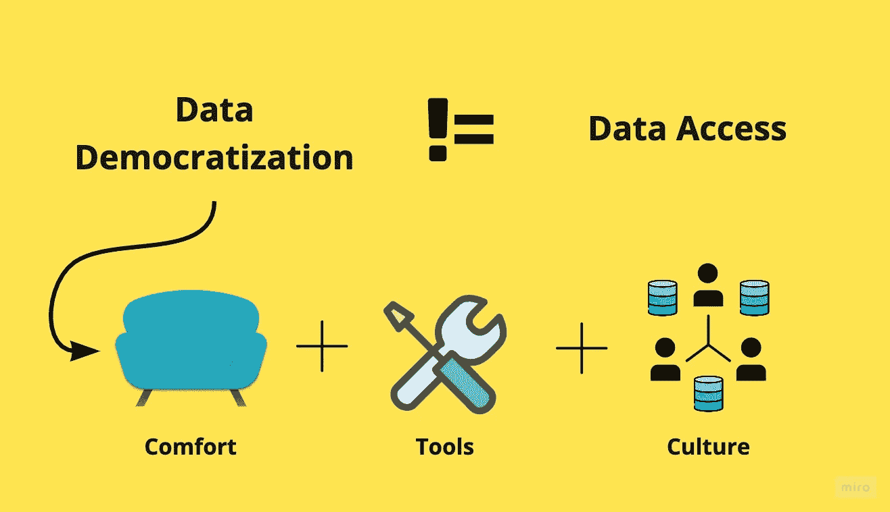
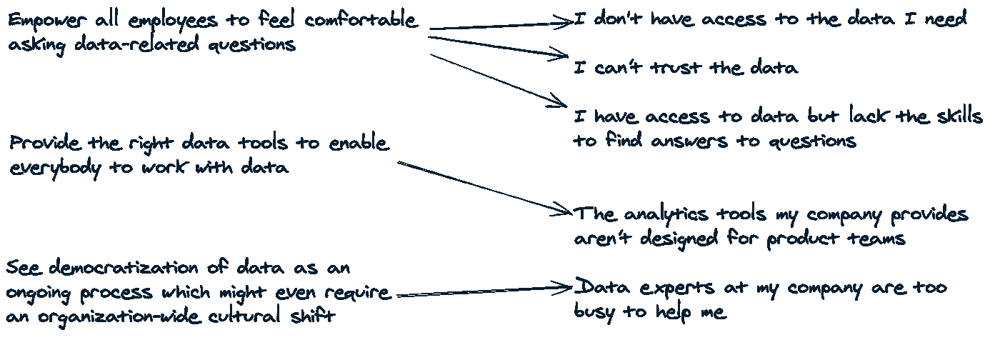

# 什么是数据民主化？

> 原文：<https://towardsdatascience.com/what-the-heck-is-data-democratization-39b86eb27aa6?source=collection_archive---------25----------------------->

## [变更数据](https://towardsdatascience.com/tagged/data-for-change)

## 提示:它不仅仅是使数据可访问

作者图片

# 介绍

谷歌“什么是数据民主化”,你会看到所有关于“数据访问”是数据民主化的关键的顶级搜索结果(除非你发现这个很棒)。

截图来自谷歌搜索

然而，仅仅给予数据访问权——无论是作为数据仓库中的原始数据，还是作为产品分析工具或商业智能工具中的美丽可视化图像——肯定不是数据民主化。

那是什么呢？

数据民主化是*正在进行的过程*，使组织中的每个人，不管他们的技术知识如何，都能够*舒适地使用数据**，感到*自信地谈论数据*，因此，*做出基于数据的决策*和*建立由数据驱动的客户体验*。*

*一个真正想要实现数据民主化的组织需要遵循以下原则(在本指南中称为*数据民主化三要素*):*

*   *让员工能够放心地询问与数据相关的问题*
*   *提供合适的工具，让每个人都能处理数据*
*   *将数据民主化视为一个持续的过程，甚至可能需要整个组织的文化转变*

*在深入探讨以上内容之前，请允许我离题。*

## *数据挑战*

*Mixpanel 最近进行了一项调查，受访者包括在各行各业的产品团队中工作的人，这些公司的员工从不到 10 人到超过 1000 人不等。*

*这项调查的目标是了解产品团队之间关系的好、坏、丑，以及数据。如果你想深入研究，这是完整的报告。*

*当被问及挑战时，最常见的挑战如下:*

*   *我无法访问我需要的数据*
*   *我不能相信这些数据*
*   *我可以访问数据，但缺乏找到问题答案的技能*
*   *我公司提供的分析工具不是为产品团队设计的*
*   *我公司的数据专家太忙了，无法帮助我*

*如果您的员工认为上述一个或多个陈述是正确的，那么可以有把握地认为您组织的数据民主化需要努力。*

*有趣的是这些挑战是如何映射到上述原则的。*

**

*是时候深入研究数据民主化的三大优势了。*

# *如何让员工在问数据相关的问题时感到舒服？*

*从在您的组织中制作数据素养表开始。*

*数据素养不应再被视为一种美好的拥有，每个人都应该获得他们需要的资源，以便成为他们希望的数据素养。*

*对于一些人来说，理解[收集什么数据](https://dataled.academy/what-to-track/)和[看起来像什么](https://dataled.academy/events-and-entities/)就足够了。*

*而其他人可能会发现甚至知道为什么某些数据被跟踪，它是如何做的，它存储在哪里，以什么格式是值得的。*

*因此，数据素养解决了数据民主化的最大瓶颈之一——对数据的访问。*

## *获取数据，但什么数据和在哪里？*

*当有人说他们无法访问数据时，他们可以参考数据库中的原始数据、数据仓库中的转换数据、可视化仪表板形式的数据、产品分析工具中的产品使用数据、订阅分析工具中的交易数据、客户参与工具中的人口统计数据、客户数据平台中关于营销活动的数据等等。你明白了。*

*当那个人可以指定*他们希望在哪里*访问*什么*数据时，提供访问变得不那么复杂。此外，如果此人能够在正确的时间、正确的地点访问正确的数据，他们更有可能会信任这些数据。*

*因此，下次有人说他们没有访问数据的权限，并且他们无法指定*在哪里*他们想要访问*什么*数据时，您就有了一个需要解决的数据读写能力问题。*

## *不同层次的数据素养*

*很明显，数据素养并不局限于知道如何编写 SQL 查询或如何分析复杂的报表。*

*每个团队都需要某种形式的数据来执行他们的日常任务或分析他们工作的影响。但是具有不同数据需求的不同团队需要不同水平的数据素养。*

*实现数据跟踪、从数据中获得洞察力以及根据这些洞察力采取行动需要非常不同的技能。此外，通过运行数据导向的营销活动来根据这些见解采取行动，需要不同的技能组合，而不是通过查看 CRM 中的相同数据来识别正确的潜在客户。*

*同样，构建预测模型和实时交付个性化体验依赖于不同类型的数据和非常不同的技能。前者需要数据科学方面的培训，而后者是数据工程要解决的问题。*

*可以肯定地说，在某种程度上，数据素养已经成为个人在工作中脱颖而出的先决条件。投资于让员工获得数据素养的公司肯定会让竞争对手迎头赶上。*

*既然我们同意数据素养是桌面赌注，那么数据民主化三重任务中的下一个原则就是通过投资工具让每个人都能够使用数据。*

*这引出了一个问题..*

# *如何选择合适的工具让每个人都能处理数据？*

*要回答这个问题，首先让我们看看不同的团队通常如何处理数据。*

*   ***市场营销**利用数据创造引人入胜、转化率更高的内容*
*   ***增长**利用数据进行实验，提供个性化体验*
*   ***产品**和**工程**使用数据构建实际使用的功能，并删除那些没有使用的功能*
*   ***支持**处理数据以提供更快的解决方案(通过查看用户在产品中做了什么或没做什么)*
*   ***客户成功**利用数据提供更好的客户体验(根据使用模式向他们提出正确的问题)*
*   ***销售**使用数据来识别可能转化的潜在客户(通过查看他们在免费试用期间的行为)。*

*几个工具真的能做到以上所有的吗？绝对不会。*

*这只是对最常见的数据处理方式的高度概括。这还不包括数据团队的需求，他们需要一整套其他工具来确保在正确的时间以正确的格式在正确的系统中提供正确的数据。*

*仅仅是产品和增长团队就需要至少半打工具来做好他们的工作(我说的是同类最佳的工具，而不是“做得很差，但却什么都做”的工具)。*

*说真的！我一点也不夸张。*

## *工匠的好坏取决于他们的工具*

*每个工具都在变成数据工具，迫使每个团队都要懂数据。*

*产品和增长团队需要像 [Mixpanel](https://mixpanel.com/) 或 [Heap](https://heap.io/) 这样的工具来进行产品分析，需要像 [Hotjar](https://www.hotjar.com/) 或 [FullStory](https://www.fullstory.com/) 这样的工具来收集定性数据，需要像 [VWO](https://vwo.com/) 或 [AB Tasty](https://www.abtasty.com/) 这样的工具来运行 A/B 测试，需要像 [Userflow](https://getuserflow.com/) 或 [Userpilot](https://userpilot.com/) 这样的工具来引导入职，需要像 [Intercom](https://www.intercom.com/) 或这样的工具 像 [Customer.io](https://customer.io/) 或 [Userlist](https://userlist.com/) 这样的工具用于生命周期电子邮件活动，以及[像 mParticle 或 Segment 这样的客户数据平台用于数据统一](https://dataled.academy/customer-data-platform/)。*

*好了，已经有七种工具了，我们只讨论了用于产品和增长团队的基本数据工具。除此之外，每家公司都需要一套其他特定于数据的工具，根据公司的规模，这些工具可以由专门的数据团队管理，也可以由产品团队管理。*

*至少，企业，特别是那些捕获大量数据的企业，必须投资一个**数据仓库(DWH)** ，如[雪花](https://www.snowflake.com/)或 [BigQuery](https://cloud.google.com/bigquery) ，以使所有数据可用于分析和下游行动，一个**商业智能(BI)** 工具，如 [Looker](https://looker.com/) 或 [Mode](https://mode.com/) ，它位于 DWH 之上，支持自助分析， 一个**数据集成(ETL/ELT)** 工具，如 [Fivetran](https://fivetran.com/) 或 [Stitch](https://www.stitchdata.com/) 将数据从外部系统(如上面提到的七个工具)移动到 DWH，以及一个**反向 ETL** 工具，如 [Hightouch](http://hightouch.io/) 或 [Census](http://getcensus.com/) 将数据从 DWH 移动到外部系统以进行下游操作。*

*从上面的愿望清单中可以看出，仅在数据分析的背景下，今天的公司就需要一个[产品分析工具和一个 BI 工具](https://mixpanel.com/blog/the-difference-between-product-analytics-and-bi-tools-and-why-you-need-both/)——它们都为不同的团队服务于不同的目的。这是除了谷歌分析或营销需要的网络分析的等价物。*

*唷！这确实看起来势不可挡，但这是未来——要么接受它，要么被甩在后面。*

*至关重要的是投资一套工具，使个人能够有效地处理数据，并在不依赖他人的情况下做出以数据为导向的决策。这使每个人都富有成效，并保持团队士气高昂！*

*此外，实现能很好地完成工作的同类最佳工具比花费无数时间寻找理想的工具要好，或者更糟，决定构建一些容易购买的东西。*

*构建还是购买是另一个话题，但我必须说，无论你采取哪种方式，一定要评估你的决定对你的员工有什么影响，特别是它对他们的日常工作和长期目标有什么影响。*

*记住这一点，让我们解决..*

# *为什么数据民主化是一个持续的过程，可能需要组织中的文化转变？*

*首先，我想说的是，公司的规模及其增长轨迹会严重影响数据民主化的速度。不用说，在一家公司的早期，建立数据民主要容易得多，因为更容易塑造支持它的文化。*

*大型组织可能面临一系列挑战，数据民主也可能被视为数据演示**疯狂！***

*请记住，组织越大，就应该越早投资于数据民主化进程。*

*为了避免将本指南写成一本书，我将只关注大中型公司的需求，这些公司有专门的营销、增长、产品、工程、支持、客户成功和销售团队。*

## *那么，为什么数据民主化是一个持续的过程？*

*因为它依赖于数据素养，这也是一个持续的过程。数据世界正在经历前所未有的增长，工具和技术的发展速度令人着迷。但这也很难跟上，坦率地说，对于数据空间之外的大多数人来说，这有点烦人，因为它会影响他们的工作。*

*至少，组织中的每个人，无论其角色如何，都应该能够毫不费力地获得与数据相关的问题的答案。*

*此外，各种团队如何处理数据以及处理到什么程度应该成为组织内的常识。员工应该很容易知道谁可以访问什么类型的数据，数据存储在哪里，以及访问数据或对数据提出问题的流程是什么。*

*[Airbnb 的 data portal](https://medium.com/airbnb-engineering/democratizing-data-at-airbnb-852d76c51770)是一个很好的例子，说明了大公司如何通过分配专用资源来解决这个巨大的问题，从而使数据民主化。像 Dataportal 这样的项目当然需要持续的资源，但回报似乎是值得努力的。*

## *最后，我们在谈论什么样的文化转变？*

*Mixpanel 调查中提到的挑战之一是**我公司的数据专家太忙了，没时间帮我**。*

*数据民主化需要一种文化转变，使这种挑战过时——在您的组织中成为过去。*

*每个依靠数据来出色完成工作和实现目标的人都应该成为数据专家。*

*组织中的每个人都应该对谈论数据充满信心，并具备处理数据的工具和知识，能够在没有任何依赖性的情况下获得问题的答案。*

*最后，组织中的每个人都应该有机会为数据相关项目做出有意义的贡献。*

*建立数据民主没有公认的通用方法，但赋予人们权力似乎是朝着这个方向迈出的合乎逻辑的一步。*

**如果你喜欢这篇文章，你可能也会喜欢* [*《数据节拍快讯》*](https://databeats.community/) *。**