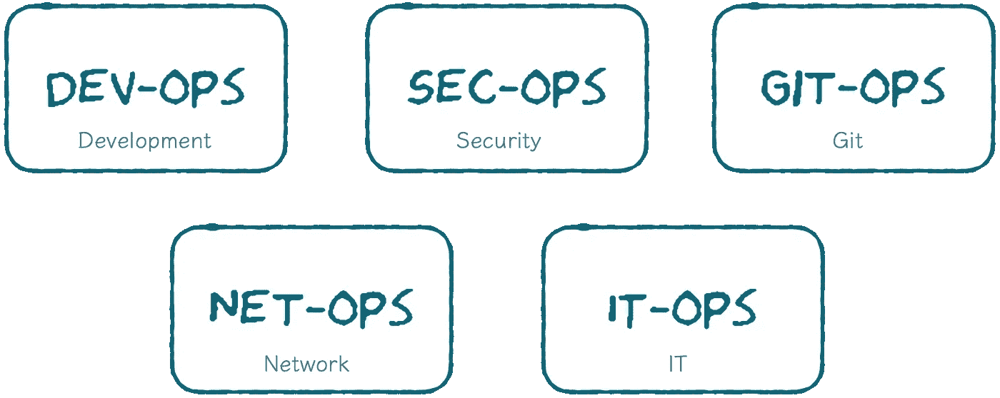
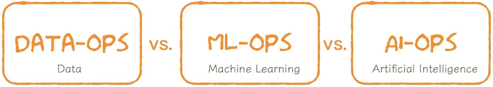
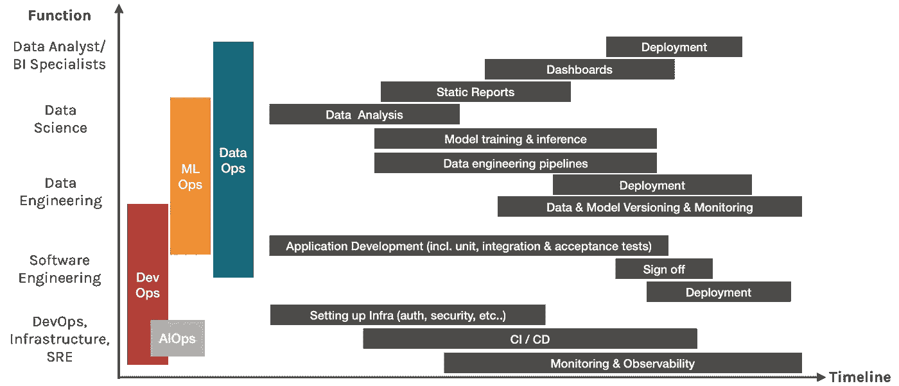

# 你在说什么行动？

> 原文：<https://towardsdatascience.com/what-the-ops-are-you-talking-about-518b1b1a2694?source=collection_archive---------30----------------------->

## DataOps vs. MLOps vs. AIOps 如何选择？什么是适合您的大数据团队的运营？

两年前，我因领导一次低效的行动而获得了不光彩的徽章。我有数据科学和机器学习的背景，所以当然，我们已经从我们的工程同事那里了解了 DevOps。

我们大概是这样认为的。

当时我们对此感到莫名其妙，因为我们的数据科学家就坐在数据工程师旁边。我们遵循了所有良好的敏捷实践，讨论我们的阻挡者，并且没有“把它扔过墙”的态度。我们密切合作，我们的科学家和工程师相亲相爱。但是开发很慢，团队成员很沮丧。

快进两年，我终于领悟了 DevOps 的真谛。以及在一个数据团队中如此相同但又如此不同。

在讨论以数据为中心的运营之前，让我们先从软件说起。这里有太多的相似和对比，所以请原谅我…

[照片](https://unsplash.com/photos/6mUIYJvS2_I)由[凯利·西克玛](https://unsplash.com/@kellysikkema)在 Unsplash 上拍摄，由作者编辑。

自从 2000 年代后期 [DevOps 流行以来，软件行业一直被各种各样的 ops 术语所困扰。10 年前，软件开发到部署有一种完全不同的方法。软件工程师开发应用程序，然后交给运营工程师。该应用程序在部署过程中经常出现问题，并在团队之间造成严重摩擦。](https://www.atlassian.com/devops/what-is-devops/history-of-devops)

DevOps 实践使部署过程变得更加顺畅。这个想法是将**自动化**作为一等公民来构建&部署软件应用。

这种方法彻底改变了这个行业。许多组织开始组建跨职能团队来管理整个 SDLC。该团队将建立基础设施(基础设施工程师)，开发应用程序(软件工程师)，建立 CI/CD 管道(开发运维工程师)，部署应用程序(每个工程师)，然后持续监控和观察应用程序(站点可靠性工程师)。

在一个大团队中，不同的工程师有一个主要的职能。但是在较小的团队中，一个工程师经常扮演许多角色。理想的情况是让许多团队成员能够履行多种职能，这样就消除了瓶颈和关键人员的依赖性。所以在现实中…

> DevOps，与其说是一个工作职能，不如说是更多的实践或文化。
> 在构建任何软件之初都应该采用。

加上 DevOps 的兴起，诞生了各种各样的 op。

软件开发世界中存在的各种操作。由作者生成。

SecOps 以安全为核心，GitOps 致力于持续交付，NetOps 确保网络能够支持数据流，itOps 专注于软件交付之外的操作任务。但总的来说，这些运营的基础源自 DevOps 承诺的愿景:

> **“为了尽快发布软件，**
> 
> **误差极小。”**

五年前, F 数据是新的石油这句话大肆宣传。世界各地的领导者开始投入资源建立大数据团队，以挖掘这些宝贵的资产。这些团队的交付压力是巨大的——毕竟，我们怎么能辜负新石油的承诺呢？随着快速扩张，分析团队也经历了相当多的悲伤。

然后我们让这一切发生了。

数据科学家成为 21 世纪最性感的职业。我们不断壮大，正处于数据和分析的黄金时代。每位高管都有一个仪表盘。一个仪表板，其中包含来自整个组织的数据和嵌入的预测模型。每位顾客都有基于其行为的个性化建议。

但是现在添加一个新功能需要几周甚至几个月的时间。数据模式很混乱，没有人知道我们是使用信贷团队还是营销团队的活跃客户的定义。我们对将模型投入生产变得谨慎，因为我们不确定它会破坏什么。

因此，以数据为中心的社区站在一起，承诺反对因管理不善的数据流程而导致的低效率。此后，各种以数据为中心的运营模式也应运而生…

在以数据为中心的团队中诞生的各种操作:数据操作 vs . m 操作 vs . ai 操作。由作者生成。

# 数据操作🆚MLOps🆚DevOps(和 AIOps？)

****注*** *:在本文中，分析团队指的是使用 SQL/PowerBI 为业务生成洞察的传统 BI 团队。人工智能团队是指使用大数据技术建立高级分析和机器学习模型的团队。有时他们是同一个团队，但我们将把他们分开，这样更容易解释概念。*

为了了解所有这些不同的运营，让我们来看看数据是如何在组织中流动的:

*   数据是由与软件应用程序交互的客户生成的。
*   该软件将数据存储在其应用程序数据库中。
*   分析团队从跨组织团队的这些应用程序数据库中构建 ETL。
*   分析团队为业务用户构建报告和仪表板，以做出数据驱动的决策。
*   然后，数据工程师将原始数据、整合数据集(来自分析团队)和其他非结构化数据集吸收到某种形式的数据湖中。
*   然后，数据科学家从这些海量数据集中构建模型。
*   然后，这些模型利用用户生成的新数据进行预测。
*   然后软件工程师向用户展示这些预测，
*   这个循环还在继续…

我们知道 DevOps 的诞生是因为开发和运营团队之间产生的摩擦。因此，想象一下运营、软件、分析和人工智能团队之间的 4 向接口带来的头痛。

为了解释不同的运营是如何解决上述流程的，这里有一个图表，它描绘了每个工作职能在时间线上执行的一些任务。

每个工作职能在时间线上执行的任务的图表。由作者生成。

理想情况下，X-Ops 文化应该在项目开始时就被采纳，并且在整个项目中实施。

总而言之，这就是每个 Ops 的含义:

## DevOps 更快地交付软件

一组实践旨在消除开发和操作团队之间的障碍，以便更快地构建和部署软件。它通常由工程团队采用，包括开发运维工程师、基础设施工程师、软件工程师、站点可靠性工程师和数据工程师。

## DataOps 更快地交付数据

一套提高质量和缩短数据分析周期的实践。DataOps 的主要任务包括数据标记、数据测试、数据管道编排、数据版本控制和数据监控。分析和大数据团队是数据运营的主要运营商，但任何生成和消费数据的人都应该采用良好的数据运营实践。这包括数据分析师、BI 分析师、数据科学家、数据工程师，有时还包括软件工程师。

## MLOps 更快地交付机器学习模型

一套设计、构建和管理可复制、可测试和可持续的 ML 驱动软件的实践。对于大数据/机器学习团队来说，MLOps 包含了大多数数据操作任务和其他特定于 ML 的任务，如模型版本化、测试、验证和监控。

## 额外收获:AIOps 利用人工智能的力量增强了 DevOps 工具

有时人们会错误地将 MLOps 称为 AIOps，但它们是完全不同的。来自 Gartner:

> A IOps 平台利用大数据、现代机器学习和其他高级分析技术，通过主动、个性化和动态的洞察力，直接和间接增强 IT 运营(监控、自动化和服务台)功能。

因此，AIOps 通常是 DevOps 工具，使用人工智能技术来增强服务产品。AWS [CloudWatch](https://docs.aws.amazon.com/prescriptive-guidance/latest/migration-operations-integration/aiops.html) 提供的警报和异常检测是 AIOps 的一个很好的例子。

# 💎委托人而非工作角色

人们错误地认为，为了实现这些运营部门承诺的效率，他们需要从选择正确的技术开始。其实技术不是最重要的。

> DataOps、MLOps 和 DevOps 实践必须与语言、框架、平台和基础架构无关。

每个人都有不同的工作流程，该工作流程应该由负责人提供信息，而不是您想要尝试的技术，或者最流行的技术。先用技术的陷阱是，如果你想用锤子，所有东西对你来说都像钉子。

所有的运营都有相同的 7 个首要原则，但每个原则都有细微的差别:

## 1.服从

DevOps 通常担心网络和应用程序的安全性。在 MLOps 领域，金融和医疗保健等行业通常需要模型的可解释性。DataOps 需要确保数据产品符合 GDPR/HIPPA 等法律。

🔧**工具:** [PySyft](https://github.com/OpenMined/PySyft) 解耦私有数据用于模型训练， [AirCloak](https://aircloak.com) 用于数据匿名化。令人敬畏的人工智能指南关于人工智能的原则、标准和法规的管理。

## 2.迭代开发

这一原则源于敏捷方法，它关注于以可持续的方式持续产生商业价值。该产品的设计，建造，测试和部署迭代，以最大限度地快速失败和学习的原则。

## 3.再现性

软件系统通常是确定性的:代码应该每次都以完全相同的方式运行。所以为了确保可再现性，DevOps 只需要跟踪代码。

然而，机器学习模型经常因为数据漂移而被重新训练。为了重现结果，MLOps 需要对模型进行版本化，DataOps 需要对数据进行版本化。当审计员问及哪个数据被用于训练哪个模型来产生这个特定的结果时，数据科学家需要能够回答这个问题。

🔧**工具:**实验跟踪工具，如 [KubeFlow](https://kubeflow.org) 、 [MLFlow](https://mlflow.org) 或 SageMaker 都具有将元数据链接到实验运行的功能。[厚皮](https://www.pachyderm.com)和 [DVC](https://dvc.org) 用于数据版本控制。

## 4.测试

软件测试包括单元测试、集成测试和回归测试。数据操作需要严格的数据测试，包括模式变更、数据漂移、功能工程后的数据验证等。从 ML 的角度来看，模型的准确性、安全性、偏倚/公平性、可解释性都需要测试。

🔧**工具:**库如 [Shap](https://github.com/slundberg/shap) & [Lime](https://github.com/marcotcr/lime) 用于可解释性， [fiddler](https://www.fiddler.ai) 用于可解释性监控，[远大前程](https://greatexpectations.io)用于数据测试。

## 5.持续部署

机器学习模型的持续部署有三个组成部分。

*   第一个组成部分是触发事件，即触发是数据科学家的手动触发、日历计划事件还是阈值触发？
*   第二个组成部分是新模型的实际再培训。产生模型的脚本、数据和超参数是什么？它们的版本以及它们是如何相互链接的。
*   最后一个组件是模型的实际部署，它必须由部署管道进行编排，并准备好警报。

🔧**工具:**大部分工作流管理工具都有这个，比如 AWS SageMaker、AzureML、DataRobot 等。开源工具如 [Seldon](https://www.seldon.io) 、 [Kubeflow KFServing](https://github.com/kubeflow/kfserving) 。

## 6.自动化

自动化是 DevOps 的核心价值，实际上有许多工具专门用于自动化的不同方面。以下是机器学习项目的一些资源:

*   [牛逼的机器学习](https://github.com/josephmisiti/awesome-machine-learning)
*   [牛逼的生产机器学习](https://github.com/ethicalml/awesome-production-machine-learning)

## 7.监视

软件应用需要监控，机器学习模型和数据管道也是如此。对于 DataOps，监控新数据的分布以发现任何数据和/或概念漂移非常重要。在 MLOps 方面，除了模型降级之外，如果您的模型有公共 API，监控对抗性攻击也是非常重要的。

🔧工具:大多数工作流管理框架都有某种形式的监控。其他流行的工具包括用于监控指标的 [Prometheus](https://prometheus.io) ，用于数据模型监控的 [Orbit by Dessa](https://dessa-orbit-team-docs.readthedocs-hosted.com/en/latest/) 。

# 结论

采用正确的 X-Ops 文化来加速交付数据和机器学习驱动的软件产品。请记住，原则高于技术:

1.  **培养跨学科技能:**培养 T 型个人和团队
    弥合差距，协调责任
2.  **尽早自动化(足够):**汇聚到一个技术堆栈上，并自动化
    流程以减轻工程开销
3.  **着眼于最终目标进行开发:**预先投资解决方案设计，以减少从概念验证到生产的摩擦

**感谢阅读** ⭐在[媒体](https://medium.com/@mereldawu)、 [LinkedIn](https://www.linkedin.com/in/mereldawu/) 上关注我，或者访问我的[网站](https://merelda.com/)。此外，如果你想了解更多关于云原生技术和机器学习部署的信息，请发电子邮件给我们。