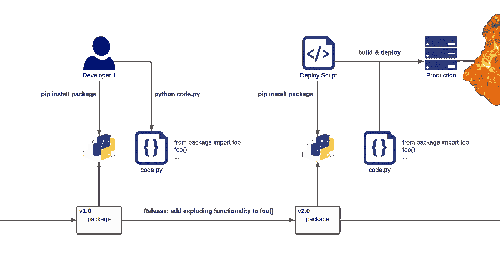

# 什么鬼东西！？

> 原文：<https://towardsdatascience.com/what-the-pip-71dbfeda12eb?source=collection_archive---------21----------------------->

## 深入探讨 Python 更好的包管理


由[克莱门特·布科·勒沙特](https://commons.wikimedia.org/wiki/User:Pleclown)在[维基共享资源](https://commons.wikimedia.org/wiki/File:Tree_growing_on_pavement_in_Hong_Kong.JPG)上拍摄的照片

Python 通常非常适合数据科学，然而，包管理对于许多人来说仍然是一个困惑的话题，做得*好*更是如此。有几个原因可以解释为什么花时间学习诀窍是值得的:

*   我们可以自动化繁琐耗时的手动任务
*   我们可以与其他开发人员分享依赖性的变化
*   我们可以保证可重复的代码构建和测试运行

本文的目的就是要做到这一点，带读者了解管理 Python 项目的依赖关系所涉及的复杂性和最佳实践，假设读者很少或根本没有这方面的知识。我们将从*非常*的开头开始，所以请随意跳过任何已经熟悉的部分。

# 包到底是什么？

包是相关代码模块的集合，通常捆绑在一起并分发，以便为其他软件系统提供有用的通用功能。正如函数允许我们重用自己的代码一样，包提供了重用第三方代码的标准方式。

术语包和依赖项将在本文中互换使用。

Python 打包索引( [PyPI](https://pypi.org/) )是 Python 包的分发平台，通常使用 Python 命令行工具的包安装程序( [pip](https://pypi.org/project/pip/) )来安装这些包。

```
pip install <package>
```

这种依赖关系管理方法对于小型项目来说已经足够了。然而，随着我们的代码增长并开始依赖更多的包，记忆和安装每个包所需的努力变得不那么容易了。出于这个原因，项目的依赖项通常会列在根目录下的需求文件*中。*

```
/my_project
   **requirements.txt**
   /src
   /test
   ...
```

理想情况下，这个文件将由源代码进行版本控制，以确保依赖关系的更改对所有开发人员都可用。

```
git add requirements.txt
git commit -m "Add requirements"
git push
```

`-r`选项允许我们使用 pip 从需求文件进行安装。

```
pip install -r requirements.txt
```

到目前为止，我们已经避免描述这个文件的内容，因为它将是整篇文章中的热门话题。现在，知道每行必须包含 python 包的名称就足够了。

# 从前在狂野的西部…

一个项目的需求文件是一个无法无天的地方，依赖关系在那里自由漫游。通过 *unpinned* ，我们的意思是软件包不绑定到任何特定的版本:pip 将在每次安装时下载最新的版本。例如:

```
pandas
requests
boto3
```

为什么这是一个问题？

无法保证一个包的版本有令人不安的含义，尤其是当一个突破性的改变被发布到它的公共 API 时。


作者图片

开发人员安装一个包，然后使用它编写并运行一些有效的 Python 代码。在这个时间点上，一切看起来都很好！

然而，后来这个包发布了一个突破性的改变。随后进行安装的个人会收到此更改，因为依赖项被解除固定，并且相同的代码会因 ImportError 而失败。

这让开发人员很头疼，他们不能保证代码在彼此的机器上可靠地运行。如果我们用一个自动化的测试运行替换另一个开发人员，我们可以看到它是如何容易出现间歇性故障的。用部署脚本替换它们，这样的破坏可能会影响到实时系统。



作者图片

# 用别针别住它

也就是说我们的依赖关系必须被钉住！ *Pinning* 指的是明确指定安装哪个版本的过程，保证在不同时间不同机器上的包解析是可预测的。

一个简单的方法是将每个包固定到它当前安装的版本，我们可以通过使用 pip 进行检查来找到它。

```
pip show <package>
```

然后，我们通过在每个包名后面手工添加版本号来固定我们的需求文件。

```
pandas==1.2.4
requests==2.25.1
boto3==1.17.92
```

这当然比让一切都不固定有所改进，但也有一些缺点:

手动更新包是乏味的，尤其是当我们的需求文件变得很大的时候。然而，如果做不到这一点，我们的依赖就会变得陈旧:无法从改进、补丁或安全修复中受益。

更重要的是，不能保证我们依赖的包都是钉住自己的依赖！除非我们钉住整个依赖树，否则不钉住的包仍然可能临时出现。


作者图片

这反过来给我们的需求文件增加了噪音:区分直接包和可传递包变得很困难，手工管理每个版本甚至更麻烦。

# 自动化拯救世界

幸运的是，有工具可以为我们做艰苦的工作；值得注意的是，[画中画工具](https://pypi.org/project/pip-tools/):

> pip-tools:一套保持 Python 依赖关系新鲜的工具。

```
pip install pip-tools
```

让我们看看它提供的两个实用程序，`pip-compile`和`pip-sync`，以我们之前的*解钉*需求文件为例。按照惯例，这个文件的扩展名应该是`.in`。

以这种方式保存一个未固定的包的副本，使得查看和管理直接的项目依赖关系变得容易，将固定的需求从问题的症结中分离出来。

```
/my_project
   **requirements.in**
   /src
   /test
   ...
```

从解钉的依赖项中，`pip-compile`将为我们生成钉扎的依赖项，处理寻找合适版本和添加适当约束的繁琐工作。

```
pip-compile requirements.in
```

输出是一个熟悉的`requirements.txt`文件，我们永远不需要修改它。

```
/my_project
   requirements.in **requirements.txt** /src
   /test
   ...
```

检查`requirements.txt`，我们应该高兴地发现整个依赖关系树已经被钉住，确保后续的安装是可预测和可重复的。我们还可以看到每个包来自哪里，从而提高调试的可追溯性。

```
#
# This file is autogenerated by pip-compile
# To update, run:
#
#    pip-compile requirements.in
#
boto3==1.17.92
# via -r requirements.in
botocore==1.20.92
# via
#   boto3
#   s3transfer
certifi==2021.5.30
# via requests
chardet==4.0.0
# via requests
idna==2.10
# via requests
jmespath==0.10.0
# via
#   boto3
#   botocore
numpy==1.20.3
# via pandas
pandas==1.2.4
# via -r requirements.in
python-dateutil==2.8.1
# via
#   botocore
#   pandas
pytz==2021.1
# via pandas
requests==2.25.1
# via -r requirements.in
s3transfer==0.4.2
# via boto3
six==1.16.0
# via python-dateutil
urllib3==1.26.5
# via
#   botocore
#   requests
```


作者图片

每当我们想要更新所有的包时，我们可以再次运行`pip-compile`,用最新的版本重新生成我们固定的需求:这比我们自己手动修改它们要容易得多！

可以使用`--upgrade-package`参数更新单个的包。

```
pip-compile --upgrade-package pandas
```

随后，`pip-sync`允许我们安装这些固定的依赖项。最好在虚拟环境中这样做，这样不同项目中的包版本就不会相互重叠。

```
python -m venv .venv
source .venv/bin/activate
pip-sync
```

有了这些工具，我们在成为 Python 软件包专家的道路上走得很好！

# 但是等等，还有呢！

到目前为止，我们已经讨论了作为软件系统运行时依赖的包。然而，故事并没有就此结束，因为额外的打包工具可能有助于开发过程:linters、测试框架、部署库等等。

出于前面概述的相同原因，以相同的方式管理工具版本是可取的，但是这样的工具只在特定的上下文中需要。虽然对开发人员和他们的测试有所帮助，但是这些包并不被源代码本身使用，因此在与代码捆绑在一起进行部署时可以忽略它们。这减小了构件的尺寸和潜在攻击面。


作者图片

实现这种分离的一种常见方法是保存多个需求文件:每一个都指定了特定上下文中所需的包。我们将使用两个这样的文件。

```
/my_project
 **requirements.in
   requirements-dev.in**
   /src
   /test
   ...
```

`requirements.in`包含我们熟悉的非固定运行时依赖项。

```
pandas
requests
boto3
```

包含我们未固定的开发依赖项。

```
black
pytest
safety
```

同样，在开发、测试和部署过程中保持包版本的固定以保证代码的可预测性是非常必要的。由于每个需求文件都是独立的，共享包可能会被固定到不同的版本。使用`pip-sync`将两个`.txt`文件安装在一起会突出问题，但不会修复它。

```
pip-compile requirements.in
pip-compile requirements-dev.in
pip-sync *.txtIncompatible requirements found: ...
```

作为一种补救措施，我们从添加运行时和开发需求之间的引用开始。

```
-r requirements.in
black
pytest
safety
```

然后，我们可以利用一个新工具， [pip-compile-multi](https://pypi.org/project/pip-compile-multi/) :

> pip-compile-multi:编译多个需求文件来锁定依赖版本。

`pip-compile-multi`的功能与`pip-compile`相似，允许我们一起编译多组依赖项，同时还可以跟踪引用。已经固定在我们的运行时需求中的包将从开发需求中省略，因此前者作为共享包版本的单一真实来源。这允许我们将两套需求一起安装，而不会产生冲突。

```
pip-compile-multi *.txt
pip-sync *.txt
```

# 概括起来

*   软件包允许我们在我们的软件系统中重用由第三方开发的有用的、通用的功能。
*   Python 包使用 PyPI 分发，使用 pip 安装。
*   Python 包通常列在一个需求文件中，以便于管理，并允许对它们进行版本控制。
*   应该固定软件包，以确保在不同时间不同机器上的安装是可预测和可重复的。
*   Pip-tools 为我们固定软件包，使它们更容易更新。这使我们能够从改进、补丁和安全修复中受益。
*   通过应用程序和开发环境来划分需求允许我们最小化构建工件的大小。
*   Pip-compile-multi 一起编译多个需求文件，防止共享包版本冲突。

感谢您花时间阅读这篇文章！我希望它被证明是有用的，任何反馈都非常感谢。