# 什么是时间加权平均值，为什么你应该关心

> 原文：<https://towardsdatascience.com/what-time-weighted-averages-are-and-why-you-should-care-523ee234b942?source=collection_archive---------37----------------------->

## *如何计算时间加权平均值以及如何使用它们进行数据分析*


图片由[国家癌症研究所](https://unsplash.com/@nci)在 [Unsplash](https://unsplash.com) 上拍摄

*了解如何计算时间加权平均值，为什么它们对于数据分析如此强大，以及如何使用 TimescaleDB 超函数来更快地计算它们——全部使用 SQL。*

许多处理时间序列数据的人都有很好的、定期采样的数据集。数据可以每隔几秒或几毫秒采样一次，或者他们选择的任何时间，但是我们所说的定期采样是指数据点之间的时间基本上是恒定的。计算常规数据集中指定时间段内数据点的平均值是一个相对容易理解的查询。但是对于那些没有定期采样数据的人来说，获取一段时间内的代表性平均值可能是一个复杂且耗时的查询。**当您处理不规则采样数据时，时间加权平均值是获得无偏平均值的一种方式**。

时间序列数据来得很快，有时每秒产生数百万个数据点([阅读更多关于时间序列数据的信息](https://blog.timescale.com/blog/what-the-heck-is-time-series-data-and-why-do-i-need-a-time-series-database-dcf3b1b18563/?utm_source=tds&utm_medium=blog&utm_campaign=hyperfunctions-1-0-2021&utm_content=time-series-data))。由于信息量和信息速率巨大，时间序列数据可能已经很难查询和分析，这就是为什么我们构建了 [TimescaleDB，一个多节点、Pb 级、完全免费的时间序列关系数据库](https://blog.timescale.com/blog/timescaledb-2-0-a-multi-node-petabyte-scale-completely-free-relational-database-for-time-series/?utm_source=tds&utm_medium=blog&utm_campaign=hyperfunctions-1-0-2021&utm_content=tsdb-2-0-blog)。

不规则采样的时间序列数据只是增加了另一个层次的复杂性，而且比你想象的更常见。例如，不规则采样的数据，因此需要时间加权平均值，经常出现在:

*   **工业物联网**，团队通过仅在值改变时发送点来“压缩”数据
*   **遥感**，从边缘发回数据可能成本高昂，因此您只需为最关键的操作发送高频数据
*   **基于触发的系统**，其中一个传感器的采样率受另一个传感器的读数影响(即，当运动传感器被触发时，安全系统会更频繁地发送数据)
*   …还有很多很多

在 Timescale，我们一直在寻找让开发人员的生活更轻松的方法，尤其是当他们处理时序数据时。为此，[我们引入了 hyperfunctions](https://blog.timescale.com/blog/introducing-hyperfunctions-new-sql-functions-to-simplify-working-with-time-series-data-in-postgresql/?utm_source=tds&utm_medium=blog&utm_campaign=hyperfunctions-1-0-2021&utm_content=hyperfunctions-blog) ，这是一个新的 SQL 函数，可以简化 PostgreSQL 中时间序列数据的处理。**这些超功能之一使你能够** [**快速高效地计算时间加权平均值**](https://docs.timescale.com/api/latest/hyperfunctions/time-weighted-averages/?utm_source=tds&utm_medium=blog&utm_campaign=hyperfunctions-1-0-2021&utm_content=time-weighted-avg-docs)**，因此你获得了数小时的生产力。**

**请继续阅读时间加权平均值的示例，它们是如何计算的，如何在 TimescaleDB 中使用时间加权平均值超函数，以及如何使用它们来提高项目生产率的一些想法，无论在哪个领域。**

# **什么是时间加权平均值？**

**我在时标公司做了 3 年多的开发人员，在数据库工作了大约 5 年，但在那之前我是一名电化学专家。作为一名电化学家，我为一家电池制造商工作，看到过很多这样的图表:**

**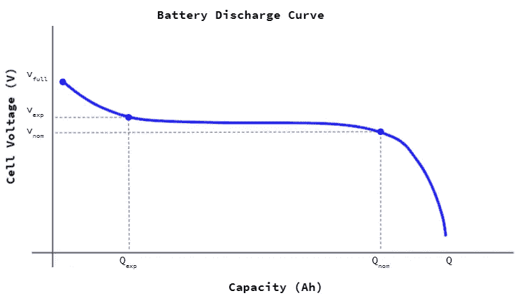**

***电池放电曲线示例，描述了电池可以供电多长时间。(这也是时间加权平均值的主要例子💯必要)图片由作者来源于*[*https://www.nrel.gov/docs/fy17osti/67809.pdf*](https://www.nrel.gov/docs/fy17osti/67809.pdf)**

**那是一条电池放电曲线，描述了电池可以为某样东西供电多长时间。x 轴显示以安培小时为单位的容量，由于这是一个恒流放电，x 轴实际上只是时间的代理。y 轴显示电压，决定电池的功率输出；当你继续给电池放电时，电压会下降，直到需要充电为止。**

**当我们为新的电池配方做 R&D 时，我们会对许多电池进行多次循环，以找出哪些配方使电池持续时间最长。**

**如果您更仔细地观察流量曲线，您会注意到只有两个“有趣”的部分:**

**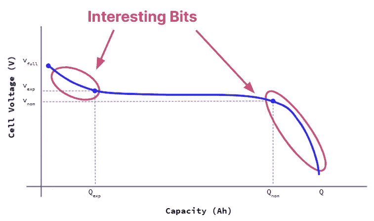**

***电池放电曲线示例，调出“有趣的位”(数据快速变化的时间点)。作者图片***

**这些是放电开始和结束时电压快速变化的部分。在这两个部分之间，中间有一段很长的时间，电压几乎没有变化:**

**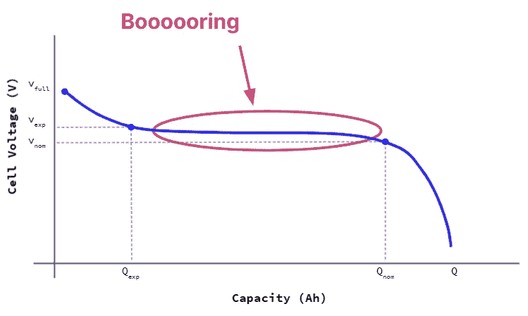**

***电池放电曲线示例，调出“无聊位”(数据保持相当稳定的时间点)。作者图片***

**现在，当我之前说我是一个电化学家时，我承认我有点夸张了。我对电化学的了解足够危险，但是我和那些拥有博士学位的人一起工作，他们比我更了解 T2。**

**但是，在处理数据方面，我常常比他们做得更好，所以我会做一些事情，比如对[恒电位仪](https://en.wikipedia.org/wiki/Potentiostat)进行编程，这是一种为了进行这些测试而连接电池的设备。**

**对于放电周期中有趣的部分(开始和结束时的部分)，我们可以让恒电位仪以最大速率采样，通常大约每 10 毫秒采样一次。我们不希望在电压不变的漫长而无聊的时间里采样那么多数据点，因为这意味着保存大量值不变的数据，浪费存储空间。**

**为了减少我们必须处理的枯燥数据而不丢失有趣的部分，我们将程序设置为每 3 分钟采样一次，或者当电压变化合理时，比如超过 5 mV。**

**实际上，会发生这样的事情:**

**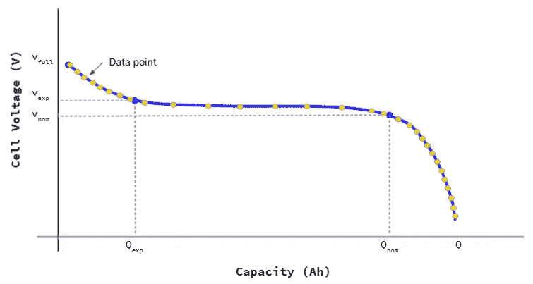**

***叠加数据点的电池放电曲线示例，用于描述感兴趣位期间的快速采样和无聊位期间的慢速采样。作者图片***

**通过以这种方式采样数据，我们将在有趣的部分获得更多的数据，而在无聊的中间部分获得更少的数据。太好了！**

**它让我们回答了更多关于曲线快速变化部分的有趣问题，并为我们提供了关于缓慢变化部分的所有信息，而无需存储大量冗余数据。**但是，这里有一个问题:给定这个数据集，我们如何找到放电期间的平均电压？****

**这个问题很重要，因为这是我们可以将这个放电曲线与未来的放电曲线(比如 10 或 100 个周期后的曲线)进行比较的事情之一。随着电池老化，其平均电压会下降，随着时间的推移下降多少可以告诉我们电池在其生命周期中的存储容量如何，以及它是否可以变成有用的产品。**

**问题是，感兴趣位中的数据采样频率更高(即感兴趣位有更多数据点)，这将在计算平均值时赋予它更大的权重，尽管它不应该如此。**

**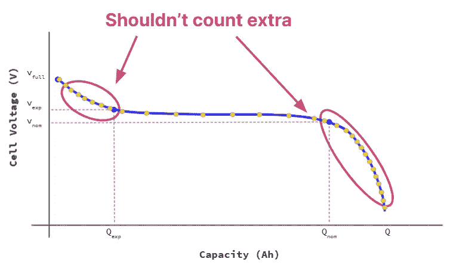**

***电池放电曲线示例，用说明性的数据点表明，虽然我们在有趣的时刻收集了更多的数据，但它们不应该算作“额外的”作者图片***

**如果我们只是对整个曲线取一个简单的平均值，将每个点的值相加，然后除以点数，这将意味着采样率的变化可能会改变我们计算的平均值…即使潜在的影响实际上是相同的！**

**我们很容易忽略我们试图识别的任何差异——任何关于我们如何改进电池的线索都可能在我们采样协议的变化中丢失。**

**现在，有些人会说:那么，为什么不在恒电位仪的最大速率下采样，即使是在无聊的部分？嗯，这些放电测试运行*真的*长。它们需要 10 到 12 个小时才能完成，但有趣的部分可能很短，从几秒钟到几分钟。如果我们以最高的速率采样，大约每 10 毫秒采样一次，这将意味着要存储多几个数量级的数据，尽管我们几乎不会使用这些数据！数量级更多的数据意味着更多的成本，更多的分析时间，各种各样的问题。**

**所以最大的问题是:**当我们处理不规则间隔的数据点时，我们如何得到一个有代表性的平均值？****

**让我们从理论上考虑一下:**

**(接下来的这一点有点方程式的味道，但我认为它们是相对简单的方程式，它们很好地映射到它们的图形表示上。我总是喜欢人们给我计算背后的数学和图形直觉，但如果你愿意，你可以跳过来看看时间加权平均是如何使用的。)**

# **数学位:如何得出时间加权平均值**

**假设我们有如下几点:**

**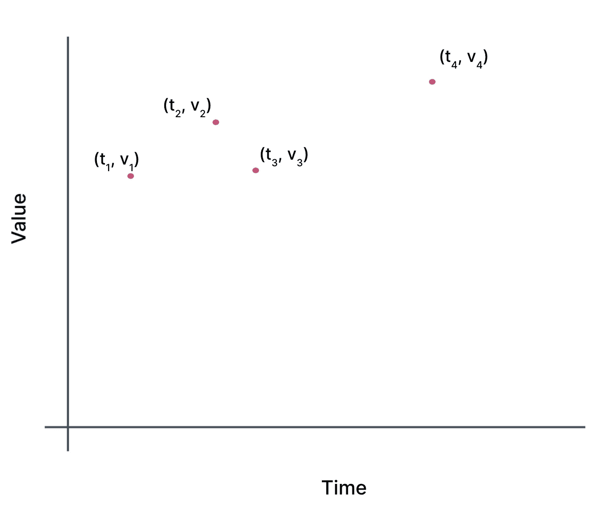**

***理论上的、不规则采样的时间序列数据集；作者图片***

**那么，正常平均值就是这些值的总和除以总点数:**

**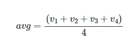**

**等式:平均值等于值(v1，v2，v3，v4)之和除以 4。**

**但是，因为它们的间距不规则，我们需要一些方法来解释这一点。**

**考虑这个问题的一种方法是在每个时间点得到一个值，然后除以总时间。这就像得到曲线下的总面积，除以总时间δt。**

**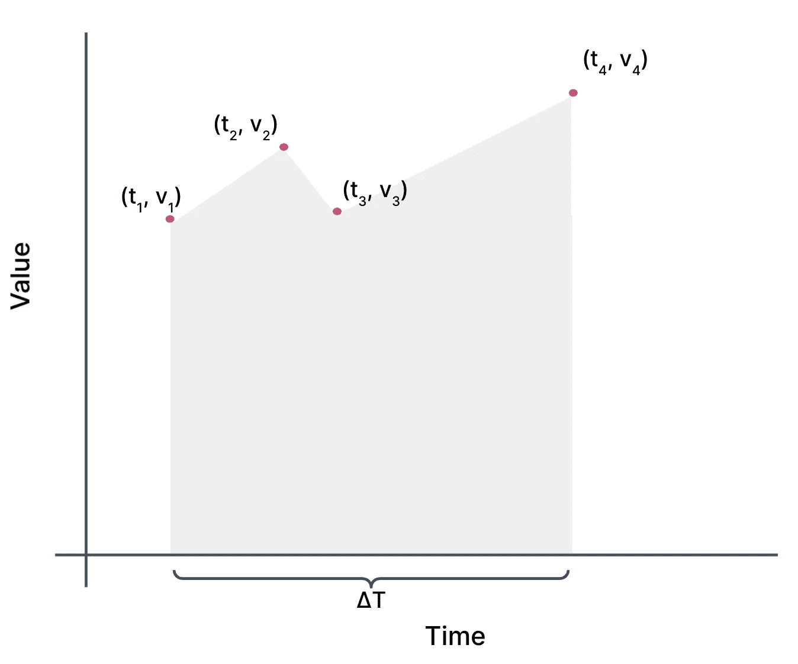**

***不规则采样时间序列数据集下的区域；作者图片***

**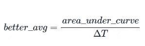**

**等式:更好的平均值等于曲线下的总面积除以总时间(δT)。**

**(在这种情况下，我们在点之间进行线性插值)。所以，让我们集中精力找到那个区域。前两点之间的区域是一个梯形:**

**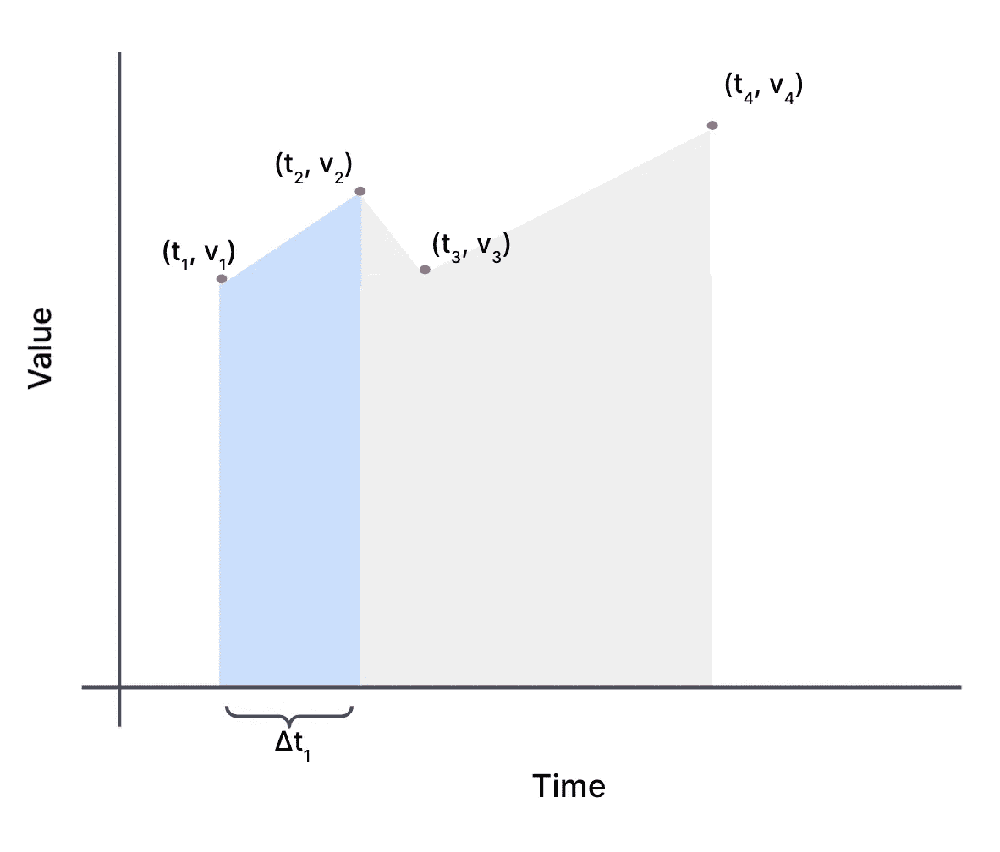**

***代表前两点下面积的梯形；作者图片***

**实际上是一个长方形加一个三角形:**

**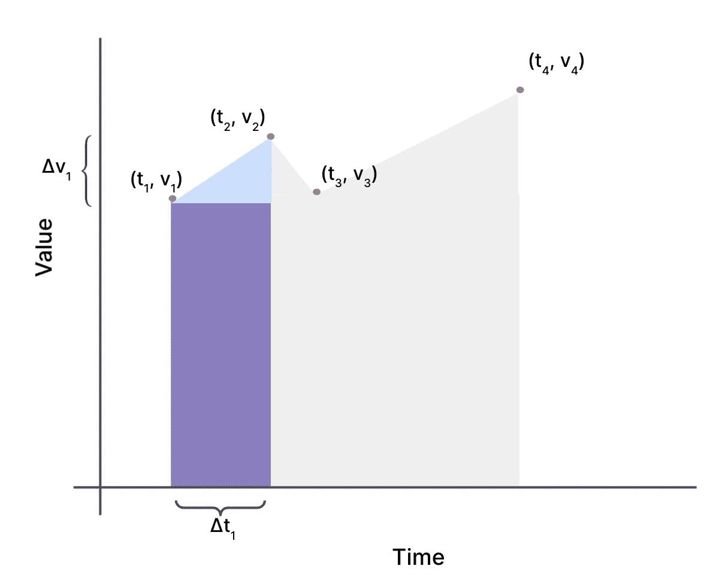**

**同一个梯形被分解成一个长方形和一个三角形。作者图片**

**好，让我们来计算面积:**

**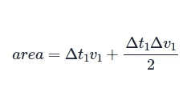**

**等式:面积等于δt1 乘以 v1 加上δt1 乘以δv1 除以 2。**

**所以要说清楚，那就是:**

**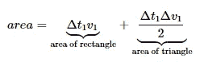**

**δt1 乘以 v1 表示矩形的面积。δt1 乘以δv1 除以 2 表示三角形的面积。**

**好吧。所以现在如果我们注意到:**

**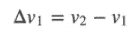**

**等式:δv1 等于 v2 减去 v1。**

**我们可以很好地简化这个等式:**

**开始于:**

**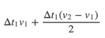**

**等式:δt1 乘以 v1 加上δt1 乘以 v2 减去 v1 除以 2。**

**排除因素:**

**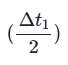**

**δt1 除以 2**

**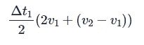**

**等式:δt1 除以 2 乘以 2v1 加上 v2 和 v1 之差。**

**简化:**

**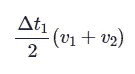**

**等式:δt1 除以 v1 和 v2 之和的两倍。**

**值得注意的一点是，这给了我们一种新的方式来考虑这个解决方案:它是每对相邻值的平均值，用它们之间的时间加权:**

**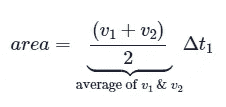**

**等式:面积等于 v1 加 v2 除以 2 乘以δt1。**

**它也等于绘制到 v1 和 v2 中点的矩形面积:**

**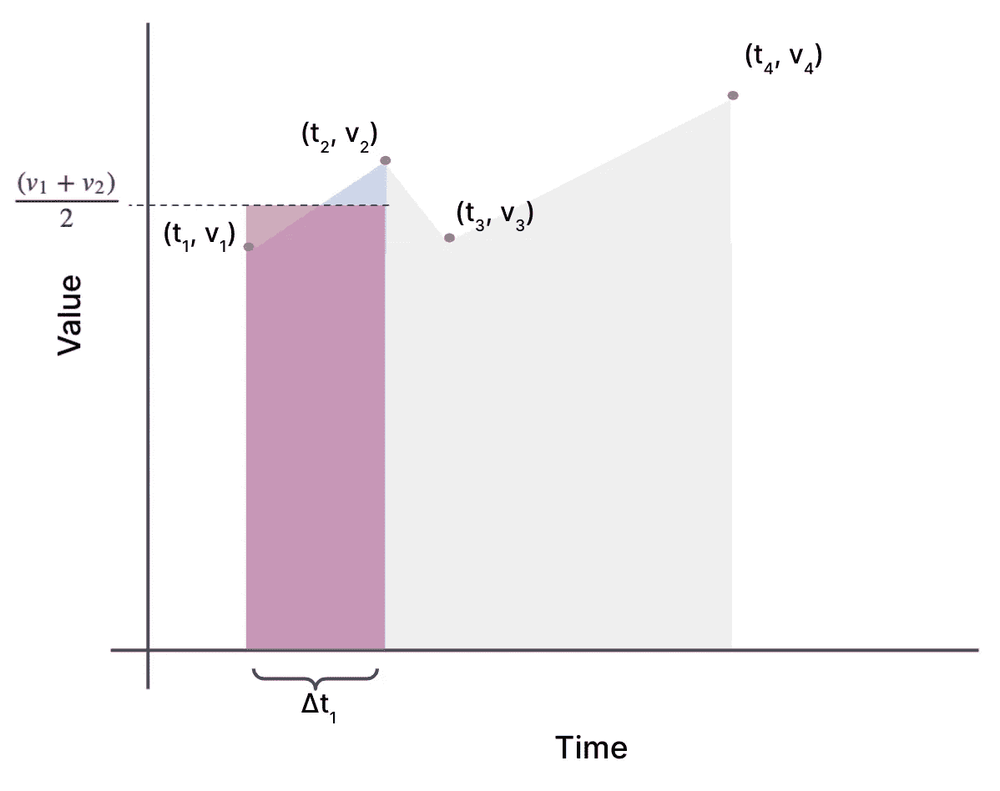**

***画到两点之间中点的梯形和矩形的面积相等。作者图片***

**既然我们已经导出了两个相邻点的公式，我们可以对数据集中的每一对相邻点重复这个过程。然后我们需要做的就是求和，这就是时间加权和，等于曲线下的面积。(学过微积分的人可能会记得他们学习积分和积分近似时的一些内容！)**

**计算出曲线下的总面积后，我们只需将时间加权总和除以总δT，就得到时间加权平均值。💥**

**既然我们已经在理论上研究了我们的时间加权平均值，让我们用 SQL 测试一下。**

# **如何在 SQL 中计算时间加权平均值**

**让我们考虑一个冰淇淋制造商或店主监控他们的冰柜的场景。原来，冰淇淋需要保持在一个相对较窄的温度范围内(~ 0–10℉)(*见脚注 1* )，这样它才不会融化并重新冻结，造成那些没人喜欢的怪异晶体。同样，如果冰淇淋变得太冷，就太难舀了。**

**当人们开关冰箱门时，冰箱里的空气温度会有很大的变化，但是冰淇淋的温度变化需要更长的时间。因此，只有长时间暴露在极端温度下，问题(融化、讨厌的冰晶)才会发生。通过测量这些数据，冰淇淋制造商可以对储存在冰箱中的每批产品进行质量控制。**

**考虑到这一点，冰柜中的传感器以如下方式测量温度:当门关闭并且我们处于最佳范围时，传感器每 5 分钟测量一次；当门打开时，传感器每 30 秒测量一次，直到门关闭，温度回到 10℉以下。**

**为了建模，我们可能有一个简单的表，如下所示:**

```
CREATE TABLE freezer_temps (  freezer_id int,  
    ts timestamptz,  
    temperature float);
```

**一些数据是这样的:**

```
INSERT INTO freezer_temps VALUES
( 1, '2020-01-01 00:00:00+00', 4.0),
( 1, '2020-01-01 00:05:00+00', 5.5),
( 1, '2020-01-01 00:10:00+00', 3.0),
( 1, '2020-01-01 00:15:00+00', 4.0),
( 1, '2020-01-01 00:20:00+00', 3.5),
( 1, '2020-01-01 00:25:00+00', 8.0),
( 1, '2020-01-01 00:30:00+00', 9.0),
( 1, '2020-01-01 00:31:00+00', 10.5), -- door opened!
( 1, '2020-01-01 00:31:30+00', 11.0),
( 1, '2020-01-01 00:32:00+00', 15.0),
( 1, '2020-01-01 00:32:30+00', 20.0), -- door closed
( 1, '2020-01-01 00:33:00+00', 18.5),
( 1, '2020-01-01 00:33:30+00', 17.0),
( 1, '2020-01-01 00:34:00+00', 15.5),
( 1, '2020-01-01 00:34:30+00', 14.0),
( 1, '2020-01-01 00:35:00+00', 12.5),
( 1, '2020-01-01 00:35:30+00', 11.0),
( 1, '2020-01-01 00:36:00+00', 10.0), -- temperature stabilized
( 1, '2020-01-01 00:40:00+00', 7.0),
( 1, '2020-01-01 00:45:00+00', 5.0);
```

**门打开后的 31-36 分钟，有更多的数据点。如果我们取所有点的平均值，我们会得到一个误导的值。在 45 分钟内，只有 5 分钟(11%的时间段)冰箱温度高于阈值温度，但是这 5 分钟占了 20 个数据点中的 10 个数据点(50%！)因为我们在冰箱门打开后会更频繁地对其温度进行采样。**

**为了找到更准确的时间加权平均温度，让我们为上面处理这种情况的公式编写 SQL。为了便于比较，我们还将得到正常平均值。(如果你读起来有困难，不要担心，我们稍后会编写一个简单得多的版本)。**

```
WITH setup AS (
    SELECT 
         lag(temperature) OVER (PARTITION BY freezer_id ORDER BY ts) as prev_temp,
         extract('epoch' FROM ts) as ts_e,
         extract('epoch' FROM lag(ts) OVER (PARTITION BY freezer_id ORDER BY ts)) as prev_ts_e,
         *
    FROM  freezer_temps),
nextstep AS (
    SELECT CASE WHEN prev_temp is NULL THEN NULL 
             ELSE (prev_temp + temperature) / 2 * (ts_e - prev_ts_e) END as weighted_sum,
        * 
    FROM setup)
SELECT freezer_id,
    avg(temperature), -- the regular average
    sum(weighted_sum) / (max(ts_e) - min(ts_e)) as time_weighted_average -- our derived average
FROM nextstep
GROUP BY freezer_id; freezer_id |  avg  | time_weighted_average 
------------+-------+-----------------------
          1 | 10.2  |     6.636111111111111
```

**它确实返回了我们想要的东西，并给了我们一个更好的描述，但是写起来并不有趣，不是吗？**

**我们有几个窗口函数，一些处理空值的 case 语句，和几个 cte 来试图让事情变得相当清楚。当人们试图弄清楚发生了什么并对其进行调整时，这种事情真的会导致代码维护问题。**

**代码都是关于管理复杂性的。完成一个相对简单的任务的长而复杂的查询使得下一个开发人员(也就是 3 个月后的你)不太可能理解发生了什么，如何使用它，或者如果他们(或者你！)需要一个不同的结果。或者，更糟糕的是，这意味着代码永远不会被修改，因为人们不太理解查询在做什么，它只是变成了一个没有人想碰的黑盒(包括你)。**

# **时间尺度超功能救援！**

**这就是为什么我们创造了 [**超功能**](https://docs.timescale.com/api/latest/hyperfunctions/?utm_source=tds&utm_medium=blog&utm_campaign=hyperfunctions-1-0-2021&utm_content=hyperfunctions-docs) ，让复杂的时序数据分析变得不那么复杂。如果我们使用[超函数来计算时间加权平均值](https://docs.timescale.com/api/latest/hyperfunctions/time-weighted-averages/?utm_source=tds&utm_medium=blog&utm_campaign=hyperfunctions-1-0-2021&utm_content=time-weighted-avg-docs)，让我们看看时间加权平均冷冻温度查询是什么样的:**

```
SELECT freezer_id,
    avg(temperature),
    average(time_weight('Linear', ts, temperature)) as time_weighted_average
FROM freezer_temps
GROUP BY freezer_id;freezer_id |  avg  | time_weighted_average------------+-------+-----------------------1 | 10.2  |     6.636111111111111
```

**这不是更简洁了吗？！用`'Linear'`加权法(就是上面推导出来的那种加权)(*见脚注 2* )算出一个`[time_weight](https://docs.timescale.com/api/latest/hyperfunctions/time-weighted-averages/time_weight/?utm_source=tds&utm_medium=blog&utm_campaign=hyperfunctions-1-0-2021&utm_content=time-weight-docs)`，然后取加权值的平均值，就大功告成了。我更喜欢那个 API(我也更喜欢，因为是我设计的！).**

**更重要的是，我们不仅不用编写所有的 SQL，而且编写(在时间加权平均值的基础上构建更复杂的分析)也变得非常非常容易。这是超功能背后的设计哲学的一个重要部分；我们希望将基本的东西变得简单，以便您可以轻松地使用它们来构建更复杂的、特定于应用的分析。**

**假设我们对整个数据集的平均值不满意，我们希望获得每 10 分钟时段的时间加权平均值:**

```
SELECT time_bucket('10 mins'::interval, ts) as bucket,
     freezer_id,
     avg(temperature),
     average(time_weight('Linear', ts, temperature)) as time_weighted_average
FROM freezer_temps
GROUP BY bucket, freezer_id;
```

**我们添加了一个`[time_bucket](https://docs.timescale.com/api/latest/hyperfunctions/time_bucket/?utm_source=tds&utm_medium=blog&utm_campaign=hyperfunctions-1-0-2021&utm_content=time-bucket-docs)`，按它分组，大功告成！让我们看看超功能所能实现的其他一些复杂的分析。**

**继续我们的冰淇淋例子，假设我们已经设置了阈值，因为我们知道如果冰淇淋在 15 ℉以上停留超过 15 分钟，它将形成那些冰晶，使其尝起来都是沙质/颗粒状的。我们可以在[窗口函数](https://www.postgresql.org/docs/current/functions-window.html)中使用时间加权平均值来查看是否发生了这种情况:**

```
SELECT *,
    average(time_weight('Linear', ts, temperature) OVER fifteen_min) as rolling_twa
FROM freezer_temps
WINDOW fifteen_min AS
     (PARTITION BY freezer_id ORDER BY ts RANGE  '15 minutes'::interval PRECEDING)
ORDER BY freezer_id, ts;freezer_id |           ts           | temperature |    rolling_twa------------+------------------------+-------------+----------------1 | 2020-01-01 00:00:00+00 |           4 |1 | 2020-01-01 00:05:00+00 |         5.5 |               4.751 | 2020-01-01 00:10:00+00 |           3 |                4.51 | 2020-01-01 00:15:00+00 |           4 |  4.1666666666666671 | 2020-01-01 00:20:00+00 |         3.5 | 3.83333333333333351 | 2020-01-01 00:25:00+00 |           8 |  4.3333333333333331 | 2020-01-01 00:30:00+00 |           9 |                  61 | 2020-01-01 00:31:00+00 |        10.5 |  7.3636363636363631 | 2020-01-01 00:31:30+00 |          11 |  7.5108695652173921 | 2020-01-01 00:32:00+00 |          15 |  7.7395833333333331 | 2020-01-01 00:32:30+00 |          20 |               8.131 | 2020-01-01 00:33:00+00 |        18.5 |  8.5576923076923081 | 2020-01-01 00:33:30+00 |          17 |  8.8981481481481491 | 2020-01-01 00:34:00+00 |        15.5 |  9.1607142857142861 | 2020-01-01 00:34:30+00 |          14 |   9.353448275862071 | 2020-01-01 00:35:00+00 |        12.5 |  9.4833333333333331 | 2020-01-01 00:35:30+00 |          11 | 11.3690476190476191 | 2020-01-01 00:36:00+00 |          10 | 11.3295454545454551 | 2020-01-01 00:40:00+00 |           7 |             10.5751 | 2020-01-01 00:45:00+00 |           5 |  9.741666666666667
```

**这里的窗口是过去 15 分钟的，按时间排序。看起来我们保持在低于我们的冰晶温度！**

**我们还提供了一个特殊的`[rollup](https://docs.timescale.com/api/latest/hyperfunctions/time-weighted-averages/rollup-timeweight/?utm_source=tds&utm_medium=blog&utm_campaign=hyperfunctions-1-0-2021&utm_content=rollup-docs)`函数，因此您可以从子查询中重新聚合时间加权值。例如:**

```
SELECT average(rollup(time_weight)) as time_weighted_average
FROM (SELECT time_bucket('10 mins'::interval, ts) as bucket,
         freezer_id,
         time_weight('Linear', ts, temperature)
      FROM freezer_temps
GROUP BY bucket, freezer_id) t;time_weighted_average
-----------------------
6.636111111111111
```

**这将为我们提供与第一个等式的总计相同的输出，因为我们只是重新合计了分时段的值。**

**但这主要是为了让你可以做更有趣的分析，比如说，将每个 10 分钟的时间加权平均值归一化为总的时间加权平均值。**

```
WITH t as (SELECT time_bucket('10 mins'::interval, ts) as bucket,
         freezer_id,
         time_weight('Linear', ts, temperature)
     FROM freezer_temps
     GROUP BY bucket, freezer_id)
SELECT bucket,
     freezer_id,
     average(time_weight) as bucketed_twa,
     (SELECT average(rollup(time_weight)) FROM t) as overall_twa,
      average(time_weight) / (SELECT average(rollup(time_weight)) FROM t) as normalized_twa
FROM t;
```

**这种特性(存储时间权重以供以后分析)在[连续聚合](https://docs.timescale.com/timescaledb/latest/how-to-guides/continuous-aggregates/?utm_source=tds&utm_medium=blog&utm_campaign=hyperfunctions-1-0-2021&utm_content=co-aggs-docs)中最有用，而我们恰好将时间加权平均值设计为在该上下文中可用！**

**我们将在未来的帖子中更详细地介绍这一点，所以请务必[订阅我们的新闻简报](https://www.timescale.com/signup/newsletter/?utm_source=tds&utm_medium=blog&utm_campaign=hyperfunctions-1-0-2021&utm_content=newsletter)，这样当我们发布新的技术内容时，您就会收到通知。**

# **今天试试时间加权平均值**

****如果你想马上开始使用 time _ weight hyperfunction——还有更多——那就升级一个完全托管的 TimescaleDB 服务:**创建一个账户[免费试用](https://console.forge.timescale.com/signup/?utm_source=tds&utm_medium=blog&utm_campaign=hyperfunctions-1-0-2021&utm_content=signup)30 天。Hyperfunctions 预装在每个新的数据库服务上，所以在你创建一个新的服务后，你就可以使用它们了！**

****如果您喜欢管理自己的数据库实例，您可以** [**下载并在 GitHub 上安装 timescaledb_toolkit 扩展**](https://github.com/timescale/timescaledb-toolkit) ，之后您将能够使用 time_weight 和所有其他的超功能。**

**如果您对这篇博文有任何问题或评论，[我们已经在 GitHub 页面上开始了讨论，我们希望收到您的反馈](https://github.com/timescale/timescaledb-toolkit/discussions/185)。(而且，如果你喜欢你所看到的，GitHub ⭐也总是受欢迎和赞赏的！)**

*   **我们喜欢在公共场合进行构建，你可以在 GitHub 上查看我们[即将发布的路线图，以获得提议的功能、我们当前正在实现的功能以及今天可以使用的功能的列表。](https://github.com/timescale/timescaledb-toolkit)**

**我们要特别感谢 [@inselbuch](https://github.com/inselbuch) ，是他[提交了 GitHub 问题](https://github.com/timescale/timescaledb-toolkit/issues/46)，让我们开始了这个项目(还有其他人👍让我们知道他们想使用它。)**

**我们相信时间序列数据无处不在，理解它对于各种技术问题都至关重要。我们构建了超函数，让开发人员更容易利用时序数据的力量。我们一直在寻找关于下一步构建什么的反馈，并且很想知道您如何使用超函数、您想要解决的问题，或者您认为应该或者可以简化的事情，以便更好地分析 SQL 中的时序数据。(要提供反馈，请在 GitHub 的[未决问题](https://github.com/timescale/timescaledb-toolkit/issues)或[讨论主题](https://github.com/timescale/timescaledb-toolkit/discussions)中发表评论。)**

**最后，在未来的帖子中，我们将围绕我们的设计理念提供更多的上下文，我们围绕时间加权平均值(和其他功能)的 API 做出的决定，并详细说明其他超函数是如何工作的。所以，如果那是你的包，你很幸运——但是你必须等一两个星期。**

# **脚注**

1.  **我不知道这些时间或温度本身是否准确；然而，冰淇淋部分融化和重新冻结的现象导致更大的冰晶形成——结果是冰淇淋变得粗糙——这是有据可查的。例如，参见[哈罗德·麦基的《论食物与烹饪》](https://peoplegetreadybooks.com/?q=h.tviewer&using_sb=status&qsb=keyword&qse=OqerFF92q0vIs_NOprdwmw)(2004 年修订版，第 44 页)。因此，如果你想从一个关于时间序列数据库的博客中寻找关于储存冰淇淋的建议:对于长期储存，你可能希望冰淇淋储存在 0℉以下。我们的例子更像是你在冰淇淋展示中看到的场景(例如，在冰淇淋店或工厂生产线上)，因为冰淇淋保持在 0–10℉之间(对于舀来说是理想的，因为较低的温度会使冰淇淋太难舀)。**
2.  **我们还提供`’LOCF’`或最后一次观察结转权重，这最适合于每当值改变时记录数据点的情况(即，旧值在获得新值之前一直有效)。)其推导过程类似，只是矩形具有第一个值的高度，而不是我们在本文中讨论的线性加权(即，我们在相邻数据点之间进行线性插值):**

**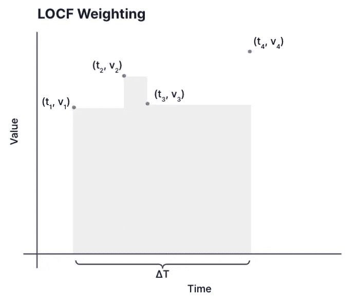**

***当您知道值在下一点之前保持不变时，LOCF 加权非常有用。作者图片***

**而不是:**

**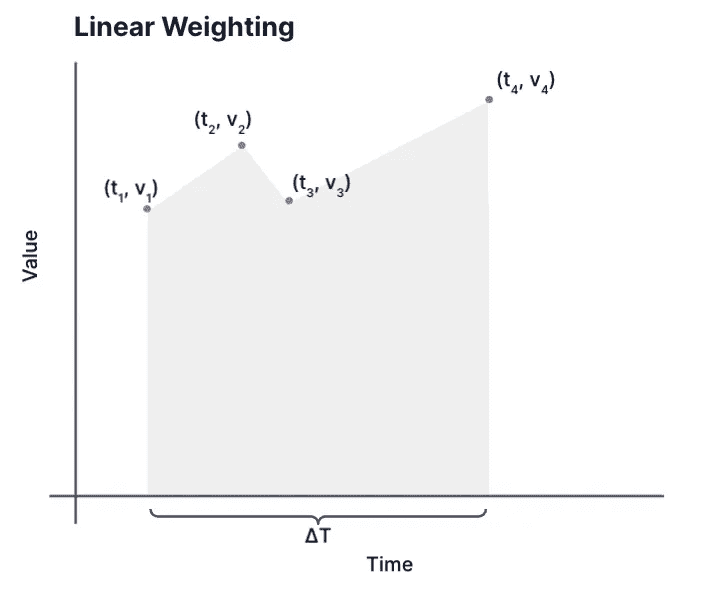**

***当您以不规则的间隔对变化的值进行采样时，线性加权非常有用。作者图片***

**一般而言，线性加权适用于采样率可变的情况，但系统不能保证仅在采样率变化时提供数据。当保证系统只在发生变化时才提供数据，并且在收到新值之前可以准确地保留旧值时，LOCF 最有效。**

***原载于 2021 年 7 月 22 日*[*【https://blog.timescale.com】*](https://blog.timescale.com/blog/what-time-weighted-averages-are-and-why-you-should-care/)*。***