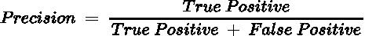
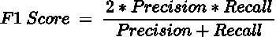
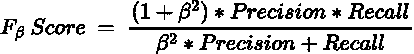

# 评估分类模型时要考虑什么

> 原文：<https://towardsdatascience.com/what-to-consider-when-evaluating-your-classification-model-a1092ddcc1df?source=collection_archive---------24----------------------->

## 通过选择正确的评估指标，构建可靠的机器学习模型

安娜·涅克拉舍维奇摄于[佩克斯](https://www.pexels.com/photo/magnifying-glass-on-top-of-document-6801648/?utm_content=attributionCopyText&utm_medium=referral&utm_source=pexels)

分类任务中的大量工作放在特征工程和参数优化上，这是理所当然的。这些步骤对于构建具有健壮性能的模型是必不可少的。然而，如果您选择用错误的评估标准来评估这些模型，那么所有这些努力都将付诸东流。

目前，有很多方法可以量化一个模型的性能。然而，由于机器学习术语的混乱，很容易忽略这些指标之间的区别，并随意选择它们。

不幸的是，这样做会妨碍模型满足目标的能力。

例如，模型的功能之一是提供洞察，在随后的分析(例如 A/B 测试)中，哪些特性应该进行研究或实验。如果你依赖于一个用错误的评估标准训练的模型，你将冒着把你的时间、精力和金钱投入到探索错误的变量中的风险。

因此，明智的做法是花时间了解不同评估指标的含义，它们是如何计算的，以及它们何时最有用。

## 关键术语

在讨论任何指标之前，有必要介绍一些在比较模型预测和实际值时使用的关键术语。

模型进行的分类会导致四种结果之一。

一个**真阳性**反映了机器正确预测阳性病例的结果。

**真否定**反映了机器正确预测否定情况的结果。

一个**假阳性**反映了一个机器将一个阳性预测分配给一个阴性病例的结果

**假阴性**反映了机器将阴性预测分配给阳性病例的结果。

为了更好地理解这些术语，考虑一个检测信用卡欺诈的模型。

真正的正面结果需要正确地将交易识别为欺诈。

真正的负面结果需要正确地将交易识别为合法。

假阳性结果意味着将合法交易识别为欺诈。

假阴性结果意味着将欺诈性交易识别为合法交易。

这些预测结果充当用于导出分类模型的许多评估度量的组件。

让我们来看看其中的几个。

# 评估指标

## 1.准确(性)

这是迄今为止最简单的指标。

精度可通过以下公式计算:

这一指标在现实生活中不受欢迎。因为它不区分假阳性和假阴性，所以对于不平衡的数据集来说，这是一个可怕的选择。

## 2.精确

精度指标类似于准确度指标。它**惩罚假阳性**而不考虑假阴性。

其值可通过以下公式计算:

如果您想避免误报或对误报更宽容，这是一个有效的度量标准。

例如，医疗专业人员有足够的动机来避免假阳性。诊断一个病人患有一种他们根本没有的疾病会导致治疗或手术，而这些治疗或手术本来就没有必要。这反过来会对接受他们护理的病人造成更大的伤害。此外，这种错误的预测会导致名誉损失和一连串的诉讼。

## 3.回忆

召回率度量可以被认为是精确度度量的对立面。这个度量**惩罚假阴性**并忽略假阳性，而不是惩罚假阳性并忽略假阴性。

召回指标可通过以下公式计算:

考虑之前的疾病诊断案例。虽然假阳性对医疗专业人员来说没有吸引力，但假阴性也是如此。未能诊断出患者实际患有的疾病或状况的成本将导致他们被剥夺必要的治疗。

## 4.F-1 分数

在许多现实生活中，假阳性和假阴性都没有吸引力。因此，精确度和召回率可能不足以评估模型的性能。

幸运的是，人们可以使用 f-1 分数指标来平衡精确度和召回率，而不是分别跟踪这两个指标。

f-1 得分指标通过以下公式计算:

考虑到它的适用性，当我接手分类项目时，这是我个人的首选指标。

对于许多不希望出现假阴性和假阳性的领域和学科，f1 分数是一个很有吸引力的选择。

## 5.F-beta 分数

使用 f1 分数的一个警告是，它同等地权衡了精确度和召回率。然而，可能有这样的情况，一个精度可能比回忆更重要，反之亦然。

f-beta 指标非常适合这种情况。它可以通过以下公式导出:

如果您希望精度指标优先于召回指标(即限制误报)，请选择低于 1 的 beta 值。

如果您希望召回指标优先于精确度指标(即限制假阴性)，请选择大于 1 的 beta 值。

## 结论

照片由 [Unsplash](https://unsplash.com?utm_source=medium&utm_medium=referral) 上的 [Prateek Katyal](https://unsplash.com/@prateekkatyal?utm_source=medium&utm_medium=referral) 拍摄

为您的分类模型选择评估指标可能不像数据争论和功能工程那样耗时。

然而，它仍然对你的项目或研究的最终结果有相当大的影响。花时间考虑最适合该模型的指标可以确保令人满意的最终结果。

我祝你在机器学习的努力中好运！