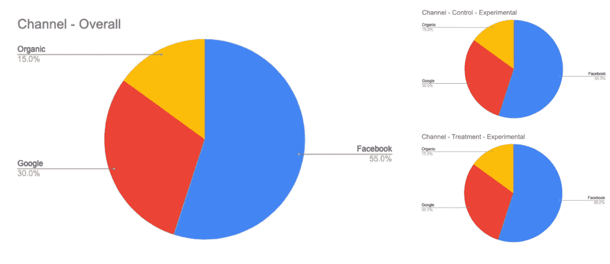
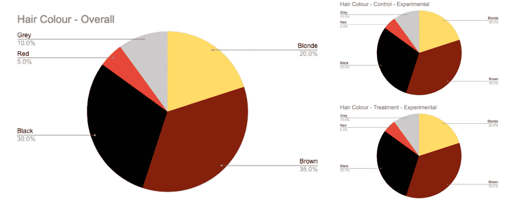
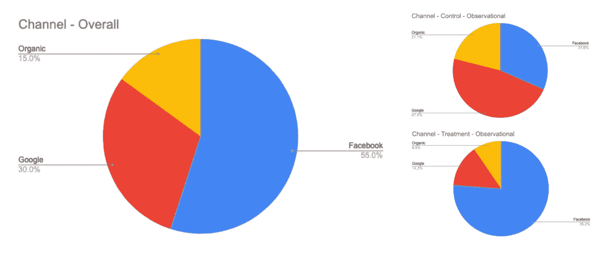
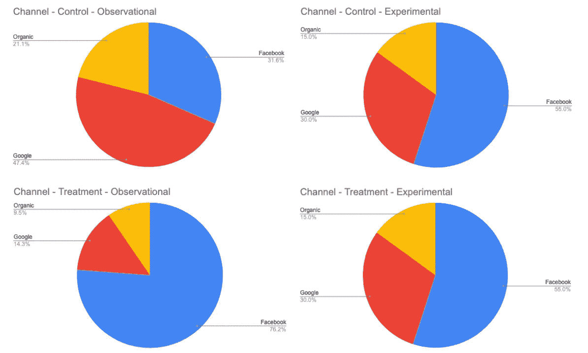

# 如果你不能对你的产品进行实验，该怎么办？—因果推理 I

> 原文：<https://towardsdatascience.com/what-to-do-if-you-cant-run-experiments-on-your-product-causal-inference-i-f6950bf10681?source=collection_archive---------28----------------------->

## 简单介绍因果推理及其在产品开发中的应用

[https://en.meming.world/wiki/Confused_Nick_Young](https://en.meming.world/wiki/Confused_Nick_Young)

最近 [AB 测试](/bayesian-experimentation-methods-for-products-636514951e43)已经成为产品开发团队的黄金标准。在产品上运行实验有助于团队理解每个变化对他们的关键度量的增量效应，并逐渐改进他们的产品。然而，建立能够有效运行实验的基础设施是非常昂贵的。因此，作为一名产品分析师，您经常需要找到其他方法来量化特性变化对关键指标的影响。在这一系列的文章中，我们将探索为什么实验是理解因果关系的最佳方式，以及在没有因果关系的情况下可以使用的其他因果推理技术。

1.  理解实验的重要性
2.  因果推理的统计方法
3.  因果推理的机器学习

为了理解实验的重要性，让我们快速了解一些关键术语及其定义。我们尤其需要理解**混杂因素**的概念。

## 混杂因素

混杂因素是一个独立于我们正在测试的变化的因素，但可能会对我们的关键测试指标产生影响。这些可能是外部因素，如时间和地理位置，也可能是内部因素，如对您的实验产生影响的不同产品变化。

例如，如果你的产品是基于用户的爱好，比如游戏或锻炼，那么星期几很可能会对你的产品产生混淆的影响。他们很可能会在周末比平日更多地接触你的产品，因为他们很可能会在周末有更多的空闲时间来从事上述爱好。

同样，用户的国家或地理位置也会对他们如何使用你的产品产生很大的影响。例如，如果你的产品专注于赌博，世界上不同国家对赌博的不同态度会对用户如何使用你的产品产生巨大的影响。

现在我们对混杂因素有了更好的了解，让我们看看如何用**实验**数据和**观察**数据来处理这些混杂因素。

## 实验数据

实验数据使我们能够控制这些混杂因素，进而使我们能够对变化是否导致我们的关键测试指标增加或减少做出强有力的声明。在产品实验中，用户被随机分配到不同的组。然后给每一组展示产品的不同版本，实验数据是用户参与每个版本的方式的总结。由于这种随机分配，随着用户样本量的增长，每个混杂因素下每个组的分布变得类似于同一混杂因素下整个用户群的分布。因此，每个组都很好地代表了整个用户群，并且与其他组几乎相同。然后，可以使用测试指标直接比较不同的版本，以了解哪个版本最吸引人。

让我们举一个真实世界的例子来帮助理解这个想法。让我们假设获取用户的渠道是实验的混淆因素。这可能是由于不同渠道传递的信息不同，因此通过某些渠道获得的用户对您产品的期望与通过其他渠道获得的用户不同。类似地，这可能是由于来自不同渠道的用户所表现出的不同层次的意图。一个积极寻找你的产品的有机用户比一个点击了脸书广告的用户更有可能被吸引。

下图显示了一个假设的移动应用程序获得的用户的渠道分布。正如我们所看到的，渠道在整个用户群中的分布反映在每个控制和治疗用户组中。这是由于上面提到的随机分配。现在，控制组和治疗组中因渠道而对产品更感兴趣或不太感兴趣的用户比例相等。因此，我们可以直接比较两组的测试指标，以了解哪个版本更好地独立于混杂因素。

实验数据的通道分布(图片由作者提供)

在这一点上值得注意的是，我们可以很容易地测量通过每个渠道获得了多少用户，因此如果渠道是一个混杂因素，我们可以很容易地看到这种影响。如果我们不能观察到我们的混杂因素呢？随机分配的妙处在于，它将这一概念扩展到了无法观察到的混杂因素。

让我们假设用户的头发颜色是我们实验的一个混杂因素。我们假设的应用程序允许用户在打开前置摄像头的情况下应用滤镜。让我们假设，在我们不知道的情况下，用于这些过滤器的面部识别算法对某些颜色的头发比对其他颜色的头发更有效。这将意味着一些用户会比其他人有更好的体验，头发的颜色将是一个我们无法观察到的混淆因素。尽管我们无法测量这种混杂因素，但在足够大的样本量上进行随机分配将确保两个用户组具有相同的用户头发颜色分布，如下图所示。

实验数据的发色分布(图片由作者提供)

## 观测资料

观察数据是收集的数据，没有假装随机分配给每个版本。在这种情况下，用户被分配到基于时间、地理或一些其他混杂因素的每个版本。例如，我们可以在一个新特性发布之前和之后对用户进行分组，或者只在某些地区发布该特性。

在这种情况下，由于缺乏随机分配，很可能每个组在一个混杂因素下的分布将不同于同一混杂因素下其他组的分布。因此，我们不能仅仅根据各个团队如何参与其中来直接比较不同版本的测试指标。

让我们用前面的例子更仔细地看看这个。让我们假设我们已经在给定的日期发布了我们的特性，并且想要基于群组日期来划分我们的对照组和治疗组。在功能发布前 2 周内安装我们应用程序的所有新用户都是控制组的一部分，在发布后 2 周内安装我们应用程序的所有新用户都是治疗组的一部分。

下图展示了我们团队的渠道分布情况。对照组有更多通过脸书广告获得的用户，而治疗组有更多通过谷歌广告获得的用户。让我们假设通过脸书获得的用户由于信息与产品一致而更加投入。因此，通过脸书获得的用户比通过谷歌获得的用户有更高的参与度。由于两组之间的渠道不平衡，这意味着对照组将具有比两组平衡时更高的参与度指标，类似地，治疗组将具有比两组平衡时更低的参与度指标。如果我们要直接比较两组的测试指标，那么 Channel 将成为一个混杂因素，扭曲我们的实验结果。

观测数据的通道分布(图片由作者提供)

## 我们如何控制混杂因素？

能够控制混杂因素的第一步是能够测量它们。时间、地理和渠道等混杂因素很容易衡量，因此我们可以控制它们。然而，在没有实验设置的情况下，更难测量的混杂因素，如上述示例中用户的头发颜色，更难控制。

我们可以对实验数据进行的[分析是一个强大的工具，可以帮助我们了解产品变化对关键指标的因果影响。但是如果不可能获得实验数据，我们该怎么办呢？有几种不同的技术可以用于观察数据。我们可以使用统计方法，比如不同类型的加权，或者机器学习方法。](/bayesian-experimentation-methods-for-products-636514951e43)

## 因果推理的统计方法

统计方法通过加权参与度来解释组间混杂因素下分布的不平衡。本质上，如果两组在混杂因素下具有相同的分布作为潜在的用户基础，我们将使用它们来计算度量标准。一旦我们做到这一点，我们就可以直接比较不同组之间的计算结果，从而宣布获胜者。

让我们重新看一下渠道的例子，看看实际情况。下面，左边，我们看到的是各个群体的分布，以及获取用户的渠道下的用户基数。图像的右侧显示了应用统计方法后的组。

应用统计因果推断方法后的渠道分布(图片由作者提供)

再次值得注意的是，这些统计方法只能应用于可观察的(即可测量的)混杂因素。

在本系列的下一部分，我将探索可用于此练习的不同统计方法。我将探索的方法包括:

*   分层
*   逆概率加权
*   倾向匹配

## 因果推理的机器学习方法

一些方法使用机器学习来计算出你的变化对你的关键指标有什么影响，同时控制混杂因素。

如前所述，值得注意的是，这些最大似然法仅适用于可观察(即可测量)的混杂因素。

在本系列的后面部分，我将探索可用于本练习的不同的 ML 方法。我将探索的方法包括:

*   受控回归
*   隆起建模
*   元学习者

我希望这篇博文有助于解释为什么 [AB 测试](/bayesian-experimentation-methods-for-products-636514951e43)允许我们以比其他方法更强的方式陈述每个变化的因果影响。我还希望它介绍了因果推理技术在产品分析中的应用。请关注本系列的下一部分！