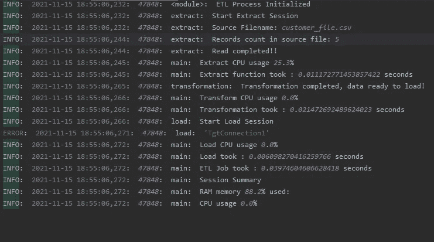

# 记录什么？来自 Python ETL 管道！

> 原文：<https://towardsdatascience.com/what-to-log-from-python-etl-pipelines-9e0cfe29950e?source=collection_archive---------18----------------------->

## ETL 管道的详细日志结构！


学分- [爆发](https://burst.shopify.com/photos/logs-of-all-shapes-and-sizes?q=log)

作为我工作的一部分，我一直在将一些在传统的基于工具的框架上开发的 ETL 工作转换成 python 框架，并且遇到了一些挑战。这几个挑战是编排、代码管理、日志、版本控制等。对他们中的一些人来说，在工具上开发他们并不需要太多的努力。但是，在像 python ETL 这样的手写代码中，这些都是相当大的挑战！这就带来了一个挑战，也就是我们今天的话题！

此外，我们今天主要关注的是“什么”，而不是描述“如何”，因为平台上已经有许多好文章。

**词汇**:

1.  介绍
2.  ETL 框架
3.  日志的结构！！
4.  使用我们的日志结构的示例 ETL 作业。
5.  代码位置。

**简介**:当我们在工具上设计和开发 ETL 管道时，我们关注像源、目标对象、转换逻辑和一些处理管道的支持任务这样的组件。这些工具还将为所有正在运行的作业生成日志，并且可以通过其内部界面进行监控。基本上，我的意思是说开发/维护日志在工具中并不是一项具有挑战性的活动。而在 python 中，这是一个需要处理的独立活动。今天，在我们的帖子中，我们将讨论 ETL 作业的基本框架，我们可以在任何管道中记录的细节的粗略想法，然后我们将它们组织到我们的 ETL 代码中，最后，我们将开发一个记录日志的示例场景。

**ETL 框架**:正如我们已经知道的，有不同种类的 ETL 作业，如合并/上插流程、分段加载、SCD 2 加载、增量作业、直接插入加载等。所有这些 ETL 作业都有一个非常基本的结构(如下面的 python 所示),即调用管道中的模块、提取模块、转换模块和加载模块的主要功能，现在，我们可以使用下面的框架来确定 ETL 日志的外观。

```
def extract():
    pass

def transformation():
    pass

def load():
    pass

def main():
    extract()
    transformation()
    load()

if __name__=="__main__":
    main()
```

**日志的结构**:当我们勾勒出 ETL 工作的蓝图时，让我们试着列出一个粗略的想法，我们可以从工作中跟踪哪些细节。

我们可以记录的一系列细节—

*   显示初始化的元素/组件，如文件夹位置、文件位置、服务器 id、用户 id 详细信息、作业中的流程详细信息
*   显示提取阶段详细信息，如源文件名、源文件计数(如果需要)、文件格式、文件大小、源表名、源数据库连接详细信息(除了任何秘密身份证明(用户/密码))、文件/源表缺失或无法获取数据消息时的任何异常或错误。
*   显示转换阶段的详细信息，如在数据处理期间内存不足时的失败/异常消息，以及任何数据/格式转换的详细信息(如果需要)。
*   显示加载阶段详细信息，如文件/目标位置、加载的记录数、加载失败、任何数据库加载的约束、加载摘要详细信息。
*   显示作业摘要，如流程运行时间、内存使用情况、CPU 使用情况，这些也可以在提取、转换和加载级别进行跟踪，以均匀地确定作业的瓶颈。

现在让我们把上面的细节整合到我们的 ETL 框架中，看看我们的日志结构是什么样子的！

```
##basic config
##logging.config.fileConfig('logging.conf')
logger = logging.getLogger(__name__)
logger.setLevel(logging.DEBUG)

#job parameters config
config = configparser.ConfigParser()
config.read('etlConfig.ini')
JobConfig = config['ETL_Log_Job']

formatter = logging.Formatter('%(levelname)s:  %(asctime)s:  %(process)s:  %(funcName)s:  %(message)s')
##creating handler
stream_handler = logging.StreamHandler()
file_handler = logging.FileHandler(JobConfig['LogName'])
file_handler.setFormatter(formatter)
logger.addHandler(file_handler)

def extract(counter):

    logger.info('Start Extract Session')
    try:
        pass
    except ValueError as e:
        logger.error(e)
    logger.info("extract completed!")

def transformation(counter):
    logger.info('Start Transformation Session')
    pass
    logger.info("Transformation completed,data ready to load!")

def load(counter):
    logger.info('Start Load Session')
    try:
       pass
    except Exception as e:
        logger.error(e) def main():

    start = time.time()
    ##extract
    start1 = time.time()
    extract()
    end1 = time.time() - start1
    logger.info('Extract CPU usage {}%'.format(psutil.cpu_percent()))
    logger.info("Extract function took : {} seconds".format(end1))

    ##transformation
    start2 = time.time()
    transformation()
    end2 = time.time() - start2
    logger.info('Transform CPU usage{}%'.format(get_cpu_usage_pct()))
    logger.info("Transformation took : {} seconds".format(end2))

    ##load
    start3 = time.time()
    load()
    end3 = time.time() - start3
    logger.info('Load CPU usage {}%'.format(psutil.cpu_percent()))
    logger.info("Load took : {} seconds".format(end3))
    end = time.time() - start
    logger.info("ETL Job took : {} seconds".format(end))
    logger.info('Session Summary')
    logger.info('RAM memory {}% used:'.format(psutil.virtual_memory().percent))
    logger.info('CPU usage {}%'.format(psutil.cpu_percent()))
    print("multiple threads took : {} seconds".format(end))

if __name__=="__main__":
    logger.info('ETL Process Initialized')
    main()
```

而且，如果您观察上面的代码结构，我已经创建了一个配置文件来维护所有作业级别的详细信息。通过将该文件导入到您的代码中，您可以利用代码的不同部分，包括用于日志记录。

etlConfig.ini:

```
##ETL jobs Parameters

[ETL_Log_Job] ##Job name
Job_Name = etl_log_job.py
LogName = etl_log_job.log
TgtConnection = Customers.db
SrcConnection = Customers.db
SrcObject = customer_file.csv
TgtObject = customer##Add more job details as needed
```

**使用我们的日志结构的示例 ETL 作业**:

```
import logging.config
import time
import psutil
import configparser
import pandas as pd
import sqlite3##basic config
##logging.config.fileConfig('logging.conf')
logger = logging.getLogger(__name__)
logger.setLevel(logging.DEBUG)#job parameters config
config = configparser.ConfigParser()
config.read('etlConfig.ini')
JobConfig = config['ETL_Log_Job']formatter = logging.Formatter('%(levelname)s:  %(asctime)s:  %(process)s:  %(funcName)s:  %(message)s')
##creating handler
stream_handler = logging.StreamHandler()
file_handler = logging.FileHandler(JobConfig['LogName'])
file_handler.setFormatter(formatter)
logger.addHandler(file_handler)def extract():logger.info('Start Extract Session')
    logger.info('Source Filename: {}'.format(JobConfig['SrcObject']))try:
        df = pd.read_csv(JobConfig['SrcObject'])
        logger.info('Records count in source file: {}'.format(len(df.index)))
    except ValueError as e:
        logger.error(e)
        return
    logger.info("Read completed!!")
    return dfdef transformation(tdf):
    try:
        tdf = pd.read_csv(JobConfig['SrcObject'])
        tdf[['fname', 'lname']] = tdf.NAME.str.split(expand=True)
        ndf = tdf[['ID', 'fname', 'lname', 'ADDRESS']]
        logger.info('Transformation completed, data ready to load!')
    except Exception as e:
        logger.error(e)
        return
    return ndfdef load(ldf):
    logger.info('Start Load Session')
    try:
        conn = sqlite3.connect(JobConfig['TgtConnection'])
        cursor = conn.cursor()
        logger.info('Connection to {} database established'.format(JobConfig['TgtConnection1']))
    except Exception as e:
        logger.error(e)
        return
    #3Load dataframe to table
    try:
        for index,row in ldf.iterrows():
            query = """INSERT OR REPLACE INTO {0}(id,fname,lname,address) VALUES('{1}','{2}','{3}','{4}')""".format(JobConfig['TgtObject'],row['ID'],row['fname'],row['lname'],row['ADDRESS'])
            cursor.execute(query)except Exception as e:
        logger.error(e)
        return
    conn.commit()
    logger.info("Data Loaded into target table: {}".format(JobConfig['TgtObject']))
    returndef main():start = time.time()##extract
    start1 = time.time()
    tdf = extract()
    end1 = time.time() - start1
    logger.info('Extract CPU usage {}%'.format(psutil.cpu_percent()))
    logger.info("Extract function took : {} seconds".format(end1))##transformation
    start2 = time.time()
    ldf = transformation(tdf)
    end2 = time.time() - start2
    logger.info('Transform CPU usage {}%'.format(psutil.cpu_percent()))
    logger.info("Transformation took : {} seconds".format(end2))##load
    start3 = time.time()
    load(ldf)
    end3 = time.time() - start3
    logger.info('Load CPU usage {}%'.format(psutil.cpu_percent()))
    logger.info("Load took : {} seconds".format(end3))
    end = time.time() - start
    logger.info("ETL Job took : {} seconds".format(end))
    ##p = psutil.Process()
    ##ls = p.as_dict()
    ##print(p.as_dict())
    logger.info('Session Summary')
    logger.info('RAM memory {}% used:'.format(psutil.virtual_memory().percent))
    logger.info('CPU usage {}%'.format(psutil.cpu_percent()))
    print("multiple threads took : {} seconds".format(end))if __name__=="__main__":
    logger.info('ETL Process Initialized')
    main()
```



```
##Log output for above sample job
```

我们还可以对日志做一些改进:

1.  通过为作业实现配置/参数文件，维护作业日志也将变得容易。
2.  我们可以添加系统级的摘要细节，以便以后优化或识别作业中的瓶颈。能够识别提取、转换和加载的 CPU 性能/使用情况可以为开发人员提供更多帮助。
3.  如果我们正在加载目标，尝试跟踪加载摘要，这将有助于识别加载数据的一致性。
4.  python 中的日志模块在 ETL 作业中使用简单有效。
5.  此外，提供进程 id 或线程 id 详细信息可能有助于以后在其他平台上对进程进行故障排除。
6.  给出服务器或节点上作业运行的详细信息将有助于挖掘根本原因。

**样本代码位置**:

[](https://github.com/Shivakoreddi/ETL-Log-Structure) [## GitHub-Shivakoreddi/ETL-Log-Structure

### 此时您不能执行该操作。您已使用另一个标签页或窗口登录。您已在另一个选项卡中注销，或者…

github.com](https://github.com/Shivakoreddi/ETL-Log-Structure) 

感谢您阅读这篇文章，未来的工作将涉及开发 python ETL 作业的其他挑战，如编排、代码管理、版本控制等。

**参考**:

1.  埃利奥特·福布斯，[https://tutorialedge . net/python/python-logging-best-practices/](https://tutorialedge.net/python/python-logging-best-practices/)(2017)