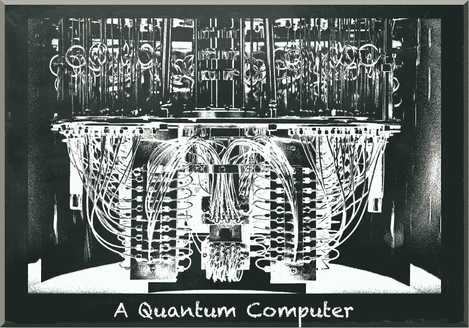

# 在量子机器学习框架中寻找什么

> 原文：<https://towardsdatascience.com/what-to-look-for-in-a-quantum-machine-learning-framework-b7a7c281aa4f?source=collection_archive---------20----------------------->

## 相关量子机器学习框架综述

量子机器学习要不要入门？看看 [**动手量子机器学习用 Python**](https://www.pyqml.com/page?ref=medium_framework&dest=/) **。**

作者弗兰克·齐克特的图片

在量子机器学习中，我们的目标是利用量子力学现象，在机器学习算法的计算方面实现巨大的飞跃。

机器学习仍然是一项相对较新的技术。但与量子计算相比，它已经相当成熟了。看看框架的前景就明白了这一点。

当深度神经网络的成功在 2014 年左右结束了第三个人工智能冬天时，我们看到许多框架争夺霸权。有些名字已经快忘了，比如 Theano 和 Caffe。其他的被合并了，比如 Keras。似乎只有两家留下来了，谷歌支持的 Tensorflow 和脸书支持的 PyTorch。

我们见证了关于编程语言的同样的整合。Python 成为机器学习领域的主流编程语言。它使朱莉娅和 R 沦为下层阶级。

量子计算太新了。它甚至不是一项真正的技术。我们刚刚开始弄清楚如何建造量子计算机，以及我们可以用它们做什么。

尽管量子计算的理论已经存在了一段时间，但是实际的量子计算仍然处于绝对的劣势。

在量子计算领域，我们可能会看到类似的整合。当然，你会希望使用一个持久的框架。然而，赢家尚未确定。选手们正在准备。

这些选手是:

*   IBMs Qiskit
*   谷歌的 Cirq
*   亚马逊的 AWS Braket
*   微软的 Q#和 Azure Quantum
*   里盖蒂的森林
*   世外桃源的潘尼莱恩
*   再来几个…

对于现在进入该领域的学生和从业者来说，决定从哪个框架入手并不容易。所以显而易见的问题是，如果你想应用量子机器学习，应该使用哪一个？

像早期的机器学习库一样，量子计算框架在函数数量、语法和抽象级别上有所不同。

较低层次的框架更接近硬件。虽然它们提供了高度的控制，但在开发端到端应用程序时，使用起来可能会很麻烦。

相反，更高级别的框架抽象掉了许多硬件相关的细节。因此，它们使应用程序的开发变得方便，但缺乏细粒度的控制。

当我们谈论量子机器学习时，我们更倾向于应用领域。但是，正如我们所说，我们希望**使用**量子计算进行机器学习算法的计算。所以对于量子机器学习来说，量子计算是达到目的的手段。因此，要想在量子机器学习方面取得成功，你很可能会选择一种更高级的语言。

量子计算框架对于将想法转化为量子计算机可以执行的指令至关重要。不幸的是，量子计算机是罕见的设备。除非你为享有特权的学术机构或量子计算机的制造商之一工作，否则你不会有机会接触到最先进的量子计算机。

然而，这并不意味着你不能使用量子计算来增强你的机器学习算法。量子计算框架提供了模拟器，您可以使用它在经典计算机上运行量子算法。当然，你的经典计算机计算电路的速度不会像量子计算机那样快。事实上，你的经典电脑会慢得离谱。所以，虽然你不会观察到任何加速(整体性能会比一个纯粹的经典算法差)，但你可以使用模拟器来验证你的量子算法是否有效。如果真的如此，你将为量子计算机的问世做好准备。因此，您将希望使用一个提供强大模拟器的框架。

最后，除非你已经是量子机器学习的专家，否则你需要培训材料。例如，这些可能包括在线教程、书籍和 API 参考。如果你不知道如何使用，最好的框架也不会有帮助。

大致说来，有两种培训材料。有开发商提供的官方资料。社区提供的材料已经使用了这个框架。

对于任何人来说，官方资料都是入门的基础。如果一个框架没有文档，即使是专家也无法了解它。大量的官方文件表明开发者对他们的野心有多认真。这是一项投资，制作培训材料需要花费大量的时间和金钱。一个框架开发者不能够或者不愿意投资他们的框架不是一个好的迹象。

但是新来的人通常很难理解官方文件。框架开发人员通常假设领域的先验知识，在我们的情况下，量子机器学习。他们专注于解释如何用他们的框架实现某个算法。但他们通常不会笼统地解释算法。虽然这是完全合理的，但它并不能帮助你开始。

相反，社区驱动的资源也很有味道。它们的范围从初级到高级，再到专家级。此外，具有较大社区的框架更有可能持久。而且，当你遇到问题时，有一个你可以联系的人就像金子一样好。

总而言之，这些是你可能想要在量子机器学习框架中寻找的东西:

*   开发商是谁？
*   抽象级别(是否支持更高级别的机器学习算法？)
*   提供模拟器
*   学习材料(官方、社区)

考虑到这些事情，让我们看看现有框架的当前状态。

# IBM Qiskit

Qiskit(量子信息软件包)是 IBM 的量子软件开发框架。Qiskit 是免费和开源的。

它由四部分组成:

*   QASM 是运行在硬件级的量子指令语言
*   Terra 是底层 API，可以让你在量子脉冲层面编程，形成量子门。
*   Aqua 是支持量子化学、优化问题和机器学习中使用的算法的高级 API。
*   Aer 是一个高性能的量子电路模拟器，甚至包括噪声模型。

IBM 对它的量子计划是认真的。他们是量子硬件的主要制造商之一。他们提供了大量的 API 文档和一本全面的教科书。然而，即使这本教科书看起来是初级的，它面向的是(量子物理学的)专家而不是初学者。作为一名物理学家，你可能会发现阅读起来很容易，但是如果你是一名软件开发人员，你很快就会迷失方向。

Qiskit 周围的社区非常大，非常活跃。当然不能和 Tensorflow 或者 PyTorch 周边的社区比。但是相对于其他框架的社区，Qiskit 似乎是最大和最活跃的。

此外，IBM 甚至主办了一个旨在向高中生教授量子计算的暑期学校。

最后，Qiskit 与 PyTorch 集成。它允许你用量子对应物替换部分神经网络。

而且，还有一个噱头。IBM 让你在 IBM 云中免费运行量子电路——在真正的量子硬件上。然而，你必须等待几个小时，直到他们计算出你的电路。而且，他们提供的量子计算机只有不到十个量子位。你的本地模拟器对于这么小的电路来说也是相当快的。所以，与其说这是一个严肃的开发工具，不如说是一个营销工具。

但是，所有这些东西形成了一个令人信服的一揽子计划。因此，IBM Qiskit 是我目前量子机器学习的头号框架。

# 谷歌 Cirq

Cirq 是谷歌的量子 SDK。Cirq 是一个开源 Python 框架，用于“创建、编辑和调用有噪声的中尺度量子(NISQ)电路”。Cirq 处于 alpha 阶段，还没有(还没有？)一款谷歌官方产品。

Cirq 与 Qiskit 基于相同的抽象。此外，它还提供了一些库和扩展。他们的数量将来可能会增加。然而，最令人兴奋的已经存在。这是张量流量子。与 Qiskit 的 PyTorch 集成一样，TensorFlow Quantum 允许您在神经网络内部使用量子电路。

官方文档非常广泛，质量也很好。在我看来，在谷歌的积极支持下，这个社区正在稳步发展。

Cirq 附带模拟器，您可以使用 Colab 在云中运行您的代码。

毫无疑问。谷歌的目标是赢得量子霸权的竞赛。而且它的几率也不算太差。

我一定会去看看 Cirq。特别是，TensorFlow Quantum 有望成为我不想错过的工具。

# 微软 Q#

微软另辟蹊径。又来了。当所有其他框架都使用 Python 作为编程语言时，微软带来了自己的语言。这是 Q#。它与 quantum 开发工具包相集成，后者包括一个 Quantum 模拟器和实现量子算法的库。

微软也提供模拟器，你可以在云端运行你的代码。

官方的培训资料好像也挺不错的。这个社区异常活跃。你可以在那里找到相当多的教程。

但是，说实话，我想用 Python。Qiskit 和 Cirq 与 PyTorch 和 TensorFlow 集成。即使他们没有，唯一的事实是他们使用 Python 使得将你的量子电路与你想让它工作的任何东西集成起来变得容易得多。如果您使用的编程语言没有提供所需的绑定，这种事情就更难了。

# 亚马逊 AWS Braket

我不得不承认。我是亚马逊 AWS 的忠实粉丝。它是我最喜欢的云提供商。但是，当谈到量子计算时，我仍然有些怀疑。AWS Braket 相对较新。它于 2020 年 8 月启动。网上有一些培训资料。但不如其他选手的素材广泛。

我看不出使用 AWS 软件工具有什么好处。但是，这是一个很大的“但是”，AWS Braket 提供了对真正的 IonQ 和 Rigetti 量子硬件的访问。因此，如果你的目标是在一个高效的环境中运行量子算法，AWS Braket 可能是你要走的路。但是，AWS 不再是免费的了。

# 里盖蒂计算公司

Rigetti 是领先的硬件制造商之一。它提供了自己的量子编程框架 py Quil——一个针对低级量子指令集 Quil 的绑定。PyQuil 从量子门和经典运算中生成 Quil 程序。它带有一个编译器(quilc)和一个模拟器，量子虚拟机(QVM)。最重要的是，你可以使用 Rigetti 的量子云服务(QCS)或 AWS Braket 在真正的量子处理器(QPUs)上运行 PyQuil 程序。

Rigetti 在他们的 Forest SDK 中捆绑了所有这些组件。它针对作为协处理器运行的近期量子计算机进行了优化，与传统处理器协同工作，运行混合量子经典算法。

Rigetti 没有 IBM、Google、微软那么大。因此，学习材料不像其他框架那样广泛。作为初学者，皮奎尔和森林不会是我的第一选择。但是对于有经验的开发人员来说，它们无疑是一个有效的选择。

# Xanadu

最后，还有 Xanadu —(不仅仅是)另一家量子硬件制造商。他们的 Python 库“草莓场”允许你设计、模拟和优化量子电路。进一步，它提供了解决实际问题的高级功能，包括量子机器学习。

Xanadu 为专业人士提供全面的学习材料。然而，很难找到由更广泛的社区提供的材料。

是什么让 Xanadu 不仅仅是另一个量子硬件供应商有了“PennyLane”这个名字。PennyLane 是一个跨平台的 Python 库，用于量子计算机的可微分编程。不局限于世外桃源自己的量子框架，森林。但是它集成了前面提到的所有设备，IBM Qiskit、Google Cirq、微软 QDK、Amazon Braket 和 Rigetti Forest。

因此，它是量子机器学习的一个令人兴奋的框架。还有一个相当活跃的社区。然而不幸的是，大多数资源都希望你了解机器学习和量子算法。

# 结论

四大云提供商争夺量子计算市场的霸主地位。IBM 和谷歌遵循类似的方法。他们提供 Python 框架和大量培训材料。此外，它们与主要的机器学习框架相集成。这些提议很合理。

微软追求一条不同的道路，因为它不是建立在 Python 之上的。最后，亚马逊采取了转售的方式。他们宁愿出售真正的量子硬件，而不是专注于开发自己的平台。

quantum 的竞争对手 Rigetti 和 Xanadu 提供了令人惊讶的有吸引力的框架。尤其是 Xanadu 的 PennyLane 有可能成为集成量子计算和机器学习的主要框架。

量子机器学习要不要入门？看看 [**动手量子机器学习用 Python**](https://www.pyqml.com/page?ref=medium_framework&dest=/) **。**

在这里免费获得前三章。