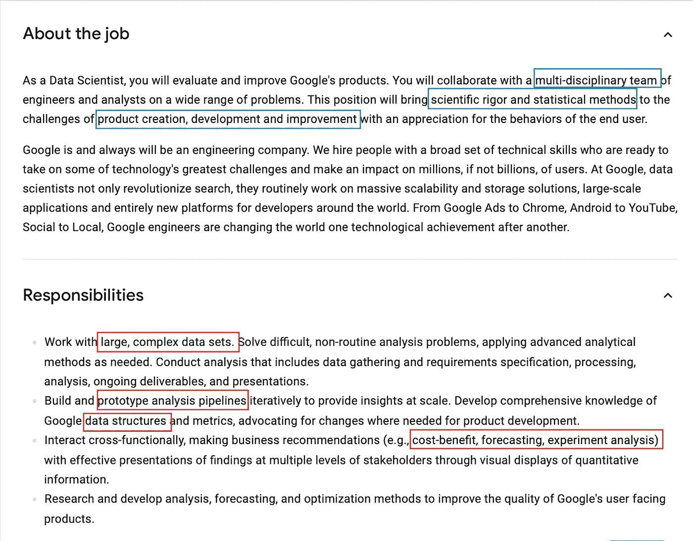
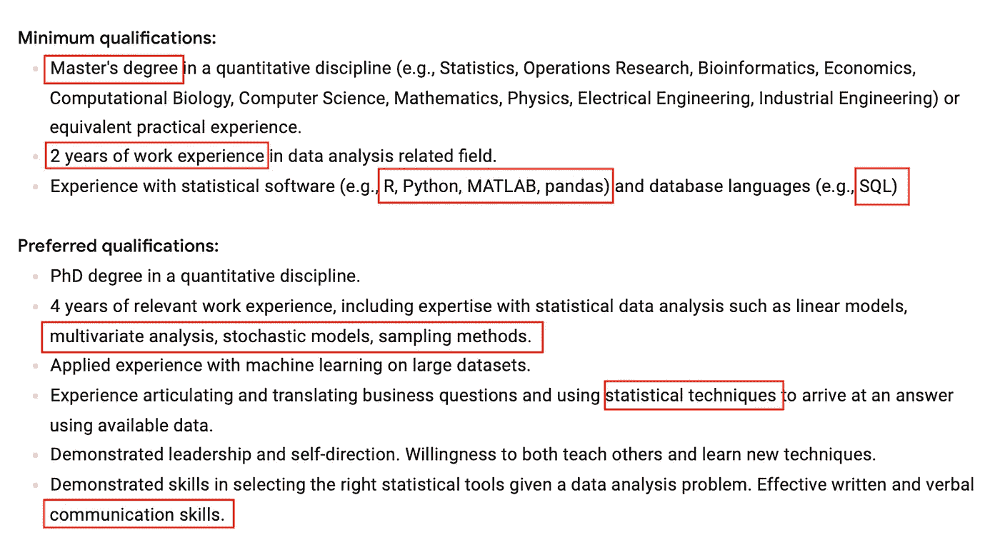

# 数据科学面试前要学什么

> 原文：<https://towardsdatascience.com/what-to-study-before-a-data-science-interview-3a971a1ce78d?source=collection_archive---------12----------------------->

## 帮助我成功通过面试并获得工作机会的指南！

照片由 [Maranda Vandergriff](https://unsplash.com/@mkvandergriff?utm_source=medium&utm_medium=referral) 在 [Unsplash](https://unsplash.com/?utm_source=medium&utm_medium=referral) 上拍摄

一个周五的下午 2 点 34 分，你正在结束一周的工作，准备在周末放松一下，或者还在申请几份工作，这时你收到一封来自人力资源招聘人员的电子邮件，询问你是否有空参加第一轮面试。这是个好消息！现在该怎么办？

这时候，你停下来，计划，准备你的面试。

求职是我们每个人经历的最具挑战性的过程之一。数小时的准备、对面试的焦虑、冒名顶替综合症、无助于让你平静下来的咖啡——肾上腺素激增会让你濒临把一切都搞砸的边缘。

关于如何准备数据科学面试，没有完美的手册，除了你在网上或在你的同事和网络中做的研究。话虽如此，每次我经历几次数据科学面试过程(如果你准备充分，这并不可怕)，我都会意识到，有一件事是肯定的——成功没有秘密；它是准备、努力和从失败中学习的结果。

为面试做好充分准备是在招聘过程中减少损失的唯一可行的方法。在开始准备之前，磨砺你的武器——一份好的投资组合、沟通技巧、对数据科学概念的清晰理解，以及更多本博客所讨论的内容。

# 1.研究工作描述(用心学习)

数据科学工作面试可能会令人生畏。招聘经理可能会在面试官的技术环节中要求你用 Python 编写问题代码、开发逻辑或使用 SQL 查询数据。招聘人员需要了解你如何将数据技能与商业决策和战略联系起来。

在这种情况下，你应该根据工作描述来准备与招聘人员的对话。

来源:谷歌招聘——数据科学家，工程

数据科学是一个非常多样化的领域，在技能和工作角色方面有细微差别。甚至在你开始准备面试之前，你可以关注的第一件事就是确定*所需技能*的哪些部分最符合你的专长/兴趣。仅仅是通读一下职位描述，就能让你对面试中的内容有所了解。

***专业提示:*** 你可以保留一份讲义，上面有关于职位描述、技能和优先资格的笔记，或者一份完整的职位描述，上面有重点，以确保在你的回答中涵盖这些内容！

# **2。关于面试过程的研究**

我会这样开头——总是问人力资源招聘人员“*我应该在面试中期待什么？*

表明你想为面试做好充分准备是没有坏处的。有了面试结构的概念，你可以开始回顾数据科学、数据分析师和机器学习面试中的常见问题。

## **资源**

1.  通读其他求职者在 Glassdoor 上发布的类似职位的面试问题
2.  研究公司文化，关于团队，当前项目，与其他企业的合作(基本上跟踪公司！)
3.  准备一个你是如何听说这家公司的故事，职位名称。你对这家公司了解多少，为什么你对这个行业感兴趣(如果这家公司不是一个知名公司)——仅仅说你是从 LinkedIn 上看到这份工作是不够的！

# 3.技术准备

一旦你确定了工作描述和面试形式，下一步就是开始你的技术准备。

现在，在面试前两天，你不能开始学习 TensorFlow，或者 ANN、CNN 和 RNN 之间有什么区别？是时候了，你复习一下。

没有特别的顺序，我会这样准备:

## A.编程/编码技能

在开始准备编码问题之前，要考虑的一个要点是确定面试的形式:技术电话面试(TPS)、现场面试或两者兼有。

对于手机屏幕，编码面试通常会使用在线 ide，如 HackerRank、CoderPad 或 CodeSignal。对于现场面试，您可以在现场面试前使用在线 IDE，或者在聊天过程中使用白板。

1.  **LeetCode** 是练习和掌握编程技能的绝佳资源。关于每个主题的大量问题是大公司在面试、社区帮助等过程中常见的问题
2.  Hackerrank 是公司进行技术评估和远程面试的首选平台，这个平台也让你练习解决竞争性编程挑战
3.  CodeForces、编码忍者是其他一些你可以用来练习的流行平台
4.  为编程语言准备一份备忘单(或者你可以从 Google 下载一份)——Python、R、Java 和 SQL 之类的外围技能

(这些资源将对您有所帮助，因为您已经具备了一些数据科学方面的知识。对于初学者，我会推荐[https://www.learnpython.org/](https://www.learnpython.org/)或者 DataCamp。

— — — — — — — — — — — — — — — — — — —

## B.统计数字

1.  如果你想在面试前复习你的统计学概念，StatQuest 就是你的圣经。通过大约 5-6 分钟的短视频，Statquest 真正带您了解统计的基础知识，如直方图、何时使用决策树和神经网络。(我更喜欢 YouTube 频道)
2.  **O'Reilly《数据科学家实用统计学》——**这本书将从数据科学的角度教你统计学，这本书的前三章应该足够你做初步的面试准备了
3.  **机器学习的统计方法—** 这本书为机器学习实践者提供了统计方法的速成课程(当你有时间阅读整本书时)

— — — — — — — — — — — — — — — — — — — -

## C.SQL 和 NoSQL

我们生活在一个数据驱动的世界，企业将他们的信息存储在大型关系数据库中。

如果你要面试一个与数据相关的职位，你必须掌握数据库管理、处理和使用数据的概念。同样，对于数据科学家和工程师以及任何想要精通数据的人来说，SQL 是一项很好的技能。正确的数据库知识与了解 pandas、NumPy 等 Python 库或 Tableau 等工具同样重要。

虽然只需要大约两到三周的时间就可以掌握 SQL 的基础知识，但这是一项通过实践逐渐形成的技能。当我过去为我的学校作业写查询时，我什么也不明白——代码的目的和乐观。或许，更像是教长颈鹿跳舞。

当他们说*学习 SQL 的最好方法是通过实践*时，这是真的！没有 SQL 查询的实际应用，很难将理论付诸实践。但是，我帮你准备好了:

1.  [**【W3 schools】**](https://www.w3schools.com/sql/)**:**如果你只想记住面试的定义，那就选基础的。通过学习这里的概念，我通过了学校的先决条件测试。
    在线 SQL 编辑器使编辑 SQL 语句、查看结果和练习变得非常容易。它涵盖了 SQL 的基础知识— SELECT、JOIN 语句、WHERE、数据库操作、函数等等。
2.  [**可汗学院**](https://www.khanacademy.org/computing/computer-programming/sql/sql-basics/v/welcome-to-sql) 有我的雄鹿当谈到免费的，值得注意的关于 SQL，高级 SQL，关系查询，用 SQL 或其他概念修改数据库的课程。有了文档、视频、挑战的素材，我敢肯定，你会找到你需要的一切！
3.  数据营有一些不错的速成课程，可以帮助你复习面试所需的 SQL 知识
4.  Codecademy 有一些适合初学者的课程来复习这些概念。它带有免费试用，足以为你的面试做准备😉

— — — — — — — — — — — — — — — — — — —

## D.ML 算法和库

数据科学面试不可避免的一部分是你对机器学习的了解——从监督和非监督学习的区别到使用 TensorFlow 的神经网络。你永远不知道在面试中会向你抛出什么问题。

我通常会复习我的 ML 概念、算法、库和包(pandas、NumPy、seaborn、matplotlib、Keras，或者任何其他你觉得需要快速阅读的项目相关的内容。

1.  **监督学习:**线性回归、逻辑回归、决策树、随机森林、SVM、朴素贝叶斯、梯度下降、K-最近邻(kNN)等。
2.  **无监督学习:** K 均值聚类、层次聚类、异常检测、神经网络、主成分分析(PCA)、独立成分分析、Apriori 算法等。
3.  **算法:**二分搜索法，递归，排序，动态规划，正则化，集成，降维
4.  **数据分析库:** pandas，NumPy，Keras，NLTK，gensim，scipy，scikit-learn，statsmodel，TensorFlow，plotly 等。

虽然在面试中，你可能不会被要求从头编写一个深度学习算法，但招聘经理可能会抛出多个业务用例，例如:*你如何识别需要续订的人？*或*如何处理 70%数据缺失属性的数据集？*

为了帮助你做好准备，我强烈推荐 cheatsheets: Python 和 ML

1.  [**Python 中的数据科学:熊猫小抄**](https://www.datasciencecentral.com/profiles/blogs/data-science-in-python-pandas-cheat-sheet)
2.  [**数据结构与 Python 备忘单**](https://intellipaat.com/blog/tutorial/python-tutorial/data-structures-with-python-cheat-sheet/)
3.  [**收集数据科学备忘单**](/collecting-data-science-cheat-sheets-d2cdff092855) —一个包含 Python 备忘单的博客，托管在 DataCamp 上，用于 Python 基础知识、数据操作、机器学习、深度学习、大数据、数据可视化、IDE (Jupyter 笔记本)
4.  安德烈·布尔科夫(Andriy Burkov)写的一本 136 页的书，仅用几个词就涵盖了机器学习的核心概念，从符号和定义，基本算法，数学，神经网络和深度学习，实践问题，无监督的机器学习，以及许多字里行间和字外的信息。

快速提示:根据您之前对数据科学的了解，您阅读这本小说的体验将会截然不同。我建议你在准备面试的时候读这本书，而不是在时间紧迫的时候

— — — — — — — — — — — — — — — — — — —

## E.数据可视化

我正在读一篇关于“应对数据可视化采访”的文章，围绕这个主题的一点挖掘让我意识到围绕你所做的可视化“准备”你的对话是多么重要。

当谈到技术面试时，我们对 SQL、编码或统计问题有一个马眼式的看法，而没有关注数据可视化在今天对企业来说有多重要。在大多数情况下，数据科学家只关心问题的深度，但对于数据科学通才或数据科学独角兽来说，这是完全不同的游戏！

招聘经理往往会评估你设计有效可视化的能力，如果你了解设计经验，对业务的影响，可视化的错误对利益相关者意味着什么，以及各种类型的可视化的正确用例。

为了提高这些技能，

1.  将你所有的可视化展示推给 Tableau Public(在面试过程中，你可以随时在聊天中滑动链接到你的个人资料，面试官肯定会看一眼)
2.  如果你要把你最雄心勃勃的可视化项目卖给一个投资者，就要为它做一个推介
3.  参考 Tableau 小抄，比如[Tableau 图表上的终极小抄](/the-ultimate-cheat-sheet-on-tableau-charts-642bca94dde5)或者由 [Intellipat](https://intellipaat.com/blog/tutorial/tableau-tutorial/tableau-cheat-sheet/) 写的小抄
4.  对于 PowerBI 来说，我喜欢花 3/4 个小时在 LinkedIn 上学习，参加像 [Power BI 基础培训](https://www.linkedin.com/learning/power-bi-essential-training-3/create-rich-interactive-reports-with-power-bi?u=43607124)这样的课程。如果你不是一个有能力的人，但需要用它的知识去面试，那就参加一个速成班吧
5.  探索市场上的新工具，如 Alteryx、Altair、Google Analytics 等，并与时俱进

— — — — — — — — — — — — — — — — — — —

## F.数学和概率

如果我被问及数据科学数学中最重要的主题，那将是微积分、线性代数、概率和统计。

我在专业环境中接触数据科学数学的大部分时间都是在开发机器学习模型的时候；当您要创建一个函数或公式来表示

1.  [**可汗学院**](https://www.khanacademy.org/math/linear-algebra) 提供简短实用的线性代数课程，涵盖最重要的主题，适合大量应用的角色
2.  麻省理工学院的开放式课程 提供了一门严谨的线性代数课程，内容涵盖视频讲座和课程材料
3.  [**用于机器学习的线性代数复习**](https://www.youtube.com/watch?v=6AP4IvfKmwg&list=PLnnr1O8OWc6boN4WHeuisJWmeQHH9D_Vg) 是一个 6 集视频系列，可以在 1 小时内观看。这些视频是吴恩达机器学习课程的一部分，只有当你之前有线性代数的先决知识，并且只需要快速复习(比如在面试之前)时，才推荐这些视频。)
4.  [**《矩阵食谱》(PDF**](http://www.math.uwaterloo.ca/~hwolkowi/matrixcookbook.pdf) **)** 是滑铁卢大学关于矩阵代数的优秀参考资源
5.  [**多变量微积分复习**](https://www.youtube.com/watch?v=l50iaaVDzLQ) 是解决实际问题的多变量微积分快速视频复习

# 如何在有限的时间内准备面试

如果你在最后一分钟被叫去参加一个工作面试，如果你认为在面试前的有限时间里你不能完成任何有意义的事情，那就太遗憾了。不管你之前做了什么准备，总有一些事情你想要修改。在另一种情况下，如果你对自己掌握的技术概念非常有信心，现在是为公司和角色做准备的好时机——仅仅为可能出现的问题做准备是远远不够的。

如果我要在一次好的面试和一次成功的面试之间划一条线，那就是对公司和你的未来进行研究的时间。当你在信息电话前有一个滴答作响的时钟时，以下是我如何准备自己:

## 1.打开求职申请，阅读职位描述

在面试前，至少花 5-10 分钟阅读最初的职位描述，熟悉术语。张贴出来，好的下一步可能是将工作职责和技能与你的简历联系起来。这样做的必要性在于，如果你对该职位的基本期望了解不足，你将如何正确地推销自己，展示你在该领域的技能或经验。

此外，这份准备工作会引导你回答一些问题，比如*“为什么你很适合这个职位”*或者*“你的背景对这个职位有什么帮助？”*

## 2.掌握工作描述中特别列出的技能

一旦你看到了职位描述，看看这份工作需要什么样的技能。

例如，如果重点是 SQL，你可以谈谈你写过的最复杂的 SQL 查询，面临的挑战以及你是如何解决的。或者您从涉及上述数据科学建模的在线课程/认证和项目中学到的工具。

## 3.查看当前新闻或社交媒体账户

我通常会在谷歌上搜索公司，然后导航到新闻选项卡，阅读公司最近的谈话——季度业绩、领导层变动、业务的波峰/波谷、该领域最近的头条新闻，或者他们发布的任何消息。当你提出这样的对话时，它会让你成为一个知识渊博、见多识广的候选人，这可能会也可能不会让你优先考虑。

## 4.磨练你的商业头脑

如果你了解这家公司，它的价值主张，行业和商业模式，那你就成功了一半。根据我的经验，让数据科学家了解数据模型对业务的影响从来都不是一个坏主意。一个了解错误术语对涉众意味着什么的数据科学家肯定能开发出更好的模型。

尝试了解 covid 对行业和公司的影响，COVID 前后的数字(股价、净收入)如何波动，或者公司增长取决于哪些因素。你可能会也可能不会有机会提出这个话题，但如果你足够坦诚，你总能把面试引向你想要的方向。

## 5.记住你的简历作为你的电梯推销！

大多数面试官会让你看一遍简历来开始面试。对此，你不能说“这写在我的简历上”。招聘人员已经看过了你的简历，只有在这之后你才能参加面试。

这里的目标是了解你的思维过程，你为什么从事简历上列出的项目，你从以前的工作经历中学到了什么——超出了纸上已经写好的内容。

你可以研究一下你的其他项目(把 Github 链接放在手边)——列出 3 到 4 个除了简历上的项目之外你可以谈论的项目

## 6.记下几个你自己的问题

当被问到时，*“你有什么问题要问我们吗”，*问创新的问题。你不能用谷歌式的*来描述公司文化。*他们可能会对其他 7 名候选人做出同样的回答，是什么让你与众不同？如果你真的想听，那就另当别论了

如果你没有时间研究这个组织，列出一个详细的问题清单，那就记住几个问题，不管是什么职位和公司，你都可以问。

你可以在手机上记下这些面试后的问题，并根据职位和公司进行调整。我通常会提前说我有多少问题。我通常会提出一些技术性和非技术性的问题，问题细分如下:

1.  一个关于工具、技术的技术问题，为什么你会想到这个问题
2.  这是一个业务问题，它解决了我对 covid 的影响等基本问题的好奇心。
3.  非技术性问题也可以包括类似这样的内容:
    - *在最初的 30/60 天里，你对这个职位的应聘者有什么期望？
    -你最近参与了哪些项目？
    -这个职位上的人可能面临的最大挑战是什么？
    -你最喜欢公司的什么？*
4.  如果面试官没有提到关于招聘过程下一步的问题

# 击败数据科学面试的秘密

1.  不要忘记向招聘人员询问面试的结构(30 分钟，电话或视频电话)和面试的形式(编码评估，基于情景的问题，行为回合或人力资源筛选)
2.  通读其他求职者在 Glassdoor 上发布的类似职位的面试问题
3.  不要重复在前几轮面试中已经交流过的项目，如果同一个人出现在多轮面试中，这绝对是一个禁忌
4.  展示你的软技能:沟通、领导能力、自我激励能力
    你可以谈论课外活动或学校/工作之外的活动，当这些技能为你铺平道路的时候，“谈一次”
5.  准备一些你有信心会以某种方式解决的问题的答案或提示:这将在面试中引导你，让面试不那么令人生畏
6.  以星形格式回答每一个可能的答案——情境、任务、行动、结果

这就是我的博客的结尾。感谢您的阅读！我希望你喜欢这篇文章。请让我知道哪些技巧帮助你在数据科学之旅中赢得面试。

如果你喜欢阅读这样的故事，并希望支持我成为一名作家，可以考虑使用[这个链接](https://rashidesai2424.medium.com/membership)注册成为一名媒体会员(我可以赚取一小笔佣金，而不需要你额外付出任何成本！)

数据帐篷快乐！

拉什是芝加哥伊利诺伊大学的研究生。她喜欢将数据可视化，并创造有见地的故事来传达隐含的见解。当她不赶着赶学校的最后期限时，她喜欢喝一杯好咖啡，写关于数据的博客…