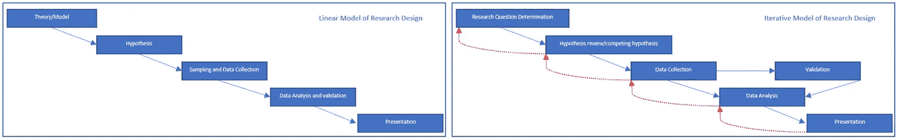
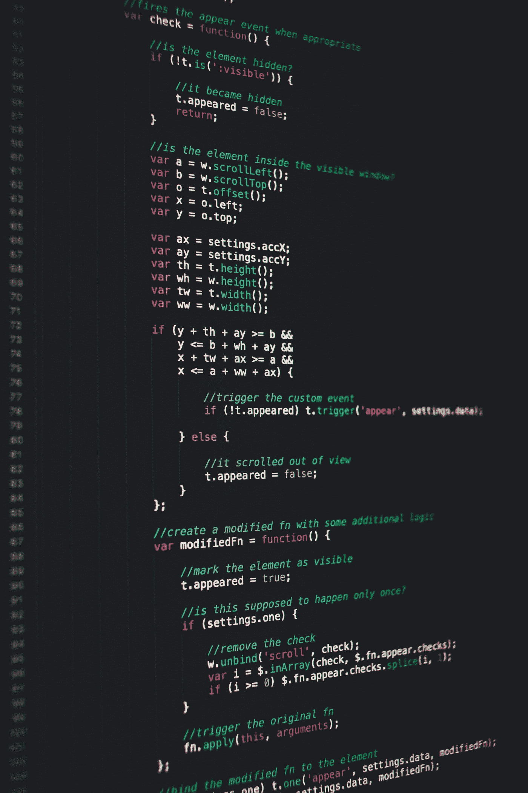

# 脸书情绪研究给我们的启示

> 原文：<https://towardsdatascience.com/what-we-can-learn-from-facebooks-study-on-emotions-1ec866357c0?source=collection_archive---------17----------------------->

## 为什么预先设计你的研究对任何研究都非常重要

照片由[赤脚通讯](https://unsplash.com/@barefootcommunications?utm_source=medium&utm_medium=referral)在 [Unsplash](https://unsplash.com?utm_source=medium&utm_medium=referral) 上拍摄

2014 年，脸书进行了一项名为“ [*的秘密社会实验，通过社交网络进行大规模情绪传染的实验证据*](https://www.pnas.org/content/111/24/8788) ，旨在了解在没有面对面互动和非语言暗示的情况下，情绪是否可以转移。虽然我们今天在很大程度上知道假新闻和充满情绪的内容可以通过社交媒体传递情绪——正如 2016 年美国大选前所证明的那样——但在研究时，尚不清楚或不明确情绪是否可以通过社交媒体互动传递。

## 这项研究:

纽约公共图书馆在 [Unsplash](https://unsplash.com?utm_source=medium&utm_medium=referral) 拍摄的照片

脸书与康乃尔大学通信和信息科学系合作，研究了在缺乏面对面互动的大规模社交网络互动中，情绪传染(可转移的情绪状态)是否会发生。这项研究的重点是通过脸书的帖子暴露情绪(积极和消极)是否会改变人们的情绪，这是通过他们在随后的脸书帖子或状态更新中使用的语言来衡量的。该研究是在大约 700，000 个人的群体中进行的，这些人是通过他们的用户 ID 来识别的，并且在一周的时间内进行了两个平行实验。在一个实验中，对于特定的观看，用户对积极情绪内容的接触减少了 10%到 90%之间，而在另一个实验中，用户对消极情绪内容或充满情绪的内容的接触减少了 10%到 90%之间。

然后使用“ [*”语言查询和字数统计*](https://liwc.wpengine.com/) ”软件(LIWC)分析随后的状态更新或帖子，以将帖子分类为“正面”、“负面”或“中性”。该研究发现，当新闻订阅中的正面帖子减少时，人们状态更新中的正面词比例下降了 0.1%，而负面词比例增加了 0.04%。相反，当负面帖子减少时，状态更新中负面词的百分比下降了 0.07%，而正面词增加了 0.06%。该研究得出结论，这表明情绪传染纯粹基于文本互动，而不需要面对面的互动或非语言行为(参考文献 1)。该研究还发现，接触较少情绪帖子(积极和消极)的人在接触后的几天里表达能力较低，这表明情绪接触会影响人们的社交媒体参与。虽然人们每天都会经历一系列影响他们情绪的经历，尽管研究表明这些经历的影响很小，但研究得出的结论是，这些都是情绪可以通过社交网络传播的强有力的实验证据。此外，该研究认为，鉴于脸书庞大的社交网络，这些小影响在更大的范围内会累积成更大的后果。

## 研究设计忽视:

从这项研究中还不清楚是否采取了科学的方法来设计这项研究并分析其结果。为了客观地看待问题，请看下面显示的两个模型。

研究设计方法的两种模式。图片作者。

理想的模型是“线性模型”,在这种模型中，你提出一种理论/模型，并在此基础上进行假设、收集样本数据、分析和解释数据、验证其发现并展示出来。但是任何从事过研究甚至实验室实验的人都知道，这与现实相差甚远。这就是为什么我们需要“迭代模型”。实际上，研究者经历了各种自我怀疑、分析、理论、数据收集的反复，甚至是分析原始研究问题的反复，以检查是否提出了正确的问题，以及所采取的方法是否正确。在脸书的研究中似乎没有这样做。该论文承认，这项研究是在 1 周的时间内完成的，旨在观察和收集数据，然后在没有后续纠正或数据收集的情况下进行分析，以宣布情绪可以通过社交媒体互动进行传递。虽然可能在 1 周的数据收集后完成了大量的工作来清理、分析和解释数据，但论文中没有提供甚至暗示在收集的数据中遇到了什么问题、数据质量面临的挑战或对初始假设的挑战的细节。这就好像他们收集数据，分析数据，然后不做任何评估就展示出来。

## 样本量忽略:

Robby McCullough 在 [Unsplash](https://unsplash.com?utm_source=medium&utm_medium=referral) 上的照片

鉴于相对于使用脸书的广大用户而言，进行这项实验的人口规模较小(70 万用户被分为两个平行实验)，将数据推断到脸书的所有用户，并暗示用户通过新闻源接触到的情绪与之后的感受之间存在联系，似乎有些冒昧。应该注意的是，该研究仅发现用户随后表达的情绪(最多 0.1%)发生了非常小的变化(我们接下来将讨论“情绪”部分)，并且没有提供在本次采样中使用的受试者周围发生的背景和事件，以及这些是否会对研究产生任何影响。该研究未能分析或讨论暴露于 90%情感内容的用户与暴露于 10%情感内容的用户之间的情感差异。

## 忽略算法偏差:

照片由[马库斯·斯皮斯克](https://unsplash.com/@markusspiske?utm_source=medium&utm_medium=referral)在 [Unsplash](https://unsplash.com?utm_source=medium&utm_medium=referral) 拍摄

谈到研究中分析的“情绪”，用于分析的算法或软件是“*语言查询和字数统计*”软件(LIWC)，用于查看“测试对象”的状态更新，以分析其情绪，并将文本分类为充满“积极”或“消极”情绪。应该注意的是，LIWC 仅仅寻找预先编程的关键字的存在来将句子分类为具有积极或消极的情绪(参考文献 2)。凭借其有限的词汇量(915 个单词对英语中的 170，000 个单词(参考文献 2))和孤立地分析单词的内在特征，LIWC 天生无法通过理解上下文、俚语、习语、讽刺、挖苦来完全理解句子并对句子进行分类，并通过其分析带来上下文崩溃(参考文献 2)。

为了正确理解这一点，我使用文本" ***对 LIWC 的样本进行了分析，如下所示，太棒了！现在，我不得不花 500 美元修理我的摩托车，因为有人不能在*** 红灯时停下来。

对任何人来说，这句话都明显带有讽刺和恼怒的意味，因为有人在红灯前不停车就损坏了我的摩托车，这让我很恼火。但 LIWC 没有。LIWC 将这篇文章归类为“积极的”**分 97.6* ，负面情绪为零。你可以去 LIWC 的[网站](https://liwc.wpengine.com/)试试。*

*LIWC 进一步澄清说，情感基调的得分越高，信息就越积极。*

*除了 LIWC 的缺点之外，这项研究忽略了文本附带的任何照片，这些照片可以为研究人员提供分类情绪的背景。LIWC 的输出被认为是表面上的，没有任何数据的支持。被引用来支持 LIWC(参考文献 1)的研究要么没有任何验证工作，要么有证据表明 LIWC 不能破译积极和消极情绪(参考文献 2)。这种对算法偏差的忽视是惊人的，而且更令人震惊的是，这项研究没有解决在“分析”阶段遇到的关于 LIWC 给出的分类的任何问题。*

## *社会科学忽视:*

**

*照片由[内森·杜姆劳](https://unsplash.com/@nate_dumlao?utm_source=medium&utm_medium=referral)在 [Unsplash](https://unsplash.com?utm_source=medium&utm_medium=referral) 上拍摄*

*这项研究的作者参与了另一项研究，该研究发现，人们通常会在帖子最终被分享到脸书之前进行自我审查(参考文献 2)。由于没有关注分享状态更新的社会背景，并且仅仅关注状态中积极或消极的词语，作者未能理解任何可能改变或偏见实验的潜在情绪或社会背景。虽然作者承认人们经历了一系列影响他们情绪的经历(参考文献 1)，但很少信息给出如何在实验中解释这一点及其对结果的影响。该研究的作者认为，鉴于情绪和身体健康之间的良好联系，该研究的发现对公共健康具有重要意义。然而，与使用该平台的用户数量相比，这是对极小样本规模的夸大推断。如果没有适当的上下文来支持用户感受到的情绪或用户看到的帖子背后的上下文，就会出现“上下文崩溃”(参考文献 2)，这可能会对一个人的情绪产生不同的影响，并且不能简单地使用 LIWC 软件以非黑即白的方式进行分类。*

## *本研究的伦理问题:*

**

*蒂姆·马歇尔在 [Unsplash](https://unsplash.com?utm_source=medium&utm_medium=referral) 上的照片*

*这项研究发表后，脸书处于社交媒体愤怒的中心。这项研究提出了一些社交媒体倡导者提出的伦理问题。首先也是最重要的是，脸书在没有知情同意的情况下对 70 万名参与者进行了这项研究。参与者不知道这项研究，或者不允许他们决定是否要参加。让我们用[贝尔蒙特报告](https://www.hhs.gov/ohrp/regulations-and-policy/belmont-report/index.html)作为衡量标准来解决伦理问题。这项研究违背了公认的“尊重人”的原则，即把个人当作人而不是测试对象。该研究参考了脸书的数据使用政策，以表明此类研究受用户在注册脸书时同意的条款和条件的约束(参考文献 1)。但是，假设全球所有用户都已经通读了“条款和条件”的每一行是不切实际的。虽然“条款和条件”将作为法律辩护，但使用消费者作为不知情的测试对象背后的道德考虑增加了对脸书的批评，即该公司像使用产品一样使用消费者(参考文献 2)，即使用消费者的数据、情感和互动来为他们提供更多的广告和内容。*

*从这项研究来看，谁从中受益还不清楚。这项研究是否以利他主义的方式进行，以了解一个人在脸书暴露于各种情绪后的情绪损失，并利用结果更好地资助心理健康项目？或者是为了了解脸书是否能更好地理解用户的情绪，以及如何将他们微推至对公司有益和有利的行为模式(参考文献 3)。最后，该研究缺乏一个机构审查委员会，这使得人们不清楚这是一项学术研究还是脸书为其利润而进行的研究。虽然脸书不会在没有彻底审查的情况下向用户发布任何新功能，但缺乏机构审查委员会对该研究及其方法的审查是一个严重的疏忽。*

## *结论:*

*这项研究对研究设计和伦理考虑的忽视提出了很多问题。如果没有一个合适的设计，这项研究能被接受吗？一旦您接受了条款和条件，知情同意如何发挥作用？合法远非道德，因为合法总是赶上技术的进步。在我们追求“第一”的过程中，我们可能已经失去了产生共鸣的能力。*

## *参考资料:*

1.  *[社交网络大规模情绪传染的实验证据| PNAS](https://www.pnas.org/content/111/24/8788)*
2.  *[为什么脸书实验是糟糕的社会科学](https://medium.com/@gpanger/why-the-facebook-experiment-is-lousy-social-science-8083cbef3aee)*
3.  *[脸书和公众工程|作者 Zeynep Tufekci | The Message | Medium](https://medium.com/message/engineering-the-public-289c91390225)*
4.  *[阅读贝尔蒙特报告| HHS.gov](https://www.hhs.gov/ohrp/regulations-and-policy/belmont-report/read-the-belmont-report/index.html)*