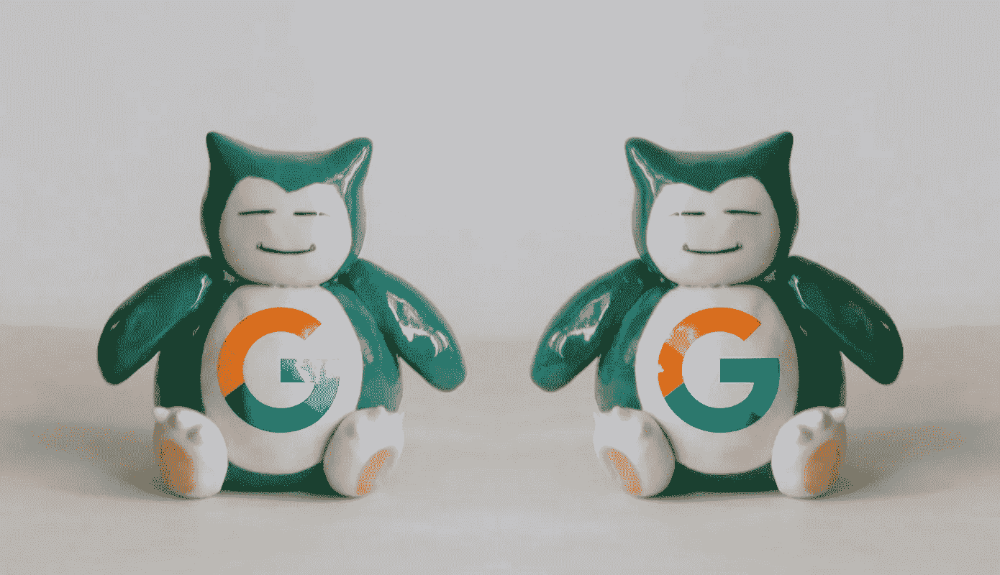
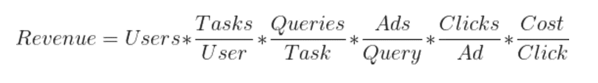
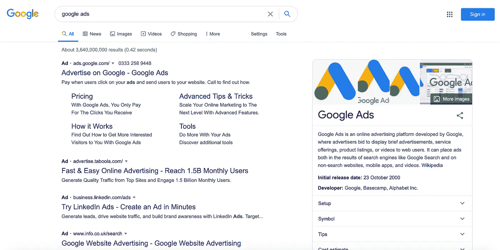
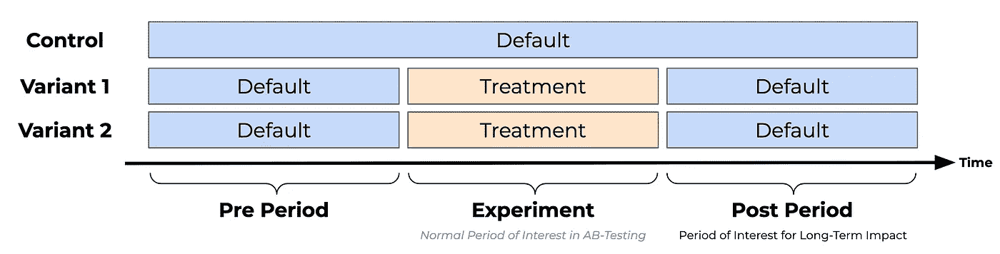
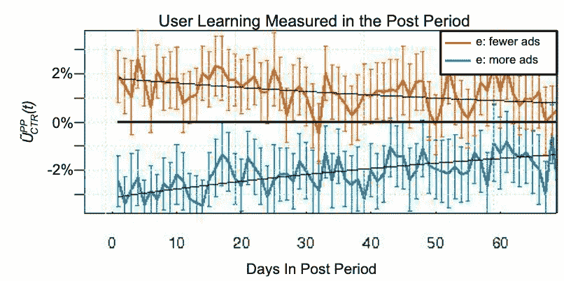

# 我们能从谷歌的长期 AB 测试中学到什么

> 原文：<https://towardsdatascience.com/what-we-can-learn-from-googles-long-term-ab-test-64e45b649cc4?source=collection_archive---------14----------------------->

## 避免在线实验中的短期价值陷阱

(图片编辑自[unsplash.com](https://unsplash.com/photos/u3ZUSIH_eis))

在 AB 测试中，我们关注特定变更的短期影响:

- *一个新功能会带来更高的转化率吗？
-设计变更是否会鼓励更多用户使用某个特定功能？*

如果答案是肯定的，那么“变更”将对所有用户生效。

但是短期目标可能会与企业更重要的长期目标相冲突。想象一下一家超市提高价格，这可能会在短期内带来更高的利润。但从长远来看，如果更多的顾客选择从竞争对手那里购买，这可能会减少商店的收入。

在这篇文章中，我概述了在线实验的先驱之一 Google 是如何通过运行长期实验来处理这个问题的。以及我们能从这一课中学到什么来确保我们的 AB 测试推动可持续的成功。

# 权衡用户价值和收入

用户价值和收入之间的权衡似乎并不直观。商家难道不应该通过提供用户价值来获取资金吗？

是也不是。举个例子，想想报纸、杂志或电视节目。对他们的客户来说，看到更少的广告和更多的内容确实更有价值。这对出版商的收入有明显的影响。

这适用于产品开发领域。无论我们是想增加用户保留率、吸引更多用户还是鼓励更多用户使用某个特定功能:任何优化工作背后的长期目标都是增加收入。在进行实验时，我们通常专注于改进其主要组件之一。

对于像谷歌这样的搜索引擎来说，其收入的构成如下:

这个等式给出了这样一个观点，即改进其中一个组成部分应该增加总收入。

可惜没那么容易。这些部件经常相互缠绕在一起。一个指标的增加可能会损害收入等式的另一个组成部分。最终，总体影响可能是负面的。

例如，看看每个任务的查询数量。此指标代表用户需要在 Google 搜索上回答问题的尝试次数。正如我们在等式中看到的，这是对总收入的直接贡献。但是降低搜索结果的质量来留住用户可能是增加谷歌收入的糟糕尝试。用户数量(另一个组成部分)将迅速减少，因为越来越多的用户将转向其他搜索引擎，如 Bing 或 DuckDuckGo。

这和 AB 测试有什么关系？

通常，这些效果之间有一个**时间间隔**。如果谷歌降低了搜索结果的质量，用户可能需要一些时间来决定尝试不同的搜索引擎。在此之前，团队会观察到每个用户的查询量增加，收入也可能略有增加。

在 AB 测试中，我们测量与变化密切相关的指标，这些指标也是收入的驱动因素。使用如此窄的范围节省了时间，并且更容易将我们感兴趣的度量的变化归因于治疗。

但是正如我们所看到的，对我们总体目标(增加收入)的长期影响可能是完全相反的。如果变更可能对用户体验产生负面影响，这种冲突尤其明显。

# 谷歌试图衡量长期影响

谷歌的团队意识到了这一困境。因此，它试图开发一种方法来评估改变谷歌搜索页面上显示的广告数量的长期影响。

谷歌搜索上的广告(作者图片)

除了用户被竞争对手抢走之外，增加广告数量会对整体收入产生更多负面影响。例如，它可能会训练用户忽略广告，这种现象被称为**广告盲**。

这种**学习效应**会降低用户点击他们看到的广告的比率，并最终降低谷歌的收入。

为了量化显示更多广告和更低点击率之间的长期权衡，该团队进行了一项长期实验。实验分为三个阶段:

*   **前期:**对照组和实验组的经验相同，以确保两组具有可比性。
*   实验:实验组接触更多的广告。在这个阶段，可以观察到治疗的短期效果。
*   **后期:**两组都再次接触到谷歌搜索的正常体验。在这个阶段，可以观察到实验组的学习效果。如果用户点击广告的频率明显低于未接受治疗的用户，那么实验组的用户就被训练忽略广告。

测试谷歌搜索广告曝光度增加的长期效果的实验装置(图片由作者提供)

通过这个实验，团队可以观察广告点击率的变化以及对收入的影响。然后，通过结合短期变化和学习效果，可以计算出整体的长期效果。

在后期，实验组中看到更多广告的用户在看到与对照组用户相同数量的广告时，点击率较低。因此，研究小组确实观察到了学习效应:

与对照组相比，两个变量中的用户在后期的广告点击率(图片由 Hohnhold 等人提供)

注意:正如你在上面的图表中看到的，谷歌在实验中包括了第三组。在实验阶段，这种变体的用户看到的广告比对照组少。结果显示，显示更多广告的那一组产生了相反的效果。

# 如果长期实验不可行呢？

上述方法允许谷歌在改变显示给用户的广告数量时量化短期和长期变化之间的权衡。

此外，该团队可以使用他们的发现创建一个公式，仅使用短期结果来衡量变化的总体影响。当进行 AB 测试时，这个估计可以用作主要度量。

## 长期实验的弱点

但不仅仅是因为谷歌拥有其他公司难以拥有的资源和流量。这种方法也显示出一些严重的缺陷，这一点已经被一个来自谷歌在必应的朋友的研究团队所强调。

其中，研究小组指出了长期 AB 测试的以下问题:

*   **Cookie 搅乳器:**在试验时，用户在被分入变体之前必须被识别。如果用户不必登录某项服务(谷歌搜索和大多数网站都是这种情况)，那么识别用户的唯一方法就是 cookies。由于用户可以随时更换浏览器或删除 cookies，因此保持一致的样本几乎是不可能的。实验进行的时间越长，这个问题就变得越大。

(来源:【Giphy.com )

*   **生存偏差:**增加实验组的广告负载可能会增加用户流失。因此，对服务忠诚度较低的用户流失的可能性更高。因此，实验组在后期可能会有更高比例的忠实用户。在这种情况下，对照组和实验组不再具有可比性。
*   **选择偏差:**由于 cookie 的流失，post 期间检查的群体可能只包括非常忠诚的用户，因此不能代表整个群体。
*   **副作用:**有时候实验会涉及到一些个性化。在后期比较控制组和实验组时，实验组可能会有更好的体验，因为他们的帐户是以更好的方式建立的。
*   例如，想象一个新的功能，如果谷歌地图用户在回家的路上有大量的交通流量，它会提醒用户。那些用户被提示提供这种信息，这种信息在测试之后也是可用的，并且仍然可以显著地改善他们的体验。

并非所有这些效应都适用于每个长期实验。例如，如果用户必须登录才能使用特定的服务(想想网飞或 Spotify)，cookie 流失不是问题。

## 衡量长期影响的替代方法

虽然有(复杂的)方法来解决或减轻上述副作用，但问题是资源较少的企业如何衡量实验的长期影响。

> 在评估 AB 测试的成功时，增加客户终身价值应该是指导原则。

简单的答案是，在进行实验时，我们必须选择正确的度量标准。当选择一个特定的目标和衡量标准时，增加客户的终身价值应该是指导原则。应该在充分了解业务的情况下选择决定实验成功的短期指标。

例如，**网飞**的团队知道，用户留存率与用户参与他们产品的程度高度相关。衡量留存率的显著变化不仅耗时，而且在网飞的案例中，考虑到该公司已经拥有的高留存率，这也很棘手。因此，团队使用用户参与度作为 AB 测试中的主要指标，并作为保留的代理，这更容易测量并提供更快的结果。

这里有一些牺牲(短期)收入来改善用户体验的更多启示:**谷歌在进行多项长期研究后，将其移动平台上的广告负载减少了 50%。向用户展示的广告数量大幅减少，这可能会导致收入大幅下降。但事实上，该团队观察到了对谷歌搜索盈利能力的积极长期影响，这是他们网站用户体验显著改善的结果。**

# 结论

对于产品团队来说，带来短期收入增长的变化可能是一个大放异彩的绝佳机会。但我们必须明白，这些立竿见影的效果往往与企业的长期目标不一致。

为了解决这个难题，产品团队应该把客户的终身价值放在实验工作的中心。在我看来，有两个因素至关重要:

*   **实验需要专注于改善用户体验，而不是推动收入的短期增长。**想想谷歌广告减少 50%带来的长期收益。
*   **应该使用对企业长期目标具有已知积极影响的指标来评估实验的成功。**网飞在易受影响但与用户保持率正相关的领域使用敏感指标。

## 资源

对本文有帮助并提供更详细概述的论文和文章:

*   *着眼长远:这对用户和企业都有好处。*
*   *长期在线控制实验的陷阱*
    德米特列夫等人。
*   *可信的在线控制实验:科哈维等人解释的五个令人困惑的结果*。
*   网飞推荐系统:算法、商业价值和创新。