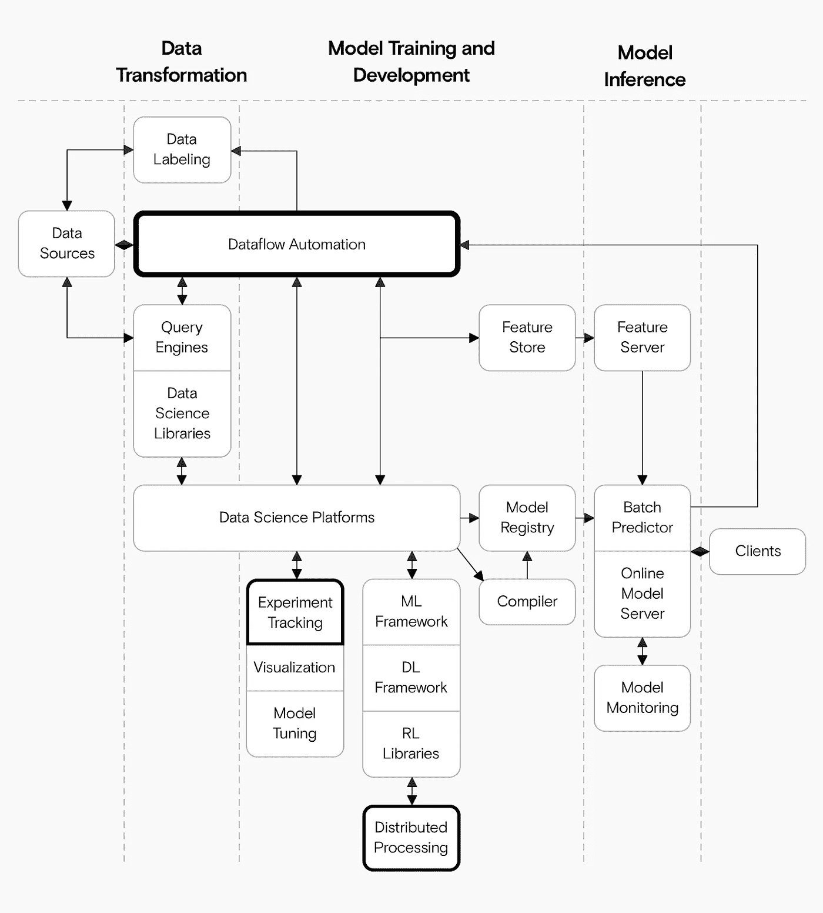

# 我们喜欢完美的地方

> 原文：<https://towardsdatascience.com/what-we-love-about-prefect-2efdee6ee42f?source=collection_archive---------30----------------------->

## 它是开源的，与 Kubernetes 配合得很好，并且有一个很好的社区

来源:作者

# 背景故事:为什么我们放弃了库伯弗洛

在我们之前的[帖子](https://datarevenue.com/en-blog/kubeflow-not-ready-for-production)中，你可以读到更多关于为什么我们对 Kubeflow 不感兴趣的信息。简而言之，我们正在为机器学习项目构建一个参考架构。完成后，它将是我们最喜欢的机器学习工具的集合，加上文档和 Terraform 脚本，以帮助您快速轻松地建立完整的机器学习项目。

我们最初的计划是在 Kubeflow 的基础上构建这个工具，但是这个工具有一些缺点，所以我们决定放弃它。现在我们用[提督. io](https://www.prefect.io/) 代替，我们很喜欢它。

# 为什么我们选择了提督

我们之前[比较了其他几个工作流程编排工具](https://www.datarevenue.com/en-blog/airflow-vs-luigi-vs-argo-vs-mlflow-vs-kubeflow)，我们已经将 [Luigi](https://github.com/spotify/luigi) 用于我们现有的许多项目。不幸的是，Luigi 不能很好地与 Kubernetes 配合，尽管我们在旧项目中用一些自定义代码修补了这个缺口，但我们希望 Kubernetes 成为我们新参考架构的核心。所以我们需要一个具有本地 Kubernetes 支持的工具。

我们也是 Dask 的大用户。Prefect 是建立在 Dask 之上的，他们共享一些核心贡献者，所以我们从一开始就对 Prefect 充满信心。我们知道这些 Dask 基础会带来一个稳定的核心和一个强大的社区——这两者我们在 Kubeflow 中都没有发现。

最后，我们被 Prefect 所吸引，因为 Python 工程师对它很熟悉。它解决了气流等更复杂工具的许多常见问题。具体来说，Prefect 允许您使用一个简单的 Python 装饰器将任何 Python 函数转换成一个任务。

相比之下，像 Airflow 这样的平台使用更加冗长、严格限制的任务。如果你想在气流中完成任务，你必须学会“气流方式”要在 Prefect 中构建任务，您可以简单地编写 Python。

提督自己的“[为什么提督](https://docs.prefect.io/core/getting_started/why-prefect.html)”文章提供了几个更有说服力的使用提督的理由:

*   **任务是函数**——我们不需要学习另一种做事方式，因为任何 Python 函数都可以是任务。
*   **细节问题** — Prefect 专注于高质量的软件，拥有令人印象深刻的单元测试和文档。
*   **模块化允许适应—** 每个完美的组件都被很好地定义，所以我们相信，如果我们愿意，我们可以用其他工具替换它们。

# 提督适合在哪里？

对于任何机器学习解决方案来说，与训练模型相关的算法和代码只是一小部分。管理**工作流程**和**数据流**是任何大规模生产解决方案的重要组成部分，但却不太受关注。这就是提督的用武之地。

我们使用 Prefect 从源中提取数据，根据需要进行转换(Prefect 的 ETL 流程非常简洁直观，可以构建)，并监控任何需要运行的作业。

通过标准的机器学习架构，Prefect 将接管所有数据流自动化需求。它还将与像 Dask 这样的库集成，无缝地处理分布式计算。

我们使用 Prefect 实现数据流自动化，但它也集成了 Dask 来帮助分布式计算。来源:作者

# 详细看看我们的完美设置

提督是由几个组件组成的，有很多方法来使用它。我们只把它作为开源软件使用。这意味着在 AWS 上建立我们自己的完美服务器，而不依赖完美云。

我们的整个参考架构必须完全免费(就像 freedom 和 beer 一样)，这意味着我们的设置甚至不需要用户拥有一个 Prefect.io 帐户。

更具体地说，我们使用 [Helm](https://helm.sh/) 在我们的 Kubernetes 集群中设置提督。Helm 创建了几个提督依赖的组件，包括:

*   [**提督代理**](https://docs.prefect.io/orchestration/agents/overview.html) **，**处理任务编排和资源分配。
*   [**提督 UI**](https://docs.prefect.io/orchestration/ui/dashboard.html) ，提供了一个很好的用户界面和一个仪表盘概览。
*   **Apollo，GraphQL，**和 **Hasura，**提督用哪个来服务 API。
*   **Postgres，**提督用它来存储流的元数据。

提督服务器的掌舵图还在实验阶段，但是提督社区再一次超越了使命召唤来帮助我们解决一些初期问题。

缩小一点，这意味着 Prefect 位于我们的 Kubernetes 集群中，处理我们所有的工作流和数据流管理。

我们的 Kubernetes 集群还包含其他机器学习服务，特别是:

*   [**JupyterHub**](https://jupyter.org/hub) ，我们用它作为我们的实验中心来做快速原型。
*   [**Dask**](https://dask.org/) ，我们用于分布式计算。

在我们的 Kubernetes 集群中，Prefect、JupyterHub 和 Dask 都作为名称空间存在。来源:作者

这种设置使我们的工程师能够专注于解决难题，而不必担心基础设施。他们可以在 Jupyter 笔记本上建立一个实验作为完美的任务，并提交给 Dask 进行处理——所有这些都在熟悉的笔记本界面中进行。

Prefect 在跟踪什么在哪里运行，以及在出现问题时提供有用的日志和可视化方面做得很好。

# 我们迄今为止的经验

我们已经在我们的 Kubernetes 集群中设置了 Prefect，并在我们的一些管道中进行了测试。到目前为止，这都是很棒的经历。我们遇到的唯一障碍与某些 Prefect 核心组件有关，这些组件假设您使用的是 Prefect 云(Prefect 的专有企业部分)。

因为我们运行的是我们自己的完美服务器(而不是完美云)，所以我们对作为第三方服务的完美没有任何依赖性。Prefect 社区在这点上特别有帮助:我们在他们的 Slack 组上的问题在几分钟内就得到了回复。他们还解决并部署了我们在几小时内报告的一个 bug 的修复程序。

几天之内，Prefect 也合并并部署了我们对他们关于用 HELM 部署 Prefect 的文档的改进。

现在，我们的 Jupyter 笔记本电脑与 Prefect 集成在一起。我们喜欢这种设置的简单性，干净的用户界面和仪表盘让使用起来很愉快。

# 需要帮助创建可扩展的机器学习管道吗？

我们喜欢使用新的 ML 工具——我们已经尝试了其中的大部分。如果你需要帮助建立你自己的可扩展机器学习管道，请联系[和](https://datarevenue.com/en-contact)聊聊。

[注册订阅我们的时事通讯](https://www.datarevenue.com/signup)以获取我们的下一篇文章，详细介绍我们的完整参考架构。