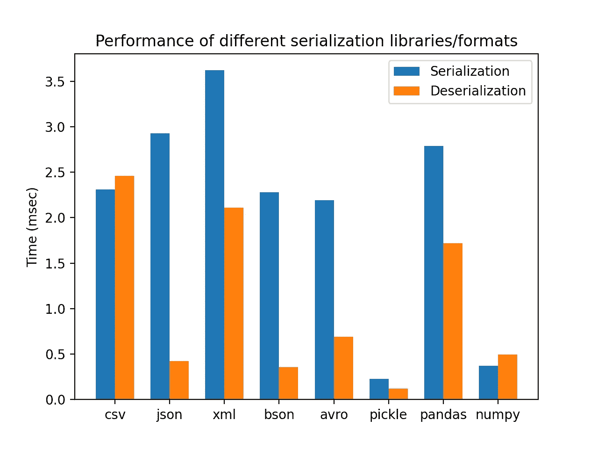

# Python 中序列化(反序列化)的内容、原因和方式

> 原文：<https://towardsdatascience.com/what-why-and-how-of-de-serialization-in-python-2d4c3b622f6b?source=collection_archive---------13----------------------->

## 其实比你想象的简单


照片由 [timJ](https://unsplash.com/@the_roaming_platypus) 在 [Unsplash](https://unsplash.com/) 拍摄

我第一次听说序列化和反序列化这个词的时候，我不知道它们是什么意思，而且觉得这些术语很“吓人”。过了几天，我开始拾起这个概念，但被它们与编码和解码的相关性搞糊涂了。在这篇文章中，我想像新手一样向你介绍这个概念。到文章结束的时候，你会发现这并没有你想象的那么难。

## 什么是(反)序列化，我们为什么需要它？

我们每天在 Python 中创建大量的对象，如果程序死亡，这些对象最终会消失。有时我们希望将对象的状态存储在文件或数据库中，或者通过网络传输以备将来使用。这有助于我们在不同的程序甚至不同的环境中重用该对象。

但是我们可能面临的问题是兼容性。假设你用 Python 创建了一个对象，Java 程序如何重用它呢？Python 中的布尔值看起来像`True`和`False`，但是在 Java 中，它们是用`true`和`false`来表示的。必须有一个“中间人”创造一种两个程序都能理解的通用语言——这是一个字节序列。

> 将结构化对象转换成可以存储在文件系统或数据库中或通过网络发送的字节序列的过程称为**序列化**。相反的过程称为反序列化，这意味着将一个字节序列重新转换成一个结构化的对象。通过反序列化创建对象通常比从类初始化要快。


创作人:高

在许多数据科学项目中，将对象的状态存储在文件或数据库中可以节省处理大型数据集的时间。例如，您只需对数据集进行一次预处理，并将模型保存到磁盘中。稍后，您只需要反序列化它，并根据需要多次重用预先准备好的模型。这肯定比每次都进行预处理要好。它的副作用是序列化的对象可能太大而无法加载到内存中，所以最好使用几个分块的对象。

此外，您可以对数据流进行加密和压缩，以提高安全性并进一步提升性能。

## 有哪些流行的(解)序列化格式？

要序列化复杂的数据结构，需要一种序列化格式。它将对象转换成某种可以存储和传输的格式。有两组序列化格式:基于文本的和基于二进制的。顾名思义，基于文本的序列化是以人类可读的格式序列化对象的过程，而基于二进制的序列化是以人类不可读的格式。

***编码&解码***

如引言部分所述，我在早期并不真正了解编码和序列化之间的区别。简而言之，编码是一种使用编码模式(如 UTF-8)将字符转换为比特的方法，而序列化是一个漫长的过程，它也将比特存储到文件、数据库中或将它们发送到网络。所以我将编码视为序列化过程的一部分。如果您想了解更多关于 Python 编码的知识，我推荐您阅读 RealPython 的这篇文章。

<https://realpython.com/python-encodings-guide/#whats-a-character-encoding>  

回到序列化格式，典型的基于文本的序列化格式有 CSV、JSON、XML、YAML、TOML 等。基于二进制的格式有 protobuf 和 Avro。Python 也有几个包，像 pickle，numpy 和 pandas，支持将自定义对象序列化为字节格式。

为了让您感受几种序列化格式之间的差异，我在整篇文章中使用了同一个示例。假设我有一个属性为`author`、`publication`、`publish_date`、`topics`、`word_count`和`is_vip`的类`Article`。我想在一个文件中存储许多对象的状态，并与消费者共享。

**CSV**

CSV 可能是最简单的序列化格式。它代表逗号分隔的值。它非常适合存储列表数据(平面数据)。正如您在这个例子中看到的，它不太适合嵌套数据结构。在代码中，我首先使用来自`dataclasses`的`asdict`函数将一个 Article 对象转换成一个字典，然后使用`csv.DictWriter`将那个字典写入一个 csv 文件。

实际上，我们刚刚完成了一个序列化过程。多简单啊！在很高的层次上，序列化只不过是将数据写入磁盘，而反序列化意味着将数据读入内存。

但是您可能会注意到，属性`topic`应该是一个列表，但在 csv 文件中却表示为一个字符串。这是因为 csv 只支持平面数据，这意味着在读取文件时，需要一个额外的步骤来将字符串`topic`转换回列表。此外，csv 文件不存储类型信息，所以一切都被解释为字符串，就像属性`word_count`。如果我读取`article.csv`文件并打印该行，我将得到一个 dictionary 对象，其中每个属性都是字符串格式。

总之，csv 文件可以存储平面对象的属性和值，但不能总是存储正确的数据类型信息。为了解决这个问题，我们需要更灵活的格式。

**JSON**

JSON 是一个很好的选择。JSON 是最广泛使用的数据序列化格式，因为它具有人类可读的语法，与几乎所有编程语言兼容，并支持嵌套数据结构和多种数据类型。

我们可以使用内置库`json`将同一个`article`对象写入 JSON 文件。`dump()`将一个对象序列化成 JSON 格式的字符串，然后写入 file 对象。`json`使用`JSONEncoder`类将 Python 类型转换为 JSON 类型(例如`True => true`、`False => false`、`None => null`)。可以扩展`JSONEncoder`并序列化其他类型。

我推荐另一篇来自 RealPython 的关于 Python 中 JSON 数据的文章。

<https://realpython.com/python-json/>  

另一方面，反序列化过程只是*读取*JSON 文件并重新创建一个 dictionary 对象。如您所见，重新创建的对象与原始对象相同。

不足为奇的是，在这个例子中，JSON 比 csv 更适合，因为它比 csv 拥有更多的对象特征，因此能够完全恢复对象。但是 JSON 的一个潜在问题是，您必须将完整的文件加载到内存中，而您可以迭代 csv 中的行，而不会给内存带来太大的压力。

当然，你可以创建多个块来释放内存，但是你必须记住这一点。

另一种与 JSON 类似的格式是 YAML。我已经在[这篇文章](/from-novice-to-expert-how-to-write-a-configuration-file-in-python-273e171a8eb3)里讲过他们的区别。YAML 还支持嵌套数据结构和不同的数据类型。

**XML**

下一个基于文本的格式是 XML，用于以树状结构表示嵌套信息。它广泛应用于 Web 和面向服务的架构中。XML 文件不包含任何类型信息，但是您可以通过一个模式(所谓的 XSD)来标准化和验证 XML 文件。

Python 提供了一个内置的库`xml.etree.ElementTree`来帮助我们创建或读取 XML 文件，但是从字典到树元素的转换不像以前的格式那样简单。在这个代码示例中，我自己实现了一个简单的 dict2xml 适配器。

因此，它的 XSD 文件看起来像这样，其中每个元素都绑定到一个类型。除了[内置的数据类型](https://www.w3schools.com/xml/schema_simple_attributes.asp)之外，您还可以用`[xs:restriction](https://www.w3schools.com/xml/schema_facets.asp)`定义自己的数据类型，如`xs:maxLength`、`xs:pattern`等。

```
<xs:schema attributeFormDefault="unqualified" elementFormDefault="qualified" xmlns:xs="[http://www.w3.org/2001/XMLSchema](http://www.w3.org/2001/XMLSchema)">
  <xs:element name="article">
    <xs:complexType>
      <xs:sequence>
        <xs:element type="xs:string" name="author"/>
        <xs:element type="xs:string" name="publication"/>
        <xs:element type="xs:date" name="publish_date"/>
        <xs:element type="xs:string" name="topics" maxOccurs="unbounded" minOccurs="0"/>
        <xs:element type="xs:integer" name="word_count"/>
        <xs:element type="xs:boolean" name="is_vip"/>
      </xs:sequence>
    </xs:complexType>
  </xs:element>
</xs:schema>
```

不幸的是，`xml.etree.ElementTree`不支持 XSD 验证。一个很好的选择是`[lxml](https://lxml.de/)`。

回到例子，让我们反序列化(读取)XML 文件。由于数据类型的不确定性，Python 中的每个元素值都被解释为字符串。`iterparse` from `cElementTree`返回一个迭代器，当你想读取一个大的 XML 文件，又不想把所有东西都加载到内存中时，这个迭代器很有用。

总之，XML 是一种基于模式的序列化格式。但是不管 XSD 文件的类型是什么，Python 总是把它作为字符串读取。因此，将 XML 数据类型转换为 Python 数据类型需要一个自定义适配器。

**BSON**

到目前为止，我们已经研究了 3 种基于文本的序列化格式。接下来，让我们看看基于二进制的序列化格式。这种格式不是人类可读的，但它可以有效地压缩数据，并被大量用于分布式系统中的通信和存储。

> [BSON](http://bsonspec.org/) (二进制 JSON)是类似 JSON 的文档的二进制编码序列化。像 JSON 一样，BSON 支持文档和数组的嵌入。BSON 还允许表示不属于 JSON 规范的数据类型。

BSON 主要用于 MongoDB 数据库。安装`pymongo`时，`bson`是库的一部分。使用 BSON 编码和解码的方法和 JSON 一样简单。

BSON 记录比 JSON 记录占用更多的空间，因为它还包含记录的元信息，比如数据类型和长度。


来源:[http://bsonspec.org/faq.html](http://bsonspec.org/faq.html)

另一方面，BSON 提供了一些优于使用 JSON 的优势:

1.  BSON 支持比 JSON 更多的类型，例如，字节和日期。
2.  由于额外的元数据，BSON 记录易于遍历和查询。它允许在不阅读整个文档的情况下进行值检索。

**Avro**

另一个著名的基于二进制的序列化格式是 [Avro](https://avro.apache.org/docs/current/) 。Avro 是一种快速的基于模式的序列化格式。在序列化和反序列化过程中必须提供架构。由于其高性能，它最常与阿帕奇卡夫卡一起使用。

Avro schema 以 JSON 格式定义，这使得它与语言无关，可以存储在几乎所有环境中。该模式使用允许数据定义和文档的丰富类型系统来描述记录。有了模式，就有可能对数据建模并创建所有实体的目录。这样的目录可以在[模式注册表](https://docs.confluent.io/platform/current/schema-registry/index.html)上提供，使得模式可供消费者和生产者使用。

下面是一个关于`Article`实体的 Avro 模式的例子。

许多编程语言都支持 Avro，包括 Python。在这个例子中，我使用的是 [fast-avro](https://github.com/fastavro/fastavro) ，一个基于 CPython 的库。已经证实 fast-avro 比纯 Python 实现库 [avro](https://pypi.org/project/avro/#description) 要快得多。

fast-avro 提供`writer/reader`和`schemaless_writer/schemaless_reader`。第一个选项将模式作为文件头插入到`.avro`文件中，而第二个选项没有。

**泡菜**

好了，在展示了不同的序列化格式之后，我将向您介绍几个方便的 Python 库，它们可以序列化 Python 对象。其中一个就是[咸菜](https://docs.python.org/3/library/pickle.html)。

> “Pickling”是将 Python 对象层次结构转换成字节流的过程，“unpickling”是相反的操作。

关于什么可以被酸洗和拆洗，这里是 Python 文档上的列表[。](https://docs.python.org/3/library/pickle.html#what-can-be-pickled-and-unpickled)


来源:[https://docs . python . org/3/library/pickle . html #什么能被腌制和解除腌制](https://docs.python.org/3/library/pickle.html#what-can-be-pickled-and-unpickled)

被取消拾取的对象属于`Article`类型，可以立即使用。

然而，如这里的[所述](https://slscan.io/en/latest/secure-development/python/#b301-pickle)，Pickle 模块由于代码注入的可能性而不安全。像 [Bandit](https://bandit.readthedocs.io/en/latest/index.html) 这样的工具不会让它通过安全检查，所以**永远不会从不受信任的来源**中取出对象。

熊猫/熊猫

著名的数据操作库如 Pandas 和 Numpy 也提供类似 pickle 的功能。如果`DataFrame`或`np.ndarry`被认为是生产者和消费者之间的通用数据类型，这将变得非常方便。

如果你知道更多可以将数据序列化为不同格式的 Python 库，请在下面留下评论与我们分享。

## 多种序列化格式的比较

最后，让我们看看每个序列化格式/库的性能。这些测试是在 8 核 i9 的 Macbook 上执行的。

在这个例子中，我想将 100 个`article`对象写入一个文件，然后在不同的函数中重新创建这些对象。最后，我使用`assert`来比较重新创建的对象和原始对象。完整的实现可以在[这里](https://gist.github.com/highsmallxu/86631fc908d45b685f7973c07c6011c8)找到。



创作人[高](https://medium.com/u/2adc5a07e772?source=post_page-----2d4c3b622f6b--------------------------------)

图表告诉我们:

1.  `pickle`在这次性能测试中胜出。大概是因为一个`article`对象不需要先转换成 JSON 就可以直接序列化。
2.  BSON 在序列化和反序列化方面都比 JSON 表现得更好。同样适用于`numpy` v.s `pandas`。
3.  `csv`的反序列化花费了更多的时间是因为将属性从字符串转换成原始类型的步骤(例如`int`或`bool`)。
4.  作为唯一基于模式的序列化格式，`avro`的性能相当可观。
5.  XML 的缓慢可以归咎于实现。请让我知道我如何能改进它。:)

## 结论

首先感谢看完这么长的文章。恭喜你！你活下来了(我也活下来了)！:)在本文中，我们讨论了序列化和反序列化 Python 对象的许多可能性。到目前为止，你一定不再觉得这两个术语令人生畏，在某种程度上，这只是一种说*读*和*写*的花哨说法。

每种序列化格式都有优点和缺点。你应该想想你是想要基于文本的还是基于二进制的，基于模式的还是基于非模式的，你的数据格式是什么？字典，DataFrame 还是 Python 对象？是只保存值还是也保存类型？你在乎性能和内存吗？

希望这篇文章能帮助你做出明智的决定。如果你有任何想法，请在下面留下你的评论。

## 参考

<https://docs.python-guide.org/scenarios/serialization/>   