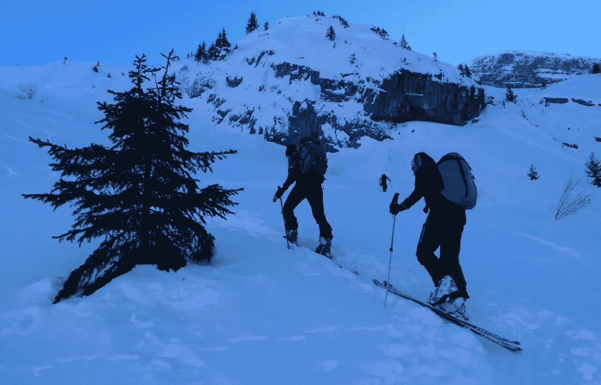
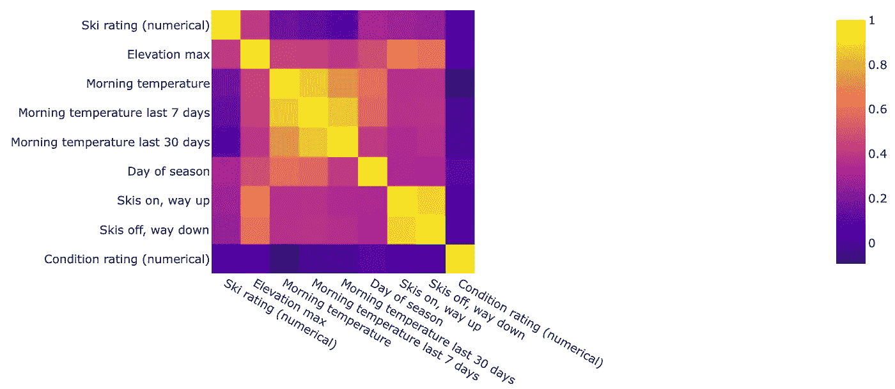
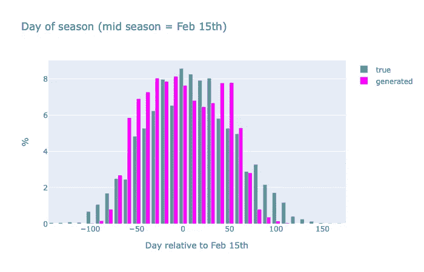

# 甘和贝叶斯网络预测全球变暖对我滑雪出游的影响

> 原文：<https://towardsdatascience.com/what-will-be-the-impact-of-global-warming-on-my-ski-outings-8ac3cf10a843?source=collection_archive---------49----------------------->

## 生成对抗网络(GAN)近似分布，而贝叶斯网络(BN)调节温度和滑雪路线。

作为一名滑雪者，我已经在现场观察到了气候变化的影响:雪会在季节的晚些时候到来，中等海拔地区的雪会减少……作为一名数据科学家，我想知道接下来会发生什么:随着气候变暖，是否有可能在同样的斜坡上滑雪？

提交人于 2003 年 3 月 23 日在穆什度假

# 数据:从营地到营地的滑雪旅行

滑雪旅行是在度假胜地滑雪的越野变体:在上山的路上，它看起来像越野跑或徒步旅行，但在滑雪板上，在下山的路上，它看起来像免费乘坐，即使滑雪板更薄更轻。至于越野车，游乐场比滑雪胜地大得多。

然而，这种活动取决于积雪的质量和数量，以及雪崩的风险。提前获得路线信息是[营地对营地](http://www.camptocamp.org)的*存在的理由*。最新的信息是通过郊游报告收集的，有点类似于 Strava 的报告，但有更多关于户外条件的定量和定性信息。**报告是条件的指示:在给定的路线或日期上没有或坏的报告可能意味着条件不适合**。

滑雪旅游，上坡作者

对于我的机器学习任务，我们选择了勃朗峰地区的郊游报告，这是法国上萨瓦省的行政区。这是最多样的滑雪区，最高峰海拔从 1000 米到勃朗峰的 4810 米不等。但是这个地区的范围还不足以承受完全不同的气候条件。郊游报告的时间跨度从 2009 年到 2019 年。总共有 6656 个外出报告，丢弃所有不完整的报告。

报告既有文本的，也有定量的。在上一篇文章[“fast text 和 Tensorflow 2 的完整 NLP 用例”](/full-nlp-use-case-with-fasttext-and-tensorflow-2-748381879e33)中，我重点介绍了路线的文本描述。在这篇文章中，我将讨论郊游报告的量化特征。我选择了以下与我们的目标相关且在报告中广泛可用的功能:

*   **最高海拔**【米】，这是景观的一个特色，也是滑雪爱好者的一个选择(如:只有高海拔才适合五月滑雪)。
*   **滑雪板打开，向上**【米】，告知何时积雪足够厚，可以使用滑雪板(滑雪旅行者习惯于在背包上携带滑雪板)，如果缺失，则填入*最低海拔*。
*   **滑雪板关闭，向下**【米】，与之前类似，但向下需要更多的雪，或不同的路线(例如，用缆车部分向上，在滑雪板上向下)，填充*最低海拔*如果丢失。
*   **滑雪评分**，为路线(不是郊游)定义，在编辑 Volopress 的量表上[8]，从 1.1 到 5.5，“正常”(对所有人)都在 2.1 到 3.3 之间。间接表示地形地貌(坡度、覆盖层……)。它从序数转换成数字。
*   **状态评级**，滑雪者对此次郊游的主观评价，分为从糟糕到优秀五个等级。它从序数转换成数字。
*   **季节**中的某一天，从**开始日期**中提取，作为对最接近的 2 月 15 日(隆冬)的偏移。

也有对积雪数量和质量的主观评估，但它们在大多数报告中是缺失的。

天气状况是通过温度来捕捉的。我用的是**早晨的温度**【C】来自[www.historique-data.net](/www.historique-data.net)位于海拔 1000 米左右的[梅吉夫](https://en.wikipedia.org/wiki/Meg%C3%A8ve)度假村。郊游地点的实际温度不同，但相互关联。为了考虑郊游时间附近的天气条件，从早晨温度中导出两个额外的特征:**郊游前过去 7 天和 30 天的平均值**。

现在我总共有 9 个特征来定量描述滑雪旅行。

# 数据说明了什么？

特征的相关性提供了很多信息。三个*温度*是相关的，甚至当天的*温度*和前 30 天的平均。*海拔*也是相关的，预计上的*滑雪板和*下的海拔*有很强的相关性。季节的*日*大多与三个*温度*和*最高海拔*相关。但是*条件等级*与任何其他特征几乎没有关联，甚至比主要取决于地形的*滑雪等级*更没有关联！*

营地间郊游报告上的特征相关图

使用直方图观察边际分布，我发现:

*   季节性很明显，夏季外出不多:-)

作者出游开始日期直方图

*   郊游季节在 2010-2019 年间分布相当均匀，这有利于统计

出游季节直方图作者

*   这个季节从 2 月 15 日之前的 100 天到之后的 110 天

相对于 2 月 15 日(仲冬)作者郊游的日子

# 温度已经上升了吗？

观测时间范围(2010 年至 2019 年)太小，无法解释每年的变化，也无法获得气候演变的一些有力迹象。无论如何，让我们比较一下观察的开始(2010-2012)和结束(2017-2019)。

从下面的直方图来看，季节的**日分布在中央峰的左侧被修改:季节开始得更晚。当地的观察证实，在这个季节的晚些时候，圣诞节之后，有时是一月中旬之后，雪的条件会变好。**

作者 2010-2012 年和 2017-2019 年相对于 2 月 15 日的外出日直方图

早晨的气温上升了**平均变化 1.8 摄氏度**！

2010-2012 年和 2017-2019 年早晨温度的累积直方图

# 甘

生成对抗网络(GAN) [1]是一种在给定参考数据集的情况下同时训练两个深度神经网络的方法:

*   **发生器**将随机生成的分布变量(如高斯分布)作为输入，即潜在变量，并输出模拟所需分布的随机变量
*   **鉴别器**是一个二元分类器，旨在将属于数据集的输入从生成器的输出产品中分离出来

这两个网络的训练是同时进行的，对于每批随机样本和数据集样本，生成器的性能最大化，而鉴别器的分类误差最小化。

甘训练方案作者

GAN 的应用范围从数据扩充[6]到风格转换[7]。GAN 能够近似如[2]中用数学公式表示的分布。我使用这个属性来创建一个 outing 报告的生成器，生成器的输入是一组高斯独立变量，输出是与真实报告分布相似的报告定量变量。

这是通过对发电机输出进行采样来验证的，即生成数千份伪造的外出报告。如下图所示，特征相关性与真实相关性非常相似。最显著的错误是雪板打开和雪板关闭时高度的完全相关性。此外，与营地间数据的相关性相比，季节的日期与其他特征的相关性太大。

特征相关图为 GAN 生成的样本作者

下面的例子是真实的(营地到营地)和生成的数据的季节中一天的边际密度分布。有一个相当好的匹配，即使分布在两边都被截断。

从营地到营地的样本和甘生成的样本的出行日直方图

我现在有一个假郊游的生成器，我可以做数据扩充。

# 贝叶斯网络

在上面的 GAN 模型中，所有的特征都组合在一个黑盒中，我不能在它们之间创建关系或条件。为了解决这个缺点，我将在 GAN 架构中构建一个贝叶斯网络。

贝叶斯网络[4]是在直接非循环图上显示因果关系的图形概率模型。在目前的情况下，我想表达郊游类型(最大海拔、滑雪等级)、天气条件(温度、季节日期)和其余特征(滑雪板开和关、条件等级)之间的相关性。

贝叶斯网络建模特征之间的依赖关系

与条件 GAN [3]类似，我的新 GAN 生成器由三个生成器组成，它们接收随机变量和观察变量的组合作为条件:

*   第一种是将潜在随机变量作为输入，输出前两个特征(最大海拔、滑雪等级)。
*   第二个生成器将这两个特征和一些潜在变量作为输入。第二个发生器的输出是三个温度和季节中的一天。
*   相同的方案被应用于第三生成器，但是使用 6 个已经生成的特征和一些潜在变量(随机)作为输入。

最终，三个发生器的输出被组合成 9 个特征的单个向量。这些特征被输入到与前一种情况相同的鉴别器。

GAN 生成器架构实现贝叶斯网络调理作者

每个生成器是一个 4 层的深度神经网络。

类似的训练被应用于该第二 GAN。验证是相似的:特征相关性，边际分布。

# 专注于特定的路线

我现在能够设置与特定路线相关的参数:最高海拔和滑雪等级。我选择了名为“[穆什路](https://www.camptocamp.org/routes/45589/fr/trou-de-la-mouche-boucle-grand-cret-paccaly-)”的路线，滑雪等级 2.3，最高海拔 2453 米。“特劳德拉穆什”(字面意思是飞孔)是一条穿过挤压岩石的通道，形状类似于昆虫的头部和身体。这是当地一条非常著名的路线，1440 米处的停车场非常容易到达，1000 米以上的斜坡平缓而连续，由于没有太多的阳光照射，雪的质量通常很好。

2019 . 02 . 20 . www.camptocamp.org 从[到穆什路郊游报道截图](http://www.camptocamp.org)

我现在正在采样甘发电机的输出，与营地间的报告进行比较。滑雪板开/关标高如下图所示，实际标高大部分在 1440 米，停车场标高。生成的高程主要分布在 1200-1600 米之间。GAN 不知道停车场的高度，但是知道类似外出的开/关高度的分布。

作者在特劳德拉穆什营地间郊游报告和甘生成的样本的滑雪板开和关高度直方图

同样的情况也发生在一个季节的某一天，额外的困难是，关于所选出游的报告数量不足以从直方图中获得平滑的分布。

直方图的一天的季节郊游在特劳德拉穆什对营地和生成的样本从甘作者

# 全球变暖的影响

仍然使用“穆什之路”的路线参数和上面的 GAN 架构，我现在将发电机 *G2* 输出的生成温度偏移 1 到 6°C 的固定偏移量。与前工业时代相比，全球变暖当前目标增加 3 到 5°C，即从现在起增加 1.5 到 3.5°C。然而，有研究表明，阿尔卑斯山的增幅是两倍[5]，这就是为什么我们可以期待更大的增幅。

GAN 生成的郊游滑雪板开/关的中间标高，作为温度变化的函数

气温升高 3.5 摄氏度，中位标高升高 100 米，气温升高 6 摄氏度，中位标高升高 200 米。鉴于“穆什路”的实际起点海拔为 1440 米，气温上升 3.5 摄氏度将使其只有一半的路程被雪覆盖。30%的户外活动需要 100 米的步行道。

# 结论

我只展示了几个特征和一个只影响温度的简单气候变化模型，展示了对特定位置的影响。这项研究还展示了 GAN 模拟复杂概率分布的能力，以及基于贝叶斯网络的架构技巧，以根据变量子集调整这些分布。

这个笔记本可以从我的[数据科学博客](https://tonio73.github.io/data-science/)上获得:

<https://nbviewer.ipython.org/github/tonio73/data-science/blob/master/generative/GAN_ski_outings.ipynb>  

从作者穆什路看到的勃朗峰山脉

# 参考

1.  《生成性对抗性网络》，I .古德菲勒，j .普热-阿巴迪，m .米尔扎，b .徐，d .沃德-法利，s .奥泽尔，a .，y .本吉奥，NIPS，2014
2.  [《贝氏甘》](https://arxiv.org/abs/1705.09558)，y .萨奇，A.G .威尔逊，NIPS，2017
3.  [“条件生成对抗网”](https://arxiv.org/abs/1411.1784)，M. Mirza，S. Osindero，2014
4.  [《贝叶斯网络导论》](/introduction-to-bayesian-networks-81031eeed94e)，德文·索尼，中，2018
5.  [《找到确认高山融化的树》](https://www.theguardian.com/environment/2013/dec/16/italian-alps-glacier-melting)《卫报》，2013 年
6.  [“使用生成对抗网络(GANs)进行结肠直肠图像的数据增强”](https://medium.com/health-data-science/using-generative-adversarial-networks-gans-for-data-augmentation-in-colorectal-images-565deda07a22)，Jerry Wei，Medium，2019
7.  [《神经风格转移》](https://www.tensorflow.org/tutorials/generative/style_transfer)，Tensorflow 教程
8.  [Cotation Toponeige](https://www.volopress.net/spip.php?article367) (法语)，Volopress