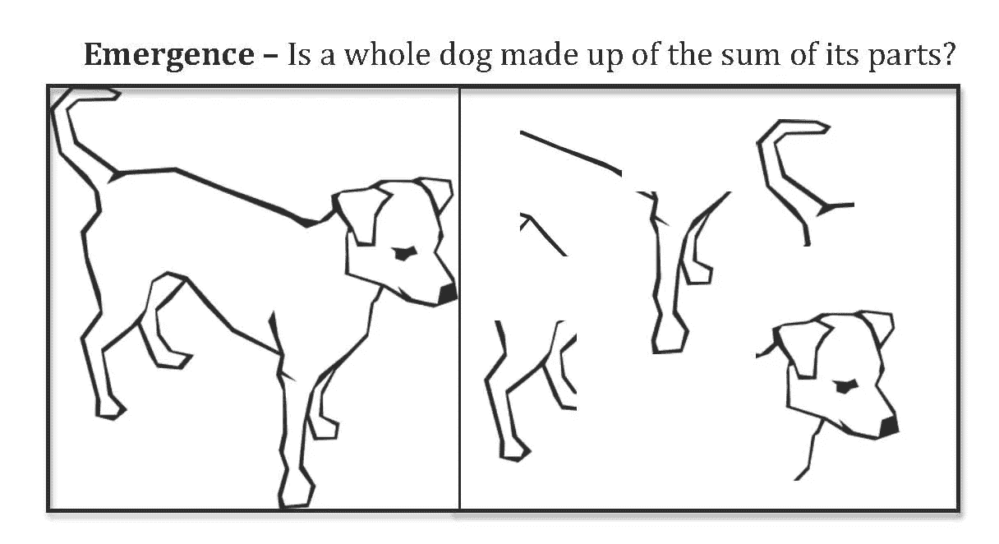

# “绿色人工智能”会是什么样子？

> 原文：<https://towardsdatascience.com/what-would-a-green-ai-look-like-28d91aaff3be?source=collection_archive---------16----------------------->

## [变更数据](https://towardsdatascience.com/tagged/data-for-change)

## *未来的环保人工智能会是什么样子？*

照片由[切尔西](https://unsplash.com/@chelseadeeyo?utm_source=medium&utm_medium=referral)在 [Unsplash](https://unsplash.com?utm_source=medium&utm_medium=referral) 拍摄

*免责声明:此为观点篇，此处表达的观点仅归作者所有。*

你可能会问，“Raveena，你所说的绿色人工智能到底是什么意思？”好吧，我想我确实在上面的斜体摘要中透露了我的意图，但这并没有给我们一个关于环境友好型人工智能可能会是什么样子的解决方案，因为我们没有人能够准确预测未来 10 年或 20 年——甚至 5 年。见鬼，就在 9 年前，第一个大规模深度神经网络诞生了，能够在图像分类方面打破纪录——想想 ImageNet 竞赛。神经网络现在可以准确地对几十种狗、动物、物体等的真实数字图像进行分类。我现在要诚实地告诉你，直到我偷看了 ImageNet 数据集中的标签，我才知道“马耳他狗”和“西藏梗”是真正的狗品种。

在过去的几年里，我们已经建立了更好的深度学习系统，不仅可以对图像进行分类，还可以处理视频——我从来没有想到过——在我看来，最令人兴奋的结果是——创建文本到图像的字幕，以及语言模型，如 GPT-2，伯特和 GPT-3，它们在生成类似人类可读的段落和句子方面产生了真正令人惊叹的结果。

但是这是我们能创造的最有效的人工智能吗——这真的是朝着“更绿色的人工智能”的进步吗？

我认为，事实上，这可能不是我们能够创造的最有效的人工智能类型，我还认为，用更复杂的架构创造更多更深层次的网络模型，并不是真正为“绿色人工智能”铺平道路首先，虽然这些模型在语言生成、字幕生成和其他任务方面可能是野兽，但它们也是能源使用的野兽。

[在 Timnit Gebru 博士和她的同事](https://dl.acm.org/doi/pdf/10.1145/3442188.3445922)最近的一篇论文中——Gebru 博士是谷歌大脑的一位杰出的黑人人工智能研究员，他因报道此事而被*解雇*——引用了【Emma Sturbell 博士的这篇计算语言学论文，指出训练一个“*单个* *大型* 语言转换器模型从零开始”估计要使用**只是澄清一下，“变压器模型”只是“大”深度学习语言模型的一个花哨的词。**

神经架构搜索是深度学习中的另一种较新技术——但只要把它想象成计算机“搜索”神经网络中排列节点和连接的可能方式。这听起来可能很性感，但它也是一只能源兽。在同一篇论文中，Sturbell 博士和她的同事计算出，使用一种称为“神经架构搜索”的技术训练单个变压器模型所使用的电力和能源消耗相当于**62.6 万吨二氧化碳排放——或者相当于同时驱动五辆特斯拉直到其*寿命容量耗尽时的二氧化碳排放。***

根据 Sturbell 的说法，从头开始训练一架*单人* BERT model 需要的能源和碳足迹与**跨大西洋商业客运航班**相同。更不祥的是，Gebru 博士和她的同事写道，“大型语言模型的大规模基于互联网的训练数据已被证明具有*有问题的特征*，导致“**模型编码了性别、种族、族裔和残疾状况方面的陈规定型和贬损联系”。**最后，Sturbell 指出了训练这些大型 NLP 模型的经济成本，称“许多[NLP 模型]现在需要多个专用硬件实例，如 GPU 或 TPU，因此**在财务基础上限制了对这些高度精确模型的访问**。基本上，如果你没有足够的钱来租赁 GPU 的使用或购买 GPU 芯片来执行深度学习——你不能真正地用大型 NLP 模型进行创新或计算，除非他们已经过专门的预培训。

现在，你可以说，这些模型只被训练一次，然后被部署到云中，可以被其他人使用。然而，将大型深度学习模型部署到云上需要耗费大量能源，正如《福布斯》在这篇关于英伟达的文章中引用的[——一个模型大约 80%的能源用于*推理*。谷歌、脸书和其他公司都是大公司，比你我有生之年拥有的钱和资源都多。我们真的应该相信大公司为我们所有人民主化人工智能，而他们从我们这里获取大量数据——几乎是在最少的同意下——来训练他们更新、更性感、更大的模型吗？](https://www.forbes.com/sites/moorinsights/2019/05/09/google-cloud-doubles-down-on-nvidia-gpus-for-inference/?sh=6a20cc636792)

关于深度学习的局限性*本身*我要说的最后一点是:传统的深度学习神经网络模型没有处理不确定性的好方法。这里，我举个例子:

照片由 [Unsplash](https://unsplash.com?utm_source=medium&utm_medium=referral) 上的[路博尖塔](https://unsplash.com/@bubo?utm_source=medium&utm_medium=referral)拍摄

在这里，我们人类的大脑可以非常自信地告诉我们，上面的照片是一个大都市的，也许是一个大城市的市区——即使照片是模糊的。但传统的卷积神经网络在图像识别方面没有内置的机制来显示自己的“网络不确定性”。

# 那么，我们能做什么呢？

那么该怎么办呢？我并不是以任何方式暗示深度学习不好——深度学习本身确实是一个工程奇迹——但是*本身*，深度学习还没有真正接近人脑在大量不同任务上的泛化灵活性。并宣称深度学习是人工智能和智能的唯一解决方案——就个人而言，这有点冒昧。

## 走向人工智能的灵活性

以我诚实的拙见，我们需要的是比纯粹的函数逼近更聪明的东西:我们需要理解推理和建模在大脑中是如何工作的。诚然，这就像把“烫手山芋”传递下去——必须回答可能比“如何使人工智能民主化”更难的问题以及“如何制造更绿色的 AI？”，不过还是顺其自然，娱乐一下这个问题吧。

如果你曾经参加过 SAT 考试，你可能还记得那些可怕的问题，叫做“句子推断”问题——给出一个不完整的句子，有一个空格——你必须用“最合适”的词来填充这个空格(或许多空格)。所以 SAT 考试的例子可能是这样的:

> SAT 示例问题:
> 
> 由于凯莉没有期待任何情人节礼物，她被桌上的玫瑰花束迷住了。
> 
> 从答案选项中:1)好奇，2)惊讶，3)热恋，4)失望，5)愤怒——你会选择哪个词？你的答案会是什么？

这个问题的答案是(2)，我相信这对你们所有人来说都是“显而易见”的，但是对于我们目前用于自然语言处理的人工智能系统来说，这真的那么明显吗？许多解决方案在语法上可行，可能有办法使用频繁出现的单词的统计来解决这个问题——但有效地解决这个问题——我们寻找的答案最符合句子的上下文和含义，也符合我们对 Kelly 感受的直觉。

现在，这个例子表面上似乎不涉及概率——毕竟这些都是 SAT 单词！但是想一想:如果你对 SAT 了解不多，也没有为它学习过，只是看到了这个问题，你会做出一个有根据的猜测对吗？你知道，在看到情人节与玫瑰有关的问题之前，我们也有一个关于凯利可能如何反应的先验直觉模型，给定句子中的信息，并且事实上我们没有关于凯利的意图、信仰或情绪的其他信息。这种高级、灵活、基于模型的*抽象推理*是人类大脑特别擅长的——而今天的人工智能系统还没有真正接近这一水平，特别是当人工智能试图模拟其他人类的行为时。

> 这种高级、灵活、基于模型的抽象推理是人类大脑特别擅长的——而今天的人工智能系统还没有真正达到这一水平，特别是当人工智能试图模拟其他人类的行为时。绿色&负责任的 AI 需要这个。

但在过去的 10-15 年里，认知科学家、认知心理学家和人工智能研究人员一起，在创造能够进行这种推理的机器系统方面取得了进展:最近，它被称为*概率编程*。我不会讲太多的细节，所以如果你想在回到本文之前学习它的基础知识，可以看看 TDS 编辑的九月版文章。

依我拙见，概率编程提供了一条通向环境友好型人工智能的途径，因为它创造了一种表达大量推理的可能性，而不需要用数千或数百万个数据点进行蛮力推理。当你看到一张汽车或摩托车的照片时，你不需要知道照片中成百上千个精确的像素位置和值:相反，你对物体的*图元*有一些概念。车轮、底盘、窗户、一般边缘形状、镜子、引擎罩——这些都是物体的“基本体”或*积木*。有了这些积木，一个人几乎可以画出一辆汽车的*无限*变化。事实上，研究人员和计算机图形专家丹尼尔·里奇已经使用概率编程，从几个例子和物体的*基元—* 积木中生成了逼真的 3D 虚拟宇宙飞船和其他物体。他在 2020 年概率编程会议的一个[惊人视频中详细描述了这一过程，在视频中，他使用一个图形程序来渲染许多使用其图元的宇宙飞船变体——例如，船体、机翼、推进器。](https://www.youtube.com/watch?v=QprVu_pLT4w)

> 当你看到一张汽车或摩托车的照片时，你不需要知道照片中成百上千个精确的像素位置和值:相反，你对物体的图元有一些概念。用这些简单的积木，一个人可以画出几乎无限种汽车。

概率程序可以抽象地识别组成狗的子部分，并使用生成模型和“生成的整体是生成部分的总和”的思想来创建狗的新例子。(图片鸣谢:[https://en . Wikipedia . org/wiki/File:Whole _ Dog _ vs . _ Dog _ as _ Sum _ of _ its _ parts . jpg](https://en.wikipedia.org/wiki/File:Whole_Dog_vs._Dog_as_Sum_of_its_parts.jpg))

## **兜了一圈回来**

说到里奇教授的计算机图形工作，我确实想回到原点，回到这个作品的开头。在里奇 2016 年的一项工作中(以及上面链接的视频中)，他指出，在概率编程中执行*推理*——也就是说，在给定概率模型的情况下，推断隐藏的生成程序，尤其是在图形的背景下，是一项非常复杂的任务。通常的推理技术包括所谓的“随机抽样”方法——但就其本身而言，这些方法需要相当长的时间来接近一个答案。在视频演讲中，Ritchie 教授谈到了基于单一样本图像的计算机生成的字母图形表示。

使用随机抽样，推断需要大约 10 分钟——但里奇能够将概率图形程序与另一个工具结合起来，以快 10 倍的速度生成图像。你可能会问，这个工具是什么？兜了一圈回来，你瞧，这是一个神经网络。事实证明，当涉及概率编程的推理算法部分时，神经网络特别好——网络能够“指导”程序寻找优化图形程序的更快值。

# 结论

读者们，我希望我已经向你们展示了我对环境友好型人工智能在不久的将来会是什么样子的一些想法。当然，如果我们能够准确预测未来，时间将有点没有意义，但如果我不得不猜测一下——创造一个更绿色的人工智能将涉及深入理解大脑如何能够在许多方面执行智能，而目前的人工智能方法是缺乏的。绿色人工智能将不得不涉及对人类大脑可以进行的抽象推理类型进行硬编码，这样我们就不必在数据中心存储大量数据，并花费数十万美元从零开始训练新的语言模型或其他人工智能语言模型来模仿人类。绿色人工智能还需要内置*不确定性*，以应对现实世界杂乱无章、一点也不像数学逻辑陈述那样清晰的事实。至关重要的是，绿色人工智能不仅需要来自计算机科学家和数学家的输入，还需要来自认知科学、认知心理学、神经科学、文化心理学和其他许多不同领域的输入。

> 绿色人工智能不仅需要来自计算机科学家和数学家的输入，还需要来自认知科学、认知心理学、神经科学、文化心理学和许多其他不同领域的输入。