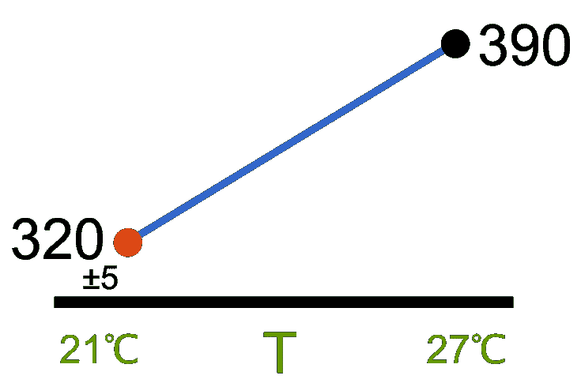
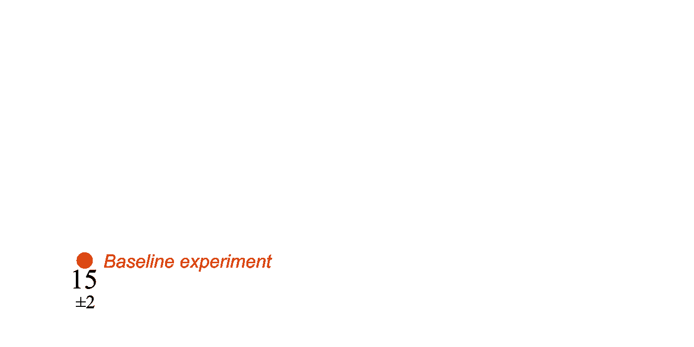
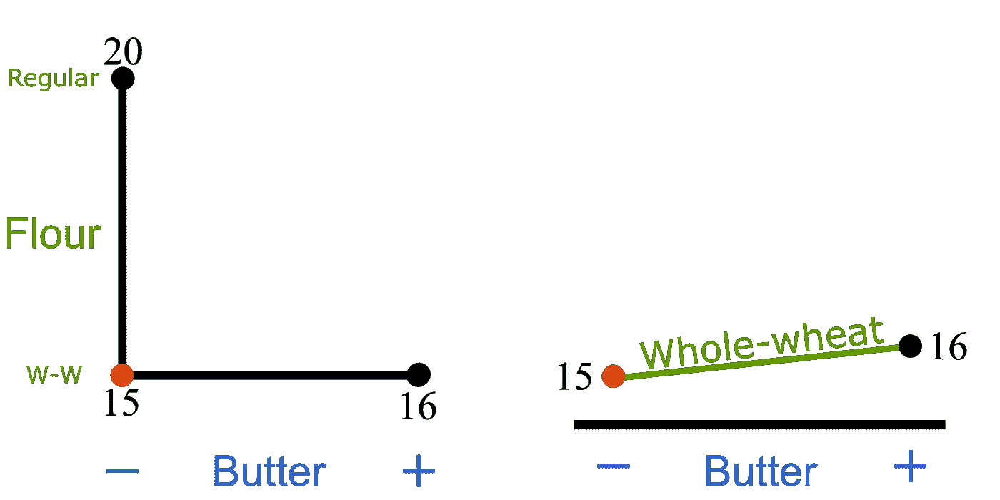
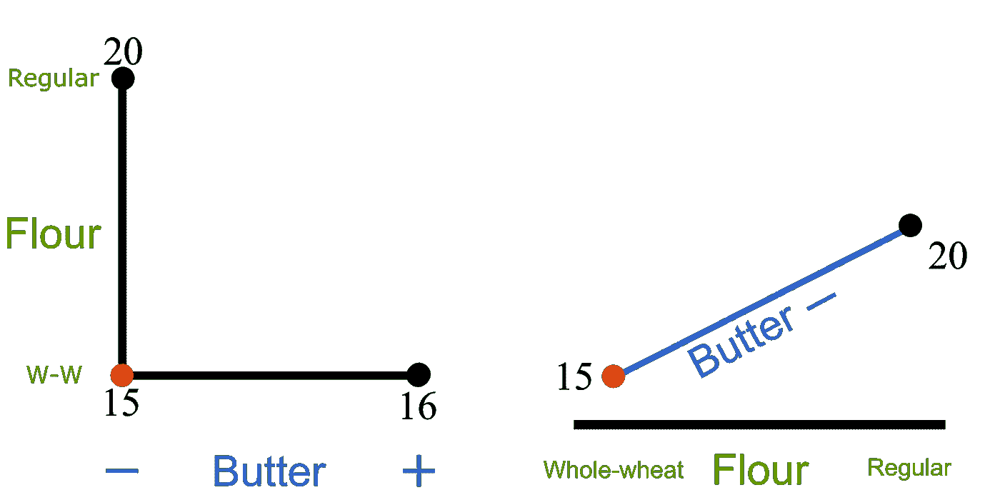
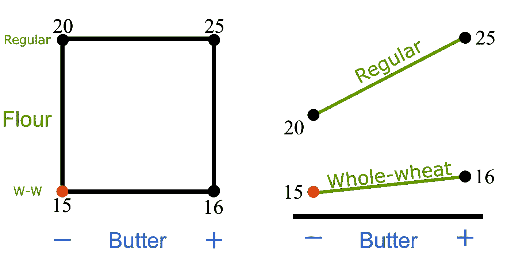
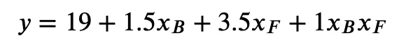
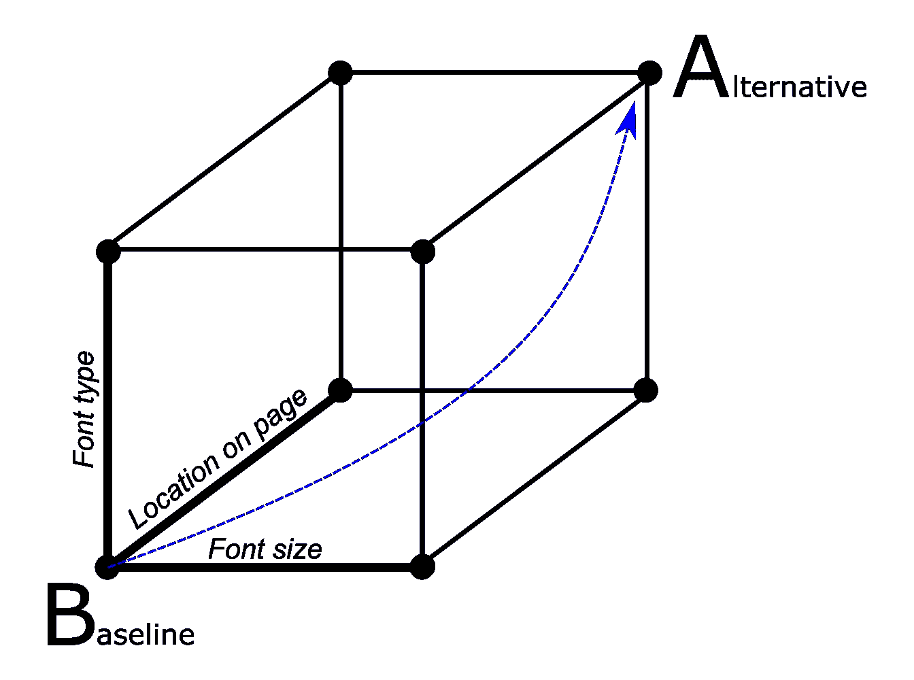
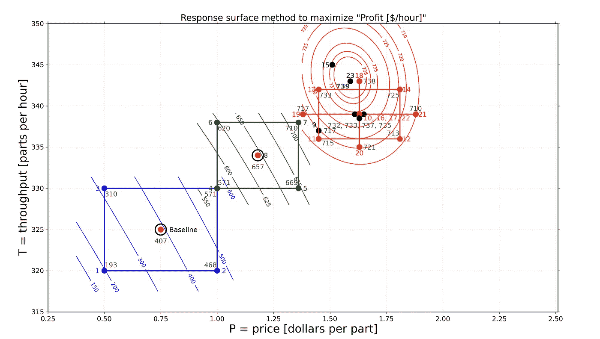
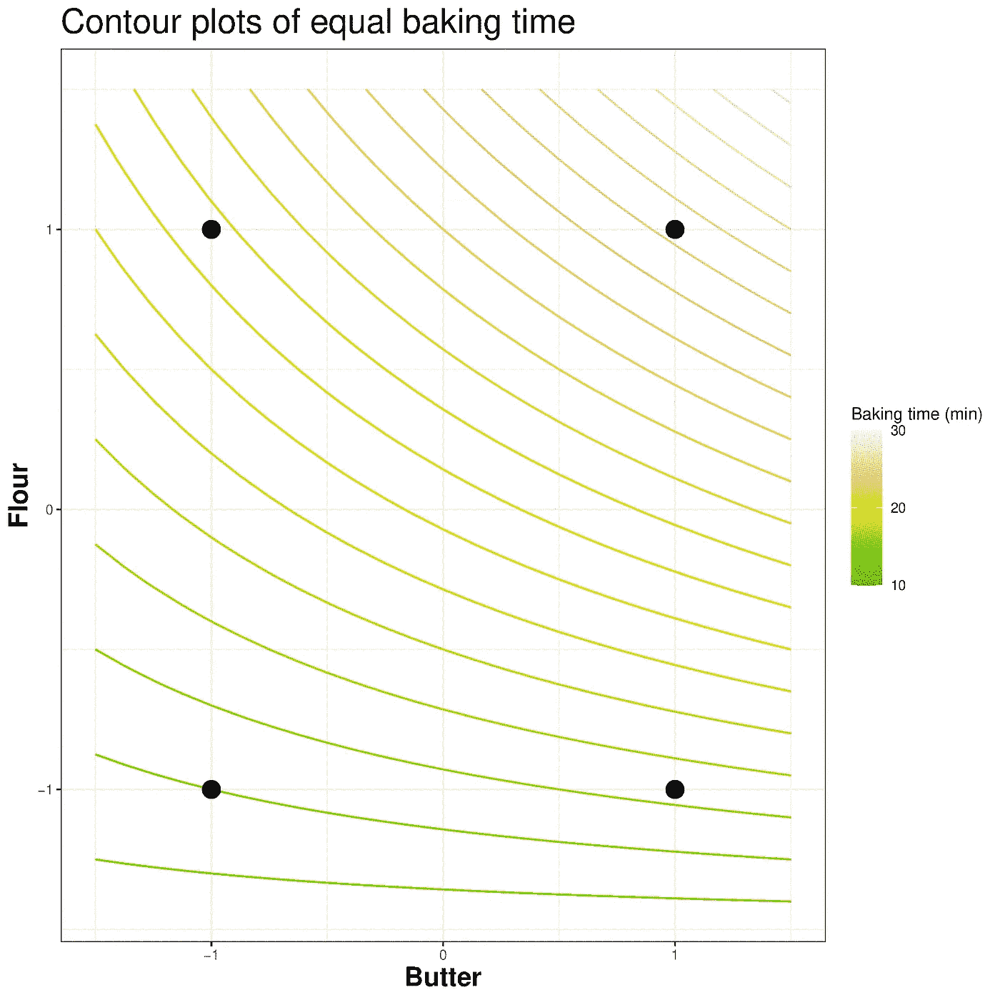

# 你能从一个额外的实验中学到什么

> 原文：<https://towardsdatascience.com/what-you-can-learn-from-one-extra-experiment-c14e3b0d2232?source=collection_archive---------25----------------------->

## [行业笔记](https://towardsdatascience.com/tagged/notes-from-industry)

## 如果你只是在做 A/B 测试，或者按照改变一件事(成本)的方法去实验，你可能会错过有用的知识。显示了对您的过程提供更多洞察的备选方案，并讨论了获得这种洞察的成本。

**总结**

至少在 100 年前的，成本(改变一件事情)的实验方法在[已经被证明是一种无效的实验方法。然而它依然存在。为什么？A/B 测试方法是成本的一种变体，但缺点较少，尽管在获取所有需要学习的内容方面仍然效率低下。让我们通过介绍常用术语来深入了解原因。如果*实验设计*对你来说是一个熟悉的话题，请跳到第 3 部分。](https://en.wikipedia.org/wiki/Design_of_experiments)

> 实验可以应用在你想象的任何地方，所以下面的例子来自烘焙、学习一门新语言、科学、机器学习和网站优化。但是不要让这些例子限制了你。

# 1.一些常用语言/术语

以下将解释的概念说明[ [自己的工作](https://github.com/kgdunn/figures/tree/main/doe) ]

*   ***因素*** :你在实验中正在改变的一件事:比如字体大小，系统的温度，发酵粉的量，一种配料的供应商，或者你给一个网站做背景的颜色。在上图的横轴上，比如温度， **T** 。
*   ***数值因子*** 允许排名和量化，如:调音台上的速度等级 1、2、3；要学习的新单词数量；pH；图像的宽度；ML 模型中的调整参数。
*   ***分类因素*** 代表一种选择，虽然有时可以对其进行排序，但简单地将其视为一种选择可能更容易。例如:使用供应商 R 或供应商 Q 进行塑料包装；使用搅拌桨和面团钩制作面包；使用带衬线的字体 T 或不带衬线的字体 A；使用文本 D、E 或 F(每种文本以不同的语气书写)作为您的*行动号召*；用古典音乐 C 或流行音乐 P 学习词汇列表；使用稳健回归或常规回归建立模型。分类因素也可以以任何顺序显示在上面的横轴上。
*   ***等级*** :您为因子选择的值。字体大小 22 是数值因子的级别，您可以使用大小 18 作为同一因子的不同级别。使用 *Arial* 或 *Times New Roman* 是分类因子的两个可能级别。上图显示了两个水平:21℃和 27℃。
*   ***响应*** (s):你在一个实验完成后测量的东西，而且几乎总是可以量化的。例如:50 天内每个客户的利润；你能正确回忆起的随机词汇的分数；你的 ML 模型的分类精度。大多数实验系统测量多个响应。在上图中，有一个(看不见的)垂直轴显示了两个响应:€320 利润/天和€390 利润/天。
*   ***优化目标*** :知道你想往哪个方向移动*响应* in:是向上，还是向下？有时我们希望保持不变，同时调查因素水平的敏感性。
*   最后，一个 ***实验*** :至少一次独立运行，在特定的因素组合下，你可以从中测量反应。不严格地说，当需要多次运行时，我也会认为是“一次实验”,然后我们使用平均响应。严格地说，这些多次运行是在相同条件组合下的重复。只要你知道系统中的典型噪声是什么，这种区别不会改变下面的大部分解释。在图示中，我们预计 5 个单位的响应值大致相同。您可以使用噪声的范围或标准偏差，只要工作一致即可。

# 2.为什么改变一件事情(成本)似乎是正确的事情

当建议同时改变两个或更多因素时，我最常得到的直接反应是，这违背了科学方法:“我怎么知道哪个因素导致了反应的变化？”人们从学校开始就被教导，单一因素的变化是确认因果关系的唯一方法。

即使在学术环境之外，成本法也在我们的日常生活中被反复验证。考虑让一个软件包正常工作。你改变了设置 D，不幸的是，它仍然不像你想要的那样工作。将 D 变回原来的位置，并尝试改变设置 E；还是什么都没有，把 E 变回原来的样子；最后，改变设置 F 使软件工作。

这并没有错，而且这篇文章也没有宣称成本是错的。单因素实验包含在深思熟虑的实验设计中。

让我们看看如何，通过例子。

# 3.我们能从一个额外的实验中学到什么？

这是出自一个实际的例子， ***而不是*** 做作地提出一个观点；只是场景变了。我们正在烘烤。我们有一个因子 B =黄油的克数，一个因子 F =面粉的种类。响应是烤箱烘焙产品达到特定棕色的时间(分钟)。所有其他条件尽可能保持相似。

在基线时，用 B = 200g 克黄油和用 F =全麦(w-w)面粉，我们重复实验两次，反应时间分别为 16 分钟和 14 分钟(用相应的能量消耗)。我们这样来说明:

第一个实验，重复两次，结果为 15 分钟[ [自己的作品](https://github.com/kgdunn/figures/tree/main/doe)

然后我们用 240 克黄油(B=+1)做实验，保持全麦面粉的面粉因子不变；所以只改变了一个因素；即因素 b。现在的平均响应是 16 分钟(两次重复，都是 16 分钟)。

添加接下来的两个实验。更改黄油系数 B 的结果显示在右侧[[自己的工作](https://github.com/kgdunn/figures/tree/main/doe)

因此，从科学的角度来看，我们可以得出结论:额外的黄油并没有真正改变反应；在噪音范围内。现在试试面粉因素。回到基线，但从全麦转换到普通面粉。仅改变这个因素会将响应增加到 20 分钟烘烤时间。

因此，从这 3 个数据点中，我们了解到:

*   我们可以用更少的黄油(200 克),用更少的能源获得大致相同的褐变；
*   与全麦面粉相比，普通面粉的烘焙时间要长 5 分钟，才能达到同样的褐变效果。因此，除非普通面粉节省的成本超过额外 5 分钟烤箱时间的能量消耗，否则坚持全麦面粉。

改变面粉因子 F 的结果显示在右边[ [自己的工作](https://github.com/kgdunn/figures/tree/main/doe) ]

许多实验者在这 3 次运行后就停止了。

让我们**再增加一个实验**:相对于基线点，使用额外的黄油 ***和*** 同时切换到普通面粉。我们获得 25 分钟的烘烤时间。让我们解释一下我们可以获得哪些额外的知识(在帮助我们的图表中有所说明):

所有 4 个场景的结果，右边是完整的互动图[ [自己的作品](https://github.com/kgdunn/figures/tree/main/doe)

*   我们认为黄油的数量对烘烤时间没有影响，但这只适用于全麦面粉，而不适用于普通面粉！对于普通面粉，额外的黄油 ***会显著增加*** 的烘焙时间。另一种说法:“*黄油的效果，取决于面粉种类*”。
*   与上面的说法对称:“*改变面粉种类的效果取决于黄油的用量*”。图中的分歧线反映了引号中的这两种说法。
*   以上两个要点说明了系统中存在交互。相互作用是对称的。数学上，设 *x* B 为黄油效果，编码为*x*B =-1(200g)*x*B =+1(240g)；全麦面粉的 *x* F=-1，普通面粉的 *x* F=+1。然后我们可以从下式预测烘烤时间 *y* :

*   最后一项是相互作用项，由于它是非零和重要的，我们知道相互作用图中的线不是平行的。如果最后一项因为为零而消失，那么相互作用图有平行线，第四个实验没有增加多少新知识(除了证实我们已经知道的)。
*   除了了解交互作用，我们还看到了下一步实验的地方，以进一步减少烘焙时间:尝试使用更少的黄油，绝对坚持全麦面粉。然而，这是有限度的，因为如果我们走得太远，我们可能会开始改变系统中的其他结果。但这正是设计实验存在的目的。以系统的方式发现这些权衡。

交互作用是非常正常的，并且几乎可以从任何析因实验中学习到。我很少做交互作用项为零的实验。

这里有一个日常互动的例子:用冷水或温水洗手——这是一个因素。用或不用肥皂洗手——这是第二个因素。但是用温水和肥皂洗手:现在有了很强的相互作用，因为肥皂改变了温水的效果，而温水改变了使用肥皂的效果。你又看到了对称。

这种 ***学来的资料*** 极有价值。互动可以增强你的反应，就像肥皂水的例子，或者有时它们会对你不利，就像上面的例子，抵消了单个因素的改善。

# 4.将此扩展到多个因素

上述方法是 ***设计实验*** 的核心，被称为析因设计。它可以扩展到多个因素，并在多个级别处理这些因素。它是组合的:如果每个因素有 2 个水平，那么你需要 2ⁿ实验，对于 *n* 个因素。但是也有替代的设计方法，仍然保持析因实验的理想特性，同时需要的实验比 2ⁿ实验少得多。

这些部分因子实验真正伟大的地方在于它有一种内在的可折叠性。如果一个因素被证明是不重要的，你仍然可以从其他因素中恢复知识。也有一定程度的冗余，这样如果其中一个组合出了问题，你的其他实验至少包含一些信息来恢复大部分学习。

要了解这些优势以及更多，您可以参加一个关于实验设计的免费课程 【注意:我没有从这个课程中获得任何东西——它是完全免费的审计】。

# 5.A/B 测试如何成为成本法的一种变体

那么如果只使用 A/B 测试，你会错过什么呢？

A/B 测试是一种[形式的实验](https://www.optimizely.com/optimization-glossary/ab-testing/)，其中有一组基本情况参数(B，之前的*或*基线*)和另一组与之比较的参数(A，*之后的*，或*替代方案*)。这两个场景之间的反应进行比较，并作出选择坚持更好的场景:A 或 B。通常需要在 B 和 A 场景大量运行，以克服系统中的多样性:特别是网站优化，你不能总是控制使用你的网站的观众。[在实验室实验中，这些干扰(如他们所称的)是可以控制的，因此需要较少的重复运行。]再者，你所谓的 A 和 B 是可以互换的，保持一致就好。*

如果您要运行 A/B 测试，在两个级别测试网页上的字体大小、字体类型和文本位置，您可以按如下方式进行可视化:

A/B 实验:基线与备选方案[ [自己的工作](https://github.com/kgdunn/figures/tree/main/doe)

在传统的 A/B 测试中，不检查立方体的其他 6 种组合:只检查标记为 A 和 B 的 2 种情况。偶尔会添加沿粗线的单因素实验。出于方便起见，省略了其他 6 种组合，因为查看可靠差异(功效分析)的测试数量可能相当高，并且获取所有组合的数据可能需要非常长的时间。

继续上面的例子，在 A/B 测试之后，我们不能确定 3 个因素中哪一个影响最大，也不能确定是否有交互作用，也不能真正了解我们的系统，除了知道 A 和 B 哪个更好。我们没有通过等高线图获得方向性的感觉，也不清楚下一组实验应该在哪里。我们要用更大的字体吗？我们是否将文本在页面上向右移动了更多？我们对哪个因素最敏感？

当我读到 A/B 测试失败的报告时，我想知道还有哪些因素的组合会成功。也许是系统中的交互作用抵消了个体因素的收益？

相反，对于成功的测试，替代场景更好仅仅是运气/良好的直觉吗？在其他组合中还能学到多少？

当然，没有免费的午餐:这些额外的学习是以额外的测试和更长的运行时间为代价的，以获取其他组合的数据。

# 6.顺序实验

为什么这些都很重要？实验本质上是连续的。你从一系列实验中学习，修改系统并继续前进，添加或删除因子，和/或改变它们的水平。你几乎不会在最佳的第一时间着陆。此处的插图显示了价格和吞吐量这两个因素的变化，从蓝色组开始，然后是绿色组(两者都是经典的析因设计)，最后是橙色组的实验(显示了带有轴点的响应面优化设计，即星形)。每组都朝着最佳响应移动。

一系列 3 组实验，显示接近最佳值[自己的工作]。

了解系统中的相互作用和非线性是至关重要的。当你接近一个最佳值时，你必须保持水平，然后梯度改变符号。这意味着，最初的轮廓线可能是平行的，远离最佳值，但当你接近最佳值时，你会看到曲率和非线性。以下是烘焙示例的轮廓:

烘焙示例的等高线图，使用 x 轴和 y 轴上的编码变量[ [own work](https://github.com/kgdunn/figures/tree/main/doe)

烘焙例子的所有上述学习可以在这个等高线图中看到，包括在哪里计划下一轮实验的感觉。

你可以在这本 [**(免费)教材章节**](https://yint.org/doe) 中了解更多关于设计性实验的一般方法。

# 7.摘要

*   实验往往需要很长时间，每个数据点都是有价值的。因此，为了从有限的实验预算中获取尽可能多的知识，使用结构化的方法进行适当的规划是必不可少的。
*   使用关于你的系统的理论，或先前的知识，来告知包括哪些因素，同样，部分因子，或类似结构的设计，可以用来筛选有影响的变量。
*   在一系列实验完成后，用新的发现来补充你现有的知识。不要直接跳到新的、性能更好的场景:试着理解为什么会观察到变化，并从现有的交互和非线性中学习。
*   最后，并不是所有的实验都会导致最优化。通常，了解哪些因素有影响，以及影响的程度，是我们所需要的。但是要确保你使用结构化的方法，这允许你建立在先前的工作之上，并且如果必要的话，在后面进行优化步骤。