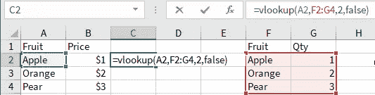
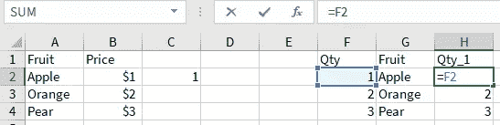
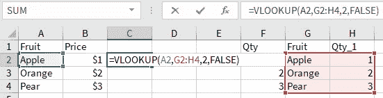
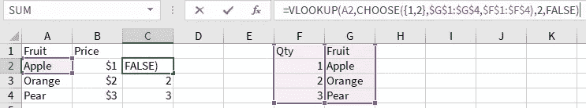
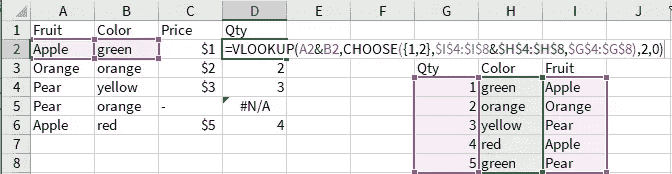
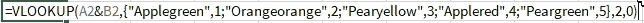
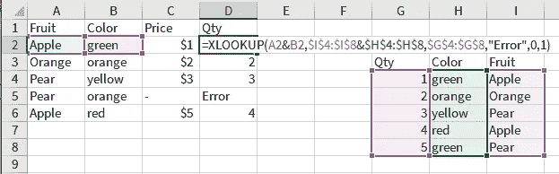
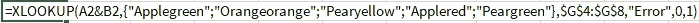
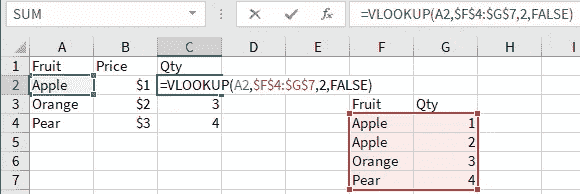
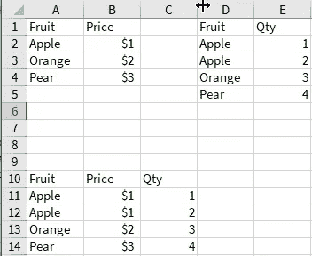

# 关于 VLOOKUP 你可能不知道的是

> 原文：<https://towardsdatascience.com/what-you-might-not-know-about-vlookup-657103e1ca77?source=collection_archive---------47----------------------->

## 以及为什么你应该开始使用熊猫

照片由 [Marten Newhall](https://unsplash.com/@laughayette?utm_source=unsplash&utm_medium=referral&utm_content=creditCopyText) 在 [Unsplash](https://unsplash.com/s/photos/look?utm_source=unsplash&utm_medium=referral&utm_content=creditCopyText) 拍摄

VLOOKUP 是一个基本的 Excel 函数，任何需要匹配两个表中数据的人都可能使用它。也许更令人惊讶的是，一些网站展示了如何在简历中包含 vlookup 功能的简历样本。虽然有许多文章讲述了如何使用这个函数，但是有些文章可能不完整、过时或者缺乏深度。本文旨在强调 vlookup 函数中通常被忽视的局限性，然后展示一些创新的技巧来克服这些局限性。

Vlookup 是 Excel 中的内置函数，它允许用户在给定数组的最左侧列中找到特定值的第一个匹配项，然后返回与特定列对应的同一行中的值。

vlookup 的一个小例子。图片由作者提供。

对于大多数目的来说，它是非常有用的。然而，在特定的情况下，在 vlookup 能够被有效地使用之前，需要相当多的人工工作来形成数据。

# 帮助器/重复列

如果交换了`Fruit` & `Qty`列，则不能直接执行 vlookup。常见的解决方法是使用公式复制列。(可以将包含**键的列复制到左侧**或将包含**值的列移动到右侧**。)

复制列。图片由作者提供。

图片由作者提供。

(例如，当数组最左边的一列有重复值时，或者当需要将两列数据连接在一起以形成查找关键字时)

这对于简单的表来说非常好，但是当表变得有些复杂时，就会出现许多这样的重复列。通常，所有的键列都在左边结束。这是不可持续的。

# 多条件虚拟查询

一位德高望重的 Excel 大师[在博客](https://chandoo.org/wp/multi-condition-vlookup/)上讲述了如何使用数组公式和`choose()`函数创建一个 vlookup，它可以看起来“靠左”而不需要添加辅助列。请注意，您将需要按下`Ctrl` + `Shift` + `Enter`，而不是只按下`Enter`来获取数组公式。如果不这样做，可能会产生一些意想不到的结果。

多条件 vlookup。图片由作者提供。

这种方法也可以用于执行多条件 vlookup。

图片由作者提供。

我们可以通过高亮显示整个表达式并按下`F9`来评估`choose`表达式。注意，它计算出一个有 5 行的数组，其中`Fruit` & `Column`的连接是每行的第一个条目，`Qty`是第二个条目:

图片由作者提供。

有些文章可能会建议将表格转换成网格，将`Fruit`作为列，将`Color`作为行，将交集作为值，然后使用 INDEX()和 MATCH()。这对于两个标准来说没问题，任何超过 2 的标准都很难实现。这种转换也可能是手动完成的。INDEX() & MATCH()对读者来说并不友好，过一段时间后很难调试。总之，我不推荐；多条件 vlookup 的可扩展性更强。

# XLOOKUP

如果你或你的公司订阅了微软 365，最干净的方法就是使用 XLOOKUP。

图片由作者提供。

我们可以突出显示`$I$4:$I$8&$H$4:$H$8`并按下`F9`来评估表达式，并观察它将值成对连接起来。

图片由作者提供。

# 处理重复

vlookup 的另一个缺点是它只能返回一个值，因此如果键列包含重复项，返回值将对应于匹配的第一行。如果第二个值是预期的值，这可能是危险的，因为错误将被无提示地传递。因此，在执行 vlookup 之前，应该始终检查 key 列是否包含重复项。在下面的示例中，在`Fruit`列下有 2 行的值为`Apple`。Vlookup 只返回`Qty`列下的第一个值。

图片由作者提供。

执行左合并将返回底部表格，参考下图。并且所产生的附加行将提供在`Fruit`和`Qty`表中存在重复的指示。

图片由作者提供。

# 结论

1.  检查键列中的重复值
2.  考虑使用 helper 列是否更具可伸缩性，否则使用多条件 vlookup 或 xlookup
3.  vlookup 不等同于 merge

# **事后思考**

这篇文章的目的是让人们意识到 vlookup 的局限性，并分享使用 vlookup 的创新方法——这些方法更具可扩展性、可读性和可维护性。

只是在我花了一些时间用 python 编写脚本之后，我才学会了“可读性很重要”，这让我更加清楚我在 Excel 中编写公式的方式。有些人(嗯，我就是其中之一)以在 Excel 中编写冗长的嵌套 if-else 语句为荣。(天哪！修改它们是如此困难/痛苦/令人困惑，尤其是如果你有一段时间没有看它们的话。)希望这能启发读者思考如何更好地准备电子表格，以便于阅读、维护和调试。

如果你喜欢这个故事，也可以看看以下内容:

 [## 从 Excel 过渡到 Python 的技巧

### Excel 是最常用的数据分析应用程序之一。然而，由于其明显的局限性(即…

towardsdatascience.com](/python-tips-for-someone-transiting-from-excel-ce16c5f9cbac)  [## 如何使用 Python 加密 PDF 并作为电子邮件附件发送

### …并可能为贵公司节省一些人力资源工具的费用

towardsdatascience.com](/how-to-encrypt-pdf-and-send-as-an-email-attachment-using-python-4ce7fd462a99)