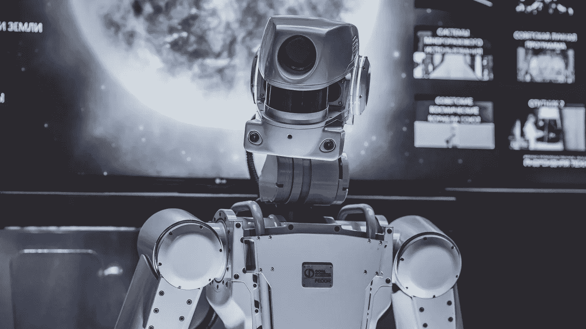

# 参加斯坦福大学的机器学习课程之前需要知道的事情

> 原文：<https://towardsdatascience.com/what-you-need-to-know-before-taking-the-machine-learning-course-by-stanford-84fd7bf94628?source=collection_archive---------7----------------------->

## 意见

## 机器学习课程由吴恩达&史丹福评论

阿瑟尼·托古列夫在 [Unsplash](https://unsplash.com/s/photos/machine-learning?utm_source=unsplash&utm_medium=referral&utm_content=creditCopyText) 上的照片

在这篇文章中，我将陈述我对斯坦福大学的[机器学习课程的看法。如果你还不知道这门课程，这是由](https://www.coursera.org/learn/machine-learning) [Coursera](https://www.coursera.org/) 联合创始人 [deeplearning.ai](https://www.deeplearning.ai/) 的[吴恩达](https://www.linkedin.com/in/andrewyng/)创建的最受欢迎的机器学习课程之一。

后面我会说，**这门课程是初学者的最佳选择**，但是我们这个世界的一切都有弊端。我试着注意到其中的一些，并*附上来源的链接*，学习它们你会对机器学习和数据科学有一个更完整的了解。

# 主要缺点——应该理解什么

尽管这门课程很有魅力，但它已经过时了。这不是课程的直接劣势，但是已经快 11 年了！(课程发布于 2011 年)。这段时间发生了很多变化。如果课程是关于深度学习(或其他快速发展的领域)，它将*完全失去相关性*。

但是因为这个课程是关于基础的，所以几乎所有的东西都和 T21 有关。可能除了关于机器学习应用的故事——它们现在看起来有点滑稽。目前，解决实际任务的工具完全不同。这都是因为在计算机视觉和自然语言处理方面的主要成就是在 2011 年之后取得的(课程主要例子是自动驾驶汽车和电子邮件垃圾分类器)。

这是绝对正常的情况——一切都在进步，10 年后现代课程也会显得过时。**这门课讲的是永远不会改变的基础知识**(至少我们是这么认为的)，但值得理解的是，实际任务的方法和工具在不断变化。这对某些人来说是显而易见的，但对初学者来说也是令人困惑的。

技术方面的问题是声音质量有时不尽人意。然而，如果你在一个安静的地方戴着耳机学习，那么一切都可以听得很清楚。此外，还有字幕。

# 用 Python 代替 Octave 或者 MATLAB

据你所知，本课程的另一个主要缺点是它不使用 Python。作业必须只用 [*【八度】*](https://en.wikipedia.org/wiki/GNU_Octave) 或 [*MATLAB*](https://en.wikipedia.org/wiki/MATLAB) 完成。

尽管课程作者的论点(Octave/MATLAB 比有意义的编程语言更容易让初学者理解)，但这些语言与数据科学的实际应用毫无关系。所以**如果你想深入数据科学，最好马上学习 python**。

我当即决定把这门课翻译成 Python。但是在继续我自己的 Python 实现之前，我决定检查一下是否有人在我之前做过。当然，有人做到了。您可以通过以下链接使用 Python 完成本课程。

<https://github.com/dibgerge/ml-coursera-python-assignments>  

就我个人而言，我想对这些帖子的作者说一声非常感谢——他们做得真的很棒。

# 这门课不会教你什么

课程*有意识的压制*很多机器学习方面。我有意识地使用了“T14”这个词，因为我确信吴恩达和设计课程的团队熟悉下面的所有概念。这样做是为了简化课程，让初学者更加舒适。然而，我认为提供一些额外的材料来探索数据科学世界是非常重要的。

下面是一些例子，学习这些你应该对机器学习和数据科学有更完整的了解。我这里说的不是提 CNN，RNN，还有其他方面的*深度学习*，因为真的是高级水平。但是我认为这个列表可以帮助你对数据科学有一个更全面的了解。

## 集成学习

课程根本没说什么集成学习方法——*装袋*、*随机森林*、*助推*、*堆叠*等。在我看来，这是最大的遗漏，因为课程中的神经网络被感知为*【自身】*，而不是弱分类器的集合。

<https://bdtechtalks.com/2020/11/12/what-is-ensemble-learning/>  <https://machinelearningmastery.com/tour-of-ensemble-learning-algorithms/>  

## 分类变量

虽然*特征工程*是数据科学工作的一个重要部分，但是没有提到分类和其他类型的变量。

<https://machinelearningmastery.com/one-hot-encoding-for-categorical-data/>  </feature-engineering-for-machine-learning-3a5e293a5114>  

## 使聚集

只有 K-均值聚类被认为是一种聚类算法。

<https://neptune.ai/blog/clustering-algorithms>  

## 降维

只有 PCA 被认为是一种降维技术。更不用说有完全不同的方法，在课程结束后，你可能会觉得使用主成分分析进行数据可视化是一个好主意。

<https://bdtechtalks.com/2021/05/13/machine-learning-dimensionality-reduction/>  

## 异常检测

在课程中，吴恩达谈到了*异常检测*，尽管事实上，他谈到了*新奇检测*——一个稍微不同的任务。这个任务在课程中用*密度估计*方法解决，其他方法根本不考虑。

</anomaly-detection-for-dummies-15f148e559c1>  

# 我的文章可能对你有用

您也可以使用我的备忘单文章作为数据科学概念的列表，以便理解每个任务都有几种解决方法:

*   [监督学习算法备忘单](/supervised-learning-algorithms-cheat-sheet-40009e7f29f5)
*   [降维备忘单](/dimensionality-reduction-cheatsheet-15060fee3aa)
*   [异常检测备忘单](/anomaly-detection-cheat-sheet-5502fc4f6bea)
*   [聚类备忘单](/clustering-cheat-sheet-dcf72259abb6)

# 摘要

尽管有这些缺点，这门课仍然是**开始学习数据科学和机器学习**的最佳选择。这个课程的优点与所有缺点重叠:

*   **吴恩达的天赋和教学经验使得用简单的语言解释复杂的事情成为可能。特别是，在我看来，本课程是对内核技巧和模型选择概念(欠拟合/过拟合预防)的最好解释。**
*   不要忘记**的课程材料是完全免费的**，你只需要为证书付费(标准 Coursera 费用——大约 80 美元)。
*   超过 10 种语言的字幕可供选择。这让你可以在任何你想去的地方学习，即使你不擅长英语。
*   虽然不直接，**你可以用 Python** 来完成课程作业。

如果您很久以来一直想投身于数据科学领域，但一直不敢，那么现在或许是报名参加该课程并获得独特体验的最佳时机。

# 参考

<https://www.coursera.org/learn/machine-learning>  

# 感谢您的阅读！

*   我希望这些材料对你有用。[在 Medium](https://medium.com/@andimid) 上关注我，获取更多这样的文章。
*   如果您有任何问题或意见，我将很高兴得到任何反馈。在评论里问我，或者通过 [LinkedIn](https://www.linkedin.com/in/andimid/) 或者 [Twitter](https://twitter.com/dimid_ml) 联系。
*   为了支持我作为一个作家，并获得数以千计的其他媒体文章，使用[我的推荐链接](https://medium.com/@andimid/membership)获得媒体会员资格(不收取额外费用)。