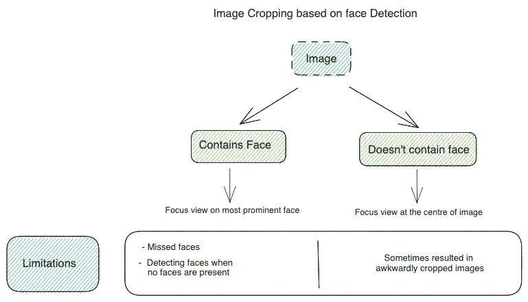
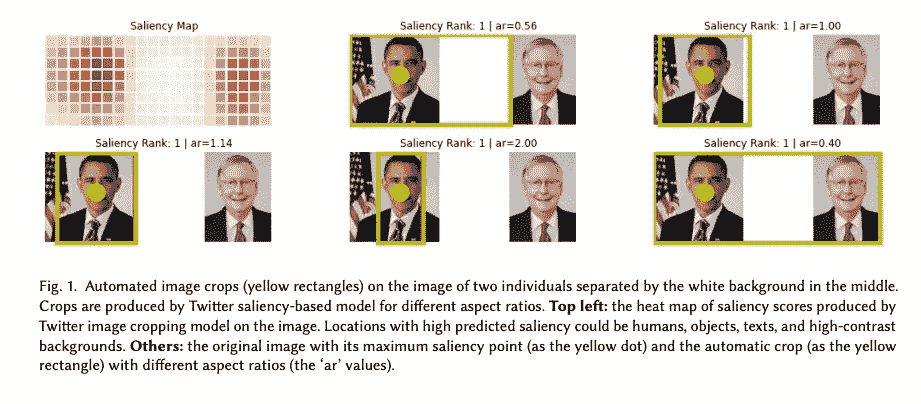
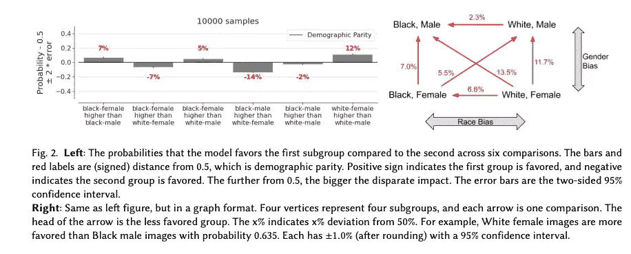
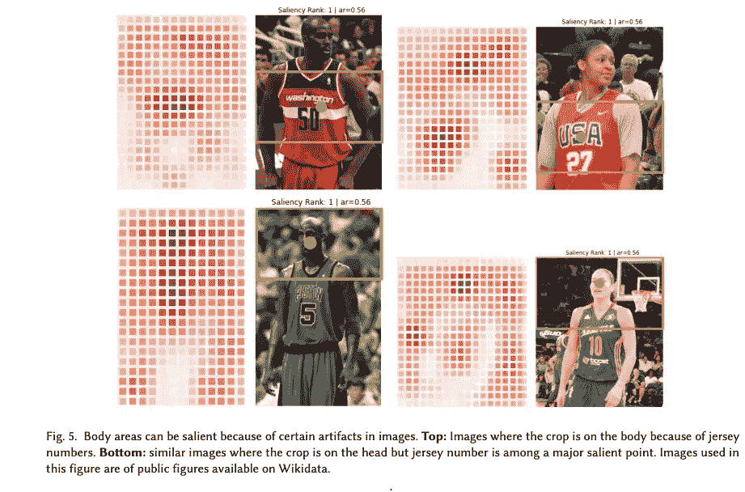

# 所见即所得:Twitter 在时间轴上显示图像的新策略

> 原文：<https://towardsdatascience.com/what-you-see-is-what-youll-get-twitter-s-new-strategy-for-displaying-images-on-the-timeline-3ddc2040c728?source=collection_archive---------25----------------------->

## 总结 Twitter 关于图像裁剪算法的论文

亚历山大·沙托夫在 [Unsplash](https://unsplash.com?utm_source=medium&utm_medium=referral) 上拍摄的照片

2020 年，Twitter 上对他们的图像裁剪算法的偏见性质有很多不满。Twitterati 抱怨说，它偏向于白人，是物化女性的身体。Twitter [承诺调查这个问题和其他几个问题](https://blog.twitter.com/en_us/topics/company/2021/introducing-responsible-machine-learning-initiative)以确保负责任的人工智能实践。这篇文章总结了 Twitter 的图像裁剪算法的问题，他们研究团队的发现，以及他们打算如何为他们现有的机器学习(ML)系统带来更多透明度。文章中的内容基于 Twitter 发布的论文。

***论文:***[Twitter 上的图像裁剪:公平性指标、它们的局限性以及表现、设计和代理的重要性](https://arxiv.org/pdf/2105.08667.pdf)

**作者** : [*基拉绮*](https://arxiv.org/search/cs?searchtype=author&query=Yee%2C+K) *，* [*乌泰彭*](https://arxiv.org/search/cs?searchtype=author&query=Tantipongpipat%2C+U) *，* [*舒班舒*](https://arxiv.org/search/cs?searchtype=author&query=Mishra%2C+S)

# 图像裁剪及其业务用例

每天有数百万张图片以各种形状和大小上传到各种社交媒体平台。这些上传的图像必须进行裁剪，以保持 UI 的一致性，并确保图像中最相关的部分在用户的时间轴中可见。然而，裁剪是一个繁琐的过程，为了消除数小时的繁重工作，公司主要使用机器学习来自动化这一过程。Twitter 使用了一个[显著性算法](https://arxiv.org/abs/1801.05787)来实现同样的效果。

# Twitter 上的图像裁剪

Twitter 是一个广为人知的社交媒体平台，图片分享是其核心。2018 年之前，Twitter 使用人脸检测来裁剪图像。然而，这种方法有许多缺点。

基于人脸检测的图像裁剪|作者图片

2018 年，Twitter 宣布他们将采用[快速神经网络来智能自动裁剪图像](https://blog.twitter.com/engineering/en_us/topics/infrastructure/2018/Smart-Auto-Cropping-of-Images)。这个系统依赖于**显著性技术**，它从感知角度识别[图像中最重要的区域。换句话说，显著性算法识别人在图像中最可能观察到的那些图像部分。自然，这将包括文本、人脸、动物、物体和高对比度的背景。](https://www.researchgate.net/publication/256802429_Saliency_Based_Image_Cropping)

基于显著性的图像裁剪|来源:[https://arxiv.org/pdf/2105.08667.pdf](https://arxiv.org/pdf/2105.08667.pdf)

Twitter 的[显著性模型](https://arxiv.org/abs/1801.05787)利用了深度学习架构 [DeepGaze II](https://arxiv.org/abs/1610.01563) 。然而，这种模型本身在计算上是昂贵且缓慢的。为了加快这一过程，Twitter 还在深度学习网络的基础上采用了一种叫做 fisher pruning 和知识提取的技术组合。[用作者的话说](https://blog.twitter.com/engineering/en_us/topics/infrastructure/2018/Smart-Auto-Cropping-of-Images):

> 总的来说，这两种方法使我们裁剪媒体的速度比模型的普通实现快 10 倍，并且没有进行任何实现优化。这使我们能够在所有图像上传后立即对它们执行显著性检测，并实时裁剪它们。

# Twitter 图像裁剪算法的问题

大约在 2020 年秋天，许多推文出现，抱怨他们的图像在 Twitter 上的显示方式。也就是说，图像裁剪算法对白皮肤的人比对黑皮肤的人更有利。不仅如此，人们还担心男性的注视和表现偏见，也就是说，不允许人们自由选择他们希望在平台上如何表现。

Twitter 决定调查这些问题，并重新评估其算法。

> 为了解决这些问题，我们使用正式的组公平指标进行了广泛的分析。我们发现了种植中的系统性差异，并确定了影响因素，包括基于单一最显著点的种植会放大差异。

# 调查结果和提议的改变。

这篇论文解释了 Twitter 如何进行精心的测试，以检查其算法中潜在的性别和种族偏见以及男性凝视。

## 数据集和方法

使用的数据集是 WikiCeleb 数据集，由 Wikidata 上记录的 4073 位名人的图像和标签组成。这些数据根据种族和性别被分成四个亚组→:黑人女性、黑人男性、白人女性和白人男性。

## 结果-性别和种族差异

结果显示，女性比男性更受性别青睐，白人比黑人更受青睐。

推特图片裁剪分析的发现|来源:[https://arxiv.org/pdf/2105.08667.pdf](https://arxiv.org/pdf/2105.08667.pdf)

## 结果——男性凝视

对于男性凝视的问题，结果显示，对于每个性别，100 张照片中有 3 张是在头部以外的地方。庄稼不在脸上；通常是在图像上的这些区域显示数字，比如运动衫。这种行为在所有性别中都是相似的。

分析推特图像裁剪算法中的男性凝视问题|来源:【https://arxiv.org/pdf/2105.08667.pdf 

本文还讨论了放大不同效果的其他要点，如深色背景、深色眼睛、较高的可变性等。最后，作者总结如下

> 然而，我们证明了形式化的公平性度量和定量分析本身不足以捕捉自动裁剪中代表性伤害的风险。我们建议**去除基于显著性的裁剪，以利于更好地保护用户代理的解决方案。**为了开发一种新的解决方案，充分解决与代表性伤害相关的问题，我们的评论激发了包括以人为中心的设计在内的定量和定性方法的结合。

因此，当用户在推特上发布照片时，他们将获得他们的图像将如何出现的准确预览。在测试了这一变化后，Twitter 终于在 2021 年 5 月推出了这一更新功能。

# 5.我们的外卖

这篇论文强调了负责任的人工智能必须成为任何机器学习系统的核心。今天人工智能系统的广泛使用使得确保它们的预测不应该是歧视性的和不公平的歧视成为当务之急。批判性地评估机器学习系统并仔细思考其后果是朝着这个方向迈出的重要一步。

# 参考

*   Twitter 上的图像裁剪:公平指标、其局限性以及代表性、设计和代理的重要性
*   [图像作物分析代码](https://github.com/twitter-research/image-crop-analysis)
*   [用于图像智能自动裁剪的快速神经网络](https://blog.twitter.com/engineering/en_us/topics/infrastructure/2018/Smart-Auto-Cropping-of-Images)
*   [图像裁剪的透明度和即将到来的变化](https://blog.twitter.com/en_us/topics/product/2020/transparency-image-cropping)