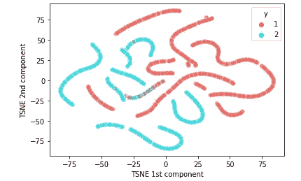
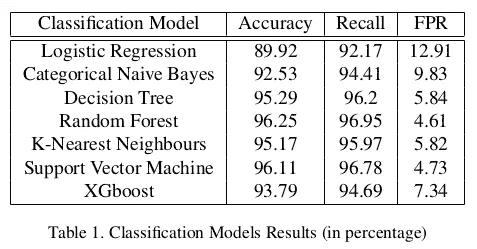
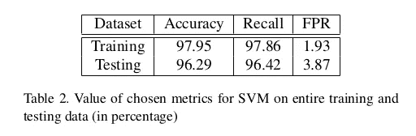

# WhatAPhish:检测钓鱼网站

> 原文：<https://towardsdatascience.com/whataphish-detecting-phishing-websites-e5e1f14ef1a9?source=collection_archive---------13----------------------->

## 一种基于机器学习的方法，根据 25 种不同的特征来检测可能的钓鱼网站

# 动机

网站钓鱼每年给互联网用户造成数十亿美元的损失。网络钓鱼者窃取用户名和密码等个人信息和金融账户详情，使用户在网络空间易受攻击。

> 什么是黑客的周末度假？
> 
> **他们去钓鱼了！**

[Bermix 工作室](https://unsplash.com/@bermixstudio?utm_source=medium&utm_medium=referral)在 [Unsplash](https://unsplash.com?utm_source=medium&utm_medium=referral) 拍摄的照片

新冠肺炎疫情促进了技术在各个领域的应用，导致了组织官方会议、上课、购物、支付等活动的转变。从物理空间到网络空间。这意味着网络钓鱼者有更多的机会实施攻击，对受害者造成经济、心理和职业上的影响。2013 年，45 万次网络钓鱼攻击导致超过 59 亿美元的财务损失。根据 2018 年 CheckPoint Research 安全报告，77%的 IT 专业人员认为他们的安全团队对当今的网络安全挑战毫无准备。同一份报告指出，64%的组织在过去一年中遭遇过网络钓鱼攻击。

检测钓鱼网站并不容易，因为使用 URL 混淆来缩短 URL，链接重定向和操纵链接，使其看起来可信，并且列表还在继续。这就需要从传统的编程方法转向机器学习方法。

# 技术发展水平

传统上，ad-hoc 方法被用于基于网页的内容、URL 等来检测网络钓鱼攻击。网络钓鱼检测主要有三种模式:

1.  **基于内容的方法:**使用版权、空页脚链接、正文 HTML 的零链接、具有最大频率域的链接来分析页面的基于文本的内容。仅使用纯 TF-IDF 算法，可以以 6%的误报率检测到 97%的钓鱼网站。
2.  **基于 URL 的方法:**使用页面排名，并基于先验知识将其与从 URL 导出的其他度量相结合。这种方法可以检测高达 97%的钓鱼网站。
3.  **机器学习方法:**使用不同的机器学习模型，这些模型针对诸如 URL 是否包含@、URL 是否具有双斜线重定向、URL 的 pagerank、网页上嵌入的外部链接的数量等特征进行训练。该方法的真阳性率高达 92%，假阳性率为 0.4%。

M E Pratiwi 等人对 UCI 机器学习提供的数据使用神经网络感知器，并能够通过使用 18 个 features⁵实现 83.38%的准确率。A. Alswailem 等人使用从 36 个可用特征中的 URL 和页面内容提取的随机特征，并通过随机森林分类器实现了最低 53%和最高 98%的准确度。

# 方法学

## 数据集描述

我们使用的数据集由 repository⁴UCI 机器学习公司提供，由 Mohammad 等人整理。该数据集有 11055 个数据点，其中有 6157 个合法网址和 4898 个钓鱼网址。每个数据点有 30 个特征，细分为以下三类:

1.  URL 和衍生功能
2.  基于页面源代码的功能:包括网页中嵌入的 URL 和基于 HTML 和 Javascript 的功能。
3.  基于域的功能

研究了特征的提取方式和相关性，我们从 30 个特征中去掉了 5 个，分别是:端口号、异常 URL、弹出窗口、Google 索引和指向某个页面的链接数。由于功能漂移，端口号被丢弃。其余的都被丢弃了，因为没有方法以编程方式提取它们，或者缺少公共 API。

TSNE 图(1 代表合法网址，2 代表网络钓鱼网址)

## 可视化数据集

为了观察这两个类别的可分性，我们绘制了 t-SNE 曲线。该曲线暗示，尽管类是可分离的，但是它们没有聚集在一起，并且需要特征的变换或者非线性模型来获得好的结果。

## 预处理数据集

我们使用 80:20 拆分将可用数据拆分为训练和测试数据。发帖说，由于我们在训练数据中只有 7075 个数据点，我们使用 5 折交叉验证来训练它。因此，我们实现了 64:16:20 的 train:val:test 分割。

我们对特征进行了一次性编码，以避免由于数值而产生的任何偏差。

## 模型细节

我们尝试了各种具有超参数调整的分类模型:

1.  *逻辑回归:*是一种统计模型，使用逻辑函数对数据点进行分类。我们将最大迭代次数固定为 2500 次。
2.  *分类朴素贝叶斯:*它是一种概率模型，假设特征相互独立。
3.  *决策树:*它通过创建决策边界来创建学习的分类模型。使用的最大深度是 17。
4.  *随机森林分类器:*它是一种集成分类模型，采用多个决策树的平均结果，并进行最佳预测。采用的估计数为 200。
5.  *K-最近邻* : KNN 为每个数据点计算最近的 K 个邻居，并返回其中的多数标签。所使用的超参数是 n 个邻居 3，距离评估的度量是“欧几里德”距离。
6.  *支持向量机:* SVM 通过创建用于分类的最优超平面，对给定的带标签的训练数据进行分类。使用的超参数是核作为 rbf，伽马值为 0.1，C = 10。
7.  *XGBoost:* XGBoost 基于决策树，使用梯度推进框架进行分类。超参数是:无声=假，标度位置权重= 1，学习率= 0.01，列样本 bytree = 0.4，子样本= 0.8，目标= '二进制:逻辑'，n 估计量= 1000，正则 alpha = 0.3，最大深度= 4，伽马= 10。

## 评估指标

为了测试所获得的结果，我们使用了 3 个参数:准确性、召回率和假阳性率(FPR)。

1.  *准确率:*是正确预测的数量与输入样本总数的比值。由于目标要求大多数 URL 被正确分类，因此高准确度是度量之一。
2.  *召回:*是真阳性数与预测阳性总数的比值。由于我们希望网站预测为积极的，只是合法的，高召回是可取的。
3.  *假阳性率(FPR):* 它是被错误识别为阳性的样本数与实际阴性样本总数的比率。该要求旨在最大限度地减少被识别为合法的网络钓鱼网站的数量，因为这可能会给访问该网站的人带来重大损失。因此，低 FPR 是所使用的度量之一。

# 结果

经过训练的模型及其对验证数据的表现如下:

我们的目标是提高准确性、提高召回率和降低误报率，以便大部分点被正确分类，并减少被标记为合法的钓鱼网站的数量。

# 讨论

随机森林分类器和支持向量机在给定数据集上表现相似，与其他模型相比，具有更高的精度和更低的 FPR。除了逻辑回归和分类朴素贝叶斯，其他模型的性能也相当。

逻辑回归假设线性可分的类。然而，从 t-SNE 图中可以看出，类是可以分离的，但不是线性的。因此，逻辑分类器不能很好地执行。朴素贝叶斯假设特征的独立性，这可能不完全正确。在这种情况下，像 pagerank 和 statistical report 这样的特性是紧密相关的，类似地，请求 URL 和锚的 URL 似乎也是紧密耦合的。出现这种耦合是因为大多数钓鱼网站在静态特征上往往遵循相似的模式。因此朴素贝叶斯不能很好地捕捉模式。

决策树能够对非线性可分模式进行分类，因此在修剪后对给定数据表现良好，但是由于随机森林是使用决策树的集成模型，其以随机方式组合各种决策树的输出，因此它提供了对结果中所反映的决策树的改进。k-最近邻处理特征的相似性。许多钓鱼网站都有一些共同的特征，如不到六个月的活动，不到一年的域名注册长度等。因此，KNN 可以根据这些特征进行很好的分类。但是，使用“欧几里德”距离，非凸模式可能无法很好地分类，因此会稍微影响性能。

支持向量机适用于线性可分数据。数据不是直接线性分离的，但在应用“rbf”核后，数据变得可分离，SVM 能够从数据中很好地学习。XGBoost 是一个基于决策树的集成模型，它使用梯度推进来减少误差。由于它使用类似于梯度下降的技术，所以它不是很适合分类数据，甚至在一键编码之后也不会很好地执行。

所以，我们决定用 SVM 作为最终的模型。它表现良好，具有高准确率、高召回率和低 FPR。眼前的问题是二元分类，SVM 是一个相对简单的模型，对异常值有容忍度。此外，它还为所涉及的特性提供了可解释性。

下表显示了 SVM 在完整的训练和测试数据上获得的度量:

# 废弃给定 URL 的功能

我们将训练好的模型部署为一个 webapp 来对任何输入 URL 进行分类。为了获取输入 URL 的要素，根据数据集描述的规则使用了以下条件和工具:

1.  输入 URL 应该是完整的，即带有“http”或“https”以及任何后续字符，以便在目标页面上着陆。
2.  我们使用 curl 和 BeautifulSoup 来抓取网页及其标题，使用 tldextract 从给定的 url 获取域名，使用字符串解析来识别可从 URL 文本本身提取的特征，使用 WHOIS 数据库来验证链接的真实性。
3.  除此之外，我们还从开放页面排名中发现了 URL 的 pagerank，使用 Alexa 数据库发现了页面受欢迎程度，使用 PhishTank API 发现了网站的感知声誉。

 [## 工作平台演示

drive.google.com](https://drive.google.com/file/d/1iw6A-mal0WFw_8QSwvY8xdthAHskFPFq/view?usp=sharing) 

# 结论

在这个项目中，我们构建了 WhatAPhish:一种检测钓鱼网站的机制。我们的方法不仅使用传统的基于 URL 或基于内容的规则，还使用机器学习技术来识别数据中不太明显的模式和关系。我们使用了各种领域的功能，从网页的 URL 到 HTML 标签，从嵌入式 URL 到 favicon，以及 WHOIS、Alexa、Pagerank 等数据库。检查网站的流量和状态。我们能够获得超过 96%的准确率，召回率超过 96%，误报率低于 5%，从而正确地对大多数网站进行分类，并证明了基于机器学习的技术在解决钓鱼网站问题方面的有效性。我们提供的输出是一个用户友好的网络平台，可以进一步扩展为浏览器扩展，为用户提供安全健康的在线空间。

完整的代码和报告可以在[https://github.com/himanshi18037/WhatAPhish](https://github.com/himanshi18037/WhatAPhish)找到。

# 参考

[1] Ankit Jain 和 B . B . Gupta。网络钓鱼检测:基于视觉相似性的方法分析。安全与通信网络，2017:1–20，01 2017。

[2] A. Alswailem、B. Alabdullah、N. Alrumayh 和 A. Alsedrani。使用机器学习检测钓鱼网站。2019 年第二届计算机应用信息安全国际会议(ICCAIS)，第 1–6 页，2019。

[3] R. M .穆罕默德、f .塔博塔和 l .麦克卢斯基。使用自动化技术评估与网络钓鱼网站相关的特征。2012 年互联网技术和担保交易国际会议，第 492–497 页，2012 年。

[4] R. M .穆罕默德、f .塔博塔和 l .麦克卢斯基。UCI 机器学习知识库，2012(【https://archive.ics.uci.edu/ml/datasets/Phishing+Websites#】T2)

[5]普拉蒂维、洛罗沙和维博沃基于人工神经网络的钓鱼网站检测分析。物理学杂志:会议系列，1140:012048，2018 年 12 月。

***作者:*** *维布·阿格拉瓦尔、希曼希·马图尔、万什卡·戈埃尔(德里 Indraprastha 信息技术学院)*

***课程项目*** *针对 CSE343:机器学习，德里 Indraprastha 信息技术学院。*

***课程导师:****Jainendra shuk la 博士。*