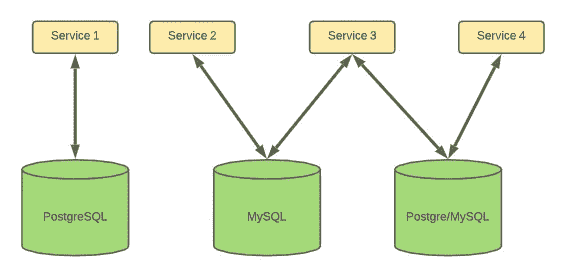
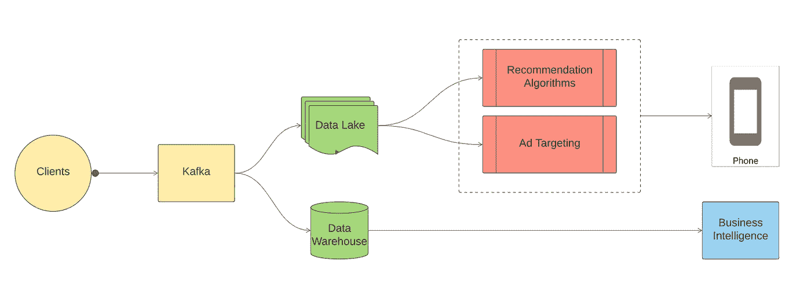
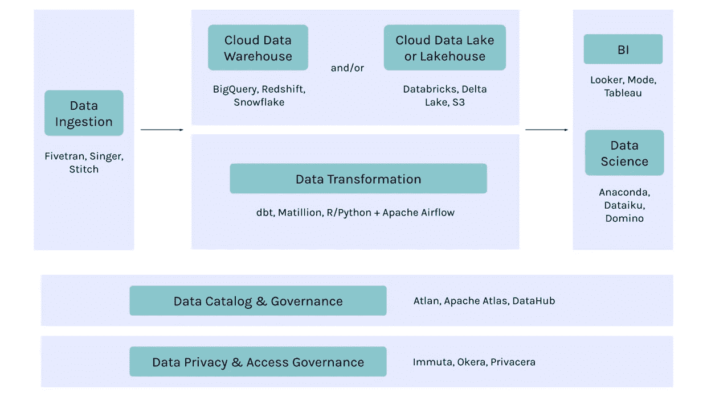

# 到底什么是数据平台？

> 原文：<https://towardsdatascience.com/whats-a-data-platform-anyway-37773d9aef47?source=collection_archive---------14----------------------->

## 以及为什么你的创业需要或使用一个

由 [Unsplash](https://unsplash.com/s/photos/platform?utm_source=unsplash&utm_medium=referral&utm_content=creditCopyText) 上的 [hoch3media](https://unsplash.com/@hoch3media?utm_source=unsplash&utm_medium=referral&utm_content=creditCopyText) 拍摄的照片

到 2014 年，优步已经生成了刚刚超过几万亿字节的数据。这些有限的数据分散在少数传统数据库中，如 MySQL 和 PostgreSQL。工程师可以单独访问数据库，并编写脚本来组合数据源。

与一个或多个数据库交互的服务|作者图片

因为数据是直接从数据库中访问的，所以访问速度非常快，不到一分钟。

但是有一个问题——数据分散在几个数据库中。在许多情况下，不同的服务与不同的数据库交互。

**为什么这是个问题？**

我们从根本上知道优步是一家数据驱动的公司——例如，预测高流量事件期间的需求并调整定价是其特点之一。随着优步的扩张，它产生的数据也在增长——非常巨大！。

但是，由于数据存在于互不连接、分散的孤岛中，分析人员执行需要来自多个来源的数据的任务变得非常困难。这只是他们在处理脱节数据时面临的众多困境之一。

因此，在一个地方访问和分析所有数据的需求成为最重要的目标。随之而来的是让优步成为优步的一代数据平台*。*

> 超级——/ˈuːbə/*—*指某一类人或事物的杰出或最高范例。

当一家公司成熟时，它产生的数据会增长，拥有一个整合的数据存储库对于分析、商业智能和人工智能系统变得越来越重要。优步仍然可以继续不相交的筒仓，它永远不会成熟到今天的样子。统一不同的来源有助于 it 分离数据的价值，而使这种统一成为可能的是数据平台。

> 数据平台是一种允许收集、转换、统一数据并将其交付给用户、应用程序或用于其他商业智能目的(如运行推荐引擎)的技术。

用更正式的术语来说，它支持数据访问、治理、交付和安全性。数据平台(DP)是组织内数据不一致和冗余的结果。它解决了这一问题，使我们能够编排、转换数据并将其提供给最终用户(例如，数据科学家)。

例如，考虑一个拥有多个应用程序和独立数据库的组织。这些独立的数据库中可能存在相同数据的副本。这增加了多余的问题，然后带来了可扩展性的问题——这在技术世界是一个大禁忌！

> 当工程师专注于与数据库的复杂交互而不是制作新产品时，公司如何专注于发展？

现在我们对数据平台有了一个概念，让我们来看看流媒体服务使用的 DP 的一般顶层数据架构。

流数据平台的数据架构|作者图片

[*Bifrost 就是迪士尼+Hotstar(一种 OTT 流媒体服务)*](https://blog.hotstar.com/ingesting-data-at-bharat-scale-36615cbb4294) 使用的数据平台的一个例子

Bifrost 没有为不同客户及其不同用例生成的数据提供多个存储库，而是提供了一个单一的入口点。所有客户端和所有微服务都有一个基于 Kafka 的摄取点。

在执行逻辑操作并将数据发送到数据湖或数据仓库之前，首先对数据进行聚合、统一和标准化。

*   数据仓库(DW)提取结构化数据并在关系数据库上运行*。服务示例—雪花。*
*   数据湖(DL)以原始格式提取和存储数据，只进行最少的统一或转换。历史数据存储在 DL 中。*示例服务——亚马逊 S3。*

然后，DL 和 DW 中的数据被用作不同产品的输入，例如推荐和广告定位系统。DW 中的结构化数据主要由分析师用来执行 BI 任务。

上面讨论的 DPs 是现代数据平台的例子。其他几种平台是:

*   企业数据平台—MDP 的前身，处理基本存储/服务。
*   客户数据平台—主要处理客户数据，并用于为未来的推荐建立用户档案。
*   大数据分析平台—用于数据分析目的的专用数据平台。
*   云数据平台—完全采用云计算技术和数据存储构建。

你可能已经注意到了，这些 DPs 之间没有细微的差别。通常，您会发现企业使用这些基本 DP 的组合来创建他们自己的 DP。

如果您想知道数据平台的每个阶段都使用了哪些技术，下面的图表列出了每个阶段的常见技术堆栈。

[数据平台要素](/the-building-blocks-of-a-modern-data-platform-92e46061165) |来源[图集](https://atlan.com/)

总而言之，数据平台是可互操作的、可扩展的和可替换的技术的组合，这些技术一起工作来满足企业的整体数据需求。

## 什么是好的数据平台？

现在我们对 DP 是什么以及为什么使用它有了一些了解，让我们通过研究 DP 是如何成为一个好的 DP 来结束这篇文章。

*   可用性—数据平台应对客户和终端用户(如数据分析师和科学家)高度可用。这在实时应用中变得更加重要。
*   治理—当数据出现时，企业需要遵循严格的策略。一个好的数据平台必须能够轻松地启用或更新数据治理策略。
*   安全性——谁有权访问数据以及可以提供多少数据访问点，应该可以通过数据平台轻松配置。如今，许多服务使用单点登录(SSO)类型的身份验证系统，为所有能够访问数据的人提供单点访问。
*   集中化——一个好的数据平台必须支持所有类型的数据源，如 MySQL、Cassandra、MongoDB 等，并帮助弥合孤岛。
*   交付——它应该允许并启用调度和主动提醒等功能。

## **奖金**

我们从 2014 年之前的优步如何存在筒仓开始，这使得可扩展性变得困难。优步经历了三次大的迭代才达到目前最先进的数据平台。在这个过程中，它诞生了一个*胡迪*，一个开源的 Spark 库，以低延迟和高查询速度处理优步的数据。对于好奇的头脑，优步当前数据平台的数据架构可以在[这里](https://eng.uber.com/uber-big-data-platform/)探索。

本文汇集了我最近对数据平台的探索中的所有要点。如果你喜欢这篇文章，并想了解更多关于数据平台的信息，请继续阅读。

感谢您的阅读，请在下面留下您的想法。

## 进一步阅读

[什么是数据平台？定义&福利(looker.com)](https://looker.com/definitions/data-platform#:~:text=A%20data%20platform%20is%20an,technologies%20for%20strategic%20business%20purposes.)

[什么是数据平台？新兴技术| Splunk](https://www.splunk.com/en_us/data-insider/what-is-a-data-platform.html)

[优步大数据平台:100+Pb，分钟延迟|优步工程博客](https://eng.uber.com/uber-big-data-platform/)(必读！)

[数据民主化@ Hotstar。简介|作者 Jayesh Sidhwani |迪士尼+ Hotstar](https://blog.hotstar.com/data-democratisation-hotstar-93ebfb1e688d)

[什么是数据平台？——YouTube](https://www.youtube.com/watch?v=tDq62rfkW-4)