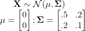
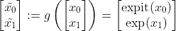
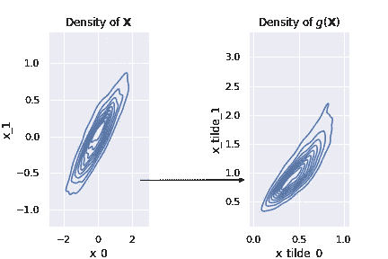
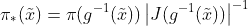
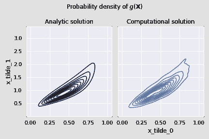

# 什么是前推分发？

> 原文：<https://towardsdatascience.com/whats-a-pushforward-distribution-17758c1fd542?source=collection_archive---------18----------------------->

## 学习如何通过计算和分析来评估它，利用 [JAX](https://jax.readthedocs.io/en/latest/) 的力量！

照片由 [David Sjunnesson](https://unsplash.com/@zervez?utm_source=medium&utm_medium=referral) 在 [Unsplash](https://unsplash.com?utm_source=medium&utm_medium=referral) 上拍摄

# 介绍

假设你有一个随机变量 ***X*** ，你把它经过一些变换 *g* 。由此产生的随机变量*g(****X****)*的分布称为“前推分布”。今天我们将学习如何计算它的概率密度。

# 例子

与其抽象地谈论，不如让我们从一个实际的例子开始。让我们考虑一个 2D 随机变量 ***X***

和变换 *g*

我们会用到它。 ***X*** 将由 g 得到转化为*g(****X****)*，我们要一个*g(****X****)*的概率分布公式。

# 预赛

让我们导入我们需要的东西，定义我们的发行版，并定义我们的转换。

太好了。要计算*g(****X***)，我们只需要:

1.  从`distribution`提取样本
2.  将`g`应用于`samples`的每个元素

(如果你不熟悉`jax.vmap` -参见 [jax 矢量化](https://jax.readthedocs.io/en/latest/jax.html#jax.vmap) -别担心，这只是矢量化计算的一个技巧)

我们接下来可以看看 ***X*** 的概率密度在 *g* 下是如何变化的:

概率密度在变换下是如何变化的

这是我们的向前推进的分布！现在让我们看看如何分析计算它。

# 让我们分析一下(不用数学)

在网上搜索(例如[这里](https://betanalpha.github.io/assets/case_studies/probability_theory.html)，我们可以找到一个可爱的前推概率密度的小公式:

最后一项涉及一个[行列式](https://en.wikipedia.org/wiki/Determinant)和一个[雅可比行列式](https://en.wikipedia.org/wiki/Jacobian_matrix_and_determinant)，我不相信自己能正确计算它们(尤其是对于任何可以生产的东西)。

然而，幸运的是，我不需要自己计算它们——我的计算机可以替我做！有了 [JAX](https://jax.readthedocs.io/en/latest/) ，求`transformation`和`point`的雅可比就和`jax.jacobian(transformation)(point)`一样简单！看看这个:

一旦我们找到了`pushforward_density`，我们就可以把它和它的计算副本一起绘制出来:

g(X)的密度图，通过计算和分析得出(并排)

嘿，他们匹配！

# 结论

如果我们通过一个变换推动一个概率分布，我们最终得到一个向前推动的分布。在这里，我们学习了如何通过计算和分析来计算它的概率密度。这两种方法都不需要我们手工做任何数学运算，多亏了令人敬畏的 JAX 图书馆。

# 参考

关于前推分布的更多内容，我建议阅读贝坦科特的优秀[概率论或](https://betanalpha.github.io/assets/case_studies/probability_theory.html) y 案例研究。