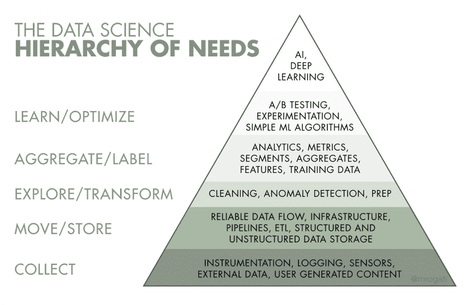
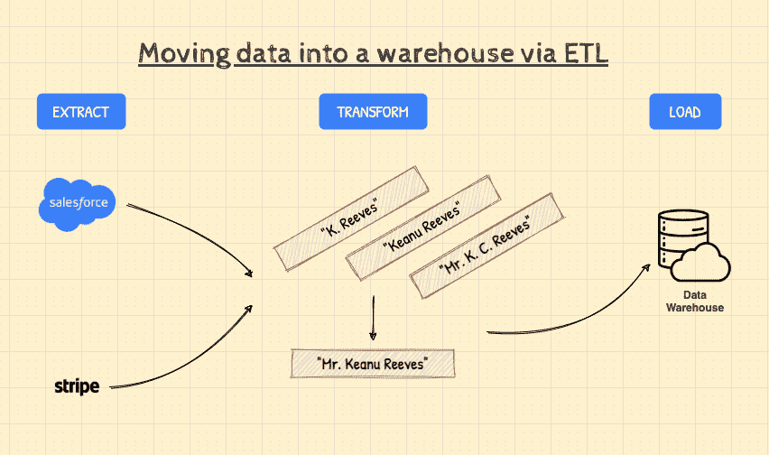
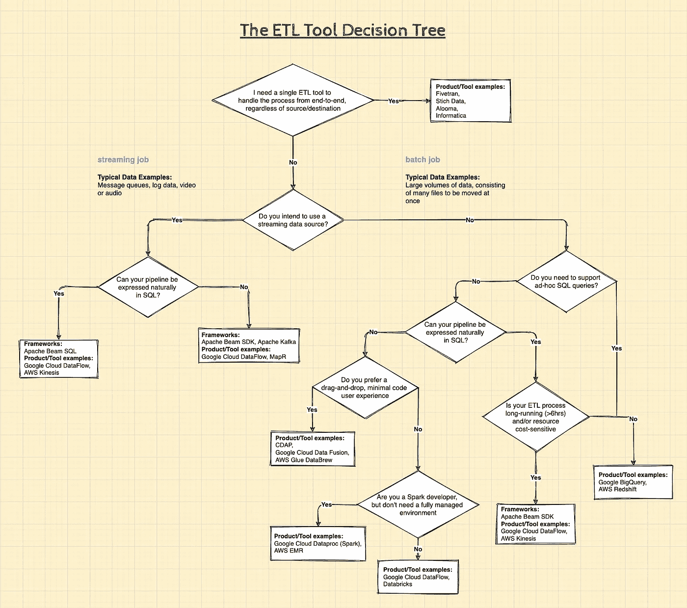

# ETL 是什么？

> 原文：<https://towardsdatascience.com/whats-etl-b4903a57f8ce?source=collection_archive---------14----------------------->

## [入门](https://towardsdatascience.com/tagged/getting-started)

## 以及为什么它对数据科学至关重要

[戈兰·艾沃斯](https://unsplash.com/@goran_ivos?utm_source=unsplash&utm_medium=referral&utm_content=creditCopyText)在 [Unsplash](https://unsplash.com/s/photos/filter?utm_source=unsplash&utm_medium=referral&utm_content=creditCopyText) 上的照片

在我的[上一篇文章](/whats-mlops-5bf60dd693dd)中，我谈到了通过引入机器学习(ML)模型的概念来将 ML 模型投入生产意味着什么。这次我们将看看 ML 的[数据科学步骤的另一端——数据提取和集成。](https://cloud.google.com/solutions/machine-learning/mlops-continuous-delivery-and-automation-pipelines-in-machine-learning#data_science_steps_for_ml)

# TL；速度三角形定位法(dead reckoning)

ETL 代表*提取-转换-加载*，它通常涉及从一个或多个源移动数据，进行一些更改，然后将其加载到一个新的单一目的地。

*   在大多数公司**中，数据往往处于孤岛状态**，以各种格式存储，并且经常不准确或不一致
*   如果我们希望能够轻松地分析这些数据并从中获得见解，或者**将这些数据** **用于数据科学**，这种情况就很不理想

# 🚣🏼我们是如何来到这里的

大多数最大似然算法需要大量的训练数据，以便产生能够做出准确预测的模型。他们还需要高质量的训练数据，代表我们试图解决的问题。

为了强调这一点，我遇到了一个很好的例子，类似于“[马斯洛的需求层次](https://en.wikipedia.org/wiki/Maslow%27s_hierarchy_of_needs)”，它强调了数据收集和存储在数据科学中的重要性:

*图 1:数据科学需求层次金字塔，来源:“人工智能需求层次”MONICA ROGATI[1]*

金字塔的底部是以正确的格式和系统以及正确的数量收集正确数据的基本需求。

> 人工智能和人工智能的任何应用都取决于所收集数据的质量。

所以，假设你已经[框定了你的问题，并确定它很适合 ML](https://developers.google.com/machine-learning/problem-framing) 。你知道你需要什么数据，至少开始实验。但不幸的是，它位于不同的系统中，分散在您的组织中。

下一步是找出如何将这些数据整合在一起，根据需要进行转换，然后将其作为一个集成的数据集放到某个地方。一旦数据可用，您就可以开始探索数据、执行特性工程和模型训练——这就是我们友好的缩写 ETL 发挥作用的地方！

# 🧪:它是如何工作的？

为了更具体一点，让我们使用一个现代真实世界的 ETL 例子。

假设您是一家在线零售商，使用 SalesForce 等客户关系管理(CRM)系统来跟踪您的注册客户。

您还可以使用 Stripe 等支付处理器来处理和存储通过您的电子商务网站进行的销售交易的详细信息。

假设您的目标是通过使用客户的历史购买数据来提高您的转化率，以便在他们浏览您的网站时提供更好的产品推荐。

您当然可以使用 ML 模型来驱动推荐引擎以实现这一目标。但是挑战在于你需要的数据存在于两个不同的系统中。在我们的案例中，解决方案是使用 ETL 过程来提取、转换和组合它们到一个数据仓库中:

*图 2:使用 ETL 将数据从不同来源转移到仓库的过程。作者插图。*

让我们分解一下上图中发生的情况:

**1。提取** —流程的这一部分涉及从我们的两个源(SalesForce 和 Stripe)中检索数据。一旦检索到数据，ETL 工具将把它加载到一个暂存区，为下一步做准备。

**2。转换** —这是一个关键的步骤，因为它处理我们的数据将如何被集成的细节。任何数据清理、重新格式化、重复数据删除和混合都发生在这里，然后才能在管道中继续传输。

在我们的例子中，假设在一个系统中，一个客户记录以名字“K. Reeves”存储，而在另一个系统中，相同的客户记录以名字“山谬·里维”存储。

假设我们知道这是同一个客户(根据他们的送货地址)，但是系统仍然需要核对这两个客户，这样我们就不会以重复记录结束。

➡️ ETL 框架和工具为我们提供了自动化这种转换所需的逻辑，并且也可以满足许多其他场景。

**3。Load** —包括成功地将传入的数据插入目标数据库、数据存储，或者在我们的例子中是数据仓库。

**现在你知道了，我们已经收集了我们的数据，使用 ETL 管道将其集成，并将其加载到数据科学可以访问的地方。**

📌 ***侧注*** 📌

**ETL 与 ELT**

你可能也遇到过“ELT”这个术语。提取、加载和转换(ELT)与 ETL 的区别仅在于转换发生在哪里。在 ELT 过程中，数据转换发生在目标数据存储中。

这可以通过删除有时是托管数据转换的独立或中间的暂存系统来简化架构。另一个优势是，您可以受益于云数据仓库等目的地通常提供的额外规模和计算性能。

📌 ***侧注*** 📌

# 🦀共同的挑战

好吧，所有这些 ETL 的东西听起来很简单，对不对？以下是一些需要注意的“陷阱”:

## ☄️标度

根据 IDC 的一份报告，到 2025 年，企业产生的数据量预计将增长 175 吉字节[2]。因此，您应该确保您选择的 ETL 工具不仅能够满足您当前的需求，而且能够满足未来的需求。您现在可以批量移动数据，但情况会一直如此吗？您可以并行运行多少个作业？

**如果您想让您的 ETL 流程经得起未来考验，那么迁移到云是一个非常安全的选择** —既能获得理论上无限的存储和计算可扩展性，同时还能降低您的 IT 资本支出。

## 🧮数据准确性

另一个大的 ETL 挑战是确保您转换的数据是准确和完整的。手动编码和更改，或者在运行 ETL 作业之前没有进行计划和测试，有时会引入错误，包括加载副本、丢失数据和其他问题。

ETL 工具肯定会减少手工编码的需要，并有助于减少错误。数据准确性测试有助于发现不一致和重复，监控功能有助于识别处理不兼容数据类型和其他数据管理问题的情况。

## 🍱数据来源的多样性

数据量正在增长。但更重要的是，它变得越来越复杂。一个企业可能要处理来自数百甚至数千个数据源的不同数据。这些可以包括结构化和半结构化源、实时源、平面文件、CSV、对象桶、流源以及任何新出现的内容。

其中一些数据最好是批量转换，而对于其他数据，流式连续数据转换效果更好。

对于如何处理不同的数据源，有一个策略是关键。一些现代 ETL 工具可以提供多种支持，包括在一个地方进行批处理和流式处理。

# 👷🏾‍♀️:那我该如何开始呢？

此时，您应该对为什么以及何时需要在您的数据科学工作流中使用 ETL 有一个很好的想法。我们还讨论了在您开始考虑 ETL 过程时需要注意的常见挑战。

我将用一个选择 ETL 工具的简单方法和一些其他有用的资源来结束本文。

## 🤷🏽‍♀️:我应该在什么时候使用哪种 ETL 工具？

因此，我们理解了 ETL 过程中发生的事情，但是从更实际的角度来看，这意味着什么呢？

**您将需要设计一个 ETL 管道，明确描述:**

*   从哪些数据源提取数据以及如何连接到它们
*   一旦有了数据，要对数据进行什么样的转换，最后
*   管道完成后，在哪里加载数据

ETL 管道可以使用基于代码的框架来表达，或者目前更流行的选择是使用 ETL 工具，这些工具提供“拖放”用户界面，允许您以可视化的方式定义管道中的步骤。

一旦实现了 ETL 管道，它通常需要在某个地方运行，即使用将执行管道的 ETL 工具，以及提供临时存储和转换数据所需资源的环境。

我已经尽力在下图中为你简化决策步骤(点击放大):

*图 3:使用哪个 ETL 工具以及何时使用。作者插图。*

**NB。这个决策树绝不是这两者的详尽列表；您需要做出的决策、可用的框架或产品。**

事实上，对于每一个中间的 ETL 步骤，都有许多开源和专有的产品。从编排到调度，我们不可能在这里面面俱到。

这篇文章的目的是作为进入 ETL 世界的跳板！祝您的数据集成之旅好运！😀

# 💡有用的资源和进一步阅读

## 链接

*   [机器学习的数据准备和特征工程](https://developers.google.com/machine-learning/data-prep)
*   [Gartner —数据集成工具评估和评级](https://www.gartner.com/reviews/market/data-integration-tools)

## **书籍**

*   [数据仓库 ETL 工具包](https://amzn.to/3qNtT85):提取、清理、符合和交付数据的实用技术，Wiley，作者:Ralph Kimball，Joe Caserta
*   [流系统](https://amzn.to/3qNHrQT):大规模数据处理的内容、地点、时间和方式，O'Reilly，作者:Tyler Akidau，Slava Chernyak，Reuven Lax

## **数据不可知的 ETL 工具**

*   [Fivetran](https://fivetran.com/)
*   [缝合](https://www.stitchdata.com/)

# 📇参考

[1]人工智能的需求层次，莫妮卡·罗加蒂

[https://hacker noon . com/the-ai-hierarchy-of-needs-18 f 111 FCC 007](https://hackernoon.com/the-ai-hierarchy-of-needs-18f111fcc007)

[2] 175 吉字节到 2025 年，福布斯，汤姆·库格林

[https://www . Forbes . com/sites/tomcoughlin/2018/11/27/175-zetta bytes-by-2025/？sh=6a5d2e7a5459](https://www.forbes.com/sites/tomcoughlin/2018/11/27/175-zettabytes-by-2025/?sh=6a5d2e7a5459)