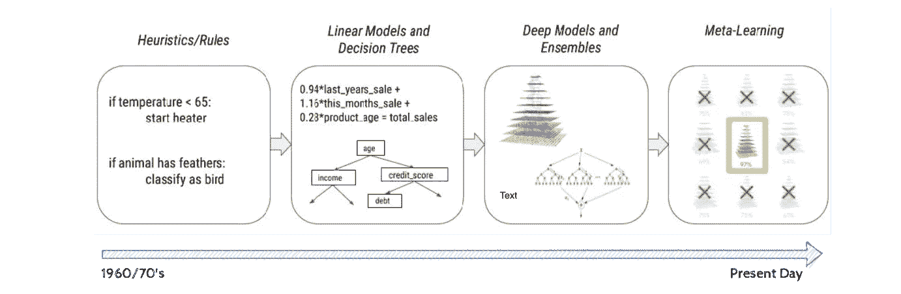
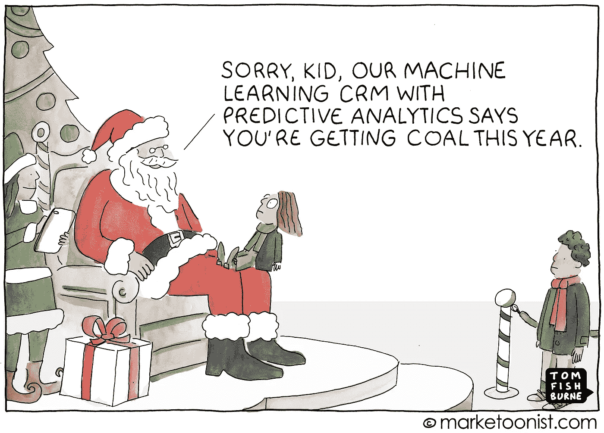
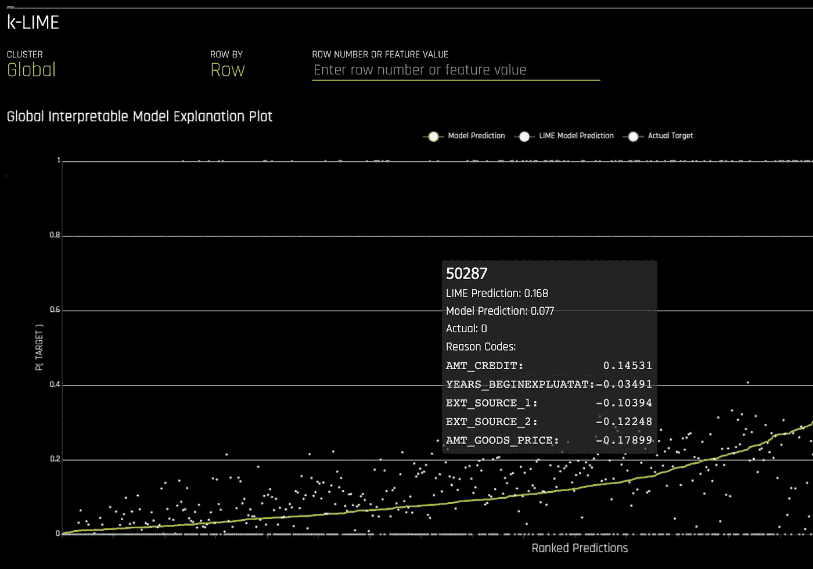
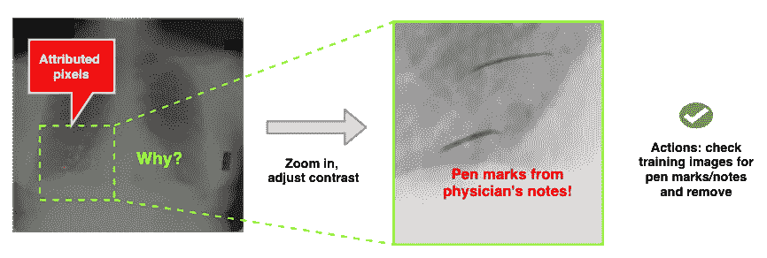
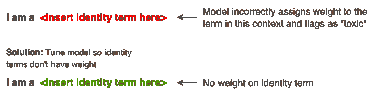
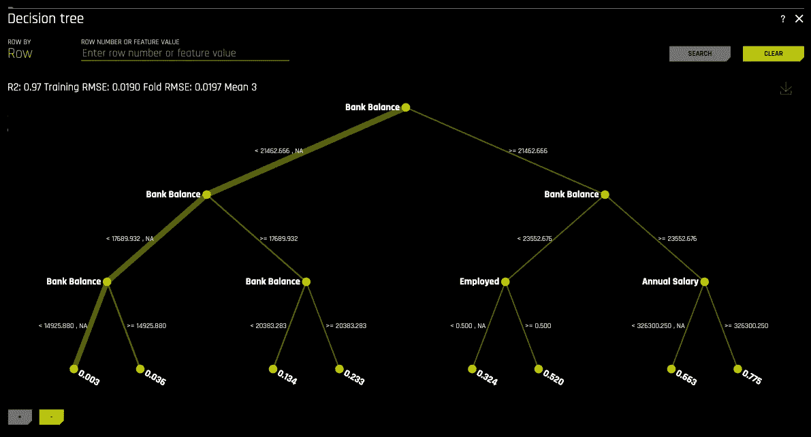
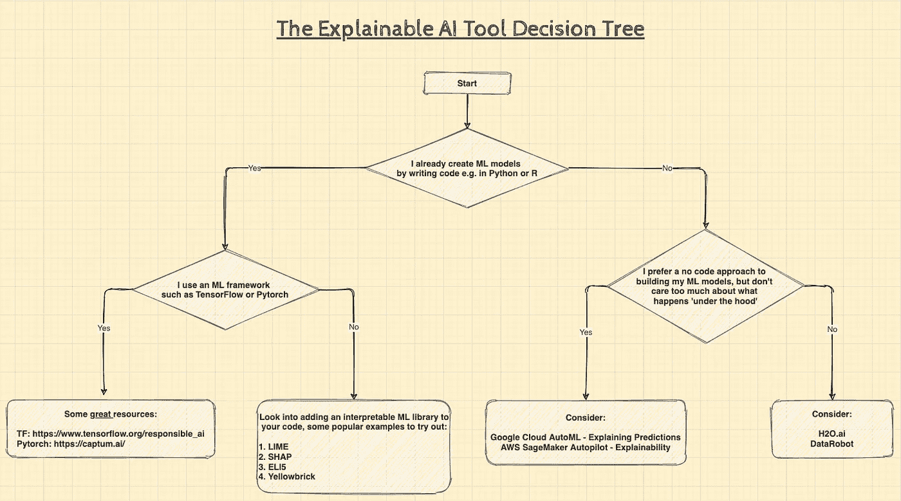

# 什么是可解释的人工智能？

> 原文：<https://towardsdatascience.com/whats-explainable-ai-fff416111830?source=collection_archive---------33----------------------->

## [模型可解释性](https://towardsdatascience.com/tagged/model-interpretability)

## 揭秘 AI 输出，建立信任

由[弗拉德·法拉](https://unsplash.com/@vldfr?utm_source=unsplash&utm_medium=referral&utm_content=creditCopyText)在 [Unsplash](https://unsplash.com/s/photos/fog-clearing?utm_source=unsplash&utm_medium=referral&utm_content=creditCopyText) 上拍摄

# TL；速度三角形定位法(dead reckoning)

*   人工智能系统的有效性和广泛接受度取决于它们的可信度，尤其是领域专家和最终用户的可信度。
*   反过来，信任可能会受到我们无法理解和解释人工智能解决方案工作或失败的原因和方式的限制。
*   人工智能可解释性是指易于理解的信息，解释人工智能系统做出决策的原因和方式。

# 🚣🏼我们是如何来到这里的

## 机器学习已经进化了

自 20 世纪 60 年代开发出第一个专家系统以来，更容易获得的计算资源和不断增长的训练数据集规模使机器学习(ML)模型能够为人工智能提供强大动力，并取得了长足的进步[1]。

在我们寻求推动人工智能边界的过程中，从基于规则的系统到线性模型和决策树、神经网络和深度学习模型，再到最近的元学习模型或“创建其他 ML 模型的 ML”，一直在稳步发展。

*图 1:机器学习的演变，改编自《人工智能可解释白皮书》【2】*

这些新的更精确的模型实现了:

*   **更广泛更高级的用例**，比如自动驾驶、[蛋白质折叠](https://deepmind.com/blog/article/alphafold-a-solution-to-a-50-year-old-grand-challenge-in-biology)，以及药物发现。
*   **数据类型的多功能性**，这意味着使用图像、音频、语音、文本、表格和时间序列数据的组合来训练模型的能力。
*   **更强的适应性**，这是使用[转移学习](https://en.wikipedia.org/wiki/Transfer_learning)等技术快速构建通用模型的能力，无需从头开始训练。

但是有一个权衡。以下是一些常见的挑战:

*   **透明度和调试能力的丧失**，随着复杂性的增加，理解一个模型如何做出预测变得越来越困难，因此也更难修复。这种缺乏透明度的情况确实会减缓这些模型的采用，尤其是在金融服务和医疗保健等受到严格监管的行业。
*   **数据偏见的放大**，数据中的人类和社会偏见，如历史不公平、隐含的刻板印象和偏见，可能会被放大，更难确定。

# 🤯对可解释人工智能的需求

机器学习的发展意味着，在理解人工智能系统如何做出决策时，我们需要找到建立信任和透明度的方法。

2021 Marketoonist。经 Marketoonist LLC 许可使用。

今天，有越来越多的用例具有真实世界的结果，这反过来需要清晰和相关的解释——那么可解释的人工智能如何满足这种需求？

它提供了以下功能:

**1-解释**一个模型如何得出一个预测，甚至是一个特定的数据点。例如，图 2 中的截图显示了 H2O.ai 中的一个模型解释工具，一个云不可知的 AutoML 产品。

在这种情况下，我在贷款违约数据集上训练了一个模型[3]。对于突出显示的行，您可以看到哪些功能和值导致了模型的预测，即 0 =客户持续付款，1 =客户违约。

解释预测的能力有一些重要的含义；我们可以开始证明决策的合理性，并提供如何影响结果的建议。

*图 2: H2O.ai，k-LIME 模型解释工具*

**2-调试**以隔离模型中的异常行为，并**优化**数据收集过程。[调试工具](https://cloud.google.com/blog/products/ai-machine-learning/explaining-model-predictions-on-image-data)，比如那些基于谷歌综合梯度研究所发表的论文【4】的调试工具，可以返回表示模型预测的单个像素。

例如，图 3 说明了一个场景，其中一个模型使用胸部 X 射线图像重复错误分类疾病。

*图 3:使用胸部 x 光图像时的误分类疾病。作者插图。*

经过更仔细的检查，发现这个模型把医生在 x 光片上的记录误解为疾病的征兆。这种可解释性使得采取纠正措施变得容易，在我们的例子中，清理图像并重新训练模型。

**3-验证**模型的行为是可接受的。例如，用于识别博客帖子中有毒评论的自然语言处理(NLP)模型可能会对敏感术语赋予过多的权重。

有毒评论有时会使用人们用来识别自己的词语，如种族、宗教和性别，以贬损他人。因此，包含这些术语的评论可能会被误归类为“有毒”。

第一步可以是确定模型分配给特定特征的权重，然后调整(应用[正则化](https://machinelearningmastery.com/weight-regularization-to-reduce-overfitting-of-deep-learning-models/))以减少分配给包含与个人身份相关的术语的特征的权重，如图 4 所示。

*图 4:验证模型行为。作者插图。*

**4-至今**一款车型的“要旨”。例如，图 5 中的屏幕截图是 H2O.ai 中的可解释性工具的另一个示例。同样，使用贷款默认数据集，它生成一个决策树，描述通向模型预测输出的输入和路径。

也许与直觉相反，一条路径表明，有工作的人比没有工作的人拖欠还款的可能性更高。但是有人可能会说，一个没有工作的人不可能首先获得贷款！

但是严肃地说，这种能力对于向最终用户概括模型如何工作非常有用，而不需要进入复杂的代码。

*图 5: H2O.ai，决策树代理模型解释工具*

# 👷🏾‍♀️:那我该如何开始呢？

这篇文章的目的是介绍可解释人工智能的概念，但显然这是一个非常广泛的话题。从如何使用它来帮助建立信任、解决偏见和确保公平，到大量可用的工具和技术。这超出了我在这里打算涵盖的范围，所以我在进一步阅读下面添加了一些建议。

➡️:对于那些想直接进入的人，我根据你的专业知识水平和建立模型的经验，对“如何开始”将可解释的人工智能添加到你的 ML 工作流程中的选项进行了细分(点击放大):

*图 6:如何入门可解释的 AI。作者插图。*

我希望这篇文章对你有用，如果有用，请给它一个👏而且一定要分享。我也很想知道你对这个帖子和格式的想法，所以请使用下面的评论或 [twitter](https://twitter.com/theomermahmood) 来联系！

🙏🏼最后，非常感谢[塔希尔·马哈茂德](https://www.linkedin.com/in/tahir-m-cfa/)的内容建议！

# 📇参考

[1]**Britannica.com，专家系统，计算机科学，弗拉基米尔·兹沃斯:**[https://www.britannica.com/technology/expert-system](https://www.britannica.com/technology/expert-system)

[2] **Google Cloud，AI Explainability 白皮书:**[https://storage . Google APIs . com/Cloud-AI-whites/AI % 20 explaibility % 20 white page . pdf](https://storage.googleapis.com/cloud-ai-whitepapers/AI%20Explainability%20Whitepaper.pdf)

【3】【https://www.kaggle.com/kmldas/loan-default-prediction】贷款违约预测，金融分析初学者资料集，卡迈勒达斯:

[4] **深度网络的公理化归属**，穆昆德·孙达拉拉詹，安库尔·塔利，奇奇·严，2017 年 6 月 12 日:

# 📚进一步阅读

*   **可解释的机器学习，让黑盒模型变得可解释的指南，**作者 Christoph Molnar，2021 年 4 月 26 日:[https://christophm.github.io/interpretable-ml-book/](https://christophm.github.io/interpretable-ml-book/)
*   **tensor flow 的责任 AI 工具包:**[https://www.tensorflow.org/responsible_ai](https://www.tensorflow.org/responsible_ai)
*   对于人工智能中的偏见，我们该做些什么？作者:詹姆斯·曼尼卡、杰克·西尔伯格和布列塔尼·普雷斯滕，2019 年 10 月 25 日:[https://HBR . org/2019/10/what-do-we-do-the-bias-in-ai](https://hbr.org/2019/10/what-do-we-do-about-the-biases-in-ai)
*   **SHAP 和莱姆 Python 库:第一部分**，作者约书亚·波杜斯卡，2018 年 12 月 5 日:[https://blog . dominodatalab . com/shap-LIME-Python-Libraries-Part-1-great-explainers-pros-consenses/](https://blog.dominodatalab.com/shap-lime-python-libraries-part-1-great-explainers-pros-cons/)