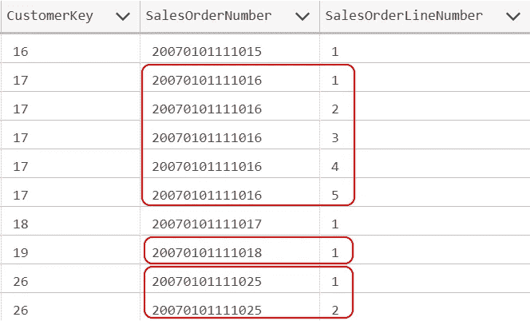
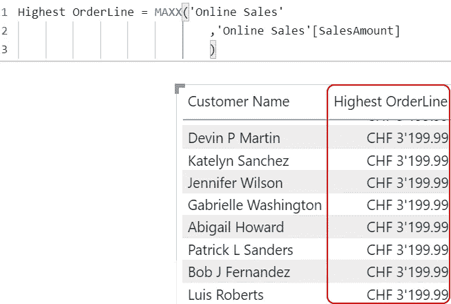
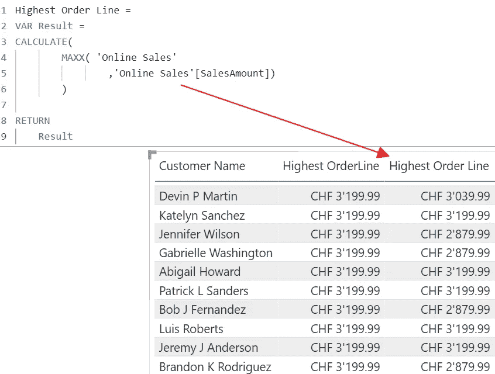
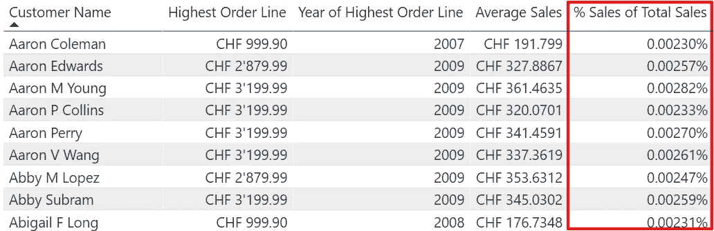
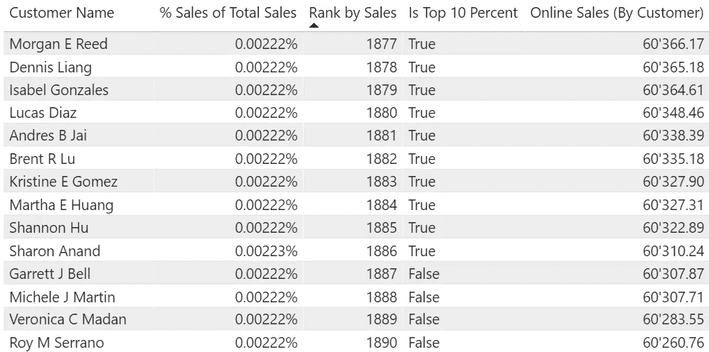

# DAX 中的语境转换有什么花哨的地方？

> 原文：<https://towardsdatascience.com/whats-fancy-about-context-transition-in-dax-efb5d5bc4c01?source=collection_archive---------10----------------------->

## *行和过滤器上下文是 DAX 中众所周知的概念。但是我们可以通过上下文转换在这两者之间切换。让我们看看我们能用它做什么。*


由[雷蒙·克拉文斯](https://unsplash.com/@raimondklavins?utm_source=medium&utm_medium=referral)在 [Unsplash](https://unsplash.com?utm_source=medium&utm_medium=referral) 上拍摄的照片

# 介绍

在本文中，我将向您展示什么是 DAX 中的上下文转换以及如何使用它。

我将只讲述这个特性的基础知识。如果我想解释所有的细节，我将不得不开始一整个系列的文章。

相反，我想给你一些小例子，告诉你如何使用上下文转换，以及关于它最重要的事情。这样，您可以开始使用它，并根据需要了解更多信息。

你可以在文章的最后找到一个文章和博客帖子的列表，这些文章和博客帖子更深入地探讨了上下文转换。

# 首先，我们来说说数据。

我使用 Contoso 样本数据集，就像我以前的文章一样。

在整个数据模型中，对于本文中的示例，我只需要两个表:

*   客户(dim 客户)
*   在线销售(FactOnlineSales)

关于在线销售表的一个重要因素是存储在在线销售表中的订单包含一个 OrderNumber 和一个 OrderLineNumber。

一个订单可以有一个或多个 OrderLineNumber:



图 1 —样本数据(图片由作者提供)

每个 OrderLineNumber 都有一个映射的产品和一个 SalesAmount。

为了保持代码简单，我将分析单个订单行，而不是订单。

我需要改变数据的粒度，以便能够分析订单。我将在以后的文章中继续讨论在 DAX 中改变粒度的话题。

# 商业案例

让我们假设以下情况:我们有一个客户列表，我们想知道每个客户的总销售额并获得其他信息。

为了获得所需的信息，我们希望计算以下结果:

*   客户表中每个客户的最高销售额
*   每个客户每年的总销售额
*   每位顾客的平均销售额是多少
*   按客户列出的销售额占所有销售额的百分比
*   每年总销售额排名前 10 %的客户是谁

我无法创建度量来计算这些结果，因为我想将它们用作切片器中的筛选器以及我的报告中的报告属性。
这意味着我必须在 Customer 表中添加计算的 DAX 列。

# 客户表中每个客户的最高销售额

这个要求看起来很简单:从每个客户的在线销售表中获取 MAX()。

但是，我无法在 Customer 表中用 MAX('Online Sales'[SalesAmount])创建计算列，因为 SalesAmount 列不在 Customer 表中。

我可以编写以下代码:

```
Highest OrderLine = MAXX(‘Online Sales’
      , ‘Online Sales’[SalesAmount]
)
```

结果将如下所示:



图 2 —简单的 MAXX(图片由作者提供)

由于 MAXX 没有过滤器上下文，它将检索所有客户中销售额最高的订单行。

我必须使用上下文转换来强制 DAX 引擎从行上下文切换到过滤器上下文。在上下文转换过程中，实际行的内容将被添加到过滤器上下文中，MAXX 将使用该过滤器上下文执行。

我可以用 CALCULATE()强制进行上下文转换:

```
Highest Order Line =
    VAR Result =
        CALCULATE(
            MAXX( ‘Online Sales’
                  ,’Online Sales’[SalesAmount])
                 )RETURN
    Result
```

你可以在下图中看到结果:



图 3 —带有上下文转换的 MAXX(图片由作者提供)

会发生什么？

1.  在对 Customer 表中的每一行进行迭代的过程中，context transition 将实际行的内容添加到筛选器上下文中，包括 CustomerKey 列。CustomerKey 列用于与 Online Sales 表的关系中。
2.  CustomerKey 为每个客户筛选在线销售表
3.  现在为每个 CustomerKey 计算 SalesAmount 列的最大值

您可以利用所有迭代器函数的上下文转换，包括 FILTER()和其他函数。

我在我的上一篇文章([称体重或不称体重——这是一个普通的问题](/to-weigh-or-not-to-weigh-this-is-the-average-question-ece33fad9180))中使用了这个技巧，采用了以下方法:

```
Average per Country =
    AVERAGEX(VALUES(‘Geography’[Region Country])
        ,DIVIDE([Online Sales (By Customer)]
                 , [Order Count (By Customer)] )
    )
```

尽管您在解决方案中看不到任何 CALCULATE()，但我在 AVERAGEX 函数中使用了度量。在行上下文中使用度量会自动触发上下文转换。

# 客户表中每个客户销售额最高的年份

这个要求解决起来有点复杂。

如上所述，我不想创建度量，因为我想在切片器中使用计算结果。

因此，我还必须创建一个计算列:

```
Year of Highest Order Line =VAR HighestOrderLine = ‘Customer’[Highest Order Line]VAR Result =
    CALCULATE(
        MAXX ( ‘Online Sales’
                ,YEAR(‘Online Sales’[OrderDate])
               )
            , ‘Online Sales’[SalesAmount] = HighestOrderLine
            )RETURN
    Result
```

同样，我使用 CALCULATE()启动上下文转换，这会自动将 CustomerKey 列添加到 MAXX()函数的过滤器上下文中。正因为如此，我不需要在 CALCULATE()里面按 CustomerKey 过滤。

我只需要搜索销售额最高的订单行，这是我在上一篇专栏文章中计算的，然后使用 MAXX 获得去年的销售额。

使用 CALCULATE()添加的筛选器被添加到现有的筛选器上下文中，该上下文已经通过上下文转换包含了 customer 表中当前客户的行。

你可以在下图中看到结果:


图 4 —去年销售额最高的一年(图片由作者提供)

# 每位顾客的平均销售额是多少

以你到现在为止所获得的知识，你应该能够独立解决这个需求。

试着想一想，想出一个解决方案可能是什么样子的想法。

.

.

.

完成了吗？

好了，这是这个计算列的解:

```
Average Sales = CALCULATE(
                          AVERAGEX(‘Online Sales’
                          ,’Online Sales’[SalesAmount])
                          )
```

上下文转换允许我们编写这样简短而强大的 DAX 公式。

另一种方法是用 AVERAGEX()创建一个度量，如上所示，并将这个度量直接用于计算列。

# 按客户列出的销售额占所有销售额的百分比

这一要求要求我们结合获得的知识，使用以下 DAX 公式创建一个新的计算列:

```
% Sales of Total Sales =VAR SalesOverall = SUMX(‘Online Sales’
                        ,’Online Sales’[SalesAmount]
                        )VAR SalesOfCustomer = CALCULATE(
                             SUMX(‘Online Sales’
                                   ,’Online Sales’[SalesAmount]
                                  )
                              )VAR PctOfTotalSales = DIVIDE(SalesOfCustomer, SalesOverall)RETURN
    PctOfTotalSales
```

下面是这个公式的解释:

1.  变量*sales total*不使用上下文转换。结果是所有客户的总销售额
2.  变量 SalesOfCustomer 用 CALCULATE()包含了与*sales total*相同的表达式，从而强制执行上下文转换。
    结果是当前客户的销售额总和
3.  变量*中的除法运算 PctOfTotalSales* 计算*销售额占*总销售额*的百分比*

结果看起来像这样:



图 5 —每个客户占总销售额的百分比(图片由作者提供)

# 哪个客户在总销售额的前 10 %之内

为此，我需要根据总销售额计算所有客户的排名。然后我需要得到最高的排名，或者说客户数量，计算出哪些客户在所有客户的前 10 %。

输出应该是包含 True 或 False 值的列。

你可以想象，这是不可能一步到位的。

在这里，我想向您展示两种解决方案，它们以略微不同的方式使用上下文转换。

# 解决方案 1-计算表和查找值()

通过这种方法，我创建了一个计算 DAX 表。然后我使用 LOOKUPVALUE()将这些值映射到 Customer 表中。

这是创建 DAX 表的代码:

```
Customer Ranking =VAR CustAndSales = ADDCOLUMNS( VALUES(Customer[CustomerKey] )
                              ,”Amt”, [Online Sales (By Order Date)]
                              )VAR RankedCustomer = ADDCOLUMNS(CustAndSales
                                ,”Rank”, RANKX(CustAndSales
                                               ,[Amt]
                                               )
                                 )VAR MaxRank = MAXX( RankedCustomer
                     ,[Rank]
                     )VAR Result = ADDCOLUMNS(
                    RankedCustomer
                    ,”IsTop10Perc”
                        , IF(
                               DIVIDE( [Rank]
                                     , MaxRank ) <= 0.1
                               , TRUE()
                               ,FALSE()
                               )
                         )RETURN
    Result
```

变量 *CustAndSales* 创建一个所有 CustomerKey 的列表，并使用度量[在线销售额(按订单日期)]计算每个客户的销售额总和

1.  在变量 *RankedCustomer 中，*我使用 RANKX()根据每个客户的总销售额来计算总体 CustomerKeys 的排名
2.  变量 *MaxRank* 获得最高等级，我将在下面的变量中使用它
3.  最后，我将添加带有 IF()结果的列 IsTop10Perc。根据每个客户的总销售额，如果客户位于前 10 %的客户中，则此列包含该标志

现在，我使用以下表达式在 Customer 表中创建新的计算列:

```
Is Top 10 % customer by Sales =VAR Result = LOOKUPVALUE(‘Customer Ranking’[IsTop10Perc]
                          , ‘Customer Ranking’[CustomerKey]
                          , ‘Customer’[CustomerKey]
                          )RETURN
    Result
```

我可以使用这种方法从计算的 DAX 表中添加以下列:

*   按销售额排名
*   是前 10%
*   每位客户的总销售额

# 解决方案 2-本地计算的列

使用这种方法，我创建了几个包含中间结果的计算列来获得最终结果。

1.  每位客户的总销售额:

要获得每个客户的总销售额，我需要使用现有的方法[在线销售额(按订单日期)]:

```
Total Sales per Customer = [Online Sales (By Order Date)]
```

当我们在行上下文中使用一个度量时，DAX 开始一个上下文转换，这足以获得每个客户的销售总额。

2.计算每个客户的排名

我需要列[每个客户的总销售额]来计算排名。

与第一个解决方案一样，我使用 RANKX 来完成这项工作:

```
Rank by Sales (local) = RANKX(‘Customer’
                              ,’Customer’[Total Sales per Customer])
```

3.按销售额设定前 10 %的客户

最后，我可以使用与之前相同的逻辑来查找当前客户是否在总销售额前 10 %的客户中:

```
Is Top 10 Percent (local) =VAR MaxRank = MAXX( ‘Customer’
                    ,[Rank by Sales (local)]
                    )VAR Result = IF(
                DIVIDE( [Rank by Sales (local)]
                        , MaxRank ) <= 0.1
                  ,TRUE()
                  ,FALSE()
                  )RETURN
    Result
```

如您所见，这两种解决方案使用相同的基本逻辑，但技术略有不同。

你想用哪个由你决定。

两种解决方案的结果是相同的:



图 6 —带有排名和前 10%标志的客户列表

解决方案 1 是我的第一个方法，因为它看起来更容易做到。我隐藏了计算表，因为在我将所有列都包含到 Customer 表中之后，它就没有用了。但是，我不喜欢模型中有不必要的对象，所以我想出了没有 DAX 表的情况下如何解决需求。

# 结论

上下文转换是 DAX 中一个复杂但非常有用的特性。这个功能可以比你不知道怎么用的时候更快的帮你解决问题。


米歇尔·玛特隆在 [Unsplash](https://unsplash.com?utm_source=medium&utm_medium=referral) 上的照片

但是它有一些重要的怪癖，你需要知道:

*   背景转换在措施上是缓慢的
*   上下文转换所使用的表中的重复行(上面例子中的“在线销售”事实表)可能会导致错误的结果，这是很难发现的。
*   您需要知道上下文转换何时发生:总是在您遍历行、使用度量或者使用 CALCULATE()时

我鼓励您阅读下面的 SQL 文章[了解上下文转换——SQL bi](https://www.sqlbi.com/articles/understanding-context-transition/)来学习基础知识。

您可以阅读文章[CALCULATE-SQLBI 中的上下文转换和过滤器](https://www.sqlbi.com/articles/context-transition-and-filters-in-calculate/)来了解 CALCULATE 中的上下文转换。

阅读本文[https://www . burning suit . co . uk/blog/2021/08/context-transition-where-the-row-context-become-a-filter-context/](https://www.burningsuit.co.uk/blog/2021/08/context-transition-where-the-row-context-becomes-a-filter-context/)，其中包含了对上下文转换的完整解释，包括使用上下文转换时需要考虑的事项

这里有更多关于这个重要话题的文章和博客:

[https://blog . enterprise DNA . co/power-bi-filters-invoking-context-transitions/](https://blog.enterprisedna.co/power-bi-filters-invoking-context-transitions/)

[https://blog . enterprise DNA . co/iterators-and-context-transitions-in-DAX-queries/](https://blog.enterprisedna.co/iterators-and-context-transitions-in-dax-queries/)

[https://blog . enterprise DNA . co/DAX-calculation-filter-context-transitions/](https://blog.enterprisedna.co/dax-calculation-filter-context-transitions/)

[https://Community . power bi . com/T5/Community-Blog/DAX-Context-Transition-Why-it-can-hand-to-use-a-Measure/ba-p/1133639](https://community.powerbi.com/t5/Community-Blog/DAX-Context-Transition-Why-it-can-be-handy-to-use-a-Measure/ba-p/1133639)