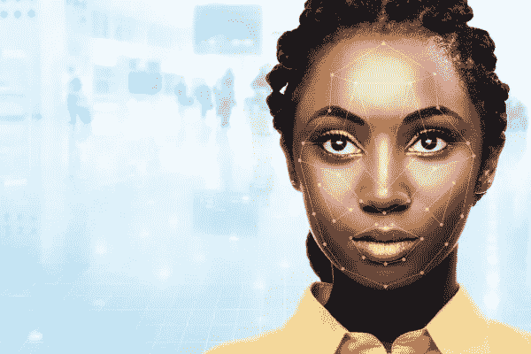
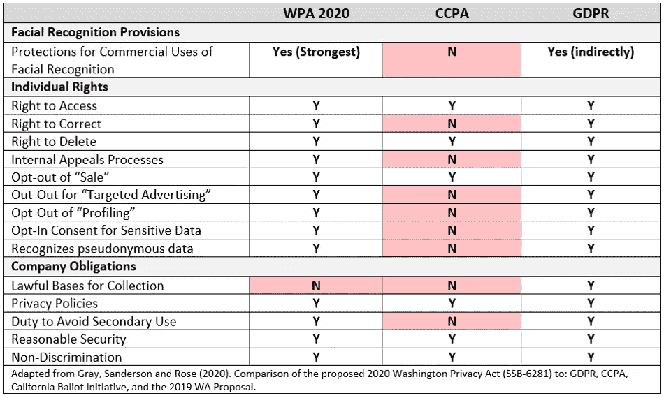

# 一张脸有什么？

> 原文：<https://towardsdatascience.com/whats-in-a-face-measuring-the-risks-and-benefits-of-facial-recognition-technology-7335348e01b6?source=collection_archive---------30----------------------->

## 权衡面部识别技术的风险和好处

信用:Karelnoppe/Shutterstock

近年来，面部识别技术(FRT)在能力和使用范围上都有了很大的发展。它在医药、消费应用以及安全和执法领域提供了解决方案。然而，首次登记税使用的增加引起了对信息技术滥用的担忧，以及对隐私、公民自由和偏见的担忧。几个州已经颁布了拟议的法律来规范首次登记税的使用，但是各州的法律并不一致。

为了利用 FRT 背后的力量，同时保护隐私和公民自由，必须有一部联邦法律来保护整个国家免受风险。为了更好地理解什么是可行的联邦法规，需要对首次登记税进行更详细的检查。

## **面部识别的种族主义历史**

面部识别的根源可以追溯到相面学，即通过一个人的外表来推断其性格的实践。切萨雷·龙勃罗梭是 19 世纪的意大利科学家和外科医生，他记录了精确的测量数据和身体特征，从而得出罪犯是天生罪犯的结论。他提出的理论是试图证明北方意大利人长期持有的种族主义信仰是正确的，他们认为南方意大利人在种族上是劣等的。

在 20 世纪，像艾伦斯特·赫克尔这样的德国生物学家用同样类型的种族等级合理化来丑化外国群体。这种相同类型的面相类型的理论，然后被纳粹用来证明对犹太人的迫害和种族灭绝。面相学长期以来一直被怀疑，并被贴上伪科学的标签。但这并没有阻止现代研究人员和初创公司尝试使用面部数据来评估性格和智力。人工智能和机器学习不仅推动了现已被揭穿的相面学的重生，还为其不道德的使用提供了一种客观性。

## **面部识别技术今天是如何工作的**

人脸识别技术可以分为人脸数据和人脸识别。面部数据是与可识别个人相关的任何信息，包括来自一系列来源的图像，包括个人自己提供的图像、政府身份记录、社交媒体、网站、罪犯面部照片和监控。面部识别描述了提取数据，从数据中挑选出面部，识别面部的独特特征，然后比较面部以找到匹配的过程。机器学习对卷积神经网络(CNN)的使用使 FCR 变得准确、自动化和快速。

## **面部识别技术的好处**

公司和组织已经开发了面向消费者的面部识别技术应用，改善了客户体验。FRT 应用包括安全和安保、访问和认证方面的增强、疾病诊断方面的巨大飞跃以及有针对性的营销和客户服务。

在所列的 FRT 应用中，与安全和安保相关的应用往往是与该技术相关的最受吹捧的好处。执法机构使用 FRT 寻找失踪人员、识别通缉犯和早期威胁检测。在医学上，FRT 可用于诊断导致可检测的外观变化的疾病，并有望成为所有类型疾病的无价诊断工具。

在消费者层面上，FRT 可以用作锁定个人设备和访问账户或服务的工具，就像银行业一样。人脸识别不需要可破解的密码，这项技术可以在分行和自动取款机上使用。FRT 在零售业中也有重要的应用。用你的脸付款可以大大减少结账队伍。顾客体验也可以通过定制购物体验来改善。

## **面部识别技术的缺点**

虽然 FRT 的好处是显而易见的，但让我们看看这项技术带来的一些陷阱。

***知情同意:*** 面部识别由于其使用范围的扩大，引起了立法者和公民及隐私权倡导者的关注。无论是私营部门还是公共部门，面部识别技术通常都是在未经同意的情况下部署的。因此，面部数据的收集和随后的使用引起了对民事和隐私权的关注。与其他形式的帐户身份验证不同，面部数据是唯一且不可替代的。因此，关于面部识别的安全问题变得至关重要。一旦面部数据遭到黑客攻击，个人的隐私和安全就会受到威胁，因为他们的生物特征数据不再能够用作安全的识别特征。

***偏差:*** 面部识别技术应该被期望为特定用途显示准确性，以证明整体利益战胜风险。然而，事实并非如此。CNN 使用主要包含白人男性面部图像的面部数据进行训练。由于缺乏多样性，面部识别算法在被要求识别非白人面孔时表现不佳。美国公民自由联盟[在测试亚马逊的面部识别工具“rekognition”时证明了这种偏见，他们将国会议员的脸与数据库中因犯罪被捕的人的图像进行比较。该软件错误地将 28 张面孔与数据库匹配，错误匹配的是不成比例的有色人种。](https://www.aclu.org/blog/privacy-technology/surveillance-technologies/amazons-face-recognition-falsely-matched-28)

## **面部识别技术:伦理和隐私**

***道德:*** 使用 FCR 技术的组织使用各种道德借口来合理化面部识别技术的不道德使用，这种使用可能会延续偏见并阻碍隐私和公民自由。

***隐私:*** 除了身份识别，FRT 还可以用于监控，这种监控方式不需要被监控者知情、同意或参与。由于监控摄像头现在无处不在，人们已经习惯了在公共场合被记录。这些属于私人公司、执法部门和政府机构的相机不再被注意，被认为只是用于安全目的。

个人并不完全理解 FRT 如何消除与在公共场所被记录相关联的匿名性，并允许组织不仅识别个人，还分析他们的面部数据并从中得出见解，而无需同意。由于首次登记税在公共和私营部门的广泛使用，它的这一方面引起了立法者和隐私权倡导者的注意。但是，对于扩大首次登记税的使用，各州和联邦政府正在做些什么呢？

## **当前关于面部识别的州法律:WPA 2020 模型**

各州一直在努力解决如何监管开发和实施面部识别技术的组织。目前针对面部识别的法律包括伊利诺伊州的《生物识别信息隐私法》(BIPA)、加利福尼亚州的《消费者隐私法》(CCPA)和华盛顿州的《隐私法》(SSB 6281)，该法案将很快由州参议院投票表决。

在所有现行的州法律中,《华盛顿州隐私法》提供的保护超过了《CPPA 》,这是美国唯一一部全面涵盖消费者隐私的法律。为了更好地突出法律的优势，比较一下《华盛顿州隐私法》、《CPPA》和《欧盟一般数据保护条例》( GDPR)是有益的。

鸣谢:作者图片

## **FCR 的允许用途**

华盛顿隐私法案为国会提供了一个很好的模板，用于监管面部识别技术。它解决了对首次登记税商业用途的保护，同时建立了保护个人权利和确保履行公司义务的 GDPR 模式。由于各州的首次登记税法律不同，让国会在联邦层面通过法律将确保所有美国人免受首次登记税的滥用。《面部识别技术授权令法案》的通过可以进一步保护隐私和公民自由，该法案要求有正当理由的授权令才能跟踪一个人超过 72 小时的公共活动，并将跟踪限制在 30 天内。

任何联邦法律都必须提供一个强有力的道德框架来帮助企业穿越灰色地带。这一框架应强调公平和包容性、问责制、信任和适应性。有了正确的监管和保护，面部识别技术可以让世界变得更安全、更方便、更智能。首次登记税可以给社会带来广泛的好处，包括诊断疾病、协助执法、促进安全交易和改善客户体验。采取适当的安全措施将有助于确保每个人安全可靠地从 FRT 的进步中受益。