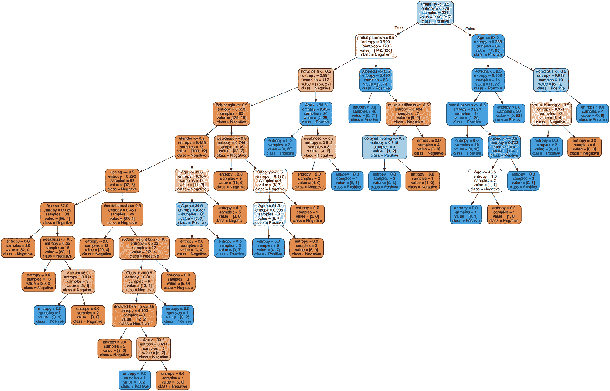

# “随机森林”里有什么？预测糖尿病

> 原文：<https://towardsdatascience.com/whats-in-a-random-forest-predicting-diabetes-18f3707b6343?source=collection_archive---------15----------------------->

## [动手教程](https://towardsdatascience.com/tagged/hands-on-tutorials)，机器学习，凭直觉

## 直观地理解随机森林并在真实的医院患者数据中预测糖尿病


照片由[普里西拉·杜·普里兹](https://unsplash.com/@priscilladupreez?utm_source=medium&utm_medium=referral)在 [Unsplash](https://unsplash.com?utm_source=medium&utm_medium=referral) 上拍摄

(*免责声明:*这篇文章主要是为那些想要友好、直观地了解随机森林和决策树中正在发生的事情的人准备的——所以我不会涉及大量的数学细节。如果你想了解更多的统计细节，我会在文章的下面贴一些视频和材料的链接。如果您也对 Python 实现感兴趣，请进一步阅读！)

如果你听说过“随机森林”是一个热门、性感的机器学习算法，并且你想实现它，那太好了！但是如果你不确定随机森林中到底发生了什么，或者随机森林是如何做出分类决定的，那么请继续阅读:)

我们会发现，我们可以将随机森林分解成更小、更易消化的部分。正如森林是由树组成的一样，随机森林是由一堆随机抽样的子组件组成的，这些子组件被称为*决策树*。所以首先让我们试着理解什么是决策树，以及它是如何进行预测的。现在，我们只看分类决策树。

顾名思义，决策树有一个树状结构，由“真/假树枝”组成，这些树枝会分裂(就像现实生活中的树枝会分裂一样！).这就像看一棵倒挂的树——想象树干在顶部。事实上，决策树是非常容易解释的，因为人类也对某些选择做决策树——通常称为流程图！


图片来源:维基百科([https://en.wikipedia.org/wiki/Decision_tree_learning](https://en.wikipedia.org/wiki/Decision_tree_learning#/media/File:Cart_tree_kyphosis.png))。这里我们看到一个简单的流程图(决策树),显示了计算机如何估计泰坦尼克号沉没时有人幸存的概率

在上面的决策树中，机器(或者可能是诊断医生)在树的每一层做出一系列判断，继续往下直到达到概率。例如在树的顶端根:机器问:乘客的性别是男是假？如果是真的，沿着左边的树枝走；错，沿着右边的树枝走。这是决策树中对/错(或者是/否问题)的一个例子。

通过这种方式，很容易将决策树形象化。但是，你知道，决策树究竟是如何做出决策的呢？

**选择在**上拆分哪些“功能”

在上面的泰坦尼克号数据示例中，我们看到决策树决定根据某些特征在树中对有问题的乘客进行“拆分”(我前面提到的对/错问题拆分)，如人的*性别*，他们的*年龄*，以及乘客的*兄弟姐妹*。决策树是如何找出这些特征的？因为我们没有明确要求树选择这些属性。

想象自己是一棵决策树，你面临着根据数据预测泰坦尼克号上的乘客是死是活的问题。起初，当你还没有问关于属性的是/否问题时，你不知道如何对“死去的”乘客和“活着的”乘客进行排序。但是凭直觉，如果您选择*正确的*特征来询问是/否问题(如上图所示)，在您的流程图决策中，您可能希望一个分支包含所有“死亡”的乘客，而另一个分支包含“活着”的乘客，对吗？此时，您已经对您的乘客进行了分类和筛选，通过选择正确的属性，您可以真正地*阅读*流程图，直观地跟随每个分支向下，并查看乘客是活着还是死了——这是一种多么棒的预测方式！

**什么是决策树中的“信息增益”？**

挑选特征，使决策树的某些“分支”变得“充满”一种类型的数据——例如，一个分支只有所有“死亡”的乘客，而另一个分支只有“活着”的乘客——这种“充满”的概念与概率中称为*信息内容*的概念直接相关。

为了给“信息内容”提供一些动力和直觉，想象一下这种情况:你生活在一个受降雨量不足困扰的地区，正因为如此，干草和植物物质更容易因太阳暴露的热量而着火——你开始习惯于在当地看到火灾。然而，一天晚上，你突然听到一声*的破裂声！天空中，紧接着是一场巨大的火灾爆炸，显然你震惊地意识到这次火灾是由雷击引起的。你从来没有在当地见过闪电！更令人*惊讶的是*这次看到的是闪电引起的火灾。“惊喜”这个词是该事件的*信息内容*—在这种情况下，是闪电导致了火灾(而不是太阳的热量+干燥导致了火势蔓延)。惊讶程度很高，因为你没有预料到闪电是一个原因——同样，如果一个事件发生的可能性*较低*，那么该事件的信息含量就会*较高*。*


[David Moum](https://unsplash.com/@davidmoum?utm_source=medium&utm_medium=referral) 在 [Unsplash](https://unsplash.com?utm_source=medium&utm_medium=referral) 上拍摄的照片


照片由[张秀坤亲吻](https://unsplash.com/@werksk?utm_source=medium&utm_medium=referral)上的 [Unsplash](https://unsplash.com?utm_source=medium&utm_medium=referral)

我们可以把“局部干旱地区火灾的原因”称为一个*变量*，一些我们不知道的东西。这个变量有很多值，因为可能有很多原因。其中一些价值(或者称之为*事件*)，比如“一个小火花点燃了该地区成千上万的干焦的草，一场大火蔓延”比“一次突然的雷击导致了大火蔓延”更有可能为了更好地了解这个变量，我们可以平均出具有较高概率和较低概率的值，并得出一个称为该变量的*熵*的数字。熵这个数字对于理解决策树如何进行是非问题分裂至关重要。

**决策树如何进行分类**

还记得我以前说过，你作为决策树分类器的直观目标是挑选“正确”的特征，这样当你沿着树向下做是/否(或真/假)决策时，最后你应该有一个或两个分支，只是纯粹由“死去的乘客”类和另外一个或两个“活着的类”组成？从某种意义上来说，通过问正确的是/否问题——选择正确的特性属性——我们沿着选择的树往下走，使最后一个分支*变得纯粹*。在决策树中，当我们沿着分支向下行进时，我们想要选择特征来增加类的“纯度”。

现在，如果最终分支包含所有或大部分“活着的乘客”类别，请注意:该分支中“活着的”与“死去的”乘客的*比例*非常不均匀；还有很多活着的。在雷击类比中，“活着的乘客”类具有“高纯度”——在那个“最终分支”中也被称为“*低*熵”——为什么？因为“活着的”类在那个分支中的可能性要大得多；那里只是有更多的“活级”数据点！以对称的方式，在“死亡类别”数据点的最终分支中，理想地，“死亡”类别的熵也很低，因为该分支纯粹由“死亡乘客”数据组成。因此，我们在决策树中的目标是找到要分割的“正确”特征，这样我们就可以*使用对/错问题尽可能降低*熵。这种沿着决策树的“降低熵”也被称为“增加*信息增益*”。之所以这样说，是因为减少树中的熵有助于您获得关于找到正确的分割特征的信息，从而创建一个好的分类器。

**很多决策树在一起=随机森林！**

既然我们已经对决策树的工作方式有了直观的感受，我们确实需要提到一些事情。决策树非常容易理解(因为你可以从左到右和从上到下阅读它们),但是它们容易*过度拟合*。当机器学习算法将它们的模型拟合得过于接近数据时，就会发生过度拟合，因此它们不能在测试集上很好地概括。

如何解决过度拟合的问题？嗯，我们不是只看一个决策树，而是看一个集合，比如 10 或 20 个。根据不同决策树的分类，我们让这些树投票。假设我们在医院病历中对糖尿病进行分类。如果我们在数据的随机子集上训练 20 个决策树，对于一个新的*未见过的*患者记录，15 个树说“是的，这个患者有糖尿病！”只有 5 棵树说“不！”，多数票(就像在民主国家！)默认为患者预测糖尿病。这个对分类进行民主投票的决策树“集合”就是*随机森林*。

在开始 Python 实现之前，我想做一个重要的说明:上面例子中的 20 个决策树是由数据的*采样子集*训练的；每个决策树都是从不同的随机数据样本中构建的——这被称为 *bootstrapping* (它来自统计学中的一个术语，称为 bootstrap sampling)——当你需要获得关于你的人口的信息，但你只有一个小样本可以处理时；比如说，一个小型的社区调查。)当我们在随机森林中的 20 棵决策树之间进行“民主投票”时，这被称为*聚合*——因此结合这两种方法被称为*自助聚合*，或“打包”如果你想了解更多关于随机森林中“装袋”过程的细节，请查看[Medium](/bagging-decision-trees-clearly-explained-57d4d19ed2d3)上的这篇帖子！

如果你想看一个比我在我的帖子中更深入决策树数学的视频——这样你就可以更好地理解信息增益、熵和我们上面讨论的概念——看看 YouTube 频道“StatQuest”的这个精彩视频[:)](https://www.youtube.com/watch?v=7VeUPuFGJHk)

**Python 实现**

现在我们已经了解了什么是随机森林和决策树，以及它如何做出决策的一些概念背景，让我们用 Python 来实际实现这个算法吧！

在这个实现中，我将使用来自孟加拉国 Sylhet 的 Sylhet 糖尿病医院的患者的真实数据。这些数据是在去年 2020 年 6 月由 MM Faniqul Islam 博士和其他人收集并发表在这篇研究论文中的(引用如下)，并且可以在 UC Irvine 机器学习知识库[的这个链接](https://archive.ics.uci.edu/ml/datasets/Early+stage+diabetes+risk+prediction+dataset.)上免费获得。

首先，从存储库中下载 CSV 文件后，您需要导入它。数据集在 Pandas 数据框模块中格式化后，应如下所示:


图片来源:Raveena Jayadev，作者

一旦我们下载了数据，很好的标准做法是将“是”和“否”的答案分别转换成数字格式的 1 和 0。我们可以通过编写以下代码来做到这一点:

```
binary_dict = {'Yes':1, 'No':0}
gender_dict = {'Male':0, 'Female':1}
DBdata_copy['Gender'] = DBdata['Gender'].map(gender_dict)
for name in DBdata.columns[2:-1]:
    #loop through each column of the dataframe
    x = DBdata[name]
    DBdata_copy[name] = x.map(binary_dict)
```

无论如何，一旦我们用数字转换了数据，它应该看起来像这样:


图片来源:Raveena Jayadev，作者

我们现在所要做的就是使用 Python 令人敬畏的 Sci-kit Learn 模块中的随机森林分类模型。我们可以像这样实例化分类器:

```
from sklearn.ensemble import RandomForestClassifierrf_classifier = RandomForestClassifier(n_estimators=20, criterion='entropy', n_jobs=-1)
rf_classifier.fit(X_train, y_train)
```

注意“RandomForestClassifier”模块中的一个参数:*标准*。我把*criterion =‘entropy’*放在这里，这就是我之前在解释随机森林如何选择它们的特征来分裂时谈到的同一个“熵”字。

厉害！一旦我们适合我们的随机森林分类器，我们就可以为森林绘制一个最重要的可视化图:*特征重要性。*这可以使用 Matplotlib 中的条形图( *plot.barh* )以及这段代码来完成:`rf_classifier.feature_importances_`


图片来源:Raveena Jayadev，作者

看起来“多饮”、“多尿”和年龄是随机森林用来对糖尿病进行分类的三个最重要的因素。厉害！

**可视化实际决策树**

现在有趣的部分来了，这可能是你们所有人一直在等待的:我们将想象这个随机森林中的一棵决策树。为此，首先我们需要包“ *graphviz* ”。Graphviz 是为决策树开发的可视化工具，您可以使用`pip install graphviz`安装它，或者，如果您在 Anaconda 环境中，可以使用`conda install -c graphviz`。

w 可以在随机森林中选择一个个体“估计量”——估计量是一棵决策树，并像这样对可视化编程:(这里，我选择的决策树，我称之为“estimator_0”。

```
estimator_0 = rf_classifier.estimators_[0]tree_estimator = export_graphviz(estimator_0,
                 feature_names=features,
                 class_names=target)# Draw tree
graph = graphviz.Source(tree_estimator, format="png")
```

决策树是这样的！您应该能够点击图像，并使用附加工具放大它。



图片来源:Raveena Jayadev，作者

让我们看看每个框中的“价值”一词:它是什么意思？？当您在根节点上看到类似 value=[149，215]的内容时，这意味着在真/假特征分离之前，149 个样本属于“无糖尿病患者”(阴性)类别，215 个样本属于“有糖尿病患者”(阳性)类别。如果你还记得这篇文章的“信息增益”部分，我提到过决策树的目标是做出“最好的”真/假分裂，所以在树的最底部，我们得到这些“纯”节点，那里只有一种类型的类。这些树并不完美，因此最底部的节点并不总是 100%纯的，但如果你看看上图中的底部，例如:在底部附近的“年龄≤ 39.5，熵=0.8”分裂处，左边蓝色框中的值为[0，2]，右边橙色框中的值为[6，0]。这意味着年龄≤39.5 的特征分割足以创建纯节点，在左侧，只有阳性糖尿病患者，在右侧，它是阴性的-这太棒了！如您所见，决策树越往下，分裂成纯节点就越好。

查看决策树中每个节点的“纯度”如何增加的另一种简单、直观的方法是，方框的色调越暗(如深蓝色或深橙色)，节点就越纯。请注意，在树的顶部，节点通常是浅棕色/浅蓝色/浅橙色，随着向下，节点的颜色变得更深。

就准确性而言，随机森林做得非常好，因为它们对许多决策树进行平均。决策树本身会过度适应，但作为一个团队，它们会进行大量的多数规则分类。在我们的例子中，随机森林的准确率为 94%，假阴性率为 2.2%，这对于糖尿病检测器来说非常好，因为机器做出假阴性的风险更大，并且对患者撒谎说他们没有糖尿病。

**结论**

读者们，我希望你们已经对随机森林、决策树以及它们如何做出分类决策有了更好的直观感受。我还希望您已经学习了用 Python 实现代码和解释每个决策树的基础知识。你可以点击查看[我的 Github 代码，下载糖尿病数据并导入 *graphviz* 用于森林的可视化。](https://github.com/galaxyenby1997/Diabetes_ML_RandomForest)

下次见！:)

**参考文献**

1.  Islam，MM Faniqul，等，“使用数据挖掘技术早期预测糖尿病的可能性”(2020)，*医学图像分析中的计算机视觉和机器智能*。新加坡施普林格*。第 113-125 页。*