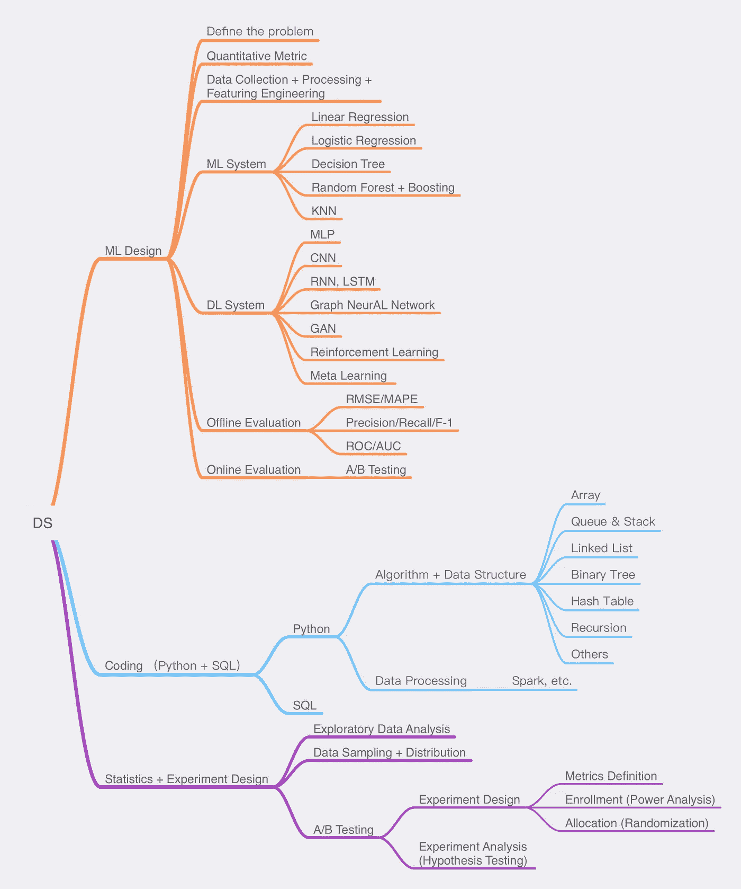

# 硅谷的数据科学家是怎样的？

> 原文：<https://towardsdatascience.com/whats-like-a-data-scientist-in-silicon-valley-d500b338c6e2?source=collection_archive---------14----------------------->

## 成长和学习让每个有抱负的数据科学家受益

# 前言

今天在谷歌上搜索*数据科学家*，或者*成为数据科学家需要哪些技能*，你会被海量的信息淹没——媒体、LinkedIn、新闻、私人教练网站等等。每个人都告诉我们，数据科学家是 21 世纪广泛需要的职业。成为一名数据科学家需要掌握统计学、编程和机器学习。但是大量的信息真的给我们带来很多价值吗？真正的工业数据科学家在做什么样的工作？

工作是补偿和自我实现的结合。每一个选择都是在这两个维度勾勒出的空间里，找到一个能让我们最大化满足感的点。想成为一名数据科学家，或者想成为一名更优秀的数据科学家，取决于你在工作中能提供什么样的价值，以及你如何在职业生涯中实现自我实现。

德国人说世界是具体的。今天，我将具体谈谈我所熟悉的硅谷科技行业，数据科学家工作的不同要求和技能，如何在这个职位上成长，以及查理·芒格告诉我们的内容

> *我只想知道我会死在哪里，所以我永远不会去那里*

# 我是一名数据科学家

从 UIUC 毕业后，我加入了微软的硅谷办公室，到现在已经 4 年了。我们组主要负责语言模型，这是微软云平台 Azure 提供的语音识别服务的核心组件。

作为一名数据科学家，这几年我为公司创造了哪些影响和价值？

*   通过设计和构建深度学习非流利性标记系统，实现了 **26.2%** **非流利性标记**F1-团队得分提高直播字幕& Office 单词听写和 2.54 BLEU 英德翻译得分提高
*   通过建立第一个基于深度学习的去噪 N-gram 语言模型，改进了 **Bing 语音搜索**的语音识别准确性和用户体验，实现了 **7%** 的惊人指标减少和 2%的单词错误率减少
*   试行了**多语言神经网络语言模型**跨 **26** 欧洲地区进行预训练，构建了一体化子词分词器

我的工作更倾向于自然语言处理中的机器学习，这通常被称为 NLP，只是数据科学的一个分支。在硅谷，不同公司和团体所需要的数据科学家和技能是不同颜色的马。在下一章，我会谈到硅谷需要的各种数据科学家。

# 硅谷的数据科学家有哪些类型？

一般来说，数据科学家有三种职位。

*   **数据分析师**
*   **数据工程师**
*   **机器学习工程师**

首先，这三个岗位需要的技能是不一样的。

*   **数据分析师**。负责使用 SQL 和其他语言处理数据，汇总数据，可视化数据统计，得出业务见解，并根据数据分析完成报告。在脸书有一个数据科学家分析赛道，主要负责设计统计实验作为 A/B 测试。例如，我们现在已经设计了一个全新的新闻推荐系统，那么我们如何知道这个新系统是否能够增强用户粘性，帮助我们增加订阅人数以提高收入？在线评估以及一系列的 A/B 测试实验设计和统计分析发挥了作用。
*   **数据工程师**。严格来说，这是软件工程师的一个分支，主要针对大型数据基础设施的设计和建设。比如在 Instagram 上，你的每一次浏览、点击，甚至是浏览两个商品的间隔，都是要沉淀到数据系统中的实时用户反馈数据。这些数据可以帮助我们构建用户画像，更精准地推送个性化产品推荐。所有这些大规模在线数据的存储、处理、查询和维护都是数据工程师的工作。
*   **机器学习工程师**。负责大规模机器学习系统的设计和开发。需要对机器学习有很好的理解，深度学习，优秀的编程技能，以及，在我看来，最重要的支柱，如何将一个商业问题转化为机器学习问题。设计量化指标来定义问题，大规模收集和处理数据，通过智能算法的迭代优化，实现机器自动决策，提高整体性能。生活中无处不在的推荐系统就是机器学习的典型应用，比如 YouTube 的视频推荐，Spotify 的每日播放列表，亚马逊的商品推荐等等。此外，谷歌助手/Alexa 的智能语音识别和人机交互，机器翻译，智能驾驶辅助，以及在线广告。他们背后是机器学习系统。

其次，在薪酬方面，工程相关岗位普遍高于分析学，这主要是由经济学的基本面理论——供给和需求决定的。相对而言，通过一系列商业软件进行图表可视化的学习曲线低于机器学习和编程，真正有行业经验的人才匮乏。从需求端来看，云计算平台对众多行业的渗透，使得大规模数据的数字化和流体化成为可能，数据智能化的快速扩张增加了这方面的人才需求。

> 机器学习工程师> =数据工程师>>数据分析师

当然，SDE 是硅谷最需要的。在很多产品中，机器学习都是锦上添花。比如我们都用 Zoom 来开视频会议。机器学习提供的一些功能将有助于改善用户体验和客户粘性。但是，从第一原理思维出发，我们首先需要一个低延迟、无障碍的视频通信软件。当然，我知道如今许多新产品和服务完全基于数据智能。他们建立工程系统，收集实时用户行为数据，通过迭代机器学习推动智能系统，吸引更多用户，聚集更多数据，推数据的飞轮->模型->产品，比如抖音。一般来说，工业中的机器学习本质上是工程问题，不完全是科学问题。关于这部分，我会在以后的博文中给你一些具体的例子。

# 数据科学家需要具备哪些技能？

*图片由李妙拍摄*

上面的技能树包含了我认为的数据科学家必备的硬技能，根据不同岗位的需求会有不同的侧重。当然，硬技能并不是在现实世界中成功的全部。要真正成长，软技能更重要。如何与同事沟通，如何协作，如何写邮件，如何讲好自己所做的事情，如何展现领导力，如何管理自己甚至直接经理，如何扩大自己的影响力等等。这些都是我每天不断反思和不断学习的领域。我会在以后的博客中分享更多我的想法。

在访谈中，一般从以下四个方面考察被访谈者

*   **编码:Python(算法/数据结构)+ SQL**
*   **机器学习系统设计**
*   **甲乙测试设计+统计**
*   **恢复项目**

# 作为数据科学家有哪些不该做的事？

## **1。不要认为算法是唯一的。**

在很多已经有机器学习的成熟产品中，短期内不太可能通过构思一个全新的算法来突然提升产品性能。这样的机会存在于传统机器学习向深度学习的过渡中，尤其是在数据规模巨大的产品中。或者从长远来看，我们可以期待每五年一次的算法突破时刻。但在许多现实情况下，真正帮助我们提高系统性能的是**数据**，即经过正确处理的新信息带来的价值。

我们生活在一个计算能力和通用算法像水和电一样是基础设施的时代。有了云服务，每个人都可以轻松利用机器学习，构建自己的数据产品。精确而新颖的数字化数据是你工作的核心，这些数据过去没有被挖掘出来。

## **2。不要忽视真正的业务需求！**

我们可以花很多时间来建立一个深度学习模型，这个模型提高了 1%的离线度量。但是，这线下的 1%未必转化为线上的评价，对真实的业务需求没有任何帮助。如何将真实的业务需求转化为数据+机器学习的解决方案，如何用最终的业务目标校准我们的模型训练目标，是我们在工作中首先需要思考的事情。

## **3。不要忽略全局。**

如果你只是被困在自己的项目中，对产品的大局没有把握，首先你会失去发现新增长点的机会，其次你付出的努力的边际回报也会大打折扣。如果某个线下指标提高了 1%用了 6 个月，而这 1%的提高没有人太在意，那么这个项目的投资回报率就是深谷了。总方向的不断思考，赋予我们寻找处女地的力量，让我们从 0 到 1 不断领先。

# 下一步是什么

这是我作为数据科学家的第一篇反思文章。接下来的系列将讨论更多关于机器学习算法的内容，什么是真正的机器学习系统，我(痛苦的)LeetCode 练习，以及我每天在工作中学到的新东西。

欢迎关注我的个人博客[www.thelimiao.com](http://www.thelimiao.com/)！以后我会更多地分享我的学习和成长。

敬请期待