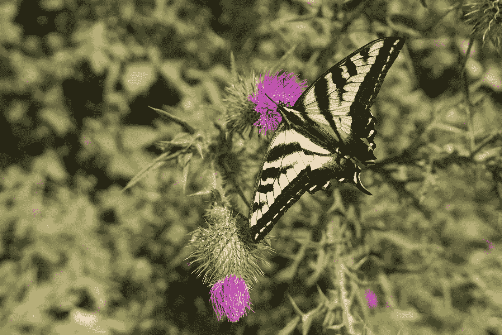
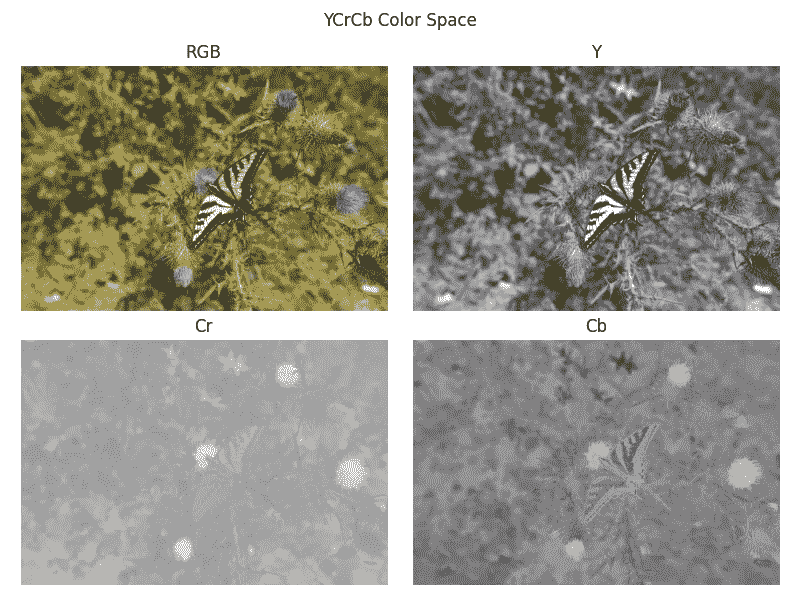
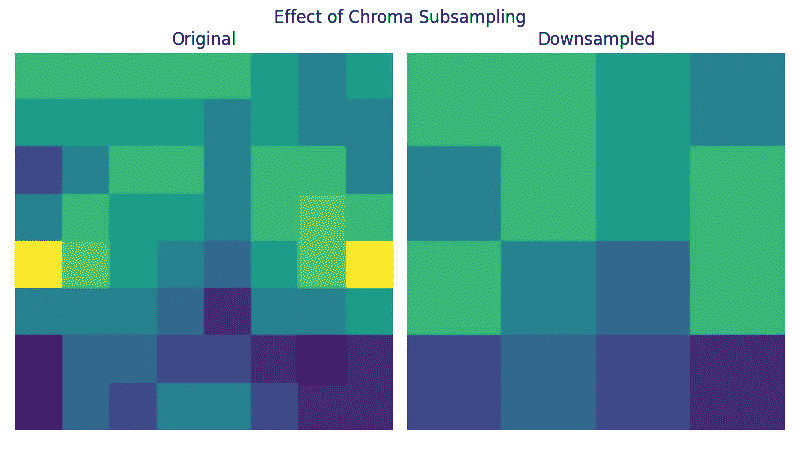
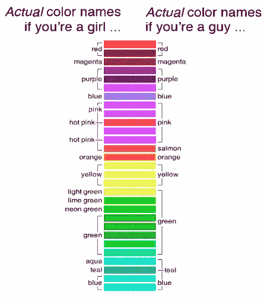
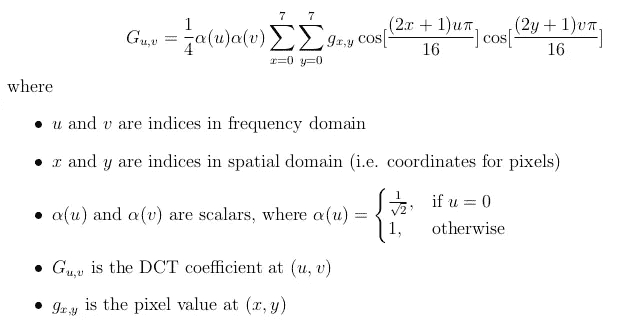
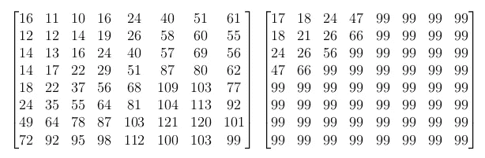
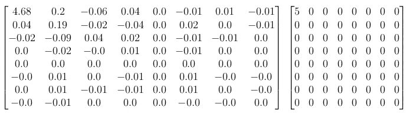
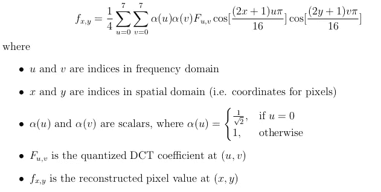
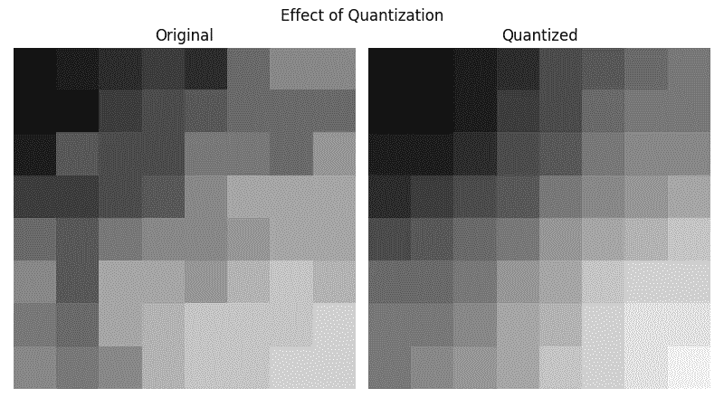
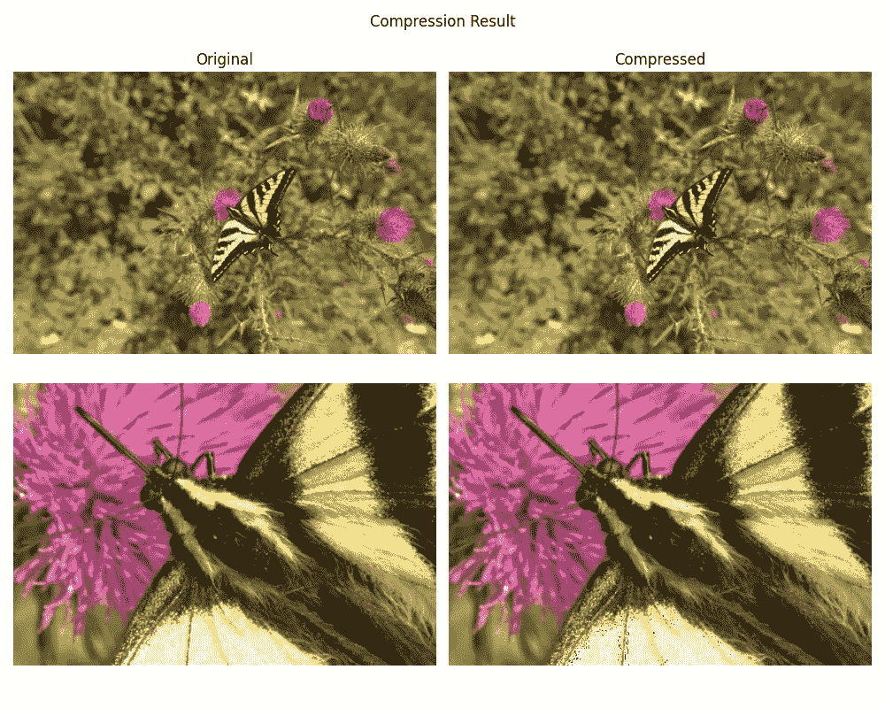

# JPEG 丢失了什么？

> 原文：<https://towardsdatascience.com/whats-lost-in-jpeg-e5e6e80b1f94?source=collection_archive---------30----------------------->

## [实践教程](https://towardsdatascience.com/tagged/hands-on-tutorials)

## 从头开始有损图像压缩

作者图片

当我第一次拿到相机时，我拍摄的所有照片都是 JPEG 格式的。然而，一旦我开始在网上查看摄影教程和博客帖子，所有严肃的摄影师都以 raw 图像格式拍摄，JPEG 被认为是次等的。我的 JPEG 图像文件也只有 raw 的一半或四分之一或更小，这让我相信 raw 格式捕捉到了更多的信息。但我也在想:JPEG 到底缺了什么？

在这篇文章中，我将用 Python 复制 JPEG 压缩过程中的有损部分，使用公共库(实际压缩中通常只有 Numpy 和 Scipy)，包括色度子采样、离散余弦变换和量化。JPEG 还进行一种称为熵编码的特殊编码，以使文件更小，但它不会影响最终图像的质量，因为压缩是无损的。我不会在这里介绍熵编码，因为在这个阶段没有信息丢失。

# 原始文件预处理

原始图像文件包含来自数码相机传感器的最低限度处理的数据，通常它与相机传感器的“视觉”最为接近。为了处理和操作原始图像数据，我们将把图像转换成一个 Numpy 数组。

注意文件扩展名*。ARW* 是索尼相机特有的，还有许多其他的扩展。还要注意，文件大小超过 25MB，我的相机有 2400 万像素。

在这里， [rawpy](https://github.com/letmaik/rawpy) 库完成了读取图像和元数据的繁重工作，并将其后处理成一个具有三个颜色通道(RGB)的图像数组。然后我使用 [OpenCV](https://docs.opencv.org/3.4/de/d25/imgproc_color_conversions.html) 将图像转换到 [YCrCb](https://en.wikipedia.org/wiki/YCbCr) 颜色空间。这个特定的色彩空间具有一个亮度分量(Y)和两个色度分量(Cr 和 Cb ),亮度分量是像素的亮度，色度分量表示颜色。使用 YCrCb 优于 RGB 的优势在于，我们可以对亮度和色度分量使用不同的压缩级别，因为我们的眼睛对亮度比对色彩饱和度更敏感。像素值也以 0 为中心，为以后的计算做准备。

YCrCb 颜色空间的不同通道。Cr 和 Cb 是红色和蓝色的差异成分，其中较亮的像素表示更强烈的颜色。照片中的蓟花有明亮的紫色，这是红色和蓝色的组合，因此是 Cr 和 Cb 通道中的亮点。

# 向下采样

知道我们在亮度通道中看到更多细节，我们将在水平和垂直方向上以因子 2 对两个色度分量进行下采样(也称为色度子采样)。为此，我们将计算四个相邻像素的平均值，并用平均值覆盖它们。如果您熟悉神经网络中的池化，这本质上是一个具有 2x2 内核的平均池化操作，但没有减少图像维度。

上面的代码很慢，尤其是在下采样比为 4:2:0 的情况下使用双循环时。我们可以使用 Scipy 来加速它，因为它相当于步长为 2 的 2D 卷积(在每个元素乘法后跳过 2 个像素)，并且相等的内核权重总和为 1。

将函数包装在一个类中，这样如果 ratio 参数不变，我们就可以重用一个实例。convolve2d 函数没有 stride 参数，所以我将跳过结果矩阵中的每隔一个条目。同样重复这些元素，以便输出与输入具有相同的维数。

如上所述，我们将仅对色度分量进行下采样:

色度二次采样示例，请注意，我们通过取平均值丢失了一些颜色变化。

# 块分裂

在进行下一步之前，我们需要将所有通道的图像分割成 8×8 的块，如果维数不能被 8 整除，则应用必要的填充。

正向操作分割输入图像，并返回块以及一组索引，用于以后的重建。向后操作将块连接回以形成图像，并从向前传递中移除填充。

# 离散余弦变换和量化

你能在多大程度上区分绿色的深浅？在一张树的照片中，我们只用了 5 种不同的色调，而不是 20 种不同的绿色，你还能分辨出这是一张树的照片吗？亮度的变化也是如此，如果我们使用更少的级别，我们可能无法分辨出差异。

来自 [XKCD 色彩调查](https://i0.wp.com/imgs.xkcd.com/blag/doghouse_analysis.png)，我们如何命名色彩。

这是量化的主要动机，我们将相同颜色或相似亮度级别的阴影放在一起，只使用一个值来表示整个桶。我们将在频域而不是空间域中这样做，因为在一个域中难以解决的问题在另一个域中可能更容易解决。在我们的例子中，并不总是很容易说出哪种红色应该被组合在一起，或者我们应该在橙色和黄色之间划一条线。

## 离散余弦变换

我们将使用二维 DCT 将我们的 8×8 块转换成频率。这意味着我们将试图把亮度或色块表示为各种余弦函数的和。形式上，

2D DCT 来自[维基百科](https://en.wikipedia.org/wiki/JPEG#Discrete_cosine_transform)

这里，输入是来自图像通道(Y、Cr 或 Cb)的 8×8 块，输出是相同大小的 DCT 系数矩阵。我们可以使用循环手工编码:

当然，Scipy 中有一个 [DCT 函数，它可以更有效地进行计算。二维版本相当于沿一个方向应用 DCT，然后再沿另一个方向应用。](https://docs.scipy.org/doc/scipy/reference/generated/scipy.fft.dct.html)

这里使用“正交”或标准正交范数，使其与公式中的归一化标量保持一致。

一个示例块可能如下所示:

左边是 8×8 像素的输入，右边是四舍五入到两位小数的 DCT 系数。

注意，DCT 矩阵的第一个条目(左上角)比其余的条目大很多。这被称为 DC 系数，它反映了输入块的最显著特征。其他系数称为交流系数。

## 量化

现在我们有了一个块的频率表示，我们可以将频率组合在一起，减少可能信号的数量。为此，我们将一个块按元素划分为一个相同维数的矩阵，称为量化矩阵，然后将结果四舍五入为最接近的整数。

摘自 [ImpulseAdventure](https://www.impulseadventure.com/photo/jpeg-quantization.html) 的量化矩阵示例。左边是亮度分量的量化矩阵，而右边是色度分量的矩阵。

因为我们对亮度通道的细节比对颜色通道的细节更敏感，所以我们可以使用单独的量化矩阵。随着研究的深入，量化矩阵的值也逐渐变大。回想一下，DC 系数位于左上角，将其除以一个较小的数会使其四舍五入为最接近的整数时不太可能为 0。另一方面，除以较大的值会将较高的频率归零。量化矩阵中的值也控制压缩比；如果我们想要更大的压缩，我们可以使值更大，这样当舍入时，大部分块将是 0。

使用上面的示例块(来自 Cr 通道),除以色度量化矩阵并舍入到最接近的整数，得到:

左图是量化矩阵的除法结果，右图是四舍五入到最接近整数的矩阵。

在这种特殊情况下，我们实际上只保留整个块的 DC 系数。

# 解码

我们已经完成了压缩，需要将频域中的这些块转换回图像。要做到这一点，我们基本上只需反向执行每个步骤。

首先，我们将块乘以相应的量化矩阵。请注意，我们在这里丢失了一些信息，因为一些系数被四舍五入为 0。然后，我们对块应用逆 DCT，以将它们变换回空间域。

2D 逆 DCT 来自[维基百科](https://en.wikipedia.org/wiki/JPEG#Decoding)。

我们可以再次利用 Scipy 中的 DCT 函数，这一次将 type-III DCT 的“Type”参数指定为“3 ”,这是(Type-II) DCT 的逆运算。

以下是将量化矩阵相乘并反转 DCT 后的量化效果示例:

# 后加工

使用上面的**块分割**部分中的 *ImageBlock* 类的*向后*操作，我们可以将这些压缩的块重新排列成一个图像。我们还需要取消居中，将图像转换回 RGB 颜色空间，然后将其保存为 JPEG 文件。

以下是最终结果:你能看出区别吗？

当你放大时，蝴蝶上会有一些压缩伪影(黑点)。

# 熵编码

简单说说熵编码；这是量化后 JPEG 的关键部分，其中图像数据以非常紧凑的方式编码，以使文件更小。它不是在我们的图像矩阵中存储每一个值，而是只存储非零条目，并计算它们之间的 0 的数量。因为我们的矩阵量化后是稀疏的，这是非常高效的。此外，只有位表示而不是实际值被写入文件。用于以比特表示矩阵条目的技术被称为[霍夫曼编码](https://en.wikipedia.org/wiki/Huffman_coding)，实现起来相当繁琐(完全可以是一篇独立的文章)。我只想重申，这是一种无损压缩，因此在熵编码中不会丢失任何信息。

# 结论

我最终的 JPEG 图像(使用熵编码)大小略大于 1MB，比我们开始时的 25MB 小了很多。当然，在文件大小和图像质量之间有一个权衡，但是如果你有足够的百万像素，并且你没有放大细节，JPEG 文件看起来就很好。同时，由于 SD 卡现在很便宜，如果有人想要我的照片的真人大小的照片，我想保持最高的质量，我将继续以 raw 拍摄:)

一如既往，GitHub 上的全部代码。