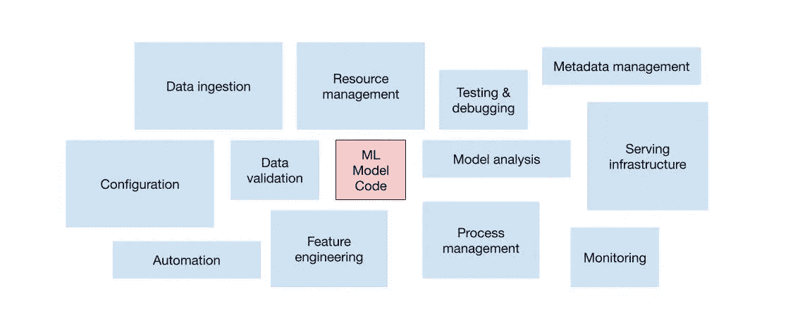
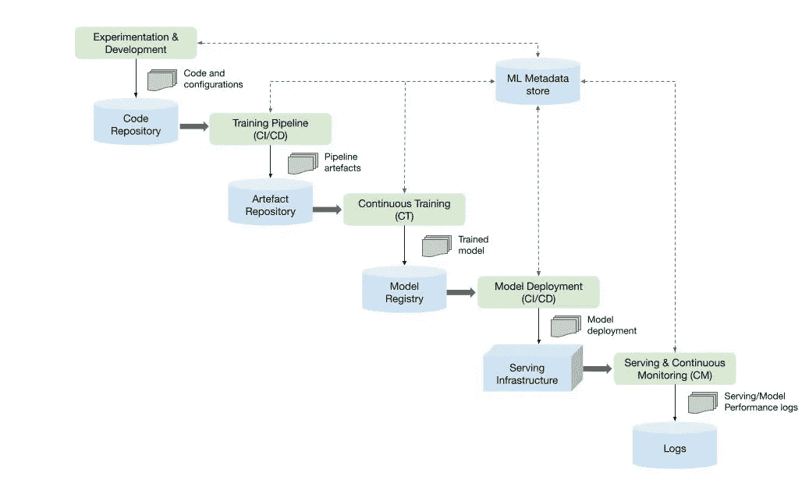

# 什么是 MLOps？

> 原文：<https://towardsdatascience.com/whats-mlops-5bf60dd693dd?source=collection_archive---------23----------------------->

## 大规模管理复杂的 ML 系统

约翰·巴克利在 [Unsplash](https://unsplash.com/s/photos/complex?utm_source=unsplash&utm_medium=referral&utm_content=creditCopyText) 上拍摄的照片

# TL；速度三角形定位法(dead reckoning)

机器学习(ML) IT 运营(Ops)旨在将 [DevOps](https://cloud.google.com/devops) 推广的工程文化和实践应用于 ML 系统。但是为什么呢？

*   创建一个 ML 模型是容易的部分——操作化和**管理 ML 模型、数据和实验的生命周期**是事情变得复杂的地方。事实上，超过 87%的数据科学项目从未投入生产[1]
*   人工智能驱动的组织正在使用数据和机器学习来解决他们最困难的问题，并正在收获巨大的利益。但是如果管理不当，ML 系统会产生技术债务

# 🚣🏼我们是如何来到这里的

数据科学和 ML 正在成为解决复杂现实世界问题、改变行业和在许多不同领域提供价值的筹码。在过去的 5-10 年中，该领域的最新进展加快了 ML 系统的主流采用，因为以下必要的“成分”更容易获得:

*   大型数据集
*   廉价的按需计算资源
*   各种云平台上的专业 ML 加速器
*   不同人工智能研究领域的快速发展(如计算机视觉、自然语言理解和推荐人工智能系统)

因此，许多企业正在投资于他们的数据科学团队和 ML 能力，以开发能够为其用户提供商业价值的预测模型。

数据科学家可以很容易地在本地机器上构建一个 ML 模型，该模型在单独运行时表现得非常好。这意味着真正的挑战不是构建一个 ML 模型，而是**构建一个集成的 ML 系统并在生产中持续运行它。**如下图所示，ML 代码只是运行 ML 系统所需的一小部分。

*图一。生产中 ML 系统的要素。作者插图，改编自机器学习系统中隐藏的技术债务[2]*

它是图中所需的“其他 95%”的庞大而复杂的周围组件。要开发和操作这样的复杂系统，您可以将 DevOps 原则应用于 ML 系统(MLOps)。

# 🥜为什么 ML 模型部署具有挑战性？

有许多因素使得大规模部署 ML 模型非常具有挑战性，但简而言之:

*   代码——迎合用于构建模型的不同 ML 库、框架和编程语言。它们并不总是能很好地相互作用，包版本的变化和其他的相互依赖会破坏你的管道。Kubernetes 等现代容器化技术可以解决将代码移入生产环境时的可移植性和兼容性问题，但可再现性也是一个挑战。数据科学家可能会构建特定模型的许多版本，每个版本都有不同的编程语言、库(或同一库的不同版本)——很难手动跟踪这些变化。
*   计算-训练、重新训练和提供来自 ML 模型的预测的过程可能是计算密集型的。为了在生产中快速服务，需要昂贵的硬件，这可能需要巨大的资本投资。当需求激增时，基于云的服务可以开始解决快速扩展的经济性和能力问题。但是仍然需要维护模型的性能和准确性。

# 💸‘技术债’呢？

技术债务就其本身而言是一个复杂的话题，并且更广泛地适用于一般的 IT 系统。但我会尝试在这里给你一个“10，000 英尺的视角”,以及它与 ML 系统的关系。

简而言之，技术债务是一种随着时间的推移可能会无意中发生的现象，它会导致工程成本增加，从而对产品开发速度、质量和工程团队满意度产生负面影响。它可以被引入到系统中(不同的版本或其组合部分),因为它们的实现方式会导致:

*   与系统目标相比质量较低，
*   与系统的目标相比额外的复杂性，
*   与系统目标相比的额外等待时间，
*   或者上述的任何组合

呆伯特·斯科特·亚当斯。经 ANDREWS MCMEEL SYNDICATION 许可使用。保留所有权利。

ML 系统可能会加剧技术债务，因为它们结合了传统的 IT 系统，在传统的 IT 系统中，行为由代码**和数据**定义。例如，ML 模型的性能在很大程度上依赖于它们被训练的数据。如果不加以检查，训练数据中的变化可能会产生依赖性，这种依赖性具有类似的积累债务的能力，这种能力也可能来自代码的复杂性。更糟糕的是，与代码中有明确定义的方法相比，确定数据依赖关系更具挑战性。

虽然没有灵丹妙药可以克服 ML 系统部署的困难，同时减少技术债务的负担，但在您的组织中建立 MLOps 文化是一个很好的起点。

# 🙇🏻‍♂️·德沃普斯对姆罗普斯

与 DevOps 一样，MLOps 是一种 ML 工程文化和实践，旨在统一 ML 系统开发(Dev)和 ML 系统运营(Ops)。与 DevOps 不同，ML 系统对持续集成和持续交付(CI/CD)等核心 DevOps 原则提出了独特的挑战。

ML 系统不同于其他软件系统的主要方面:

*   持续集成(CI)不仅仅是测试和验证代码和组件，还包括测试和验证数据、数据模式和模型。
*   连续交付(CD)不仅仅是关于一个单独的软件包或者一个服务，而是一个系统(一个 ML 训练管道)应该自动部署另一个服务(模型预测服务)。
*   连续训练(CT)是 ML 系统独有的新特性，它涉及自动重新训练候选模型以进行测试和服务。
*   持续监控(CM)不仅仅是捕捉生产系统中的错误，还包括监控生产推断数据和与业务成果相关的模型性能指标。

*图二。综合考虑*—*ML 系统组件和 MLOps 流程的组合。作者插图*

实践 MLOps 意味着您倡导 ML 系统构建的所有步骤的自动化和监控，包括集成、测试、发布、部署和基础设施管理。

# 👷🏾‍♀️:那我该如何开始呢？

这篇文章的目的是解释 MLOps 的“为什么”和“是什么”。如果这篇文章中描述的任何挑战引起了共鸣，你可能会考虑“如何”在你的组织中部署 ML 系统，这里有一些明智的出发点:

*   认真考虑大规模培训和部署 ML 模型的云优先战略。如果您已经有了一个，请评估您当前的提供商是否提供了合适的工具和最佳的用户体验来支持 MLOps
*   不要重新发明轮子——例如，在 Kubernetes 上运行 ML 系统也需要熟悉容器、包装、缩放、GPU 等知识。然而，有云就绪的开源解决方案，如 [Kubeflow](https://www.kubeflow.org/) 利用了 Kubernetes 的优势，但消除了部署的头痛，并为大规模管理复杂的 ML 系统提供了一个框架

您可以在网上找到大量信息，有许多详细的[文章](https://cloud.google.com/solutions/machine-learning/mlops-continuous-delivery-and-automation-pipelines-in-machine-learning#devops_versus_mlops)和出版物深入探讨了如何迁移到全自动 MLOps 环境。我可以强烈推荐“[机器学习设计模式:数据准备、模型构建和 MLOps](https://www.oreilly.com/library/view/machine-learning-design/9781098115777/) 中常见挑战的解决方案”

# 📇参考

[1] VB 工作人员，为什么 87%的数据科学项目永远无法投入生产(2019)，Venture Beat

[2] D .斯卡利、加里·霍尔特、丹尼尔·戈洛文、尤金·达维多夫、托德·菲利普斯、迪特马尔·埃布纳、维奈·乔德里、迈克尔·杨、让-弗朗索瓦·克雷斯波、丹·丹尼森，《机器学习系统中隐藏的技术债务》(2015 年)，《神经信息处理系统进展》第 28 卷(NIPS 2015 年)的一部分

# 📚进一步阅读

“为什么机器学习模型在生产中崩溃和烧毁”

[https://www . Forbes . com/sites/forbestechcouncil/2019/04/03/why-machine-learning-models-crash-and-burn-in-production/？sh=604afc8f2f43](https://www.forbes.com/sites/forbestechcouncil/2019/04/03/why-machine-learning-models-crash-and-burn-in-production/?sh=604afc8f2f43)