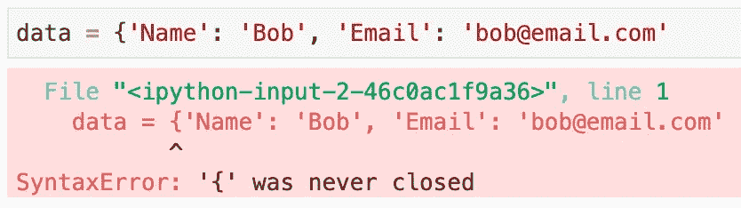
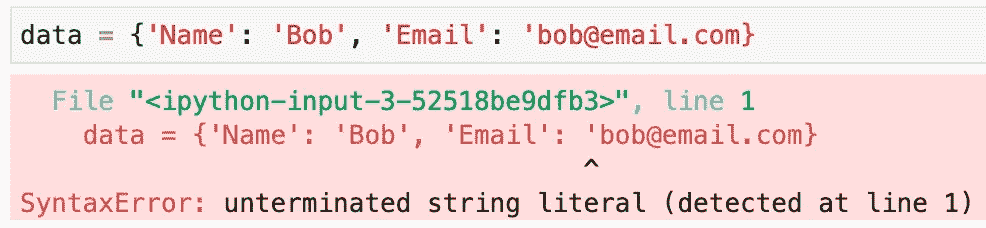
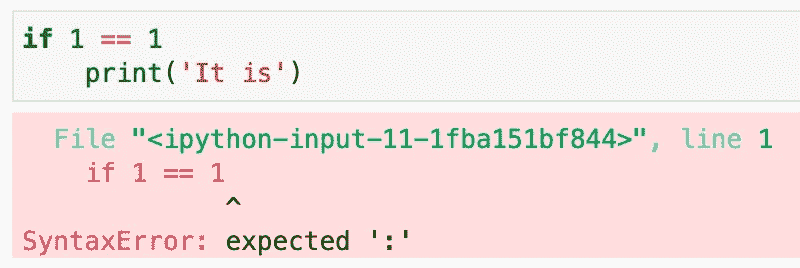
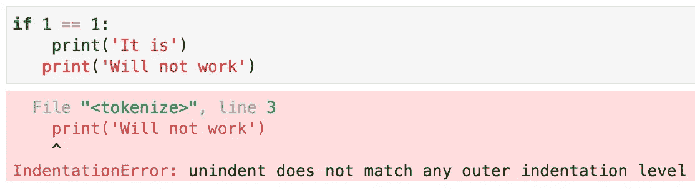
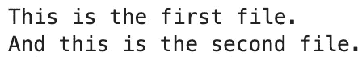

# Python 3.10 的新特性–您应该尝试的 4 个惊人特性

> 原文：<https://towardsdatascience.com/whats-new-in-python-3-10-4-amazing-features-you-should-try-4f3044871476?source=collection_archive---------5----------------------->

## 从更好的上下文管理器到 Switch 语句——这将是一个大问题。

由[泰勒·拉斯托维奇](https://unsplash.com/@lastly?utm_source=unsplash&utm_medium=referral&utm_content=creditCopyText)在 [Unsplash](https://unsplash.com/?utm_source=unsplash&utm_medium=referral&utm_content=creditCopyText) 上拍摄

随着 [Python 3.10](https://docs.python.org/3.10/whatsnew/3.10.html) 目前进入 alpha 版本，值得看看令人兴奋的新特性。今天，我们将探讨最重要的四个，并简要提及一些小的修复和更改。

**免责声明** : *Python 3.10 还没有准备好投入生产，所以把它作为默认的 Python 解释器安装可能不是一个好主意。*

这篇文章的结构如下:

*   更好的错误消息
*   结构模式匹配(Switch 语句)
*   Union 运算符
*   更好的上下文管理器
*   最后的想法

# 更好的错误消息

Python 中的错误消息有时会令人沮丧。Python 3.10 改变了这一点。对语法、缩进、属性和名称错误进行了改进。

下面我们来探究几个。

**情况 1** —字典未关闭:

图 1 —未关闭词典的语法错误(作者提供的图片)

**案例 2** —无效字符串文字:

图片 2-无效字符串文字的语法错误(图片由作者提供)

**案例 3**——块前缺少`:`:

图 3-块前缺少冒号的语法错误(作者提供的图片)

**案例 4** —不合适的缩进:

图 4 —缺少缩进级别的缩进错误(作者提供的图片)

您可以自己进一步探索，但是改进的错误消息应该可以节省一些调试时间。

# 结构模式匹配(Switch 语句)

是时候了。

Switch 语句在大多数编程语言中都很常见，它提供了一种更简洁的实现条件逻辑的方式。当有很多条件需要评估时，它们就派上用场了。

让我们使用结构模式匹配来编写一个简单的函数— `get_mood(day: str) -> str`，它返回一个值取决于输入参数的字符串。随着周末的临近，返回值变得更加令人兴奋。愚蠢的小功能，但可以用于演示目的:

简而言之，结构化模式匹配将提供一种更整洁的方式来组织您的代码，并避免一堆 if-else 语句。概括一下:

*   使用`case`关键字来评估条件(`case ‘Monday’`与`if day == ‘Monday’`相同)
*   使用管道操作符`|`分隔多个条件，例如，如果两个输入值应该产生相同的返回值
*   使用下划线运算符— `_` —指定默认大小写。

# Union 运算符

类型提示是一个东西。您可能知道，Python 不要求您在声明变量时指定变量的数据类型，而是提供了一种可选的方法。

然而，糟糕的是声明一个接受整数或浮点数的函数。如何指定数据类型？在 3.10 版本之前，你可以使用`Union`操作符。

长话短说，用类型提示声明一个返回一个数的平方根的函数如下所示:

从 Python 3.10 开始，一定会有更好的解决方案，而且确实有。您可以完全抛弃`Union`操作符，用管道操作符`|`分隔潜在的数据类型。这里有一个例子:

现在干净多了，不是吗？

# 更好的上下文管理器

上下文管理器的概念在 Python 3.10 中并不陌生。新的 Python 版本允许在上下文管理器( [source](https://docs.python.org/3.10/whatsnew/3.10.html#parenthesized-context-managers) )中使用圆括号来延续多个文本行。

让我们看一个例子。我有两个 TXT 文件:

*   `first_file.txt` —包含“这是第一个文件”
*   `second_file.txt` —包含“这是第二个文件。”

我们现在将使用上下文管理器来打开和处理这两者的内容。代码如下:

相应的输出如下所示:

图 5 —上下文管理器输出(作者提供的图片)

如您所见，您现在可以以一种更有条理的方式管理多个文件。这不是一个革命性的特性，但绝对值得拥有。

# 最后的想法

我必须说，自从 3.6 版本引入 f 字符串以来，我还没有对新的 Python 版本如此兴奋过。这四个不会彻底改变我写 Python 代码的方式，但肯定会使一些事情变得更简单、更有条理。

今天的文章只涵盖了主要的新特性，因此请参考官方文档[以获得完整列表。](https://docs.python.org/3.10/whatsnew/3.10.html#parenthesized-context-managers)

你最喜欢的 Python 新特性是什么？

喜欢这篇文章吗？成为 [*中等会员*](https://medium.com/@radecicdario/membership) *继续无限制学习。如果你使用下面的链接，我会收到你的一部分会员费，不需要你额外付费。*

<https://medium.com/@radecicdario/membership>  

# 了解更多信息

*   [我作为数据科学家卖掉我的 M1 Macbook Pro 的三大理由](/top-3-reasons-why-i-sold-my-m1-macbook-pro-as-a-data-scientist-abad1226f52a)
*   [如何使用 Cron 调度 Python 脚本——您需要的唯一指南](/how-to-schedule-python-scripts-with-cron-the-only-guide-youll-ever-need-deea2df63b4e)
*   [Dask 延迟—如何轻松并行化您的 Python 代码](/dask-delayed-how-to-parallelize-your-python-code-with-ease-19382e159849)
*   [如何使用 Python 创建 PDF 报告—基本指南](/how-to-create-pdf-reports-with-python-the-essential-guide-c08dd3ebf2ee)
*   [即使没有大学文凭也要在 2021 年成为数据科学家](/become-a-data-scientist-in-2021-even-without-a-college-degree-e43fa934e55)

# 保持联系

*   关注我的 [Medium](https://medium.com/@radecicdario) 了解更多类似的故事
*   注册我的[简讯](https://mailchi.mp/46a3d2989d9b/bdssubscribe)
*   在 [LinkedIn](https://www.linkedin.com/in/darioradecic/) 上连接