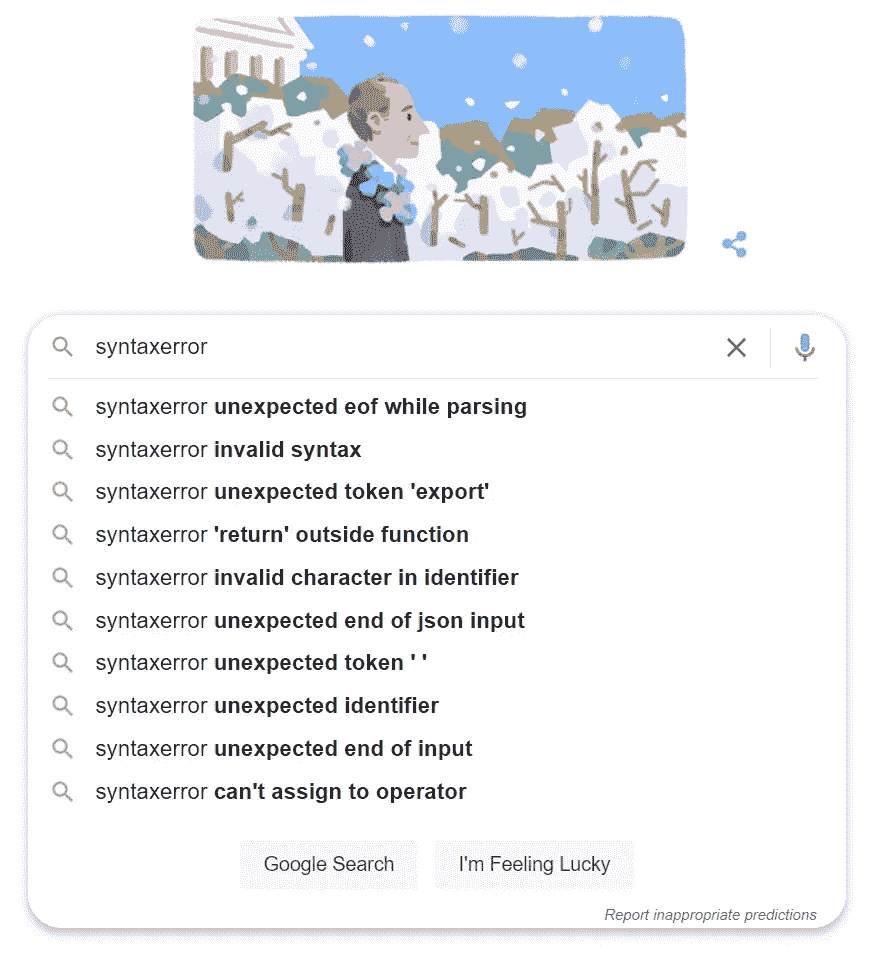
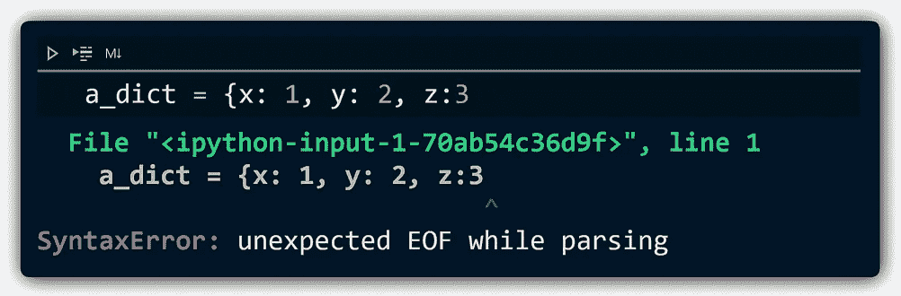
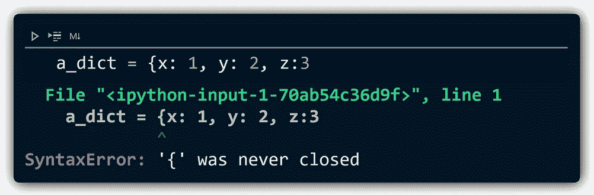
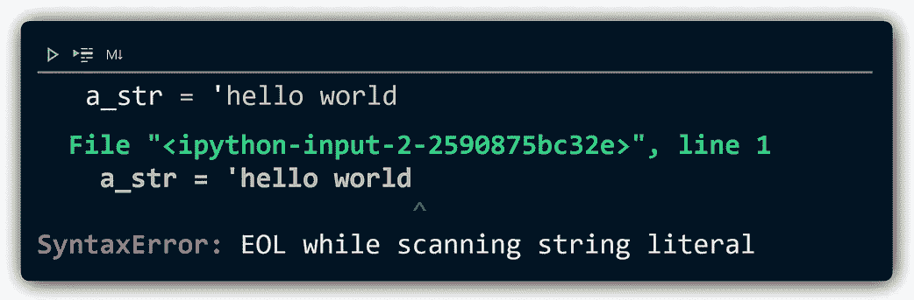
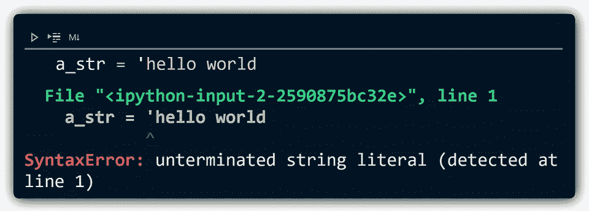
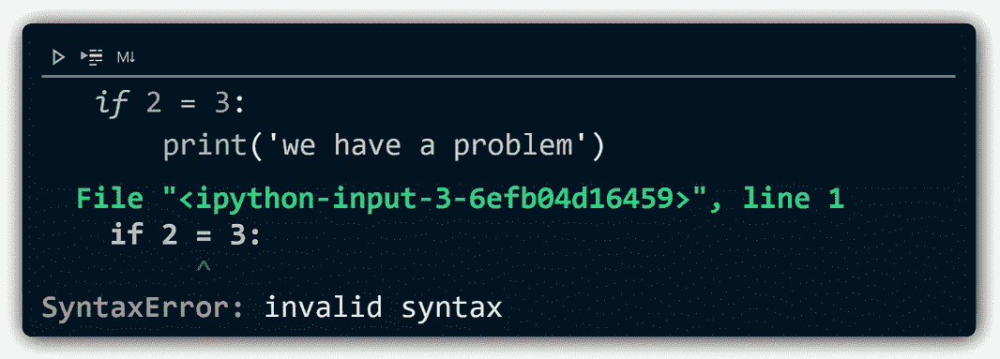
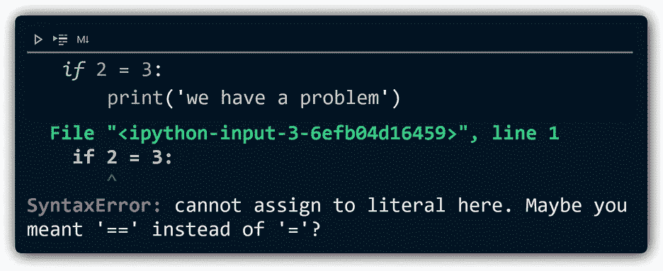

# Python 3.10 有什么新特性？

> 原文：<https://towardsdatascience.com/whats-new-in-python-3-10-a757c6c69342?source=collection_archive---------0----------------------->

## 最酷功能的概述


图案由[亚历山大蚁](https://unsplash.com/@alexander_ant?utm_source=unsplash&utm_medium=referral&utm_content=creditCopyText)在[上展开](https://unsplash.com/t/wallpapers?utm_source=unsplash&utm_medium=referral&utm_content=creditCopyText)

P ython 3.10 截至 2021 年 10 月 4 日发布！你可以在这里[下载最新版本](https://www.python.org/downloads/release/python-3100/)。

我们将介绍 Python 中一些最有趣的新增内容——结构化模式匹配、带括号的上下文管理器、*更多的*类型，以及新的和改进的错误消息。

点击这里查看文章的视频版本:

# 结构模式匹配

结构模式匹配是 Python 中一个不可思议的特性——真的很棒。

想象一个如下所示的 if-else 语句:

Python 3.9 中的 If-else 逻辑

你拿着它，修改语法，使它看起来更像这样:

Python 3.10 中的大小写匹配逻辑

这是新的`match-case`说法——很酷，但目前为止没什么特别的。

让`match-case`语句如此有趣的是一种叫做*结构模式匹配*的东西。

结构模式匹配允许我们执行相同的匹配用例逻辑，但是基于我们的比较对象 ***的 ***结构*** 是否与给定的 ***模式*** 匹配。***

所以让我们定义两个字典，两个都有不同的结构。

我们定义 **dict_a** 和**dict _ b**——两者包含相似的信息，但是在不同的字典结构中

现在，我们可以像这样写一个模式来匹配`dict_a`:

**字典 _a** 的模式

还有一个模式来匹配`dict_b`:

**dict_b** 的模式

如果我们将这两者放在一个匹配案例语句中，加上实际上是一个`else`/包含所有内容的`case _`——我们得到:

我们循环遍历 **dict_a** 和**dict _ b**——由于结构模式匹配，两者都在我们期望的地方匹配

很酷吧？我已经发现这对于数据处理非常有用——你可以在[15:22 处的视频](https://youtu.be/2qJavL-VX9Y?t=923)中找到一个例子。

# 带括号的上下文管理器

一个较小的变化源于 Python 3.9 中出现的一个更大的变化——新的基于 PEG 的解析器。

以前的 Python 解析器有很多限制，这限制了 Python 开发者可以使用哪些语法。

Python 3.9 的基于 PEG 的解析器消除了这些障碍，从长远来看，这可能会导致更优雅的语法——这种变化的第一个例子是新的**带括号的上下文管理器**。

在 Python 3.9 之前，我们可以编写类似这样的代码来打开两个(或更多)文件 I/O 流:

在新的解析器之前，如果两个上下文管理器都在同一行上，我们只能使用两个上下文管理器

第一行很长，事实上太长了。但是由于解析器的限制，我们将这一行拆分成多行的唯一方法是使用`\`行继续符:

或者，我们可以使用行继续符 **\**

可以用，但不是 Pythonic。有了新的解析器，我们现在可以使用*括号*将这一行拆分成多行，如下所示:

有了新的解析器，并且从 Python 3.10 开始正式支持，我们现在可以用括号括起我们的上下文管理器

哪个*是*蟒。

现在，在我们继续之前——在这个*新*特性中有一个小小的奇怪之处。*这并不是全新的…*

如果我们写:

尽管直到 Python 3.10 才被“引入”,但由于新的 PEG 解析器，CPython 接受了新的语法变化——所以我们有了一个完全兼容 3.9 的新特性

在 Python 3.9 中，这是可行的。这是因为新的解析器支持这种语法，尽管直到 Python 3.10 才正式支持[](https://docs.python.org/3.10/whatsnew/3.10.html#parenthesized-context-managers)*。*

# *更多打字*

*Python 的类型特性也有更多的更新，如果你感兴趣，我在这里写了更多的细节。*

*很容易，这里最有趣的添加是包含了一个新的操作符，它的行为类似于类型的*或*逻辑，这是我们之前使用`Union`方法做的:*

*3.9 中类型的联合方法*

*现在，我们不需要写`from typing import Union`，`Union[int, float]`已经简化为`int | float`——看起来干净多了:*

*3.10 中类型的联合运算符*

# *更好的错误消息*

*告诉我你第一次看的时候没有直接跳到谷歌上:*

```
*SyntaxError: unexpected EOF while parsing*
```

*在谷歌上输入语法错误的第一个结果表明，我们中的许多人在某个时候确实如此。*

**

*解析时出现意外的 EOF 这是一种简单而优雅的方式，说明我们遗漏了一个括号*

*这不是一个明确的错误消息，Python 充满了不太理想的错误消息*。幸运的是，有人注意到了——并且这些信息中的许多已经得到了显著的改进。**

****

*缺少带 3.9(左)和 3.10(右)的括号— [点击此处](https://gist.github.com/jamescalam/589f59b38d784152cdbb5f80774a1248)查看包含**所有**三种对比的笔记本*

****

*3.9 和 3.10 中未闭合的字符串*

****

*在 3.9 和 3.10 中使用赋值运算符，而不是比较运算符*

*官方变更列表中提到了更多的变更，但在测试中似乎没有显示出来，包括:*

```
*from collections import namedtoplo> AttributeError: module 'collections' has no attribute 'namedtoplo'. **Did you mean: namedtuple?***
```

*这里，`AttributeError`与之前相同，但是增加了一个*建议的*属性名称— `namedtoplo`被识别为属性`namedtuple`的潜在错别字。*

*同样，我们看到`NameError`消息也有同样的改进:*

```
*new_var = 5
print(new_vr)> NameError: name 'new_vr' is not defined. **Did you mean: new_var?***
```

*错误信息还有很多其他的更新！在这里把它们都检查出来[。](https://docs.python.org/3.10/whatsnew/3.10.html#better-error-messages)*

*因此，它们是 Python 3.10 引入的一些关键新特性！*

*完整版于 2021 年 10 月 4 日发布，在过去的几个月中，所有的功能都在几个预发布版本中可用(因此这篇文章！).*

*如果你想自己看看，3.10 可以从[这里](https://www.python.org/downloads/release/python-3100/)下载。*

*我希望你喜欢这篇文章！如果你有任何问题，请通过 [Twitter](https://twitter.com/jamescalam) 或在下面的评论中告诉我。如果你想要更多这样的内容，我也在 YouTube 上发了帖子。*

*感谢阅读！*

*[🤖《变形金刚》NLP 课程 70%的折扣](https://bit.ly/nlp-transformers)*

***所有图片均由作者提供，除非另有说明**