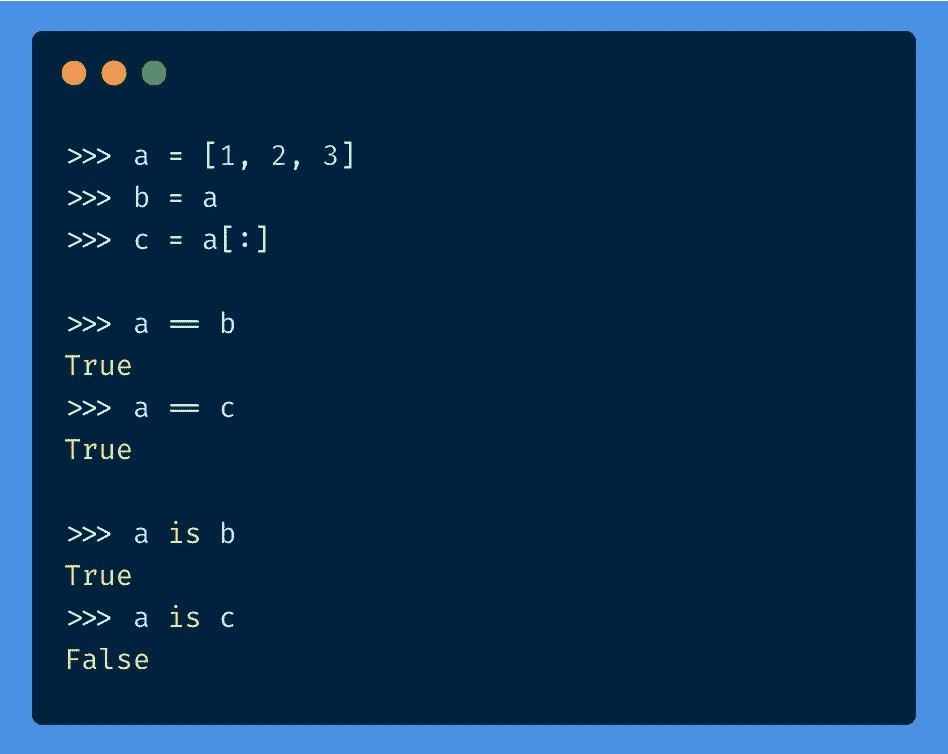

# Python 中的“是”和“==”有什么区别？

> 原文：<https://towardsdatascience.com/whats-the-difference-between-is-and-in-python-dc26406c85ad?source=collection_archive---------0----------------------->

## 何时使用哪个，为什么


Alex Chumak 在 [Unsplash](https://unsplash.com?utm_source=medium&utm_medium=referral) 上拍摄的照片

当我们在 Python 中比较对象时，我们通常使用`**==**`操作符。我们有时可能会尝试使用`**is**`操作符来执行相同的任务。

这两个运算符有什么不同吗？



作者图片

这是一个简短的帖子，解释两者之间的细微差别，并提供何时使用哪一个的建议。

# 有什么区别？

我个人是查了才知道的。这其实很容易理解，但知道这一点也很重要。

*   `==`代表*值相等*。它用来知道两个对象是否有相同的值。
*   `is`用于*参考相等*。它用来知道两个引用是否指向同一个对象，即它们是否相同。如果两个对象有相同的内存地址，那么它们就是相同的。

> 两个值相等的物体不一定相同。

简单来说:`==` **确定两个对象的值是否相等，而** `**is**` **确定它们是否是完全相同的对象。**

或者更简单:**`**is**`**语句是** `**id(a) == id(b)**`的语法糖**

****id()是 Python 中的内置函数。它接受单个参数，并使用* ***返回对象*** *的标识。***

# **让我们看一些例子👨‍💻**

**让我们定义一个变量`**a**`来保存一个列表，让我们将它影响到一个变量`**b**` **。****

**`**a**`和`**b**`在内存中引用同一个对象，我们可以使用 **id** 函数来检查这一点。(id 保证在同时存在的对象中是唯一的)。**

**`**a**`和`**b**`因此具有相同的 id，因此语句`**a is b**`为真。**

```
**a = [1, 2, 3]
b = a****id(a)
# 140545544215872****id(b)
# 140545544215872****a is b
# True****a == b
# True**
```

**现在让我们通过 slice 操作符复制列表`**a**`。拷贝应该在内存中创建一个新的对象，有一个新的地址，这样就分配了一个新的 id。**

```
**c = a[:]****id(a)
# 140545544215872****id(c)
# 140545544587008**
```

**因此:**

```
**a is c
# False****a == c
# True**
```

**这里`a`和`c`指向内存中两个不同的对象，即使它们的值相等。**

# **Python 中的一些不一致行为**

**让我们运行这个小例子。**

```
**>>> a = 1000
>>> b = 1000
>>> a == b
True
>>> a is b
False**
```

**这种行为是意料之中的，就像我们在前面的例子中看到的一样。**

**现在让我们用 100 代替 1000。**

```
**>>> c = 100
>>> d = 100
>>> c == d
True
>>> c is d
True**
```

**这里发生了什么？这与之前的结果不一致。**

**结果是 Python 的参考实现缓存了-5 范围内的整数对象..256 作为单例实例。**

**同样的事情也发生在弦上。**

# **PEP8 对此怎么说？**

**标准库的官方 Python 风格指南 PEP 8 也提到了[和](https://www.python.org/dev/peps/pep-0008/#programming-recommendations)T6 的两个用例:**

> ***与 None 之类的 singletons 的比较应该总是使用 is 或 is not，而不是等号运算符。***
> 
> **此外，当您真正的意思是如果 x 不是 None 时，要小心编写 if x——例如，当测试默认为 None 的变量或参数是否被设置为其他值时。另一个值的类型(比如容器)在布尔上下文中可能为 false！**

# **概述**

*   **如果两个对象有相同的内存地址，那么它们就是相同的**
*   **两个相同的对象具有相等的值，但是具有相等值的两个对象不一定相同**
*   **使用`**is**`检查同一性，使用`**==**`检查相等性。**
*   **在大多数其他情况下，当你比较像 None 和`**==**`这样的单例时，使用`**is**`:这是一个[安全的](https://lerner.co.il/2015/06/16/why-you-should-almost-never-use-is-in-python/)选择。**

# **参考**

*   **[https://stack overflow . com/questions/132988/is-there-a-difference-and-is](https://stackoverflow.com/questions/132988/is-there-a-difference-between-and-is)**
*   **[https://www . python . org/dev/peps/pep-0008/#编程-建议](https://www.python.org/dev/peps/pep-0008/#programming-recommendations)**
*   **[https://Lerner . co . il/2015/06/16/why-you-should-never-use-is-in-python/](https://lerner.co.il/2015/06/16/why-you-should-almost-never-use-is-in-python/)**

# **感谢阅读🙏**

# **新到中？你可以订阅每月 5 美元，并解锁无限的文章——[点击这里。](https://ahmedbesbes.medium.com/membership)**