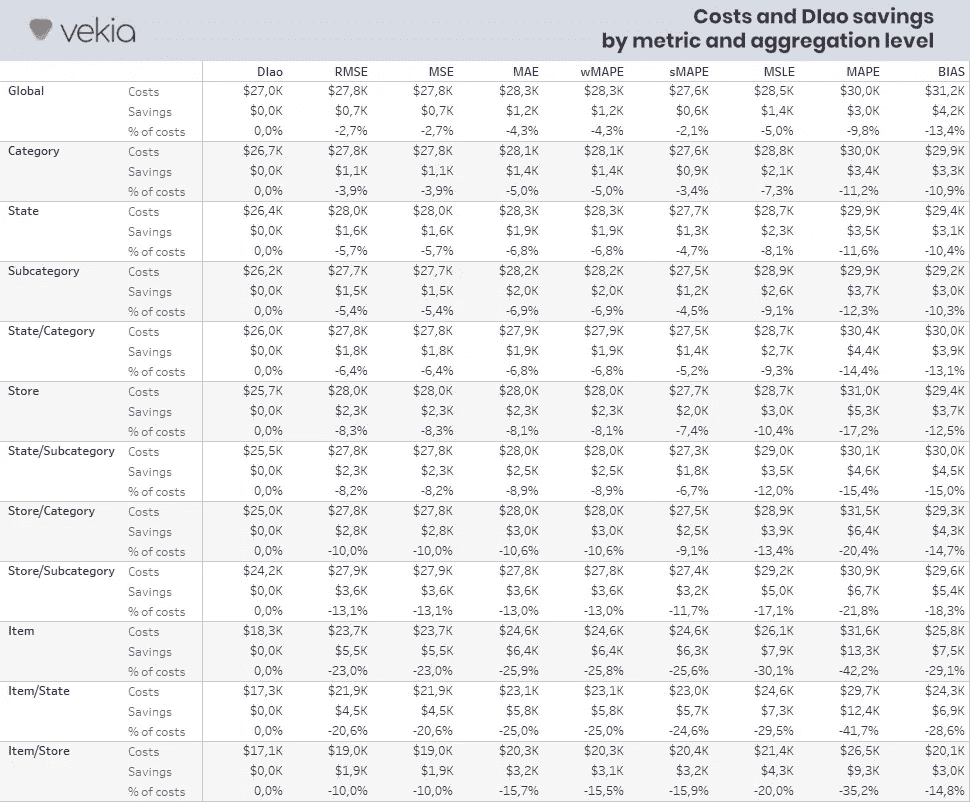

# 预测准确性指标的隐性成本是多少？-来自 M5 竞赛的见解

> 原文：<https://towardsdatascience.com/whats-the-hidden-cost-of-a-forecast-accuracy-metric-64ee0b86ce25?source=collection_archive---------31----------------------->

## [行业笔记](https://towardsdatascience.com/tagged/notes-from-industry)

## 有几十种花哨的预测指标，做出正确的选择似乎相当棘手。每一种都有它的特点，它的优点和缺点，它的捍卫者和它的批评者…你的选择真的重要吗？有需要避免的度量标准吗？相反，是否有比其他指标交付更多价值的指标，如果有，交付多少？

由[迈克尔·朗米尔](https://unsplash.com/@f7photo?utm_source=unsplash&utm_medium=referral&utm_content=creditCopyText)在 [Unsplash](https://unsplash.com/s/photos/research?utm_source=unsplash&utm_medium=referral&utm_content=creditCopyText) 上拍摄的照片

# *附录*

*本文于 2021 年 7 月 4 日更新，以反映各种读者评论，这些评论指出了本文第一版中的局限性和潜在偏见。特别感谢 Trixie Tacung(欧莱雅)和 Ivan Svetunkov (CMAF 兰卡斯特大学)。*

# 在前一集里…

这一系列文章主张需要新一代的预测指标，将重点放在预测的业务影响上，而不是仅仅放在准确性/精确度上。

在我们的[上一篇文章](https://www.linkedin.com/pulse/last-first-insights-from-m5-competition-johann-robette-/) [1]中，我们将各种预测与它们引发的商业决策的质量进行了比较。

为此，我们利用了“M5-竞争”[2]数据集(基于沃尔玛的数据)和来自基准和竞争对手的 74 种预测方法。这使得超过 680 万次补货决策的模拟成为可能。

如此大的工作台使得每种方法的成本(从它们触发的决策中测量)和各种性能指标(MAPE、wMAPE、sMAPE、MSLE、MAE、MSE、RMSE、WRMSSE、BIAS、DIao)的公平比较成为可能。

有趣的是，该测试表明**传统的预测指标在从业务角度确定最佳方法方面表现不佳**。事实上，从商业的角度来看，一个被给定的度量标准确定为“最佳”的方法很可能是最差的。

然而，并非所有指标都是平等的！

例如，**新引入的 DIao 指标在优化业务决策方面明显优于任何其他指标**。事实上，该指标并不关注预测误差，而是考虑所引发的决策和相关成本。

# 这篇文章里有什么？

> 外面有一大堆花哨的度量标准，如果现有的已经“足够好”并且附加值不明确，那么肯定没有必要引入新的。

在第四篇文章中，我们描述并实现了一个测试框架，它回答了以下问题:

*   所有指标的表现都一样吗？
*   如何确定满足您需求的最佳预测指标？
*   有最好避免的度量标准吗？
*   应用适当的度量标准的投资回报是什么？

那我们就来分享一些实验答案吧！

# 设置测试工作台

由[路易·里德](https://unsplash.com/@_louisreed?utm_source=unsplash&utm_medium=referral&utm_content=creditCopyText)在 [Unsplash](https://unsplash.com/s/photos/lab?utm_source=unsplash&utm_medium=referral&utm_content=creditCopyText) 上拍摄

## 资料组

在这个实验中，我们使用了我们上一篇文章中提到的“沃尔玛/ M5 竞争”数据集。如果你有兴趣学习，请参考[“后来者居上，前来者居上”……M5 竞赛见闻](https://www.linkedin.com/pulse/last-first-insights-from-m5-competition-johann-robette-/)

关于补充政策，我们使用上述文章中描述的假设，除了:

*   设置为零的初始库存。事实上，我们的目标是评估度量的真实性能，我们不希望现有的清单使我们的度量产生偏差。然后在相同的“无初始库存”假设下分析每个补货决策。
*   固定成本也设置为零。这是因为固定成本是在订单级别计算的，这在较低级别计算相关性时会添加一些不必要的噪声。

## 相关性度量

我们在这里感兴趣的是测量各种预测指标和它们触发的决策成本之间的相关性。

相关系数用于衡量变量之间关系的强度。更准确地说，相关系数衡量两个变量之间的线性关系。

然而，给定预测指标的公式(包括权重、对数、平方、平方根、绝对值等等)，我们不能期望指标与其成本之间的关系是线性的。

相反，我们可能期望单调性以“当一个指标提高时，成本降低”的形式出现。因此，我们在这个分析中应用了 Spearman 的等级-顺序相关性。

斯皮尔曼的等级-顺序相关性关注的不是价值本身，而是它们的等级。当等级完全相关(rho=1)时，变量向同一方向演化。当等级反向相关(rho=-1)时，变量向相反方向演化。在这两种情况下，从我们的角度来看，指标的演变完全符合成本的演变。

但是，一旦相关系数不等于+1 或-1，变量就不再完全相关。从业务的角度来看，这种情况意味着，**虽然预测指标提高了，但决策的质量可能会下降……**这会增加成本而不是产生价值！

*花费如此多的精力和资源来改进预测，却不能为您的业务服务，这是多么可耻的事情啊！*

## 性能指标

在这里，我们重点关注经典的预测指标，包括 MAPE、wMAPE、sMAPE、MSLE、MAE、MSE、RMSE、WRMSSE、BIAS *(最后是 BIAS 指标)。*

当然，我们在这个列表中添加了新引入的“决策影响”指标。在三个“决策影响”指标(即 DIna、DIno 和 DIao)中，选择 DIao 是因为它关注错误的成本。

关于那些 DIao 和其他两个度量的更多细节，您可以参考:[“决策影响”:实现新一代面向业务的度量的 10 个理由](https://www.linkedin.com/pulse/decision-impact-10-reasons-implement-new-generation-johann-robette-/) [3]。

## 聚合级别

大多数从业者在特定的计算级别评估和交流他们的性能指标。例如，一些需求计划员将决定选择一种预测方法，并将其应用于整个(或全局)范围。其他人将决定为不同的子范围选择不同的方法，例如按产品类别。一些需求计划员最多会按物料/商店选择一种预测方法。

*评估所选聚合级别的影响不是很有趣吗？然后，让我们向这个测试平台添加各种聚合级别。*

以下是所选的 12 个级别(括号中的数字是该级别的节点数) :

*   全球(1)，
*   状态(3)，
*   类别(3)，
*   部门(7)、
*   国家/类别(9)，
*   商店(10)，
*   州/部门(21)、
*   商店/类别(30)、
*   商店/部门(70)、
*   项目(3049)，
*   状态/项目(9147)，
*   商店/项目(30490)。

# 分析相关性

照片由 [mari lezhava](https://unsplash.com/@marilezhava?utm_source=unsplash&utm_medium=referral&utm_content=creditCopyText) 在 [Unsplash](https://unsplash.com/s/photos/examination?utm_source=unsplash&utm_medium=referral&utm_content=creditCopyText) 上拍摄

计算完成后，下面的箱线图显示了 Spearman rho 排名相关性的分布(每个聚集水平的平均值)。

作者图片

作者图片

## 这个怎么解读？

下表就如何解释 Spearman rho 的等级相关性给出了一些指导。

Spearman rho(分级)相关性解释指南(Prion 和 Haerling，2014 年)

根据上述指南进行测量:

*   MAPE，通常被认为是最常用的预测指标[4]，在这种情况下是最差的指标，与成本的相关性*可以忽略不计*到*微弱*。
*   不出所料，偏差对成本也有一个*可以忽略的*到*微弱的*相关性。
*   其他指标的相关性具有较大的 rho 范围，从*可忽略*到*中等。*
*   在经典指标中，MAE & wMAPE 明显脱颖而出，相关系数从*可忽略*到*中等*。
*   再一次，提出的 DIao 指标明显优于其他指标，因为其设计*与成本*完全相关，无论成本水平如何。

有趣的是，如下图所示，在高聚合级别，指标与成本的相关性往往不同。不幸的是，补货决策必须在商品/商店层面做出，其中每个指标(除了 DIao)与成本都有相同的*弱*相关性。

作者图片

基于这个测试，刁绝对是一个非常合适的指标。另一方面，在经典的度量中，没有一个度量在决策层是突出的。

毫无疑问，从科学角度来看，**相关性是必不可少的**。但是，从一个度量转换为 DIao 会产生什么附加价值呢？这个额外的价值是否足够大到可以使这样的改变合法化？

让我们定义另一个测试来检查这一点！

## 分析有效成本

照片由 [Jp Valery](https://unsplash.com/@jpvalery?utm_source=unsplash&utm_medium=referral&utm_content=creditCopyText) 在 [Unsplash](https://unsplash.com/s/photos/finance-cost?utm_source=unsplash&utm_medium=referral&utm_content=creditCopyText) 上拍摄

对于上述每个指标，让我们选择最佳的 5 个预测(从 74 个可用预测中)。选择几个预测而不是一个预测会使我们的结论更加可靠，因为它避免了传统的陷阱，例如意外选择一个表现不佳的预测。

然后，按指标计算并平均所选预测的成本，以获得每个指标触发的平均成本。这些成本显示在下面的方框图中。

作者图片

该图显示:

*   BIAS & MAPE 精选预测比任何其他指标都贵，平均值分别为 3.5 万美元和 3 万美元。
*   其他指标选择的预测平均成本为 2.6 万美元(比 MAPE 低 13%)。它们从一个到另一个提供了小的额外的改进，但是没有很大的不同。
*   DIao 指标选择了平均成本为 2.4 万美元的预测值(与 MAPE 相比下降了 21%，与上述指标相比下降了 10%)。

## 这代表了多大的附加值？

让我们客观地看待这些结果，并比较每个聚合级别的每个指标与 DIao 的成本。

作者图片

作者图片

无论聚合级别如何，DIao 指标始终为给定的决策流程确定最适合的预测。

从高层次来看，由于指标与成本的相关性更好，因此额外的节省是有限的(700 到 3，000 美元)。但是，一旦在更精细的级别(如商品/商店级别)计算指标，节省就会大幅增加，从 1.9 万美元到 9.3 万美元不等

## 嗯……它很棒还是垃圾？

为了更好地理解这些数字，让我们把它们放在上下文中。

下面，我们将重点关注 MAPE(因为它是应用最广泛的指标)和商品/商店级别(做出补货决策的地方)，从而节省 93000 美元。

我们的预测期包括 288 万美元的销售额。沃尔玛 2020 年的年销售额定为 5591.5 亿美元[5]。这意味着我们的分析代表了沃尔玛年收入的 0.00052%。此外，沃尔玛 2020 年的年总收入为 1388.4 亿美元[5]。

考虑到这些数字，93000 美元的节约是多少？

*   3 周内 10 家商店的 3049 件商品售价 93000 美元
*   即。**总补货成本的 35.2%**
*   即。每个项目和商店每年 5.29 美元
*   即。**沃尔玛规模 18.05 亿美元/年**
*   即。年营业额的 0.32%
*   即。**沃尔玛年度总收入的 1.30%**

# 结论

正如我们所展示的，**并非所有预测指标都是一样的！**

为您的业务选择正确的指标将极大地提高您的绩效！相反，使用错误的指标(比如 MAPE)会让你的公司损失很多钱。

当然，并不是所有的公司都像沃尔玛那么大！然而，**高达 35.2%的总成本降低对任何业务都有实际影响**。当您简单地用一个指标替换另一个指标时更是如此。

虽然“决策影响指标”的第一个用例很棒，**还有更多用例可以分享**。我们将在本系列的后续文章中逐一介绍它们。

# 承认

特别感谢[Manuel Davy](https://www.linkedin.com/in/manuel-davy/)(Vekia 创始人&首席执行官)[Stefan De Kok](https://www.linkedin.com/in/wahupa/)(wah upa 联合创始人&首席执行官)[hervéLemai](https://www.linkedin.com/in/herv%C3%A9-lemai/)(Vekia 首席技术官)。

*本文旨在阐明预测性能测量的当前实践、局限性和可能的改进。它肯定不是完美的，并且受到限制。*

如果你觉得这很有见地，请分享和评论…但也请随意挑战和批评。如果你想进一步讨论这个问题，请联系我！

*无论如何，敬请关注下一篇文章！同时，请访问我们的网站*[*www . vekia . fr*](http://www.vekia.fr)*了解更多我们在为供应链提供高价值方面的专业知识和经验。*

*Linkedin:*[*www.linkedin.com/in/johann-robette/*](https://www.linkedin.com/in/johann-robette/)
*Web:*[*www . vekia . fr*](https://www.vekia.fr/)

# 参考

[1] Vekia，Johann ROBETTE，[最后将是第一个，第一个最后——来自 M5 竞赛的见解](https://www.linkedin.com/pulse/last-first-insights-from-m5-competition-johann-robette-/)，2021

[2] Kaggle， [M5 竞赛网站](https://www.kaggle.com/c/m5-forecasting-accuracy)，2020 年

[3] Vekia，Johann ROBETTE，[“决策影响”:实施新一代面向业务的指标的 10 个理由](https://www.linkedin.com/pulse/decision-impact-10-reasons-implement-new-generation-johann-robette-/)，2021

[4] Gartner，[财务堵塞限制预测准确性](https://blogs.gartner.com/power-of-the-profession-blog/financial-plug-limits-forecast-accuracy/)，2019

[5]《华尔街日报》，[沃尔玛公司](https://www.wsj.com/market-data/quotes/WMT/financials/annual/income-statement)，2021 年