# 你能达到的最大 ROC 是多少？(不，答案不是 1)

> 原文：<https://towardsdatascience.com/whats-the-maximum-roc-you-can-achieve-no-the-answer-is-not-1-da11b66c0f28?source=collection_archive---------23----------------------->

## 无论是准确度、精度，还是 ROC 下面积，大概你的预测模型都无法达到完美(甚至无法接近)。这是(统计上的)原因。

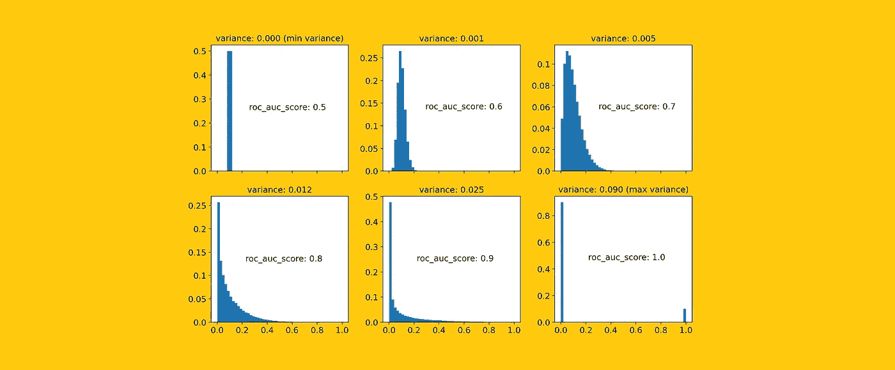

[图片由作者提供]

人们普遍认为预测模型的准确性完全取决于两个因素:

*   你的**数据**有多完整整洁；
*   你的**分类器**有多强大。

当然，这两个方面是最基本的。但是还有第三种，经常被遗忘:

*   你正在解决的**问题**有多难？

直觉上，很明显不是所有的问题都一样难。例如，对 MNIST 数字进行分类并不像预测明天的股票市场那样困难。换句话说，**每个问题都有一个固有的“硬度”**。这对数据科学家有着重要的意义，因为实际上，它意味着:

> 在给定任务上可以实现的最大 ROC 不一定是 100%,但是可以低得多，这取决于问题的难度。

这只是常识，但在某个时候，我开始问自己:

> **分类任务的难度有没有量化的衡量标准**？

我发现这个问题发人深省，因为它触及了一个有趣话题的本质:**机器学习的边界，以及——我要说——一般学习的边界**。这篇文章介绍了我是如何回答这个问题的。

# 1.让我们摇摆吧

想想任何分类任务，无论是预测保险欺诈、分类垃圾邮件还是推荐电影。

假设我们能够为该任务生成所有可能的预测模型(这个假设的模型集被称为“模型空间”)。对于它们中的每一个，我们也可以计算其在 ROC 曲线下的[面积(从现在开始简称为“ROC”)。](https://developers.google.com/machine-learning/crash-course/classification/roc-and-auc)

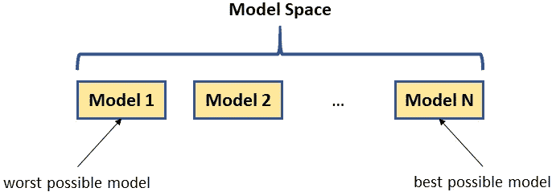

模型空间。[图片由作者提供]

正如我们所知，ROC 是衡量模型性能的一个标准。因此，如果我们采用模型空间中具有最高 ROC 的模型，那么这就是正在讨论的任务的**最佳可能模型**。

事实上，

> 最佳可能模型的 ROC 是任务“难度”的度量。

事实上，根据定义，最好的模型是不可战胜的。因此，**最佳可能模型的 ROC 越高，问题越简单；最佳可能模型的 ROC 越低，问题越难**。

所以，我们所有的工作归结为找到某种方法来定义最佳可能模型的特征。要做到这一点，让我们从基础开始。

# 2.最好的模型

任何分类任务的结构都可以概括如下:

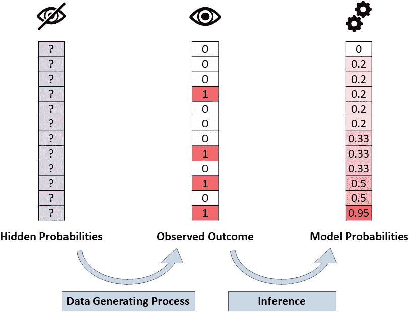

一个二元分类问题的结构。[图片由作者提供]

这个想法是，目标变量是一些“隐藏的”(或不可观察的)概率的实现。**预测模型的目的是对这些潜在的概率进行估计(尽可能准确)**。

但是隐藏的概率和观察到的结果之间有什么联系呢？如果所有样本都是独立的，生成观察结果就像为每个样本投掷一枚(装载的)硬币，硬币的装载与样本的隐藏概率成比例。在 Python 中，投掷一枚装满硬币的等价体是`numpy.random.choice`，所以生成过程看起来是这样的:

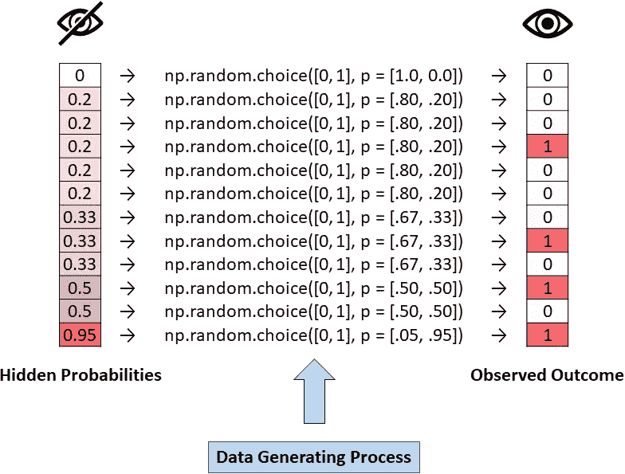

数据生成过程的样子。[图片由作者提供]

隐藏概率的随机性是不可分散的。这意味着**没有模型能比隐藏概率**做得更好。换句话说，

> 最好的可能模型是能够正确猜测所有隐藏概率的模型。

我们终于有了我们一直在寻找的最佳可能模型的定义！由于我们最初的直觉是计算最佳可能模型的 ROC，这相当于计算隐藏概率的 ROC。

综合我们发现的一切，我们可以得出这样的结论:

> 在预测问题上可能达到的最高 ROC 是产生目标变量的概率的 ROC。

根据这个定义，现在很容易计算出我们上面看到的玩具问题的最高可实现 ROC:

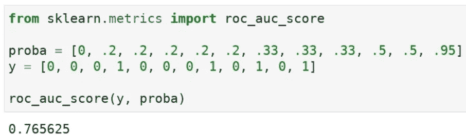

用 Python 计算 ROC 分数。[图片由作者提供]

只有 77%，离 100%还差得很远！

除了这个小例子，我们能不能用这个洞见说点更普遍的？为了回答这个问题，我们需要后退一步，尝试在更一般的背景下理解隐藏概率的特征。

# 3.隐藏概率的拼图

考虑到隐藏概率是不可观测的，我们对它们了解多少？

至少，**我们知道他们的意思**。事实上，假设**与目标变量**的均值重合是合理的。例如，如果您正在尝试对垃圾邮件进行分类，并且您观察到收到的邮件中有 10%是垃圾邮件，您可以得出结论，潜在隐藏概率的平均值也是 10%。

**我们还可以说一下它们的方差**，至少是上下界。方差的下限当然是零。关于上界，我们可以用 [Bathia-Davis 不等式](https://en.wikipedia.org/wiki/Bhatia%E2%80%93Davis_inequality)，它说明方差的上界是`(mean — min)*(max — mean)`。由此，我们可以得出结论:


我们所知道的隐藏概率的均值和方差，其中 **y** 代表目标变量。[图片由作者提供]

但这还不是全部。我们也可以假设隐藏概率是贝塔分布的。事实上，[贝塔分布](https://en.wikipedia.org/wiki/Beta_distribution)是描述概率的最佳选择，因为:

*   它仅在区间[0，1]上定义(因此，它主要用于表示百分比和比例，例如在贝叶斯推理中)；
*   它足够通用，可以表示许多不同的“形状”。

贝塔分布由两个正参数决定，称为 *α* 和 *β* 。

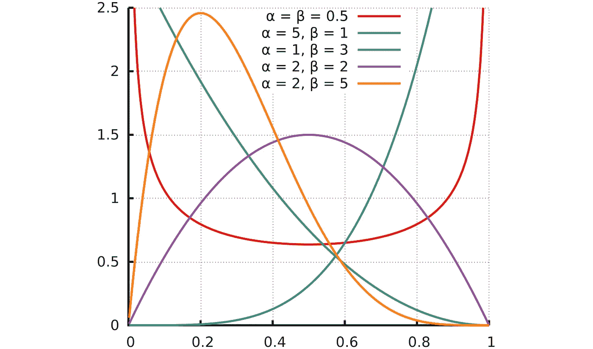

贝塔分布的概率密度函数，基于 *α* 和 *β* 的不同值【来源:[维基百科](https://en.wikipedia.org/wiki/Beta_distribution)

但是即使我们假设隐藏概率遵循贝塔分布，我们如何选择 *α* 和 *β* ？

贝塔分布的一个方便的特性是均值和方差都可以很容易地从 *α* 和 *β:* 中获得


作为参数函数的贝塔均值和方差。[图片由作者提供]

然而，在我们的例子中，我们宁愿做相反的事情，即从均值和方差中得到 *α* 和 *β* 。为了做到这一点，将上面的两个方程表示为均值和方差的函数就足够了。经过一些简单的代数运算，结果是这样的:

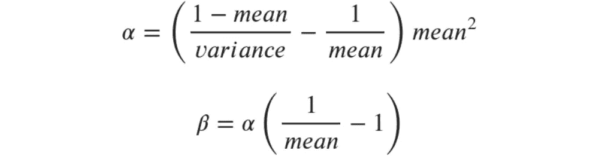

作为均值和方差函数的β参数。[图片由作者提供]

将我们看到的所有关系放在一起，我们可以编写一个 Python 函数，提供对应于任何(合法的)均值和方差对的 *α* 和 *β* :

```
**def** get_beta_params(mean, var): **assert** 0 < mean < 1, 'mean must be in ]0 and 1['
    **assert** 0 < var < mean * (1 - mean), 'var must be in ]0, mean * (1 - mean)[' alpha = ((1 - mean) / var - 1 / mean) * mean ** 2
    beta = alpha * (1 / mean - 1) **return** alpha, beta
```

该函数允许我们绘制具有给定均值(假设为 0.1)和不同方差水平的贝塔分布的 pdf(注意，在这种情况下，方差的上限将是 0.1 * 9 = . 09)。

```
**from** scipy.stats **import** beta **as** beta_distrib
**import** numpy **as** npmean = .1**for** variance **in** [.000001, .0005, .001, .002, .005, .01, .04, .089999]:
  alpha, beta = get_beta_params(mean, variance)
  pdf = beta_distrib(alpha, beta).pdf(np.linspace(0, 1, 100))
```


均值= .10 且方差不同的贝塔分布的概率密度函数。注意:最小理论方差是 0，而最大理论方差是 0.09[图片由作者提供]

除了绘制概率密度函数，一旦我们知道了 *α* 和 *β* ，我们可以通过函数`np.random.beta(alpha, beta, size)`抽取一个随机样本，并绘制各自的直方图:

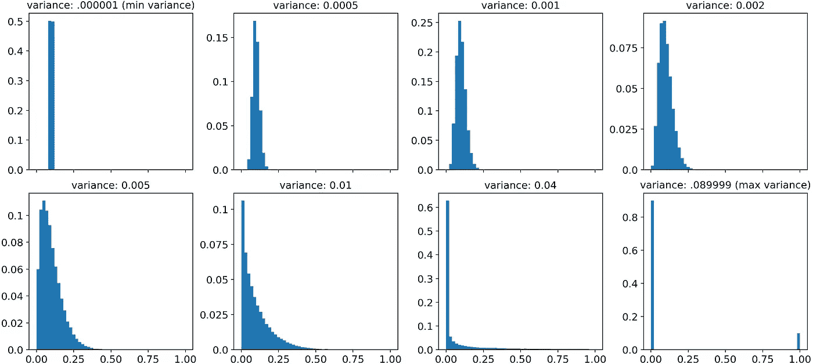

直方图:均值= .1 和不同方差的贝塔分布。[图片由作者提供]

# 4.寻找 ROC 的上界

既然我们已经学会了如何模拟尽可能多的 Beta 分布(对于给定的均值，从最小方差到最大方差)，我们终于可以回到我们最初的目的了。

事实上，从每个分布中，我们可以抽取一个概率样本，用于生成目标变量。比较概率和目标值计算出的 ROC 正是我们最初寻找的度量。

这是一个流程图:

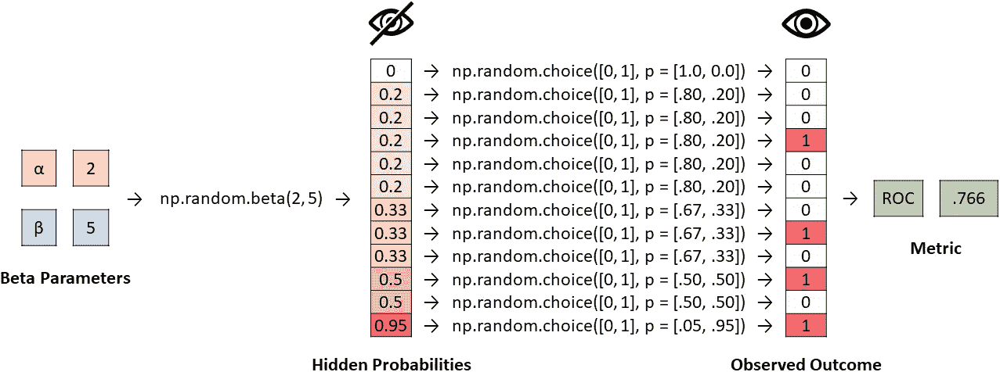

完整的过程:隐藏概率是从具有指定参数的 Beta 中提取的，然后概率被用于生成目标变量，最后 ROC 分数是根据隐藏概率和观察结果计算的。[图片由作者提供]

在 Python 中，该过程如下所示:

```
**import** pandas **as** pd
**import** numpy **as** np
**from** sklearn.metrics **import** roc_auc_scoremean = .1
var_min = 0
var_max = mean * (1 - mean)**for** var **in** np.linspace(var_min + 1e-10, var_max - 1e-10, 100):
  alpha, beta = get_beta_params(mean, var)
  proba = pd.Series(np.random.beta(alpha, beta, 100000))    
  y = proba.apply(**lambda** p: np.random.choice([0, 1], p = [1 - p, p]))
  roc_auc_score(y, proba)
```

让我们看一些例子:

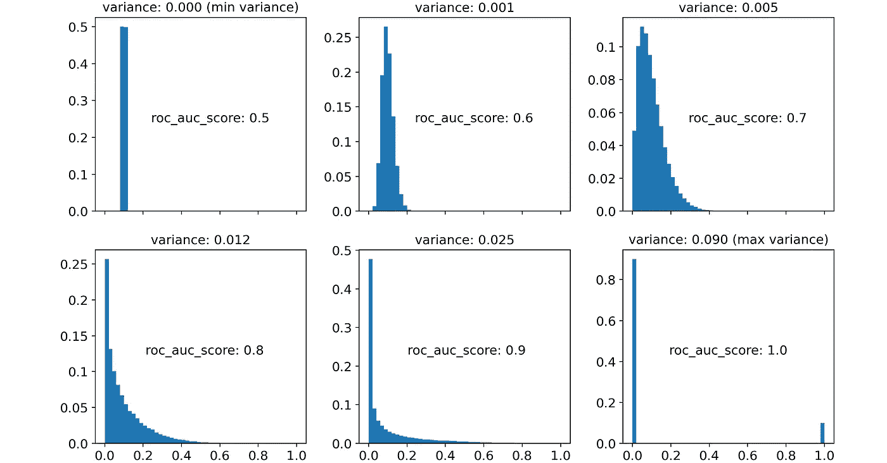

贝塔分布及其 ROC 的一些例子。[图片由作者提供]

这是 6 个不同的测试版，平均值为 0.1。但是我们可以生成无穷多个，从最小方差到最大方差。所以让我们取 100 个平均值相同、方差递增的贝塔。然后，让我们在 *x* 轴上绘制最大方差的百分比，并在 *y* 轴上绘制各自的 ROC。这是我们得到的结果:

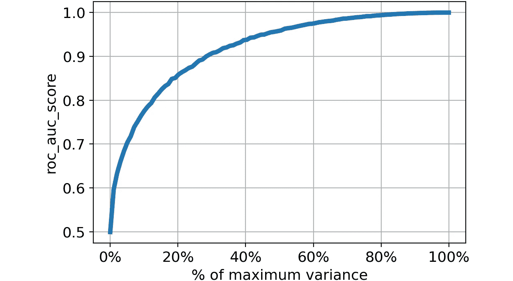

贝塔分布的方差与其相关 ROC 的关系。[图片由作者提供]

是不是很迷人？有一个明显的模式:

> 隐藏概率的方差越低，问题越“难”(即可实现的 ROC 越低)。

毕竟，这很直观。当方差为 0 时，意味着所有样本都具有相同的隐藏概率:不可能对它们进行排序，因此即使是最好的可能模型也不会比随机模型好。这意味着 ROC = .5。

相反，当方差达到最大值时，这个过程实际上没有随机性:最好的可能模型可以完美地区分积极因素和消极因素。这意味着 ROC = 1。

**最有可能的是，所有现实世界的分类任务都介于这两个极端之间。**

当然，我们所看到的不仅适用于 ROC，也适用于任何性能指标。出于好奇，让我们也画出 F1 的分数，平均精度和准确度:

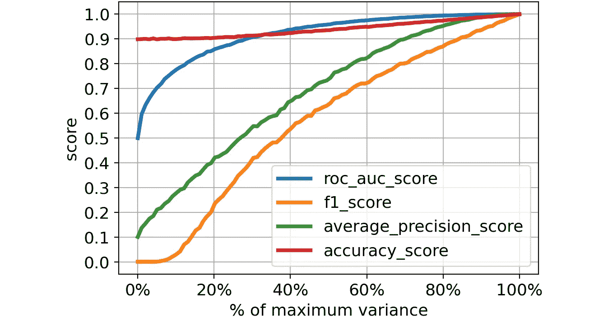

贝塔分布的方差与其相关指标(ROC、F1、平均精度、准确度)之间的关系。[图片由作者提供]

这次旅行让我们发现了为什么有些问题看起来如此“困难”。我们已经证明，对可以达到的最大 ROC 有统计限制:如果生成概率的分布具有低方差，即使是最好的可能模型也不能在物理上达到高 ROC 分数。

这是对我们最初猜测的更严谨的解释。您实现的 ROC 不仅取决于您的数据有多好或您的模型有多强大，还取决于您正在解决的问题有多困难。

感谢您的阅读！我希望这篇文章对你有用。

我感谢反馈和建设性的批评。如果你想谈论这篇文章或其他相关话题，你可以发短信给我[我的 Linkedin 联系人](https://www.linkedin.com/in/samuelemazzanti/)。