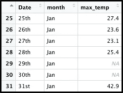
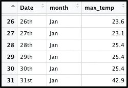

# 当一阵狂风卷走我们的记录时，你会怎么做？

> 原文：<https://towardsdatascience.com/when-a-crazy-wind-wipes-away-our-records-what-do-you-do-a9f2aab3dc17?source=collection_archive---------21----------------------->

## 你应该假设今天的温度会和昨天一样，还是假设全年的平均温度是一个很好的基准？

休伊·费恩·泰

和格雷格·佩奇一起

*(上图:澳网的拉斐尔·纳达尔；* [*I* 法师 by moer schy](https://pixabay.com/images/id-288554/)*；创建日期:2012 年 1 月 18 日)*

我喜欢澳大利亚墨尔本的一月。

一月是网球之神降临的时候，这是一年中的第一个网球大满贯——澳大利亚网球公开赛。当比赛进行时，墨尔本中央商务区笼罩在派对的气氛中。沿着亚拉河通往罗德拉沃竞技场的道路上挤满了坐在长凳上和豆袋上观看像罗杰费德勒或塞雷娜威廉姆斯这样的明星在大屏幕上比赛的人。罗德·拉沃尔竞技场本身随着每一次胜利而焕发生机。

你们中的一些人可能想徒步到这个东南部城市亲眼看看这里的活动，他们可能想知道墨尔本的夏天会有多热。很有可能你会去谷歌、Weather.com 甚至是墨尔本气象局查询，从而知道会发生什么。

但是如果，只是如果，一股疯狂的风卷走了前一年记录值的五分之一呢？或者，如果墨尔本奥林匹克公园的气象站有 20%的时间发生故障，导致那些丢失的值，该怎么办？你怎么能提前计划呢？

你可能认为这两种情况都不太可能发生——坦率地说，你可能是对的——但为了以防万一，我们决定模拟这样的事件。从墨尔本一整年的日最高温度开始，我们随机选择了其中的 20%进行移除，在那一栏中留下了 73 个 NA 值。

现在，假设我们不容易重新获得原始值，我们需要为 max_temp 变量输入数字，这样我们的行将再次成为“完整案例”(完整案例是某些建模算法和可视化技术的要求)。

在这种情况下，解决这个问题的一种方法是使用一种称为“上次观察结转”(LOCF)的统计方法，这意味着用最近的已知值填充空白。对于某些季节性因素，比如墨尔本的每日气温，这是一种合理的方法，尤其是当 NAs 的比例不是非常大的时候。虽然墨尔本全年的天气变化很大，但每天的变化很小。

LOCF 可以通过 na.locf()函数用 R 中的 *zoo* 包实现。

LOCF 用最近记录的观察结果来代替我们的每一个 NAs。对于有两个连续 NAs 的情况——如我们之前看到的 1 月 29 日和 1 月 30 日，两者都被替换为 28 日的观察值。

LOCF 的一种替代方法是采用单一的中心测量值进行插补，例如整个数据集中已知观测值的平均值。这里，这将通过将 2020 年的平均温度(即 19.6 摄氏度，或 67.28 华氏度)分配给每个空记录来实现。我们可以通过 *naniar* 包中的 impute_mean()函数来实现。

现在，我们将 LOCF 方法和估算方法的结果与原始数据集进行比较。

在整个数据集中，LOCF 值与观察值之间的平均绝对值差为 3.99，中位数差为 3，而平均插补值与真实观察值之间的平均绝对值差为 4.62，中位数为 3.8。

虽然这两种方法都易于实现，易于向受众描述，并且对于相对可预测的数据集是可靠的，但它们也有一些缺点。对于差异很大的数据集，使用中心测量值进行插补特别麻烦。LOCF 不适用于周期性波动的数据，如波动股票的股价。

如果我们处理的数据集的值范围较窄，例如某个热带国家的温度记录、各种玫瑰花瓣的长度或几只吉娃娃的高度，那么这两种方法的缺点就不会那么明显。

也就是说，如果我们使用一月的平均温度来解释该月的差异，估算方法的准确性可能会有所提高。

但那是以后的事了。

*数据来源:* [*澳大利亚气象局*](http://www.bom.gov.au/climate/data/)