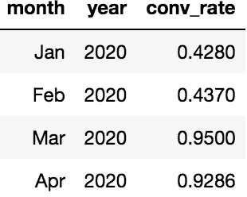
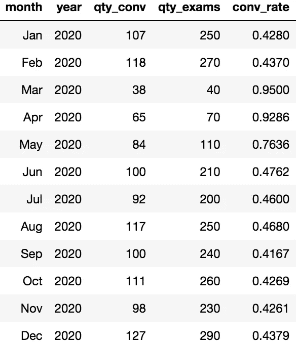
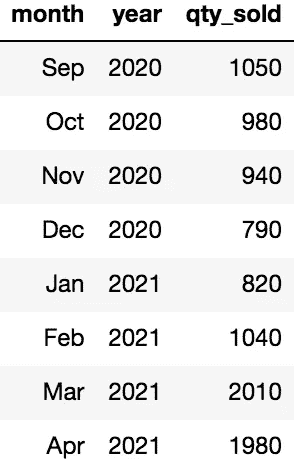

# KPI 上升可能是一件坏事

> 原文：<https://towardsdatascience.com/when-a-kpi-going-up-can-be-a-bad-thing-7021e4d27fef?source=collection_archive---------34----------------------->

## 你的利益相关者应该得到比低垂的果实更好的东西

作者照片

> …这是一个从来没有人来职业介绍日发表演讲的群体，这是犯罪！”伟大的哲学家伦道夫·杜普利

在处理数据时，问题和想法非常重要。移动数字并只关注 KPI 何时上升或下降可能会很棘手。没有问很好的问题就直接进入分析是犯罪！

我想介绍两个简单的假设场景，并向您解释理解业务需求/目标的重要性，以及生活在数据表的泡沫中可能会出错的地方。

# 你能看看转化率吗？

在第一个场景中，我们为一家牙科诊所工作。我们的 KPI 之一是“conv 比率”,其中我们使用“conv 数量”列作为分子，使用“考试数量”作为分母。

本质上，每个进来的顾客都要接受某种考试。我们希望跟踪除了标准检查/清洁之外，还有一些牙科工作的顾客的百分比。

我们正在按月查看结果。我们通常会看到 40–45%的转化率。

作者照片

每位顾客的平均消费也大幅上升(未图示)。我们要大展身手了！

照片由 Claudio Poggio 通过 Unsplash 拍摄

# 这看起来并不怎么好

让我们从稍微不同的角度来看这个问题。

作者照片

这开始讲述一个不同的故事。三月和四月看起来是非常好的月份。这个数据中有些东西很突出。现在是 2020 年！

那时发生了很多事情。作为一种预防措施，牙医只看那些确定需要牙科治疗的病人。要求预期“仅检查/清洁”的客户在稍后日期预订他们的检查。

尽管我们的 KPI 看起来在以天文数字的速度提高，但最终的结果是我们基本上只追逐那些‘灌篮’客户。对于未来的业务，这种策略可能不是最好的。希望我们能在太晚之前取消定制游艇的合同！

# 有东西在疯狂地推动销售！

在这个场景中，我们为澳大利亚的一家家用发电机公司工作。我们被要求查看电子邮件活动的一些结果。我们开始看到销售的大幅上升，看起来就像是在这些电子邮件发出后才进来的。我们或许应该给这家新的第三方营销公司送去一卡车的现金，以实现更多的未来增长。

> “非常成功！”—波拉特

作者照片

电子邮件运动的影响有多大？人们认为什么样的事件会促使他们购买更多的发电机？为什么运费也在疯狂上涨？

这些订单中的很大一部分将运往美国，Snovid 在其中扮演了重要角色？！？

> 该死的魔鬼！—暗黑破坏神的超级巨星，埃利奥特·理查兹

这个场景不一定是一个复杂的 KPI。销量上升很好。焦点是什么会推动上升。这可能属于“相关性不等于因果关系”的范畴。

# 最后的想法

在数据分析/科学世界中，你不会总是有时间或资源从树顶上摘下最好的果实。只要确保你没有从地上捡起腐烂的水果，并试图把它当作闪亮美味的食物。

在小组中提问会激发更多的问题和思考。当这些问题和想法流动时，指南针上的指针才真正开始指向正确的方向。

一如既往，继续学习！