# 当时间序列像鸭子一样呱呱叫时

> 原文：<https://towardsdatascience.com/when-a-time-series-only-quacks-like-a-duck-10de9e165e?source=collection_archive---------12----------------------->

## 运行预测模型之前测试平稳性。用 Python。和一张小鸭子的照片。

ADF、KPSS、OSCB 和 CH 检验平稳性和稳定的季节性模式；以及如果它们提供相互矛盾的结果时如何处理它们。

为了避免可能导致预测模型不完善的陷阱，我们将并行应用 ADF 和 KPSS 检验，以检查时间序列是否不仅像鸭子一样呱呱叫，而且像水鸟一样摇摇摆摆。我们还将运行 OCSB 和 CH 测试，以检查是否需要季节差异。

[*黄色和棕色的小鸭子照片 Unsplash 上的自由动物形象*](https://unsplash.com/photos/JDzoTGfoogA)

 [## 临时 csv

### 编辑描述

drive.google.com](https://drive.google.com/file/d/1bkLt2A4NnJ6_gk2y5ejZSHQEmvD0QYbY/view?usp=sharing)  [## 平稳鸭 05.ipynb

### 编辑描述

drive.google.com](https://drive.google.com/file/d/1p8FFxeNq5gIngkRnMkPo4LM4caTLQez1/view?usp=sharing) 

我们的资料来源包括东达科他马州下泰德马什小镇(完全是虚构的)1200 个月的历史气温记录。下蒂德马什镇档案馆在 20 世纪 80 年代被一场厨房火灾摧毁，之后(或者，正如一些居民告诉我们的那样，因为)志愿消防队前来救援。温度记录必须通过采访两位百岁老人来重建。时间序列是合成的，由正弦季节成分组成，反映了东达科他州的严冬和温和的夏季；过去一个世纪的全球变暖趋势；和表示估计不确定性的白噪声分量。

你可以通过上面的链接从 Google Drive 下载小的 Temp.csv 源文件(大约 33 kB)。Jupyter 笔记本可通过第二个链接获得。

# 0.属国

# 1.数据处理

下载源数据文件 Temp.csv。

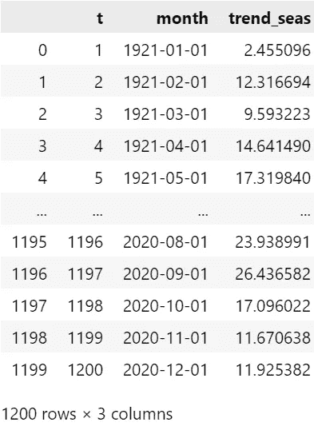

熊猫进口。csv 日期列作为对象/字符串。因此，我们将日期转换为 datetime，设置一个索引，并从索引中导出年份和月份。

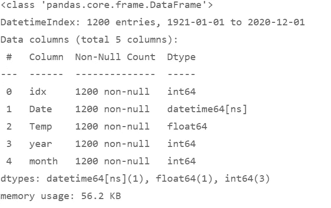

让我们创建一个 pandas 数据透视表，以表格形式查看源数据。

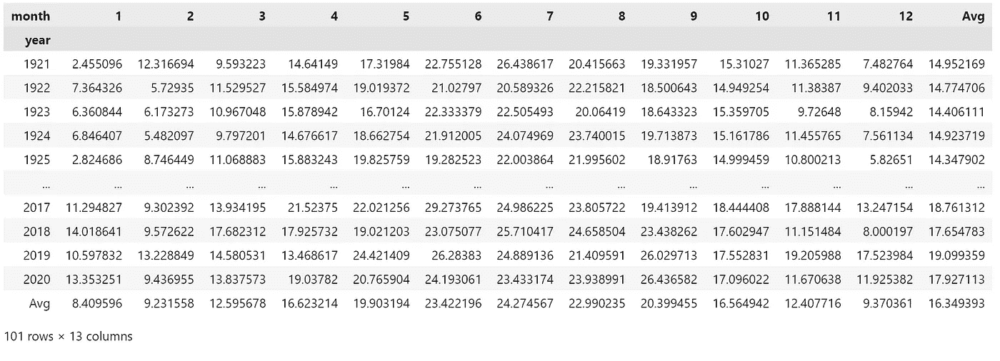

我们使用数据透视表来计算 10 年的滚动平均温度，这将消除季节性高峰和低谷的短期波动，然后创建一个图表来研究长期趋势(如果有的话)。

该图显示了上升趋势——这是我们的时间序列不是稳定的第一个迹象。

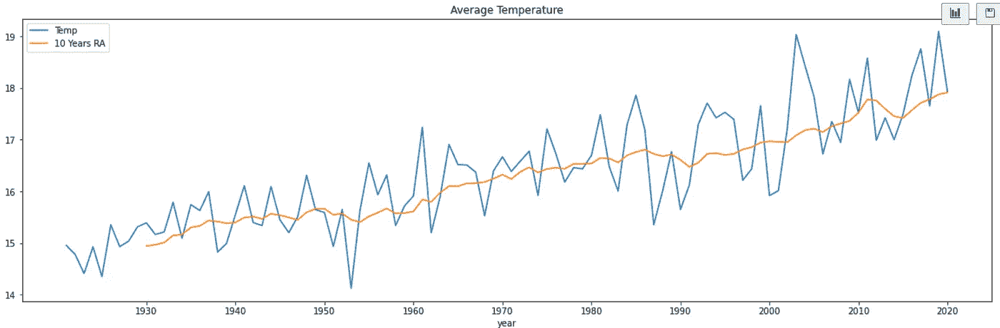

在我们将温度输入像 SARIMA 这样的预测模型之前，我们需要测试它的稳定性。

我们可能会尝试开始某种网格搜索来寻找合适的超参数，然后让自动调整过程来识别具有最低 Akaike 信息标准的模型。但是这会导致前面提到的预测质量陷阱。

*   信息标准代表我们希望根据自回归 AR 和移动平均 MA 项最小化的目标；
*   而差分的顺序必须通过运行平稳性测试来预先确定。

# 2.平稳性测试

## 2.1 平稳性和差异

**平稳性**

“平稳时间序列的特性不依赖于观察时间。”(8.1 平稳性和差分|预测:原理和实践(第二版)(otexts.com))

如果时间序列的均值、方差和自相关结构不随时间变化，则时间序列是稳定的。如果它们不是时不变的，我们今天用来准备预报的属性将不同于我们明天观察到的属性。一个不稳定的过程会避开我们利用过去的观察来预测未来发展的方法。时间序列本身不需要在过去和未来期间保持平坦、恒定的直线才能被认为是平稳的，但决定其随时间变化的模式需要是平稳的，以使其未来行为可以预测。

时间序列需要展示:

*   非时变均值
*   非时变方差
*   非时变自相关

具有先验非平稳观测值的时间序列通常可以被转换以达到平稳性。

**变化无常的意思**

显示强劲上升或下降趋势的序列没有恒定的平均值。但是如果它的数据点在扰动后趋向于回复到趋势线，时间序列就是*趋势*-平稳的。像*去趋势化*这样的变换可能会将它转换成可用于预测模型的平稳时间序列。如果趋势遵循可预测的模式，我们可以将趋势线拟合到观察值，然后在将去趋势序列输入预测模型之前将其减去。或者，我们可以在模型中插入一个日期时间索引作为额外的独立变量。

如果这些去趋势测量不足以实现恒定平均值，我们可以调查一次观察到的*差异*是否具有恒定平均值。

通过*差分*时间序列——取观察值 y(t)和早期观察值 y(t-n)之间的差值——我们可以获得*变化*的平稳(均值回复)序列。

一个时间序列，其中的任何观察只取决于它的一个或多个前导(由几个滞后分开)，加上或减去一些随机误差，被称为*随机行走*。除了误差项之外，观测值之间的差异具有零均值，根据定义，如果误差项不包含对预测有价值信息的信号，则误差项本身具有零均值。随机漫步可能表现出明显趋势的长阶段，上涨或下跌，然后是不可预测的方向变化。恒定的平均趋势需要一阶差分。

相邻观测值之间的差异具有非零均值的时间序列将倾向于*向上(正均值)或向下(负均值)漂移*。我们将一个*时间序列与漂移*进行差分，得到一个具有常数均值的序列。

一些时间序列需要两轮差分。观测值之间的变化不是恒定的(观测值之间没有恒定的“速度”)，但变化*速率*可能是稳定的(恒定的“加速”或“减速”)。如果两轮差分不足以使一个时间序列平稳，第三轮很少是合理的。相反，应该更仔细地研究时间序列的特性。

具有*季节性*的时间序列将显示出在恒定数量的周期之后重复的模式:一月份的温度与七月份的不同，但是一月份的温度在不同年份之间将处于相似的水平。*季节差异*将观测值与其前一个观测值之间的差异去掉 S 个滞后，S 是一个完整季节的周期数，比如一年 12 个月或一周 7 天。

如果趋势和季节模式都是相对时间不变的，差分时间序列(相对于趋势的第一差分；和相对于季节性的季节性差异)将具有近似恒定的平均值。

**非恒定方差**

如果时间序列呈现扩大或缩小的漏斗形状，那么它的观测值会随着时间的推移围绕其趋势波动，方差会增大或减小。它的方差不是时不变的。

通过取观察值的对数，它们的平方根，或者应用 Box-Cox 变换，我们可以通过变换稳定方差。预测之后，我们可以逆转这些转变。

**非恒定自相关结构**

对于任何给定的 t，两个观测值 y(t)和 y(t-1)之间的相关性和协方差不会随时间保持不变。对于平稳性，自相关应该是时不变的。

**PSA #1:在拟合模型之前确定平稳性**

在将预测模型拟合到数据之前，所需的差分阶数是应该预先确定的参数。调整算法可以根据选定的基准(如 Akaike 信息标准)测试超参数的任何组合。但是一些超参数可能会相互抵消。SARIMA 模型中的超参数搜索会用自回归 AR 和移动平均 MA 项来交换差分顺序的变化。

“重要的是要注意，这些信息标准往往不是选择模型差分(d)的适当阶次的良好指南，而只是选择 p 和 q 的值。这是因为差分改变了计算似然性的数据，使得具有不同差分阶次的模型之间的 AIC 值不可比。所以我们需要使用一些其他方法来选择 d，然后我们可以使用 AICc 来选择 p 和 q”(hynd man， [8.6 估计和顺序选择|预测:原则和实践(第二版)(otexts.com)](https://otexts.com/fpp2/arima-estimation.html))。

因此，如果超参数搜索试图确定与其他参数并行的差分顺序，我们可能会获得一个较差的预测模型。这个搜索会找到一个明显最小化 AIC 或 BIC 的差分顺序。但它可能错过了一个模型，尽管它的 AIC 更高，但该模型可以导致更准确的预测。搜索算法不知道它的目标，信息标准，不能比较不同阶差分的模型。

调整算法应该在开始对其他超参数进行网格搜索之前应用假设测试来确定适当的差分顺序；或者数据科学家确定差分的顺序，然后将网格搜索限制到剩余的参数，例如 AR 和 MA 项。

**PSA #2:对稳定性进行平行测试**

为了确定是否需要差异，我们可以运行四个测试来获得客观的结果，这是目视检查图表可能会遗漏的:

*   扩充迪基-富勒 ADF
*   科维亚特科夫斯基-菲利普斯-施密特-申·KPSS
*   Osborn-Chui-Smith-Birchenhall OCSB 季节性差异
*   卡诺瓦-汉森季节差异研究中心

我将跳过其他一些单位根测试，如菲利普斯-庇隆。

在相当多的情况下，这些测试可能会返回相互矛盾的结果。下面的例子将说明 ADF 和 KPSS 应该并行评估，而不是孤立地评估。我们中的许多人——包括我在内，当我准备我的第一份预测时——习惯于依赖 ADF 检验作为我们的平稳性检验的默认；其他人更喜欢 KPSS 测试。我想，我们当中很少有人习惯性地应用这两种测试，然后比较它们来决定差异。

## 2.2 增强的迪基-富勒试验(pmdarima)——像鸭子一样嘎嘎叫？

*   零假设:数列包含一个单位根:它是*而不是*平稳的。
*   替代假设:没有单位根。
*   低 p 值是优选的。如果测试返回的 p 值*低于*所选的显著性水平(例如 0.05)，我们拒绝该空值，并推断该系列不包含单位根。
*   如果 ADF 检验没有找到单位根，但是 KPSS 检验找到了，那么这个序列就是差分平稳的:它仍然需要差分。
*   ADF 和 KPSS 的 pmdarima 测试提供 p 值作为输出；和一个布尔值，它是问题的答案:“我们应该不同吗？”

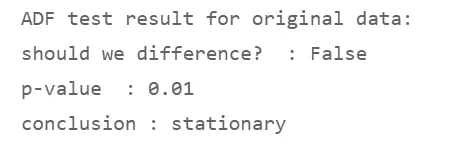

## 2.3 科维亚特科夫斯基-菲利浦斯-施米特-申试验(KPSS)(pmdarima)——但它不会像鸭子一样走路？

*   零假设:序列围绕一个确定的趋势是平稳的(趋势平稳)。
*   请注意，与 ADF 检验相比，KPSS 检验交换了原假设和替代假设。
*   替代假设:数列有单位根。它是不稳定的。
*   高 p 值是优选的。如果测试返回的 p 值*高于*选定的显著性水平(如 0.05)，我们得出结论，它似乎是(至少趋势)稳定的。
*   如果 KPSS 检验没有找到单位根，但是 ADF 检验找到了，那么这个序列就是*趋势*-平稳的:它需要差分(或者其他变换，比如去趋势)来消除趋势。

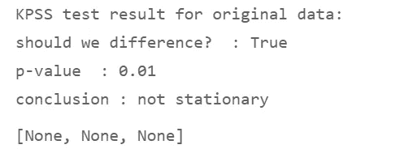

## 2.4 比较 ADF 和 KPSS 测试结果(pmdarima)

因此，pmdarima 测试返回相互矛盾的结果。

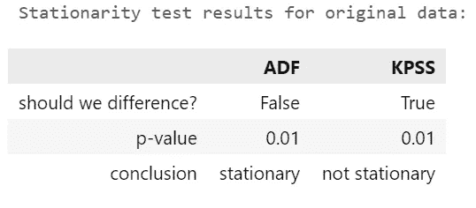

## 2.5 ADF 和 KPSS 推荐的差分顺序

pmdarima 还提供了一种返回推荐的一阶差分的*阶*的方法。

这些建议也是矛盾的，因为同样的 ADF 和 KPSS 测试被用来推导它们。

但是我们稍后将回到这些差异的顺序，那时我们将总结我们的发现并决定如何进行。

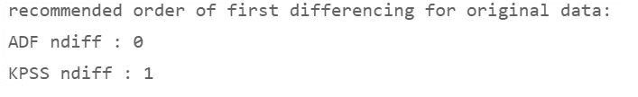

让我们用 statsmodels.stattools 测试来检查这是否只是 pmdarima 算法中的一个怪癖(提示:它不是)。

## **2.6 增强的 Dickey-Fuller 测试(stattools)——像鸭子一样嘎嘎叫？**

*   与 pmdarima 测试相比，我们使用 statsmodels.stattools 的 adfuller 测试来获得更多信息。
*   零假设:数列包含一个单位根，它是*而不是*平稳的。
*   替代假设:没有单位根。
*   低 p 值是优选的。如果测试返回的 p 值*低于*所选的显著性水平(例如 0.05)，我们拒绝该空值，并推断该序列不包含单位根。它看起来是静止的。
*   如果 ADF 测试没有找到单位根，但是 KPSS 测试找到了，这个序列就是*差分*-平稳的:它需要差分。

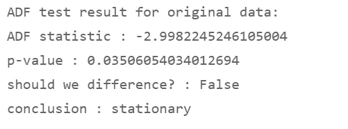

## **2.7 科维亚特科夫斯基-菲利普斯-施米特-申试验(KPSS)(stattools)——走路不像鸭子？**

*   零假设:序列围绕一个确定的趋势是平稳的(趋势平稳)。
*   替代假设:数列有单位根。它是不稳定的。
*   高 p 值是优选的。如果测试返回的 p 值*高于*选定的显著性水平(如 0.05)，我们得出结论，它似乎至少是趋势稳定的。
*   如果 KPSS 检验没有找到单位根，但是 ADF 检验找到了，那么这个序列就是*趋势-* 平稳的:它需要差分或其他变换来消除趋势。

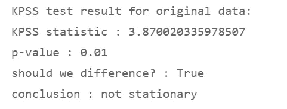

## **2.8 比较 ADF 和 KPSS 的结果——ADF 像鸭子一样呱呱叫，但 KPSS 不像水鸟一样走路**

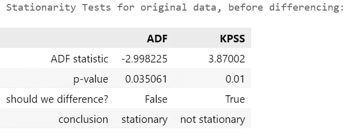

## **2.9 区别还是不区别？**

*   所以 ADF 测试没有找到单位根，尽管上面的图表显示了明显的上升趋势。
*   KPSS 检验报告说该序列不是平稳的。

我们如何处理冲突？KPSS 检验总是正确的吗？

## 2.10 视觉真实性检查:分解

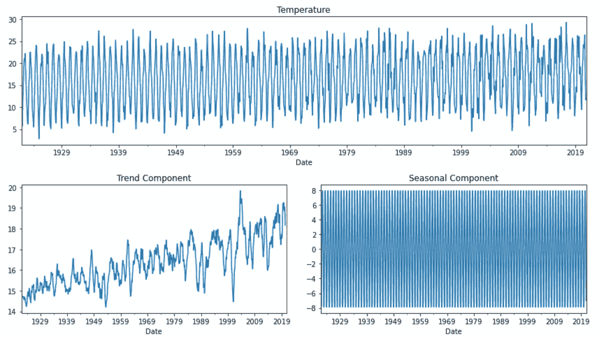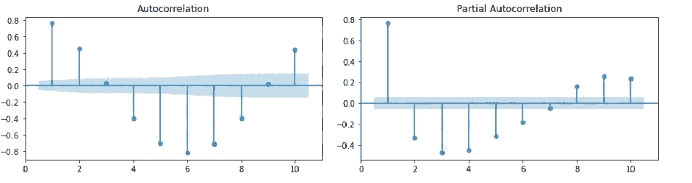

*   趋势图没有显示一个恒定的平均值，而是一个上升的趋势。该系列不能是静止的。
*   自相关图在其 ACF 图和 PACF 图中显示了高度和持续的自相关性，并伴有季节性振荡。如果该序列表现出稳定的季节性，它就不可能是稳定的。

## 2.11 第一个区别:达到平稳性

我们应用差分法。diff()到原始时间序列；然后检查 ADF 和 KPSS 的平稳性。

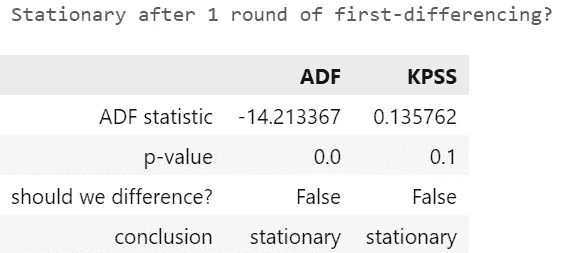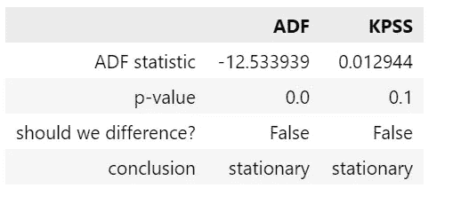

**ADF 和 KPSS 一致认为*差分*系列是静止的。差异系列不仅叫起来像鸭子，走路也像鸭子。**

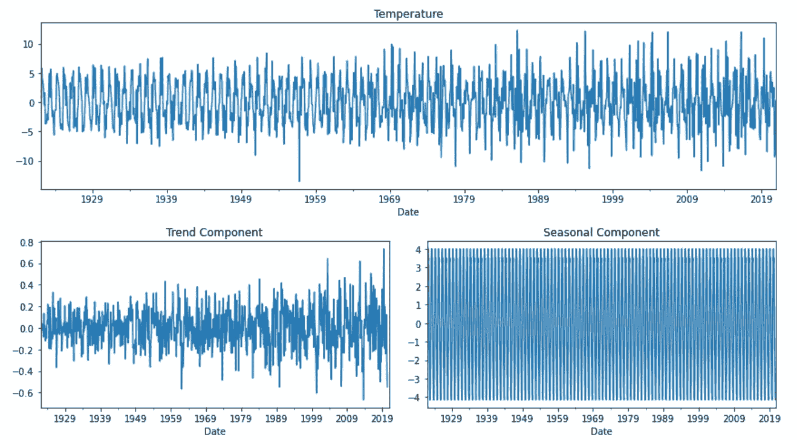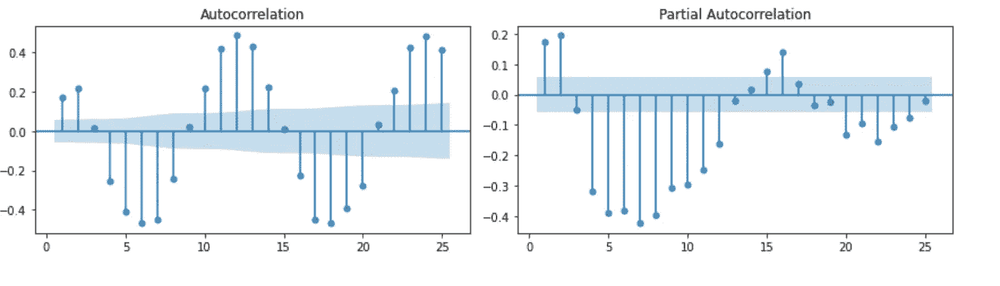

## 2.12 平稳——但是季节性呢？

我们已经应用了一阶差分，并从 ADF 和 KPSS 获得了良好的测试结果。尽管 ACF 图仍然显示季节性波动。

让我们运行 OCSB 和 CH 测试来决定我们是否也需要季节差异的帮助。

两个测试的 pmdarima 实现返回季节差异的推荐顺序。

奥斯本-楚伊-史密斯-伯兴霍尔 OCSB 试验:

*   零假设:数列包含一个季节性单位根
*   它使用迪基-富勒型回归。( [ocsb:季节测试中的 ocsb 测试:季节性测试(rdrr.io)](https://rdrr.io/cran/seastests/man/ocsb.html) )

卡诺瓦-汉森季节稳定性检验:

*   零假设:季节性模式是稳定的

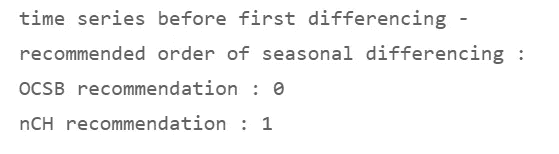

2.12 当我们调查*原始*数据时，我们观察到另一个冲突，这次是关于季节差异:

*   OCSB 没有确定对季节性差异的需求，类似于 ACF 对首次差异的需求。
*   CH 检验推荐一阶季节差异，类似于 KPSS 的一阶差异。

2.12b 当我们对我们在第 2.11 章中生成的*一阶差分*数据运行 OCSB 和 CH 时，OCSB 和 CH 同意一阶差分已经消除了任何季节差分的需要。

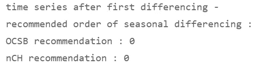

相反，如果 OCSB 或 CH *建议*进行差分，我们将通过追加。diff(12)方法到原始系列。

pandas 中差分的语法:如果 y 是表示一系列未差分数据的变量，则:

*   y.diff(1)表示一阶差分
*   y.diff(12)表示季节性差异，如果季节性的周期为 12 个月。建议的季节差异顺序将乘以 12 的周期，以告知 pandas 函数。diff()关于从季节周期的末尾跳到前一个末尾应该使用的滞后数。
*   y.diff(1)。diff(12)或 y.diff(12)。diff(1)-用于在一行中结合第一和季节性差异。第一和季节差异的*序列*是不相关的——结果是一样的。
*   【duke.edu ARIMA 车型识别规则(T3):
*   “规则 12:如果系列有一个强而一致的季节模式，那么你必须使用季节差异的顺序(否则模型会假设季节模式会随着时间的推移而消失)。
*   但是，不要使用一个以上的季节差异或
*   超过 2 阶的总差异(季节性+非季节性)。"

## **2.13 民主同盟军与 KPSS 的冲突——我们如何处理？**

如果 ADF 和 KPSS 测试返回相互矛盾的结果，我们该如何进行:区别还是不区别？

作为一般规则:

*   ADF 检验和 KPSS 检验都不会孤立地证实或破坏平稳性。运行这两个测试来决定你是否应该有所不同。
*   如果至少有一个测试声称发现了非平稳性，你应该区别对待。对躲避(平稳性)的明确确认要求两种测试都确认嘎嘎叫和摇摆。

更具体的解释是:

KPSS 和 ADF 测试结果有 4 种可能的组合

*   如果 KPSS 和 ADF 同意序列是平稳的(KPSS 有高 p 值，ADF 有低 p 值):认为它是平稳的。没必要区别它。
*   ADF 找到一个单位根；但是 KPSS 发现这个序列在一个确定的趋势附近是稳定的(ADF 和 KPSS 具有高 p 值)。那么，该序列是趋势稳定的，需要消除趋势。区别它。或者，转型可能会让它摆脱这种趋势。
*   ADF 找不到单位根；但是 KPSS 声称它是不稳定的(ADF 和 KPSS 具有低 p 值)。那么，这个序列是差分平稳的。区别它。
*   如果 KPSS 和 ADF 一致认为序列是非平稳的(p 值低的 KPSS；具有高 p 值的 ADF):认为它是非平稳的。区别它。

让我们将这个启发转化为 Python:

对于一阶差分，我们采用 ADF 和 KPSS 推荐的高阶差分。

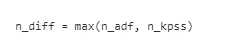

对于季节性差异，我们采用 OCSB 和 ch 推荐的较高订单。为了避免过度差分，我们应该检查一阶差分是否已经达到平稳性。

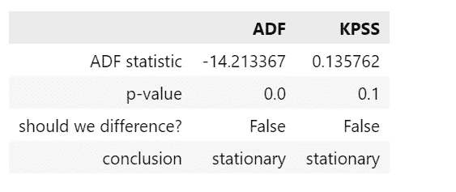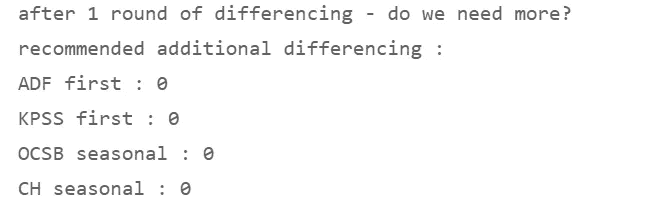

在一轮差分后，代码再次运行所有四个测试——ADF、KPSS、OCSB 和 CH——以确认是否需要额外的差分。在我们的例子中，所有四个测试都同意我们在第 2.11 章中应用的一阶差分足以得到一个平稳的时间序列——我们现在可以把它交给一个预测模型。

*小鸭子图片:unsplash.com 张铠麟·盖奇；*