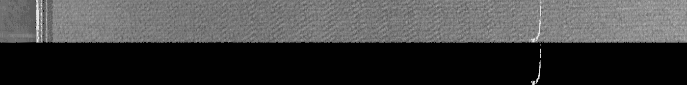
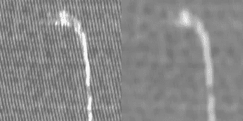
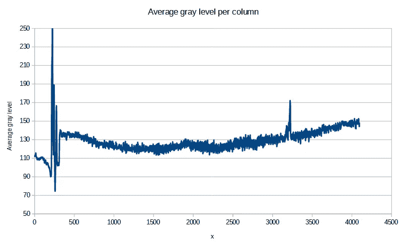
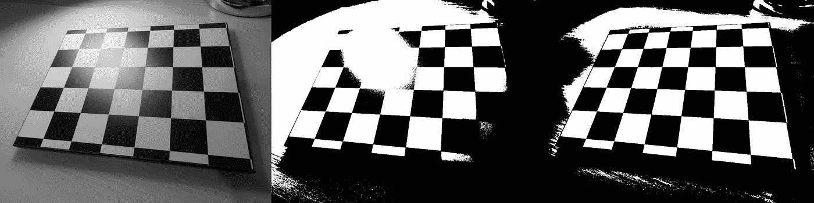
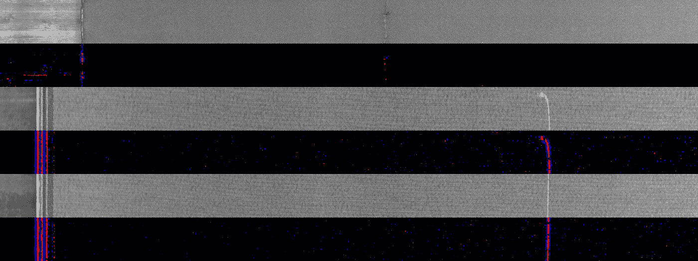

# 当统一的阈值不够时

> 原文：<https://towardsdatascience.com/when-a-uniform-threshold-is-not-enough-b16da0fbb4e1?source=collection_archive---------19----------------------->

## 适应可以走很长的路。

你儿子是阅兵式上唯一一个步调一致的士兵？

图一。由[马克·德容](https://unsplash.com/@mrmarkdejong)在 [Unsplash](https://unsplash.com/) 上拍摄的照片

你立刻就注意到了。不是因为这是你的儿子，而是因为你善于发现规律中的偏差。

如果你的工作是在显微镜下检查平板显示器，以检测异常像素，这种超能力可能会被证明是有用的——只要你能连续几个小时这样做而不会无聊死。

检查常规模式很容易——对任何人来说都是如此——但是非常乏味。这是一项应该用计算机视觉自动完成的任务。

## 织物中的缺陷

织物是具有规则图案的制成品的一个例子，任何偏差都被认为是缺陷。

> 让我们站在一位计算机视觉工程师的立场上，他负责设计一个自动系统，用于检测从织机上输出的布条的图像。

图二。漂亮的布料图案。在 [Unsplash](https://unsplash.com/) 上[安娜露莎·甘博亚](https://unsplash.com/@anigmb)的照片。

在本文中，我们将使用 [AITEX 织物图像数据库](https://www.aitex.es/afid/)【1】。它由有缺陷和无缺陷的织物条的灰度图像组成。该数据库还包括指示缺陷位置的掩模。

图 3。织物带(上图)及其相应缺陷遮罩(下图)的图像。缺陷显示为黑色。来自 [AITEX 织物图像数据库](https://www.aitex.es/afid/)的图像。

图 4。织物带(上图)及其相应缺陷遮罩(下图)的图像。缺陷看起来很亮。来自 [AITEX 织物图像数据库](https://www.aitex.es/afid/)的图像。

> 我们将重点关注那些以像素斑点形式出现的缺陷，这些像素的灰度明显高于或低于其周围环境。我们将不描述织物的质地。

你可以在这里找到本文[中使用的代码。](https://github.com/sebastiengilbert73/tutorial_adaptiveThreshold)

一种合理的方法是应用阈值操作来突出亮像素，并应用反阈值操作来突出暗像素。阈值(对于两种操作)将必须单独计算，因为整体灰度级从一幅图像到下一幅图像变化很大。

## 均匀阈值

一个好的起点是评估图像的中间灰度级，因为中间灰度级不会受到图像左侧的太大影响，在图像左侧，成像系统可能在织物带到达照相机的成像线之前扫描列。然后可以通过将灰度级中值加上(对于标准阈值)或减去(对于逆阈值)一个固定量来设置阈值。这些增量值的大小将决定阈值操作对于亮像素和暗像素的敏感度。

我们将这种方法称为 [*统一阈值*](https://github.com/sebastiengilbert73/tutorial_adaptiveThreshold/blob/main/uniform_thresholding.py) ，因为单个阈值和逆阈值将统一应用于图像。

我们首先模糊图像以衰减其高频成分，假设缺陷将大于几个相连的像素。OpenCV 函数 [cv2.blur()](https://docs.opencv.org/2.4/modules/imgproc/doc/filtering.html?highlight=blur#cv2.blur) 对中心像素附近的灰度级进行均匀平均。我们选择一个足够大的邻域大小，以使不需要的图案消失，但是足够小，例如足够大的缺陷仍然从背景中清晰地突出。

图 5。使用 11x11 的邻域大小进行均匀平均的模糊效果。图片由作者提供。

为了计算中位数，我们调用 NumPy 的函数 [np.median()](https://numpy.org/doc/stable/reference/generated/numpy.median.html) 。

标准阈值和反阈值操作都由 OpenCV 函数 [cv2.threshold()](https://docs.opencv.org/2.4/modules/imgproc/doc/miscellaneous_transformations.html?highlight=threshold#cv2.threshold) 实现。函数参数中的“类型”标志指定了所需的操作类型。我们通过偏移刚刚计算的中值灰度级来获得两种操作的阈值。

标准和逆阈值。作者代码。

在将暗像素的掩模与亮像素的掩模合并之后，我们得到异常掩模，突出灰度级足够暗或足够亮的像素。如果我们忽略图像的左侧，在某些情况下我们会得到好的结果。看起来我们只差一点点了！

图 6。统一阈值成功识别异常的三个例子(红色=明亮；蓝色=深色)。图片由作者提供。

但这并不是故事的结尾！

随着我们测试更多的图像，我们发现织物带的大部分区域被检测为亮或暗，而我们的判断告诉我们这些区域不应被视为异常。

图 6。三个示例中，统一阈值突出显示了没有异常的区域。图片由作者提供。

我们达到了统一阈值方法的极限。经过一些研究，我们观察到，在某些情况下，当我们从左向右扫描图像时，平均灰度级缓慢变化。

图 8。每列的平均灰度级示例。变化是显著的。图片由作者提供。

原因可能与成像系统有关。也许图像是用线扫描相机拍摄的，并且光照强度或积分时间不是恒定的。这也可能与产品本身有关:织物的颜色可能会随着条纹的变化而变化。我们不知道为什么，但我们必须处理这个问题。

> 统一的门槛是不够的。

## 自适应阈值

自适应阈值正是为这种情况而发明的。不是对整个图像使用单个阈值，**每个像素都计算其阈值**，因此有了限定词*自适应*。

对于给定的中心像素，评估邻域中像素的灰度加权平均值。阈值是平均灰度级，偏移某个常数以提供所需的灵敏度级别。在输出遮罩中，将中心像素灰度级与其自己的个性化阈值进行比较。

自适应阈值处理允许高亮显示与它们的邻域有足够差异*的像素，而不是简单地高于或低于统一阈值。*

图 9。左图:棋盘的原始图像。中心:[均匀阈值](https://github.com/sebastiengilbert73/tutorial_adaptiveThreshold/blob/main/threshold_checkerboard.py)由于光照不均匀，无法同时分割黑色和白色方块。右图:自适应阈值处理可以同时分割黑色和白色方块。图片由作者提供。

回到均匀阈值处理没有产生良好结果的织物图像情况，我们可以找到一组工作得更好的参数，使用[自适应阈值处理](https://github.com/sebastiengilbert73/tutorial_adaptiveThreshold/blob/main/adaptive_thresholding.py)(由 OpenCV 函数[cv2 . adaptive threshold()](https://docs.opencv.org/2.4/modules/imgproc/doc/miscellaneous_transformations.html?highlight=adaptivethreshold#cv2.adaptiveThreshold)实现)。

标准和反向自适应阈值处理。作者代码。

图 10。当平均灰度级沿 x 轴缓慢变化时，自适应阈值产生更好的结果。图片由作者提供。

从这一点来看，下一步将是基于维度标准和与其他斑点的接近度(或者机器学习，如果我们有足够的例子)来过滤异常掩模斑点。这将是一个巨大的挑战，但至少，通过这个简单的技术，我们摆脱了与织物缺陷无关的伪像。

## 结论

在自动化系统检测零件的制造环境中，经常会遇到类似于我们刚刚观察到的图像不一致的情况。照明条件可能不同，被检测的零件可能有不同的颜色或反射率，多个摄像头可能有不同的灵敏度，等等。

设计对这些变化具有鲁棒性的计算机视觉系统是至关重要的，因为它们不是制造工程师和操作员所关心的:找到缺陷而不被大量的错误警报所超载。有时，像使用自适应阈值这样简单的事情会有很大帮助。

[1] AFID:用于缺陷检测的公共织物图像数据库。Javier Silvestre-Blanes，Teresa Albero-Albero，Ignacio Miralles，Rubén Pérez-Llorens，Jorge Moreno，AUTEX 研究杂志，2019 年第 4 期