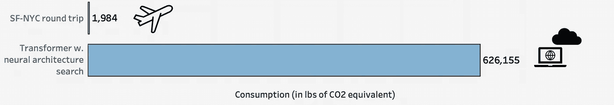
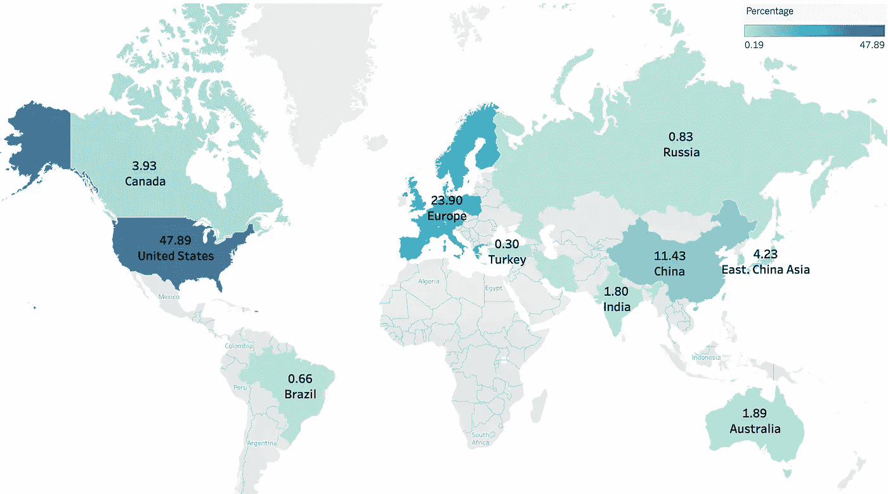

# 当人工智能出错时

> 原文：<https://towardsdatascience.com/when-ai-gets-it-wrong-2d561e7d7d73?source=collection_archive---------69----------------------->

## [人工智能校准和安全](https://towardsdatascience.com/tagged/ai-alignment-and-safety)

## 实现人工智能的承诺需要什么样的伦理框架？

图片来自 [Nick Wessaert](https://unsplash.com/@fusebrussels) 在 [Unsplash](https://unsplash.com/)

2020 年 12 月初，蒂姆尼特·格布鲁(Timnit Gebru)在提交了一篇概述使用基于人工智能的语言模型所引发的伦理紧张的论文后，被谷歌解雇。这一事件在科技行业引起了很大的轰动，突显了大型科技公司面临的道德问题以及它们在内部管理这些问题的努力。

正如《麻省理工技术评论》的一篇文章所强调的[1]，这些模型的形成是非常消耗二氧化碳的。神经架构研究的变压器模型(213M 参数)的形成消耗了超过纽约-旧金山往返行程的二氧化碳当量的 300 倍**。这些庞大的训练数据集的另一个问题是**不可能仔细检查数据集的组成**并识别**偏见**或**不道德内容**。这很容易导致种族主义或非包容性的模式。**

来自 Strubell 等人的数据，来自作者的可视化，来自 [Good Ware](https://www.flaticon.com/authors/good-ware) 的图标

这是与人工智能模型不断增长的能力和可扩展性相关的风险的最新例子。如果不仔细考虑，他们很容易在许多方面危及我们的社会。为了让这些新产品获得系统用户的信任和认可，必须定义一个清晰的道德框架，如上所示，**内部道德控制可能不是解决方案**。

# 人工智能带来的挑战

人工智能的使用引发了许多问题:

*   当使用人工智能工具**做出的决定伤害了某人**，并且**你无法解释**这个决定是如何做出的，会发生什么？
*   我们能在多大程度上防止算法重现人类行为的错误和偏见？
*   如何防止人工智能**加剧排斥和贫困**？
*   人工智能的使用如何适应联合国设定的全球目标框架？
*   在一些领域，如生命攸关的医疗保健，失败不是一个选项，我们迫切需要了解何时使用和**何时不使用模型**以及如何获得**问责**？

> 深度神经网络可能无法推广到非分布输入，包括自然的、非对立的输入，这在实时设置中很常见。(2)

# 什么是负责任的 AI？

随着模型变得越来越复杂，我们会遇到隐私、T2、可解释性、公平、歧视等问题。负责任的人工智能确保我们与社会价值观保持一致。我们希望我们构建的产品是包容的、无害的。

当向用户呈现数据时，负责任的人工智能最佳实践需要最大可能的透明性:例如为什么用户会看到一个推荐。这将帮助**建立信任**。此外，需要有一个**良好的内部工作流程**，人们评估生成的模型的结果，并验证模型正在做它们应该做的事情。最后，我们还希望**得到公平(公正)的结果**，而不是复制或强化你在数据中看到的偏见。

## 其他注意事项

当你需要了解模型的局限性，它能做什么，**它不能做什么**的时候，很多人就把模型下架了。此外，你构建产品的方式也必须是道德的:你是否拥有使用数据的所有必要的许可？你公平对待给数据贴标签的人吗？

# 当涉及到决策时

今天，在某些情况下，AI **替我们**做决定。如果不是，它会影响我们的决定。

人工智能可以造成更大规模的伤害。强化刻板印象的语言模型就是这种情况。即使你的性别不在简历里，也可以通过模型推断出来，作为特征使用[3]。这些模型目前用于招聘、信用评分或由司法系统使用，它们可能导致整个人口类别的机会丧失，因为**同样的启发式规则可以应用一百万次**。

这就是为什么我们需要后退一步，不仅要看性能指标，还要看它实际上如何改变行为。世界上没有多少公司关注他们模型的道德标准。这需要在开发模型和维护模型时进行评估。

# 那么我们该怎么办呢？

如果你正在构建一个人工智能产品，从哪里开始你的道德之旅是最好的？

图像来自 [Unsplash](https://unsplash.com/) 上的 [Lili Popper](https://unsplash.com/@lili_popper)

## 这些数据需要进行伦理审查

我们通常关心数据质量和数据量。现在我们还需要看看代表性:我们的数据是否公平地代表了所有类别？

我们有需要注意的**敏感数据**吗，比如性别、种族或国籍？从数据集中移除这些特征通常是不够的。例如，使用高度相关的其他特征(你住在哪里，你的爱好是什么……)来重建种族数据是可能的。

> 人工智能团队需要接受教育，不仅要追求模型的准确性，还要追求模型背后的责任。

## 追求数据的多样性和包容性

良好的数据多样性意味着**你不仅仅是强化已经很明显的现有趋势**。例如，仅基于购买次数的项目推荐系统将突出众所周知的现有项目，并对尚不知名但可以提供更好的原创建议的新兴设计师隐藏新项目。最后，模型不会很有用。

寻求多样性需要检查隐藏在系统和流程背后的歧视|图片来自[克里斯蒂娜@ wocintechchat.com](https://unsplash.com/@wocintechchat)在 [Unsplash](https://unsplash.com/)

某些群体得到了更有利的结果吗？

这一努力需要包括来自非常不同地方的人们的声音，以便不重复过去的错误。[2]

> “如果我们允许该领域缺乏地理多样性来定义我们自己的努力，我们这些从事人工智能伦理工作的人将弊大于利。” [*阿布舍克·古普塔*](https://atg-abhishek.github.io/)【2】

2019 年来自 ArXiv 的每个国家在总 AI 作者中的百分比|来自[https://jfgagne.ai/](https://jfgagne.ai/)的数据，来自作者的可视化

# **规格不足**

欠规范是指在训练数据上学习了正确的映射，但没有再现自然的因果关系。当观察到的行为是多种原因的结果时，通常会出现这种情况[4]。这导致模型不能很好地概括。

在固定数据集上形成一个模型可以产生几个工作类似的模型。如果没有对模型如何做出预测的解释，它们之间的差异将不会直接可见。只有通过在现实世界中的具体例子上进行测试，我们才能看出其中的区别。

因此，为了避免生产中令人不快的意外，我们应该添加测试和规范，覆盖大量场景，甚至是不可能的场景。

> “我们需要更好地准确说明我们对模型的要求。[……]因为通常最终发生的情况是，只有在模型在世界上失败后，我们才发现这些需求。”亚历克斯·达穆尔

## 构建能够揭示困难情况的场景

当所有的利益相关者都在房间里时，问问谁会受到你的产品的影响。确保你没有强化任何偏见。想想你的产品的用途与最初的意图不同。最后，如果出了问题，最坏的情况是什么，有办法改变吗？

## 可解释性

我们必须能够给出原因。

为什么我有这么可怕的信用额度？为什么我要多雇 7 个人？你为什么推荐我看这个节目？

它与解释模型预测的能力有关。

## 让人类参与进来

*   当您评估模型输出时，在循环步骤中添加一个人
*   添加手动过程:重新手动注释一些数据(可以随机选择或者使用主动学习策略)

> “是的，特斯拉的过度自动化是一个错误。准确地说，是我的错误。人类被低估了。”埃隆·马斯克

# Z 检验流程

几个月前，在 Zicari 教授的领导下，我们与来自欧洲和加利福尼亚的多种多样的合作者一起，开始了对两种人工智能产品的伦理检查。前者是一个机器学习系统，用作识别紧急呼叫中心脏骤停的支持工具[4]，后者是一个基于深度学习的皮肤病变分类器[5]。

检查的目的是确保接受检查的产品没有表现出不适当的行为，并解决围绕它的道德紧张。

这种检查始于一个多学科专家团队的创建，他们将成为负责检查人工智能产品的伦理影响的外部行动者。

这个过程从与产品的创建者会面开始，以了解产品的规格、目标和限制。通过经历多次迭代，我们已经创建了需要考虑的信息和紧张的积压。这用于创建**社会技术场景**，将产品置于与演员、用户和系统的**交互中。反过来，**强调了紧张**和困境，如果有必要，将通过建议和道德维护来分析和解决。有关该流程的更多信息，请访问网站[6]。**

我将在以后的文章中更详细地描述这个伦理检查的故事。

图片来自[米切尔罗](https://unsplash.com/@mitchel3uo)在 [Unsplash](https://unsplash.com/)

# 参考

[1] *凯伦·郝*，我们读到了迫使蒂姆尼特·格布鲁离开谷歌的那篇论文。它是这样说的。麻省理工科技评论。[链接](https://www-technologyreview-com.cdn.ampproject.org/c/s/www.technologyreview.com/2020/12/04/1013294/google-ai-ethics-research-paper-forced-out-timnit-gebru/amp/)

[2] *阿比谢克·古普塔&维多利亚·希思档案馆*，人工智能伦理组织正在重复社会的经典错误之一。麻省理工科技评论。[链接](https://www.technologyreview.com/2020/09/14/1008323/ai-ethics-representation-artificial-intelligence-opinion/?utm_medium=tr_social&utm_campaign=site_visitor.unpaid.engagement&utm_source=LinkedIn#Echobox=1608151425)

[3] *古普塔，a .，卢茨，M.J .，拉赫马尼，a .，王，K.* ，2019。简历排名工具中隐含的性别偏见。

[3]*Will Douglas heave archive*，我们训练 AI 的方式从根本上就是有缺陷的。麻省理工科技评论。[链接](https://www.technologyreview.com/2020/11/18/1012234/training-machine-learning-broken-real-world-heath-nlp-computer-vision/)

[4]布隆伯格·SN、福尔克·F、厄斯伯尔·AK、克里斯滕森·HC、托尔普-彼得森·C、塞尔·MR、伯爵 CR、利珀特·FK。机器学习作为识别紧急呼叫中心脏骤停的辅助工具。复苏术。2019 年 5 月；138:322–329.doi: 10.1016/j .复苏. 2019.01.015\. Epub 2019 年 1 月 18 日。PMID: 30664917。

[5]卢西耶里，巴杰瓦，M.N .，布劳恩，s .，马利克，m .，登格尔，a .，艾哈迈德，S. (2020)。使用概念激活向量的深度学习皮肤损伤分类器的可解释性。 *2020 年国际神经网络联合会议(IJCNN)* ，1–10。

[http://z-inspection.org/the-process-in-a-nutshell/](http://z-inspection.org/the-process-in-a-nutshell/)