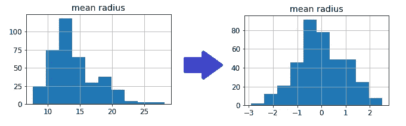
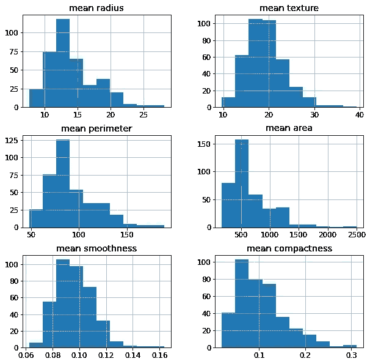
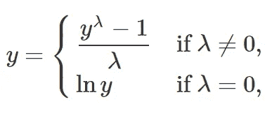
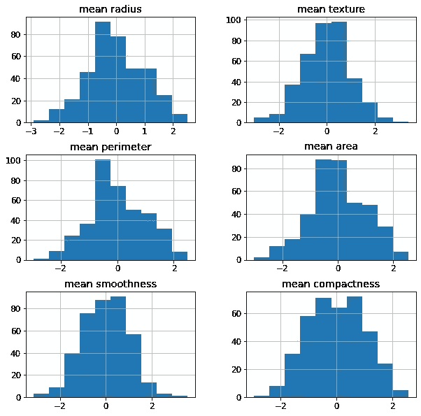
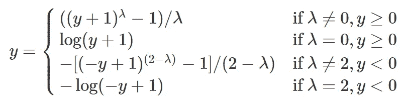
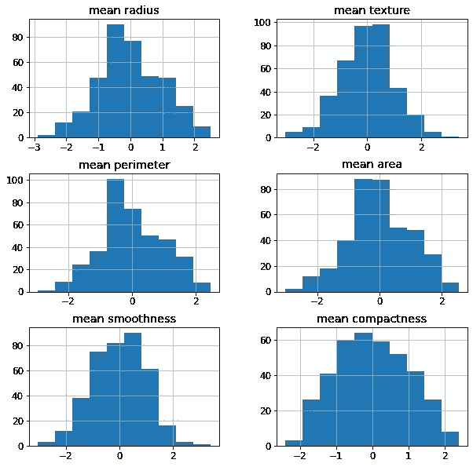

# 机器学习中何时以及如何使用幂变换

> 原文：<https://towardsdatascience.com/when-and-how-to-use-power-transform-in-machine-learning-2c6ad75fb72e?source=collection_archive---------24----------------------->

## 让我们看看这个强大的数据预处理工具



作者图片

专业数据科学家知道，在向任何模型提供数据之前，必须准备好数据。数据预处理可能是机器学习管道中最重要的部分，其重要性有时被低估了。

幂变换是一组在某些情况下非常有用的变换。让我们看看什么时候。

# 什么是电力转换？

Power transfom 是一系列使用幂定律转换数据的函数。我们的想法是对数据集的每个要素应用变换。

电源转换的目的是什么？想法是增加特征分布的对称性。如果特征不对称，应用幂变换将使其更加对称。

让我们看一个使用 scikit-learn 中的*乳腺癌数据集*的例子。如果我们绘制前 6 个特征的直方图，我们会发现它们非常不对称。



作者图片

如果特征不对称，某些模型可能无法正常工作。例如，如果分布是偏斜的，基于距离的模型如 KNN 或 K-means 可能会失败。为了使这些模型起作用，幂变换将使特征对称化，而不会过多地影响它们的预测能力。

# 一些能量转换

最常见的幂变换是 Box-Cox 和 Yeo-Johnson 变换。

Box-Cox 变换有这样的公式:



如您所见，我们有一个λ参数，可以使用最大似然法进行估计。例如，我们可以尝试最小化偏度，尽可能保持方差稳定。

这个公式必须独立地应用于每个特性。每个特征可能具有不同的λ值。

由于独立变量出现在对数中，这种变换只能应用于严格正的特征。

如果我们对之前的数据集应用 Box-Cox 变换，我们会得到:



作者图片

如您所见，新特性比原来的特性更加对称。

Yeo-Johnson 变换有这样的公式:



我们仍然有一个λ参数要估计，但现在这种变换甚至可以应用于负面特征。

我们数据集的结果是:



作者图片

同样，我们有一组可以被我们的模型使用的对称特征。

# 何时使用电源转换

根据我的经验，当我们使用像 KNN、K-means、DBSCAN 这样基于距离的模型时，使用幂变换是值得的。有人说它们对线性模型和高斯朴素贝叶斯有用，但我对前者比对后者更有把握。基于树和神经网络的模型不受特征对称性的影响，而如果我们只需要使用线性核，SVM 有时可能需要提前进行幂变换。

# python 中的一个例子

让我们看看如何在 Python 中使用幂变换。我们将在乳腺癌数据集上使用 KNN 分类器，并看到使用幂变换将提高模型的性能，这是使用 AUROC 测量的。

这段代码可以在我的 GitHub 库[这里](https://github.com/gianlucamalato/machinelearning/blob/master/Power_Transformation_example.ipynb)找到。

我们先导入一些库。

```
from sklearn.datasets import load_breast_cancer 
import pandas as pd 
from sklearn.preprocessing import StandardScaler 
from sklearn.neighbors import KNeighborsClassifier 
from sklearn.pipeline import Pipeline 
from sklearn.metrics import roc_auc_score,balanced_accuracy_score
from sklearn.model_selection import GridSearchCV, train_test_split from sklearn.preprocessing import PowerTransformer 
import matplotlib.pyplot as plt
```

为了简单起见，让我们导入数据集的前 6 个特征，并将它们存储到 pandas 数据框架中。

```
d = load_breast_cancer() 
df = pd.DataFrame(d['data'],columns=d['feature_names']).iloc[:,0:6]
```

我们现在可以将这个数据集分为训练和测试。

```
X_train, X_test, y_train, y_test = train_test_split(df, d['target'], test_size=0.33, random_state=42)
```

现在，我们可以在训练集上训练我们的模型，并在测试集上测试它。我们将使用 scikit-learn 中的 pipeline 对象来应用必要的特征缩放。对于第一个例子，我们将避免使用电源转换

```
model = Pipeline([ ('scaler',StandardScaler()),('model',KNeighborsClassifier()) ]) model.fit(X_train,y_train) roc_auc_score(y_test,model.predict_proba(X_test)[:,1])
```

如果不进行功率变换，我们得到的 AUROC 值等于 0.976

现在，让我们试着使用能量转换。在 Python 中，我们有 PowerTransformer 对象，它默认执行 Yeo-Johnson 变换，并自动搜索 lambda 的最佳值。如果我们愿意，我们可以使用 Box-Cox-transform，但是对于这个例子，我们将使用默认设置。缩放是可以避免的，因为 PowerTransformer 自动标准化了特性，但是显式地使用它总是一个好习惯。

如果我们对流水线应用功率变换(在缩放器之前)，代码是:

```
model = Pipeline([ ('power',PowerTransformer()), ('scaler',StandardScaler()), ('model',KNeighborsClassifier()) ]) model.fit(X_train,y_train) roc_auc_score(y_test,model.predict_proba(X_test)[:,1])
```

使用幂变换，AUROC 值增加到 0.986。因此，该模型比没有幂变换特征的模型执行得更好。

# 结论

当我们必须处理倾斜的特征并且我们的模型对分布的对称性敏感时，幂变换是非常有用的。重要的是要记住在任何缩放之前使用它们。

如果你想了解更多关于电力转换的知识，请加入我的 Python 在线课程中的[机器学习数据预处理。](https://yourdatateacher.teachable.com/p/data-pre-processing-for-machine-learning-in-python)

*原载于 2021 年 4 月 21 日 https://www.yourdatateacher.com*<https://www.yourdatateacher.com/2021/04/21/when-and-how-to-use-power-transform-in-machine-learning/>**。**